<html>

<head>
<meta http-equiv=Content-Type content="text/html; charset=gb2312">
<meta name=Generator content="Microsoft Word 15 (filtered)">
<title>物联网调查报告</title>

</head>

<body lang=ZH-CN link=blue vlink=purple style='text-justify-trim:punctuation'>

<table class=MsoNormalTable border=1 cellspacing=0 cellpadding=0 align=left
 width="80%" style='width:80.0%;border-collapse:collapse;border:none;
 margin-left:7.1pt;margin-right:7.1pt'>
 <tr>
  <td width=511 valign=top style='width:383.6pt;border:none;border-left:solid #4F81BD 2.25pt;
  padding:10.8pt 5.75pt 10.8pt 5.75pt'>
  
[键入公司名称]

  </td>
 </tr>
 <tr>
  <td width=511 valign=top style='width:383.6pt;border:none;border-left:solid #4F81BD 2.25pt;
  padding:0cm 5.4pt 0cm 5.4pt'>
  
物联网调查报告

  </td>
 </tr>
 <tr style='height:16.8pt'>
  <td width=511 valign=top style='width:383.6pt;border:none;border-left:solid #4F81BD 2.25pt;
  padding:10.8pt 5.75pt 10.8pt 5.75pt;height:16.8pt'>
  
物联网发展，架构，关键技术，物联网解决方案及应用

  </td>
 </tr>
</table>

&nbsp;

&nbsp;

<table class=MsoNormalTable border=0 cellspacing=0 cellpadding=0 align=left
 width="80%" style='width:80.0%;border-collapse:collapse;margin-left:7.1pt;
 margin-right:7.1pt'>
 <tr>
  <td width=511 valign=top style='width:383.6pt;padding:10.8pt 5.75pt 10.8pt 5.75pt'>
  
夏立新

  
2016/5/9

  
&nbsp;

  </td>
 </tr>
</table>

&nbsp;

 

<b>&nbsp;</b>

目录&nbsp;&nbsp;&nbsp;&nbsp;&nbsp;&nbsp;&nbsp;&nbsp;&nbsp;&nbsp;&nbsp; 

<a href="#_Toc450518819">范围... 3</a>

<a href="#_Toc450518820">趋势... 3</a>

<a href="#_Toc450518821">信息化与工业化融合... 3</a>

<a href="#_Toc450518822">企业虚拟化... 3</a>

<a href="#_Toc450518823">产业跨界创新... 3</a>

<a href="#_Toc450518824">物联网... 4</a>

<a href="#_Toc450518825">物联网概念... 4</a>

<a href="#_Toc450518826">物联网架构... 4</a>

<a href="#_Toc450518827">物联网的应用领域... 5</a>

<a href="#_Toc450518828">产业链... 10</a>

<a href="#_Toc450518829">关键技术... 11</a>

<a href="#_Toc450518830">应用案例... 12</a>

<a href="#_Toc450518831">分类... 13</a>

<a href="#_Toc450518832">物联网通信协议... 14</a>

<a href="#_Toc450518833">接入协议... 14</a>

<a href="#_Toc450518834">通讯协议... 15</a>

<a href="#_Toc450518835">物联网平台介绍... 17</a>

<a href="#_Toc450518836">QQ物联... 18</a>

<a href="#_Toc450518837">框架说明... 18</a>

<a href="#_Toc450518838">产品案例展示... 19</a>

<a href="#_Toc450518839">阿里智能... 20</a>

<a href="#_Toc450518840">架构... 21</a>

<a href="#_Toc450518841">应用场景... 22</a>

<a href="#_Toc450518842">案例应用... 23</a>

<a href="#_Toc450518843">百度云物联网... 25</a>

<a href="#_Toc450518844">架构... 25</a>

<a href="#_Toc450518845">应用场景... 27</a>

<a href="#_Toc450518846">华为物联... 28</a>

<a href="#_Toc450518847">架构... 28</a>

<a href="#_Toc450518848">案例应用... 29</a>

<a href="#_Toc450518849">中国移动物联网... 30</a>

<a href="#_Toc450518850">架构... 31</a>

<a href="#_Toc450518851">案例应用... 32</a>

<a href="#_Toc450518852">亚马逊物联... 37</a>

<a href="#_Toc450518853">架构... 37</a>

<a href="#_Toc450518854">微软物联... 39</a>

<a href="#_Toc450518855">架构... 40</a>

<a href="#_Toc450518856">攀多物联... 40</a>

<a href="#_Toc450518857">美国2015年十大创新型B2B物联网公司... 41</a>

<a href="#_Toc450518858">1 Ambyint. 41</a>

<a href="#_Toc450518859">2 ClickSoftware. 42</a>

<a href="#_Toc450518860">3 Ayla Networks艾拉物联... 42</a>

<a href="#_Toc450518861">4 CRG International 42</a>

<a href="#_Toc450518862">5 Inrix. 42</a>

<a href="#_Toc450518863">6 CrossChx. 43</a>

<a href="#_Toc450518864">7 Tungsten
Solutions, LLC. 43</a>

<a href="#_Toc450518865">8 Ekoor. 43</a>

<a href="#_Toc450518866">9 Onstream.. 43</a>

<a href="#_Toc450518867">10 StratIS. 43</a>

<a href="#_Toc450518868">物联网行业应用-安防系统... 44</a>

<a href="#_Toc450518869">KA综合安防系统... 44</a>

<a href="#_Toc450518870">功能介绍... 44</a>

<a href="#_Toc450518871">系统架构... 45</a>

<a href="#_Toc450518872">车辆人员出入控制系统... 47</a>

<a href="#_Toc450518873">系统架构... 47</a>

<a href="#_Toc450518874">检查站车辆控制器内部架构... 48</a>

<a href="#_Toc450518875">地理信息系统... 48</a>

<a href="#_Toc450518876">总结... 51</a>

<a href="#_Toc450518877">参考资料... 53</a>

&nbsp;

 

&nbsp;

<h1><a name="_Toc450518819">范围</a></h1>

&nbsp;&nbsp; &nbsp;本文档主要描述物联网发展，架构，关键技术，市场上成熟悉物联网解决方案，以及与物联网行业应用安防系统介绍，为以后公司技术发展方向提供参考。

<h1><a name="_Toc450518820">趋势</a></h1>

随着信息产业的发展从有线到无线，从呼叫位置到呼叫个人，从摩尔斯码到语音及短信，从以网络能力提供为主到以用户需求体验为主的移动多媒体业务（视频业务社交媒体，定位服务，融合通信等）的发展，未来信息网络的发展会呈现出三条主线：新型智能终端，超宽带移动互联网以及智能化的应用。2020年的到来，信息通信客户需求将发生怎样的变化？个人消费者，企业客户以及产业革新方面会呈现何种趋势？

<h2><a name="_Toc450518821">信息化与工业化融合</a> </h2>

到2020年，先进的交互和显示技术将为用户创建数字世界和现实世界的无缝联接(例如：超视听，3D打印，增强现实，体三维等)。用户在消费海量信息的同时，也逐渐成为”微型企业”，生产出大量的个性（iMade）数字信息。

<h2><a name="_Toc450518822">企业虚拟化</a> </h2>

身处全球各处的企业员工通过身临其境的虚拟网络协作,紧密地工作在一起。公司外包的IT全部依靠云。产业价值链进一步精细划分，多个企业在其中自动、有效的相互作用。

<h2><a name="_Toc450518823">产业跨界创新</a> </h2>

无处不在的移动宽带网络引发了多个行业新一轮的变革(金融、交通、能源电力、教育、医疗等)，并且创造了新的e行业，如：车联网，e医疗，e物流等。

根据GSMA预测，2020年全球数据消费量增长11倍，全产业价值增长11000亿美元。到2020年，平均每用户每天至少需要消费1G字节流量，网络容量增加至少1000倍；融合的移动通信业务渗透到各行各业，以云和大数据为代表的网络变革满足用户的个性化体验；运营商会在如下领域面临挑战：

&#61548; 1》互联网高速发展时期，持续网络建设投入的同时，如何保障稳定增长的收入

&#61548; 2》客户体验成为核心竞争力，如何确保用户在不同场景下的体验一致性，并在此基础上为客户提供个性化服务

业务需求是技术创新的原动力，同时技术创新也将激发新业务的增长。2020年的信息技术发展主要围绕基础技术的演进、网络系统及终端技术的革新以及支撑数字化新服务的智能应用来展开。

到2020年及以后，将会实现 “连接无限可能”（More Than Connecting）的目标，建立精品智慧网络，实现万物互连；面向“互联网+”实现传统行业和信息化的连接。

美国权威咨询机构FORRESTER预测，到2020年，世界上物物互联的业务，跟人与人通信的业务相比，将达到30比１，因此，“物联网”被称为是下一个万亿级的通信业务。 &nbsp;

<h1><a name="_Toc450518824">物联网</a></h1>

<h2><a name="_Toc450518825">物联网概念</a></h2>

物联网是新一代信息技术的重要组成部分，也是“信息化”时代的重要发展阶段。其英文名称是：“Internet of
things（IoT）”。顾名思义，物联网就是物物相连的互联网。这有两层意思：其一，物联网的核心和基础仍然是互联网，是在互联网基础上的延伸和扩展的网络；其二，其用户端延伸和扩展到了任何物品与物品之间，进行信息交换和通信，也就是物物相息。物联网通过智能感知、识别技术与普适计算等通信感知技术，广泛应用于网络的融合中，也因此被称为继计算机、互联网之后世界信息产业发展的第三次浪潮。物联网是互联网的应用拓展，与其说物联网是网络，不如说物联网是业务和应用。因此，应用创新是物联网发展的核心，以用户体验为核心的创新2.0是物联网发展的灵魂。

活点定义：利用局部网络或互联网等通信技术把传感器、控制器、机器、人员和物等通过新的方式联在一起，形成人与物、物与物相联，实现信息化、远程管理控制和智能化的网络。物联网是互联网的延伸，它包括互联网及互联网上所有的资源，兼容互联网所有的应用，但物联网中所有的元素（所有的设备、资源及通信等）都是个性化和私有化。

<h2><a name="_Toc450518826">物联网架构</a></h2>

物联网架构可分为三层：感知层、网络层和应用层。

感知层由各种传感器构成，包括温湿度传感器、二维码标签、RFID标签和读写器、摄像头、红外线、GPS等感知终端。感知层是物联网识别物体、采集信息的来源。

网络层由各种网络，包括互联网、广电网、网络管理系统和云计算平台等组成，是整个物联网的中枢，负责传递和处理感知层获取的信息。

应用层是物联网和用户的接口，它与行业需求结合，实现物联网的智能应用。

如图：

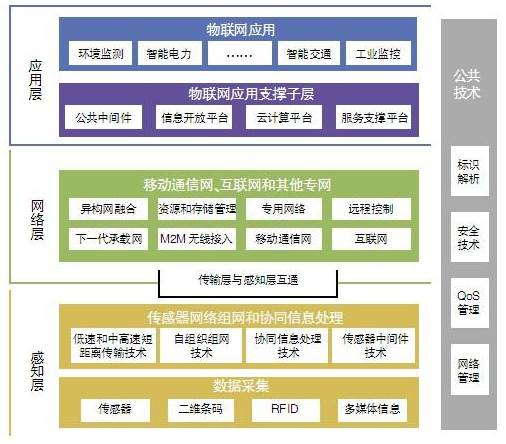

&nbsp;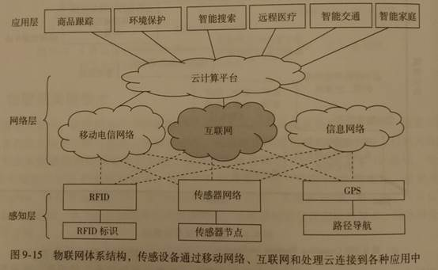

<h2><a name="_Toc450518827">物联网的应用领域</a></h2>

物联网用途广泛，遍及智能交通、环境保护、政府工作、公共安全、平安家居、智能消防、工业监测、环境监测、路灯照明管控、景观照明管控、楼宇照明管控、广场照明管控、老人护理、个人健康、花卉栽培、水系监测、食品溯源、敌情侦查和情报搜集等多个领域。

<b>国际电信联盟于2005</b><b>年的报告曾描绘“</b><b>物联网”</b><b>时代的图景：</b>当司机出现操作失误时汽车会自动报警；公文包会提醒主人忘带了什么东西；衣服 会“告诉”洗衣机对颜色和水温的要求等等。物联网在物流领域内的应用则比如：一家物流公司应用了物联网系统的货车，当装载超重时，汽车会自动告诉你超载
了，并且超载多少，但空间还有剩余，告诉你轻重货怎样搭配；当搬运人员卸货时，一只货物包装可能会大叫“你扔疼我了”，或者说“亲爱的，请你不要太野蛮， 可以吗？”；当司机在和别人扯闲话，货车会装作老板的声音怒吼“笨蛋，该发车了！”

物联网把新一代IT技术充分运用在各行各业之中，具体地说，就是把感应器嵌入和装备到电网、铁路、桥梁、隧道、公路、建筑、供水系统、大坝、油气管道等各种物体中，然后将“物联网”与现有的互联网整合起来，实现人类社会与物理系统的整合，在这个整合的网络当中，存在能力超级强大的中心计算机群，能够对整合网络内的人员、机器、设备和基础设施实施实时的管理和控制，在此基础上，人类可以以更加精细和动态的方式管理生产和生活，达到“智慧”状态，提高资源利用率和生产力水平，改善人与自然间的关系。

&nbsp; 物联网应用主要有智慧家居，智慧医疗，智慧安防，智慧环保，智慧交通，智慧农业，智慧物流，智慧校园，智慧电网等。

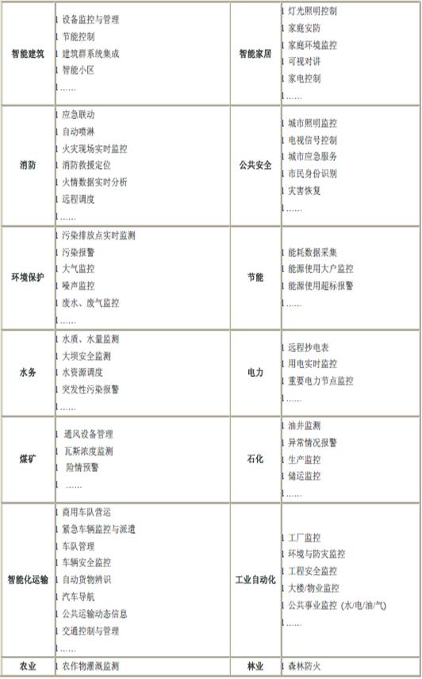

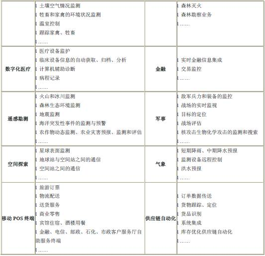

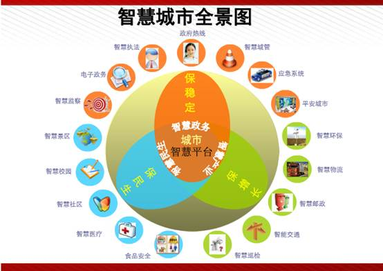

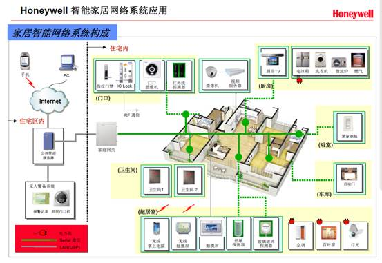

智慧医疗

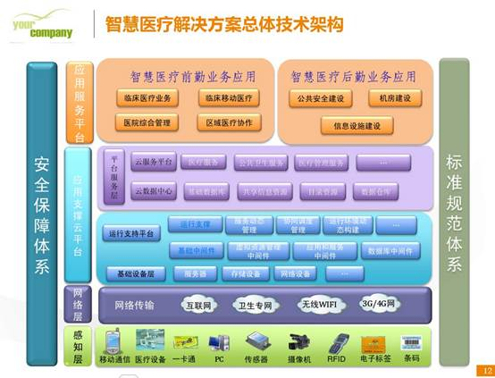

智慧安防

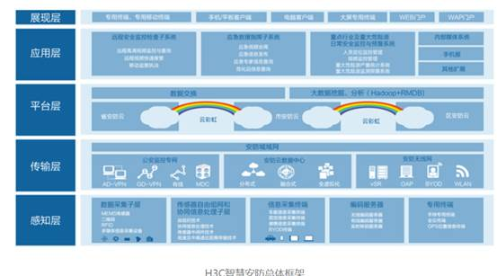

<h2><a name="_Toc450518828">产业链</a></h2>

物联网是在当前通信网与互联网基础上的发展延伸，产业链也与通信网和互联网产业链类似，增加了部分参与者。譬如，在上游增加了RFID与无线传感器供应商，下游增加了物联网运营商。其中RFID和传感器是给物品贴上身份标识和赋予智能感知能力，物联网运营商是海量数据处理和信息管理服务提供商。物联网产业链结构如下图所示：

&nbsp;

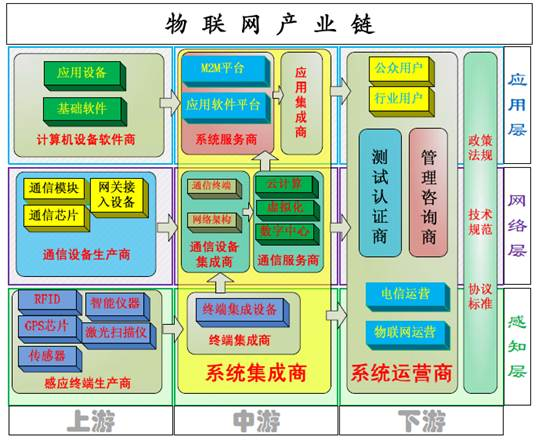

1）

产业链上游

由感应网组成设备、通信设备、应用基础设备与软件等设备生产、销售、代理、维护厂商组成；

2）

产业链中游

由感应终端集成、通信设备集成与服务、系统平台建设、应用集成等各类子集成商与物 联网平台总集成商组合；

3）

产业链下游

由平台测试、管理、运营等机构，政策法规、技术规范、协议标准制定与管理机构，以 及电信级网络运营、物联网平台产品总运营商组成。

<h2><a name="_Toc450518829">关键技术</a></h2>

在物联网应用中有三项关键技术

1、<b>传感器技术</b>：这也是计算机应用中的关键技术。大家都知道，到目前为止绝大部分计算机处理的都是数字信号。自从有计算机以来就需要传感器把模拟信号转换成数字信号计算机才能处理。

2、<b>RFID</b><b>标签</b>：也是一种传感器技术，RFID技术是融合了无线射频技术和嵌入式技术为一体的综合技术，RFID在自动识别、物品物流管理有着广阔的应用前景。

3、<b>嵌入式系统技术：</b>是综合了计算机软硬件、传感器技术、
集成电路技术、电子应用技术为一体的复杂技术。如果把物联网用人体做一个简单比喻，传感器相当于人的眼睛、鼻子、皮肤等感官，网络就是神经系统用来传递信息，嵌入式系统则是人的大脑，在接收到信息后要进行分类处理。这个例子很形象的描述了传感器、嵌入式系统在物联网中的位置与作用。

<h2><a name="_Toc450518830">应用案例</a></h2>

<ol start=1 type=1>
 <li class=MsoNormal style='text-align:left'>物联网传感器产品已率先在上海浦东国际机场防入侵系统中得到应用。</li>
</ol>

系统铺设了3万多个传感节点，覆盖了地面、栅栏和低空探测，可以防止人员的翻越、偷渡、恐怖袭击等攻击性入侵。上海世博会也与中科院无锡高新微纳传感网工程技术研发中心签下订单，购买防入侵微纳传感网1500万元产品。

<ol start=2 type=1>
 <li class=MsoNormal style='text-align:left'>ZigBee路灯控制系统点亮济南园博园。ZigBee无线路灯照明节能环保技术的应用是此次园博园中的一大亮点。园区所有的功能性照明都采用了ZigBee无线技术达成的无线路灯控制。</li>
 <li class=MsoNormal style='text-align:left'>首家手机物联网落户广州</li>
</ol>

将移动终端与电子商务相结合的模式，让消费者可以与商家进行便捷的互动交流，随时随地体验品牌品质，传播分享信息，实现互联网向物联网的从容过度，缔造出一种全新的零接触、高透明、无风险的市场模式。手机物联网购物其实就是闪购。广州闪购通过手机扫描条形码、二维码等方式，可以进行购物、比价、鉴别产品等功能。

这种智能手机和电子商务的结合，是“手机物联网”的其中一项重要功能。

<ol start=4 type=1>
 <li class=MsoNormal style='text-align:left'><b>与门禁系统的结合</b></li>
</ol>

一个完整的门禁系统由读卡器、控制器、电锁、出门开关、门磁、电源、处理
中心这八个模块组成，无线物联网门禁将门点的设备简化到了极致：一把电池供电的锁具。除了门上面要开孔装锁外，门的四周不需要设备任何辅佐设备。整个系统简洁明了，大幅缩短施工工期，也能降低后期维护的本钱。无线物联网门禁系统的安全与可靠首要体现在以下两个方面：无线数据通讯的安全性包管和传输数据的安稳性。

<ol start=5 type=1>
 <li class=MsoNormal style='text-align:left'><b>与云计算的结合</b></li>
</ol>

物联网的智能处理依靠先进的信息处理技术，如云计算、模式识别等技术，云计算可以从两个方面促进物联网和智慧地球的实现：首先，云计算是实现物联网的核心。
其次，云计算促进物联网和互联网的智能融合。

<ol start=6 type=1>
 <li class=MsoNormal style='text-align:left'><b>与TD</b><b>结合</b></li>
</ol>

物联网发展是确保TD成功的重大契机。TD-SCDMA是我国拥有自主知识产权的第三代移动通信系统，是宽带无线通信网络，TD的发展需要数据业务的拉动，物联网应用是需求最迫切的增强型数据业务，具有广阔的应用前景，能够充分发挥TD网络优势，有助于促进TD产业链的成熟。 完善现有网络，发挥TD优势，积极推动无线传感器网络与TD网络融合，构建适于物联网应用的GPRS/TD/WSN（无线传感器网络）融合网络，大力发展适于TD网络承载的物联网业务，提升TD的核心竞争力，给物联网的发展以强有力的支撑，是中国移动的发展思路。

<ol start=7 type=1>
 <li class=MsoNormal style='text-align:left'>与移动互联结合</li>
</ol>

物联网的应用在与移动互联相结合后，发挥了巨大的作用。智能家居使得物联网的应用更加生活化，具有网络远程控制、摇控器控制、触摸开关控制、自动报警和自动定时等功能，普通电工即可安装，变更扩展和维护非常容易，开关面板颜色多样，图案个性，给每一个家庭带来不一样的生活体验。

<ol start=8 type=1>
 <li class=MsoNormal style='text-align:left'>与指挥中心的结合</li>
</ol>

物联网在指挥中心已得到很好的应用，网连网智能控制系统可以指挥中心的大屏幕、窗帘、灯光、摄像头、DVD、电视机、电视机顶盒、电视电话会议；也可以调度马路上的摄像头图像到指挥中心，同时也可以控制摄像头的转动。网连网智能控制系统还可以通过3G网络进行控制，可以多个指挥中心分级控制，也可以连网控制。还可以显示机房温度湿度，可以远程控制需要控制的各种设备开关电源。

<ol start=9 type=1>
 <li class=MsoNormal style='text-align:left'>物联网助力食品溯源,肉类源头追溯系统</li>
</ol>

从2003年开始，中国已开始将先进的RFID射频识别技术运用于现代化的动物养殖加工企业，开发出了RFID实时生产监控管理系统。该系统能够实时监控生产的全过程，自动、实时、准确的采集主要生产工序与卫生检验、检疫等关键环节的有关数据，较好的满足质量监管要求，对于过去市场上常出现的肉质问题得到了妥善的解决。此外，政府监管部门可以通过该系统有效的监控产品质量安全，及时追踪、追溯问题产品的源头及流向，规范肉食品企业的生产操作过程，从而有效的提高肉食品的质量安全。

<h2><a name="_Toc450518831">分类</a></h2>

<ol start=1 type=1>
 <li class=MsoNormal style='text-align:left'>私有物联网：一般面向单一机构内部提供服务；</li>
 <li class=MsoNormal style='text-align:left'>公有物联网：基于互联网向公众或大型用户群体提供服务；</li>
 <li class=MsoNormal style='text-align:left'>社区物联网：向一个关联的“社区”或机构群体（如一个城市政府下属的各委办局：如公安局、交通局、环保局、城管局等）提供服务；</li>
 <li class=MsoNormal style='text-align:left'>混合物联网：是上述的两种或以上的物联网的组合，但后台有统一运维实体；</li>
 <li class=MsoNormal style='text-align:left'>医学物联网：是将物联网技术应用于医疗、健康管理、老年健康照护等领域；</li>
 <li class=MsoNormal style='text-align:left'>建筑物联网：是将物联网技术应用于路灯照明管控、景观照明管控、楼宇照明管控、广场照明管控等领域。</li>
</ol>

<h2><a name="_Toc450518832">物联网通信协议</a></h2>

为了方便，将物联网通信协议分为两大类，一类是接入协议，一类是通讯协议。接入协议一般负责子网内设备间的组网及通信；通讯协议主要是运行在传统互联网TCP/IP协议之上的设备通讯协议，负责设备通过互联网进行数据交换及通信。

<h3>接入协议</h3>

市场上常见的有zigbee、蓝牙以及wifi协议等。

<h4>zigbee</h4>

zigbee目前在工业控制领域应用广泛，在智能家居领域也有一定应用。它有以下主要优势：

1. 低成本。zigbee协议数据传输速率低，协议简单，所以开发成本也比较低。并且zigbee协议还免收专利费用。

2. 低功耗。由于zigbee协议传输速率低，节点所需的发射功率仅1mW，并采用休眠+唤醒模式，功耗极低。

3. 自组网。通过zigbee协议自带的mesh功能，一个子网络内可以支持多达65000个节点连接，可以快速实现一个大规模的传感网络。

4. 安全性。使用crc校验数据包的完整性，支持鉴权和认证，并且采用aes-128对传输数据进行加密。

zigbee协议的最佳应用场景是无线传感网络，比如水质监测、环境控制等节点之间需要自组网传输数据的工业场景中。在这些场景中zigbee协议的优势发挥的非常明显。目前国内外很多厂商也将zigbee运用在智能家居方案中，比如小米发布的“小米智能家居套装”。

为什么厂商会抛弃使用比较广泛的wifi及蓝牙协议，而采用zigbee呢，主要有以下原因：

1. 刚才提到zigbee协议有很强的自组网能力，可以支持几万设备，特别对于小米这种想构建智能家居生态链的企业，wifi和蓝牙的设备连接数量目前都是硬伤。

2. 目前zigbee协议还很难轻易被破解，而其他协议在安全性上一直为人诟病。

3. 很多智能家居产品如门磁为了使用方便，一般采用内置电池。此时zigbee的超低功耗大大提升了产品体验。

但是zigbee协议也有不足，主要就是它虽然可以方便的组网但不能接入互联网，所以zigbee网络中必须有一个节点充当路由器的角色（比如小米智能家居套装中的智能网关），这提高了成本并且增加了用户使用门槛。同时由于zigbee协议数据传输速率低，对于大流量应用如流媒体、视频等，基本是不可能。

相对wifi和蓝牙协议这些年的快速发展和商业普及，zigbee协议尽管在技术设计和<a
href="http://lib.csdn.net/base/16" target="_blank" title=大型网站架构知识库>架构</a>上拥有很大优势，但是技术更新太慢，同时在市场推广中也被竞争对手拉开了差距。后续zigbee协议在行业领域还是有很大空间，但是家用及消费领域要挑战wifi及蓝牙协议不是那么容易了。

<h4>蓝牙</h4>

蓝牙目前已经成为智能手机的标配通信组件，其迅速发展的原因包括：

1. 低功耗。我认为这是蓝牙4.0的大杀器，使用纽扣电池的蓝牙4.0设备可运行一年以上，这对不希望频繁充电的可穿戴设备具有十分大的吸引力。当前基本世面上的可穿戴设备基本都选用蓝牙4.0方案。

2. 智能手机的普及。近年来支持蓝牙协议基本成为智能手机的标配，用户无需购买额外的接入模块。

值得关注的是蓝牙4.2版本近期推出，加入mesh组网功能，向zigbee发出了强有力的挑战。

<h4>wifi</h4>

wifi协议和蓝牙协议一样，目前也得到了非常大的发展。由于前几年家用wifi路由器以及智能手机的迅速普及，wifi协议在智能家居领域也得到了广泛应用。wifi协议最大的优势是可以直接接入互联网。相对于zigbee，采用wifi协议的智能家居方案省去了额外的网关，相对于蓝牙协议，省去了对手机等移动终端的依赖。

相当于蓝牙和zigbee，wifi协议的功耗成为其在物联网领域应用的一大瓶颈。但是随着现在各大芯片厂商陆续推出低功耗、低成本的wifi soc（如esp8266），这个问题也在逐渐被解决。

谁将一统江湖？

wifi协议和蓝牙协议谁会在物联网领域一统江湖？这是目前讨论比较多的一个话题。wifi和蓝牙的各自在技术的优势双方都可以在协议升级的过程中互相完善，目前两个协议都在往“各取所长”的方向发展。最终谁能占据主导，可能更重要的是商业力量和市场决定的。短期内各个协议肯定是适用不同的场景，都有存在的价值。

<h3>通讯协议</h3>

对于物联网，最重要的是在互联网中设备与设备的通讯，现在物联网在internet通信中比较常见的通讯协议包括：HTTP、websocket、XMPP、COAP、MQTT

<h4>HTTP和websocket</h4>

在互联网时代，TCP/IP协议已经一统江湖，现在的物联网的通信架构也是构建在传统互联网基础架构之上。在当前的互联网通信协议中，HTTP协议由于开发成本低，开放程度高，几乎占据大半江山，所以很多厂商在构建物联网系统时也基于http协议进行开发。包括google主导的physic web项目，都是期望在传统web技术基础上构建物联网协议标准。 

HTTP协议是典型的CS通讯模式，由客户端主动发起连接，向服务器请求XML或JSON数据。该协议最早是为了适用web浏览器的上网浏览场景和设计的，目前在PC、手机、pad等终端上都应用广泛，但并不适用于物联网场景。在物联网场景中其有三大弊端：

1. 由于必须由设备主动向服务器发送数据，难以主动向设备推送数据。对于单单的数据采集等场景还勉强适用，但是对于频繁的操控场景，只能推过设备定期主动拉取的的方式，实现成本和实时性都大打折扣。

2. 安全性不高。web的不安全都是妇孺皆知，HTTP是明文协议，在很多要求高安全性的物联网场景，如果不做很多安全准备工作（如采用https等），后果不堪设想…

3. 不同于用户交互终端如pc、手机，物联网场景中的设备多样化，对于运算和存储资源都十分受限的设备，http协议实现、XML/JSON数据格式的解析，都是“mission impossible”

所以在设计物联网云平台时，可以只是在针对手机或PC的用户时，采用HTTP协议，针对设备的物联网接入不采用HTTP协议。

当然，依然有不少厂商由于开发方便的原因，选择基于HTTP协议构架物联网系统，在设备资源允许的情况下，怎么避免上面提到的数据推送实时性低的问题呢？

websocket是一个可行的办法。websocket是HTML5提出的基于TCP之上的可支持全双工通信的协议标准，其在设计上基本遵循HTTP的思路，对于基于HTTP协议的物联网系统是一个很好的补充。

<h4>XMPP</h4>

由于物联网设备通信的模式和互联网中的即时通讯应用非常相似，互联网中常用的即时通讯协议也被大量运用于物联网系统构建中，这其中的典型是XMPP。

XMPP是基于XML的协议，由于其开放性和易用性，在互联网及时通讯应用中运用广泛。相对HTTP，XMPP在通讯的业务流程上是更适合物联网系统的，开发者不用花太多心思去解决设备通讯时的业务通讯流程，相对开发成本会更低。但是HTTP协议中的安全性以及计算资源消耗的硬伤并没有得到本质的解决。前段时间报出的黑客轻松破解的TCL洗衣机，正是采用XMPP协议。

无论是HTTP、websocket还是XMPP，在设计时都是根据互联网应用场景设计的，虽然很多厂商把他们应用在物联网系统中，但是必然会水土不服，这些协议的通病就是根本无法适用物联网设备的多样性，无法适用很多物联网设备对低功耗、低成本的需求，难以在极低资源的物联网设备中运用。能不能有协议既可以借用web技术的设计思想，同时又能适应恶劣的物联网设备运行环境呢？

COAP协议应运而生了。

<h4>COAP</h4>

COAP协议的设计目标就是在低功耗低速率的设备上实现物联网通信。coap和HTTP协议一样，采用URL标示需要发送的数据，在协议格式的设计上也基本是参考HTTP协议，非常容易理解。同时做了以下几点优化：

1. 采用UDP而不是TCP。这省去了TCP建立连接的成本及协议栈的开销。

2. 将数据包头部都采用二进制压缩，减小数据量以适应低网络速率场景。

3. 发送和接收数据可以异步进行，这样提升了设备响应速度。

COAP协议就像一个针对物联网场景的http移植品，很多设计保留了HTTP协议的影子，拥有web背景的开发者也能快速上手。但是由于很多物联网设备隐藏在局域网内部，coap设备作为服务器无法被外部设备寻址，在ipv6没有普及之前，coap只能适用于局域网内部（如wifi）通信，这也很大限制 了它的发展。

<h4>MQTT协议</h4>

&nbsp;&nbsp;&nbsp;&nbsp; MQTT协议就很好的解决了coap存在的问题。MQTT协议是由IBM开发的即时通讯协议，相比来说比较适合物联网场景的通讯协议。MQTT协议采用发布/订阅模式，所有的物联网终端都通过TCP连接到云端，云端通过主题的方式管理各个设备关注的通讯内容，负责将设备与设备之间消息的转发。

MQTT在协议设计时就考虑到不同设备的计算性能的差异，所以所有的协议都是采用二进制格式编解码，并且编解码格式都非常易于开发和实现。最小的数据包只有2个字节，对于低功耗低速网络也有很好的适应性。有非常完善的QOS机制，根据业务场景可以选择最多一次、至少一次、刚好一次三种消息送达模式。运行在 TCP协议之上，同时支持TLS（TCP+SSL）协议，并且由于所有数据通信都经过云端，安全性得到了较好地保障。

但是mqtt协议的局限性是不支持设备的直连，对于可直接连接（如同一个局域
网内）的设备也必须通过云端进行消息转发。

当前的物联网通信协议真的是百花齐放，没有任何协议能够在市场上占有统治地位。但要实现物联网设备互联互通（不同厂商、不同平台、不同架构），关键点并不在上述接入协议或通讯协议的统一，而在于上层业务应用层协议的统一。无论是wifi、蓝牙、亦或是mqtt、http都是设备进行数据通讯和交换的通道， 规定的是通讯的格式；而通讯的内容的统一才是实现互联互通的关键。

如果把通信协议比作声音，光有通信协议，任何人之间还是无法交流。只有统一语言，大家才能顺畅沟通。

<h1><a name="_Toc450518835">物联网平台介绍</a></h1>

&nbsp;&nbsp; 以下介绍目前市场一些成熟物联网解决方案

<strong>QQ</strong><strong>物联</strong><strong> </strong><a
href="http://iot.open.qq.com/">http://iot.open.qq.com/</a>

阿里物联 <a
href="https://open.alink.aliyun.com/">https://open.alink.aliyun.com/</a>

<strong>百度物联</strong><strong> </strong><a href="http://iot.baidu.com/solution.html">http://iot.baidu.com/solution.html</a>

<strong>华为物联</strong><strong> </strong><a href="http://developer.huawei.com/cn/ict/Products/IOT">http://developer.huawei.com/cn/ict/Products/IOT</a>

中国移动物联网&nbsp; <a
href="http://open.iot.10086.cn/">http://open.iot.10086.cn/</a>

亚马逊物联&nbsp;
https://aws.amazon.com/cn/iot/

微软物联&nbsp;
https://www.azure.cn/home/features/event-hubs/

<strong>京东智能云</strong><strong>&nbsp; </strong><a href="http://devsmart.jd.com/dev/index">http://devsmart.jd.com/dev/index</a>

机智云&nbsp; <a href="http://www.gizwits.com/">http://www.gizwits.com/</a>

艾拉物联&nbsp; <a
href="http://www.ayla.com.cn/company/about-ayla">http://www.ayla.com.cn/company/about-ayla</a>

攀多物联&nbsp; <a
href="http://www.pandocloud.com/">http://www.pandocloud.com/</a>

<h2><a name="_Toc450518836">QQ</a>物联</h2>

<h3><a name="_Toc450518837">框架说明</a>框架说明</h3>

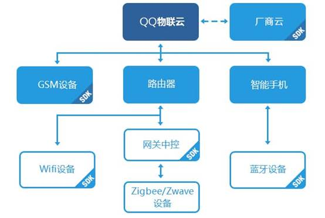

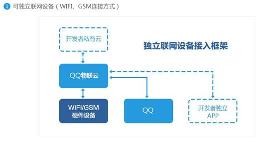

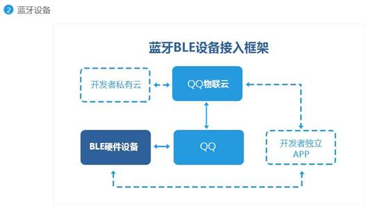

<h3><a name="_Toc450518838">产品案例展示</a></h3>

<h4>音视频类产品</h4>

<b>QQ</b><b>物联开放能力:</b> QQ物联将腾讯积累优化多年的核心音视频能力开放给硬件设备，让具备音视频采集及播放的设备，能够通过音视频
通道，扩展出设备与用户沟通互动的新玩法

<b>应用产品形态: </b>网络摄像机（监控、看护） 、行车记录仪、可视门铃

<b>功能简介: </b>

* 实时无线远程观看视频（支持多人同时）

* 设备本地历史视频无线查看

* 实时语音对讲、异步语音留言

* 自由配置各类动态或预制消息推送

&nbsp;&nbsp;&nbsp;&nbsp;&nbsp;&nbsp;&nbsp;&nbsp;&nbsp;&nbsp;&nbsp;&nbsp;
（如：入侵报警、车辆擦碰通知、婴儿哭声通知等）

* 云台方向控制

* 清晰度调整

* 画面截屏

* 固件在线升级

<h4>沟通互动类产品</h4>

<b>QQ</b><b>物联开放能力:</b> QQ物联将腾讯优势的各类即时通讯及文件传输能力开放，开发者可以利用如语音、视频、图片等形式，组合赋予硬件设备沟通互动的属性。

<b>应用产品形态:</b> 语音对讲手表、儿童早教机、社交电视、电子相框

&nbsp;&nbsp;&nbsp;&nbsp;&nbsp;&nbsp;&nbsp;&nbsp; <b>功能简介: </b>

&nbsp;&nbsp;&nbsp;&nbsp;&nbsp;&nbsp;&nbsp;&nbsp;&nbsp;&nbsp;&nbsp;&nbsp;&nbsp;&nbsp;&nbsp;&nbsp;&nbsp;&nbsp;&nbsp;&nbsp;&nbsp;&nbsp;&nbsp;&nbsp;&nbsp;&nbsp;&nbsp; *
双人语音双向留言

&nbsp;&nbsp;&nbsp;&nbsp;&nbsp;&nbsp;&nbsp;&nbsp;&nbsp;&nbsp;&nbsp;&nbsp;&nbsp;&nbsp;&nbsp;&nbsp;&nbsp;&nbsp;&nbsp;&nbsp;&nbsp;&nbsp;&nbsp;&nbsp;&nbsp;&nbsp;&nbsp; *
双人视频双向留言

&nbsp;&nbsp;&nbsp;&nbsp;&nbsp;&nbsp;&nbsp;&nbsp;&nbsp;&nbsp;&nbsp;&nbsp;&nbsp;&nbsp;&nbsp;&nbsp;&nbsp;&nbsp;&nbsp;&nbsp;&nbsp;&nbsp;&nbsp;&nbsp;&nbsp;&nbsp;&nbsp; *
双人实时视频聊天

&nbsp;&nbsp;&nbsp;&nbsp;&nbsp;&nbsp;&nbsp;&nbsp;&nbsp;&nbsp;&nbsp;&nbsp;&nbsp;&nbsp;&nbsp; &nbsp;&nbsp;&nbsp;
* 双人实时语音聊天

&nbsp;&nbsp;&nbsp;&nbsp;&nbsp;&nbsp;&nbsp;&nbsp;&nbsp;&nbsp;&nbsp;&nbsp;&nbsp;&nbsp;&nbsp;&nbsp;&nbsp;&nbsp;&nbsp;&nbsp;&nbsp;&nbsp;&nbsp;&nbsp;&nbsp;&nbsp;&nbsp; *
家庭群聊，人与设备加入同一个讨论组，支持语音、视频、图片、文字等多种沟通方式

&nbsp;&nbsp;&nbsp;&nbsp;&nbsp;&nbsp;&nbsp;&nbsp;&nbsp;&nbsp;&nbsp;&nbsp;&nbsp;&nbsp;&nbsp;&nbsp;&nbsp;&nbsp;&nbsp;&nbsp;&nbsp;&nbsp;&nbsp;&nbsp;&nbsp;&nbsp;&nbsp; *
相片拍摄及推送

&nbsp;&nbsp;&nbsp;&nbsp;&nbsp;&nbsp;&nbsp;&nbsp;&nbsp;&nbsp;&nbsp;&nbsp;&nbsp;&nbsp;&nbsp;&nbsp;&nbsp;&nbsp;&nbsp;&nbsp;&nbsp;&nbsp;&nbsp;&nbsp;&nbsp;&nbsp;&nbsp; *
固件在线升级

&nbsp;

<h4>数据采集类产品</h4>

&nbsp;&nbsp;&nbsp;&nbsp;&nbsp;&nbsp;&nbsp;&nbsp; <b>QQ</b><b>物联开放能力:</b> 含各类传感器的设备，可将采集并处理过的数据，通过QQ物联提供的通道及云端的存储能力，让用户便捷的在手机中查看。配合规则引擎的设计，让数据采集类产品也可以提供更加人性化的服务，与用户产生互动。

<b>应用产品形态: </b>体重秤、温度计、空气检测器、手环

&nbsp;&nbsp;&nbsp;&nbsp;&nbsp;&nbsp;&nbsp;&nbsp;&nbsp;&nbsp;&nbsp;&nbsp;&nbsp;&nbsp;&nbsp;&nbsp;&nbsp;&nbsp; <b>功能简介: </b>

&nbsp;&nbsp;&nbsp;&nbsp;&nbsp;&nbsp;&nbsp;&nbsp;&nbsp;&nbsp;&nbsp;&nbsp;&nbsp;&nbsp;&nbsp;&nbsp;&nbsp;&nbsp;&nbsp;&nbsp;&nbsp;&nbsp;&nbsp;&nbsp;&nbsp;&nbsp;&nbsp;&nbsp;&nbsp;&nbsp;&nbsp;&nbsp;&nbsp;&nbsp;&nbsp;&nbsp; *
近场或远程实时查看各类数据

&nbsp;&nbsp;&nbsp;&nbsp;&nbsp;&nbsp;&nbsp;&nbsp;&nbsp;&nbsp;&nbsp;&nbsp;&nbsp;&nbsp;&nbsp;&nbsp;&nbsp;&nbsp;&nbsp;&nbsp;&nbsp;&nbsp;&nbsp;&nbsp;&nbsp;&nbsp;&nbsp;&nbsp;&nbsp;&nbsp;&nbsp;&nbsp;&nbsp;&nbsp;&nbsp;&nbsp; *
历史数据指标查看

&nbsp;&nbsp;&nbsp;&nbsp;&nbsp;&nbsp;&nbsp;&nbsp;&nbsp;&nbsp;&nbsp;&nbsp;&nbsp;&nbsp;&nbsp;&nbsp;&nbsp;&nbsp;&nbsp;&nbsp;&nbsp;&nbsp;&nbsp;&nbsp;&nbsp;&nbsp;&nbsp;&nbsp;&nbsp;&nbsp;&nbsp;&nbsp;&nbsp;&nbsp;&nbsp;&nbsp; *
多人数据共享

&nbsp;&nbsp;&nbsp;&nbsp;&nbsp;&nbsp;&nbsp;&nbsp;&nbsp;&nbsp;&nbsp;&nbsp;&nbsp;&nbsp;&nbsp;&nbsp;&nbsp;&nbsp;&nbsp;&nbsp;&nbsp;&nbsp;&nbsp;&nbsp;&nbsp;&nbsp;&nbsp;&nbsp;&nbsp;&nbsp;&nbsp;&nbsp;&nbsp;&nbsp;&nbsp;&nbsp; *
特定数据指标超标通知（支持文字、图片、语音、视频多种通知方式）

&nbsp;&nbsp;&nbsp;&nbsp;&nbsp;&nbsp;&nbsp;&nbsp;&nbsp;&nbsp;&nbsp;&nbsp;&nbsp;&nbsp;&nbsp;&nbsp;&nbsp;&nbsp;&nbsp;&nbsp;&nbsp;&nbsp;&nbsp;&nbsp;&nbsp;&nbsp;&nbsp;&nbsp;&nbsp;&nbsp;&nbsp;&nbsp;&nbsp;&nbsp;&nbsp;&nbsp; *
内容分享至QQ好友、群、微信好友、朋友圈

&nbsp;&nbsp;&nbsp;&nbsp;&nbsp;&nbsp;&nbsp;&nbsp;&nbsp;&nbsp;&nbsp;&nbsp;&nbsp;&nbsp;&nbsp;&nbsp;&nbsp;&nbsp;&nbsp;&nbsp;&nbsp;&nbsp;&nbsp;&nbsp;&nbsp;&nbsp;&nbsp;&nbsp;&nbsp;&nbsp;&nbsp;&nbsp;&nbsp;&nbsp;&nbsp;&nbsp; *
固件在线升级

<h4>无线控制类产品 </h4>

<b>QQ</b><b>物联开放能力: </b>设备利用QQ物联提供的稳定、安全的传输通道，可进行各类设备的近场或远程的无线控制。配合QQ物联提供的消息通道、规则引擎及好友授权能力，简单的控制类设备也可以变得好玩起来） 
<b>&nbsp;&nbsp; </b><b>应用产品形态:</b> 音箱、空气净化器、灯泡、插座、门锁  
<b>&nbsp;&nbsp;&nbsp;&nbsp;&nbsp;&nbsp; </b><b>功能简介: </b> 
&nbsp;&nbsp;&nbsp;&nbsp;&nbsp;&nbsp;&nbsp;&nbsp;&nbsp;&nbsp;&nbsp;&nbsp;&nbsp;&nbsp;
* 设备开关、不同模式切换等不限形式和功能的控制信令（如，音量调节、&nbsp;&nbsp;&nbsp;&nbsp;&nbsp;&nbsp;&nbsp;&nbsp;&nbsp;&nbsp;&nbsp;&nbsp;&nbsp;&nbsp;&nbsp;&nbsp;&nbsp;&nbsp;&nbsp;&nbsp;&nbsp;&nbsp;&nbsp;&nbsp;
净化功能定时开启、灯泡调色等） 
&nbsp;&nbsp;&nbsp;&nbsp;&nbsp;&nbsp;&nbsp;&nbsp;&nbsp;&nbsp;&nbsp;&nbsp;&nbsp;&nbsp;
* 设备状态通知 （如，电量低提示、空气PM2.5超标通知、陌生人进入通知等） 
&nbsp;&nbsp;&nbsp;&nbsp;&nbsp;&nbsp;&nbsp;&nbsp;&nbsp;&nbsp;&nbsp;&nbsp;&nbsp;&nbsp;
* 家居设备家庭成员共享 
&nbsp;&nbsp;&nbsp;&nbsp;&nbsp;&nbsp;&nbsp;&nbsp;&nbsp;&nbsp;&nbsp;&nbsp;&nbsp;&nbsp;
* 固件在线升级 

<h2><a name="_Toc450518839">阿里智能</a></h2>

阿里云物联网套件是阿里云专门为物联网领域的开发人员推出的，其目的是帮助开发者搭建安全性能强大的数据通道，方便终端（如传感器、执行器、嵌入式设备或智能家电等等）和云端的消息通信。开发者可以基于物联网套件快速搭建自己的云平台，部署物联网应用；&nbsp;&nbsp;&nbsp;&nbsp;&nbsp;&nbsp;&nbsp;&nbsp; 开发者还可以基于物联网套件实现跨厂商的互联互通，进而实现多样化的智能场景提供给终端用户。

<h3><a name="_Toc450518840">架构</a></h3>

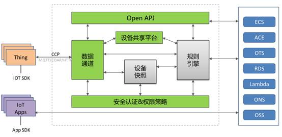

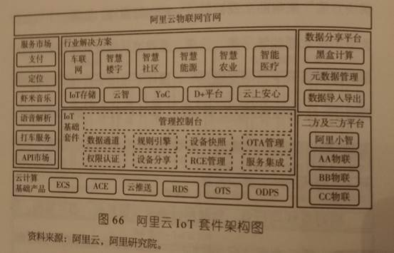

阿里云物联网套件包括以下一部分：

<h4>数据通道</h4>

为设备和物联网应用程序提供发布和接收消息的安全通道。数据通道目前支持CCP协议和MQTT协议：

<ul type=disc>
 <li class=MsoNormal style='text-align:left'>用户可以基于CCP协议实现Pub/Sub异步通信，也可以使用远程调用（RPC）的通信模式实现设备端与云端的通信。</li>
 <li class=MsoNormal style='text-align:left'>用户也可以基于开源协议MQTT协议连接阿里云IoT，实现Pub/Sub异步通信。</li>
</ul>

<h4>安全认证&amp;权限策略</h4>

为每个设备颁发阿里云IoT的凭证，依赖凭证才能连接阿里云IoT。提供设备级的授权粒度，任何设备必须经过授权才能对某个Topic发布订阅消息，服务端也需要经过授权才能操作其他账号下的Topic。

<h4>设备共享平台</h4>

提供Topic跨账号的授权，帮助用户实现跨厂商的数据共享，进而实现更加丰富智能的场景。

<h4>规则引擎</h4>

为用户提供类SQL语言的规则引擎，帮助用户过滤数据、处理数据，并能够发送数据到阿里云其他服务，例如RDS,OTS，ONS等等，也能够发送到数据到其他Topic。

<h4>设备快照（待上线）</h4>

保存设备的最新状态或者APP希望的最新状态在云端，然后当设备或APP连接上来时，同步状态给设备或APP。

&nbsp;

<h3><a name="_Toc450518841">应用场景</a></h3>

<b>设备端实时请求云端: </b>很多物联网设备调用云端服务需要返回结果给设备，方便设备作相应处理。例如用户通过智能音箱调用云端语音解析服务，设备可以实时得到解析结果做处理。

<b>云端实时请求设备端: </b>开发者通过云端控制设备时，需要知道控制有没有成功，例如请求打开灯，用户需要得知灯是否打开，这就需要设备端返回结果给云端

<b>设备端与云端的异步请求: </b>有很多物联网设备之间有互联互通的需求，这种场景适合用异步的方式将消息Pub/Sub到Topic，然后让其他设备或者云端Sub/Pub该 Topic。例如家里的门打开之后，灯和空调就打开。这种场景就可以基于阿里云物联网套件实现，将门的打开这个消息Pub到某个Topic，然后灯以及空 调Sub该Topic得到的门打开的消息作相应的处理。

<b>跨厂商设备互联互通:</b> 不同厂商的设备具有互联互通的需求，例如A厂商的手环通过检测用户的身体状态来控制B厂商的空气净化器以及C厂商的空调。这种场景可以通过阿里云物联网套件实现，具体请在<a
href="https://help.aliyun.com/document_detail/iot/user-guide/console-guide/share.html?spm=5176.789194444.6.98.08e1lI">设备共享</a>中查看详情。

<h3><a name="_Toc450518842">案例应用</a></h3>

<h4>智能硬件平台解决方案</h4>

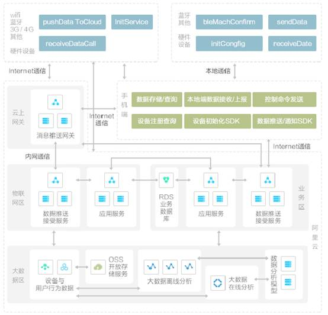

<h4>货车联网平台解决方案</h4>

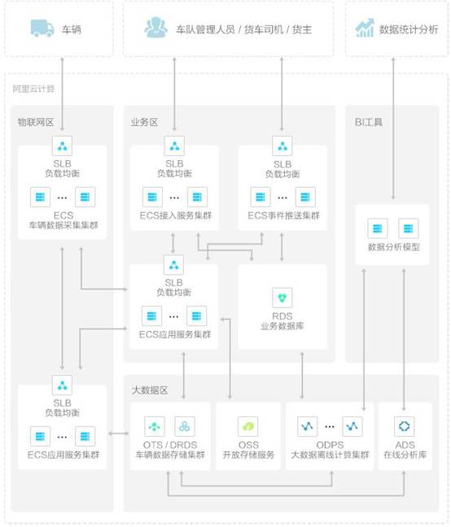

<h4>智能物业设备管理平台解决方案</h4>

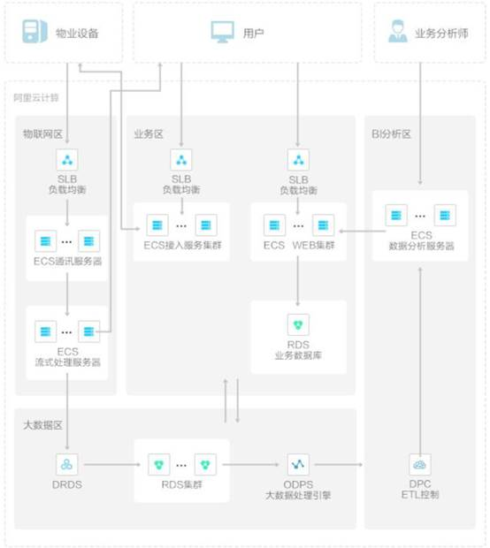

<h2><a name="_Toc450518843">百度云物联网</a></h2>

<h3><a name="_Toc450518844">架构</a></h3>

百度开放云物联网服务支持MQTT（Message
Queuing Telemetry Transport）协议，使用的发布/订阅（Publish/Subscribe）模式更符合机器之间（Machine-to-Machine，M2M）的大规模沟通。

通过支持轻量级可扩展的MQTT，百度开放云物联网服务非常适合需要低功耗和网络带宽有限的IoT场景：

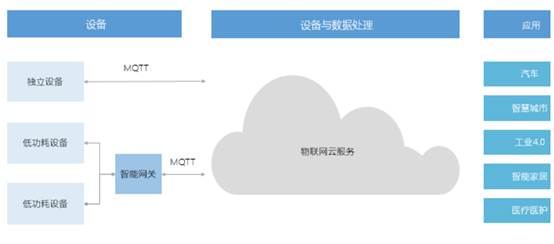

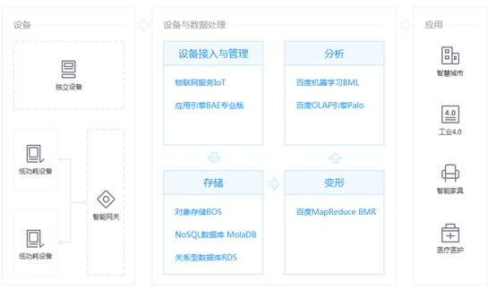

&nbsp;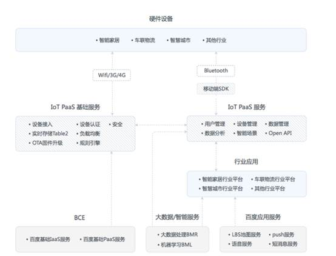

&nbsp;

<h3><a name="_Toc450518845">应用场景</a></h3>

为了更好的推动物联网在中国的发展，百度开放云正式推出了物联网服务，全面助力构建物联网社会。IoT适用于五大业务场景：智能家居，智能穿戴，车联网，工业4.0，智慧城市。

<h4>智能家居</h4>

通过百度IoT OS或者ConnectionAgent SDK可以快速开发连接IoT云平台的智能产品，同时IoT云平台中配套智能规则引擎，可以实现不同厂家产品之间互通、互操作，实现更加丰富的业务场景，为用户提供更定制化、更智能的家居体验。

<h4>车联物流</h4>

货物的地理位置信息上云之后，可以实现货物、车辆的实时跟踪，另外百度地图的多种云端服务与IoT云平台无缝对接，支持物流厂家开发运力调配、货物环境监控、围栏报警等多样应用。

<h4>智慧城市</h4>

智能城市场景中，照明是非常重要的子系统。基于百度IoT OS构建的智能路灯功耗极低，与百度云建立安全可靠的双向通道，通过大数据分析决策实现对道路、片区路灯的智能控制、维护保养，从而达到照明更节能、更舒适、更高效目的。

<h2><a name="_Toc450518846">华为物联</a></h2>

<h3>&nbsp;<a name="_Toc450518847">架构</a></h3>

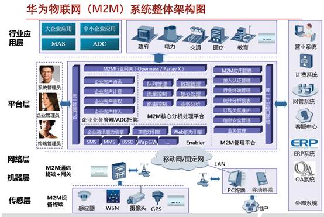

&nbsp;

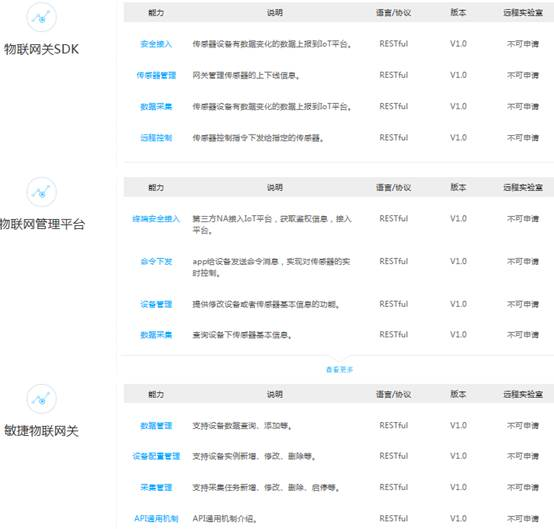

<h3><a name="_Toc450518848">案例应用</a></h3>

&nbsp;

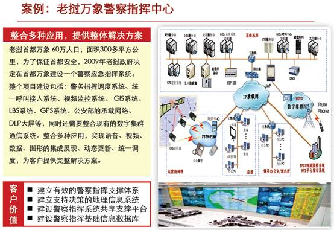

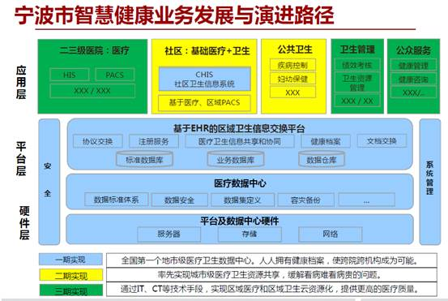

<h2><a name="_Toc450518849">中国移动物联网</a></h2>

&nbsp;&nbsp;&nbsp; 中国移动物联网开放平台是中移物联网有限公司基于物联网技术和产业特点打造的开放平台和生态环境，适配各种网络环境和协议类型，支持各类传感器和智能硬件的快速接入和大数据服务，提供丰富的API和应用模板以支持各类行业应用和智能硬件的开发，能够有效降低物联网应用开发和部署成本，满足物联网领域设备连接、协议适配、数据存储、数据安全、大数据分析等平台级服务需求。

中国移动物联网开放平台始终秉承开放合作的态度，为智能硬件创客和创业企业提供硬件社区服务，为中小企业客户物联网应用需求提供数据展现、数据分析和应用生成服务，为重点行业领域/大客户提供行业PaaS服务和定制化开发服务。

<h3><a name="_Toc450518850">架构</a></h3>

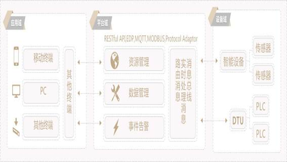

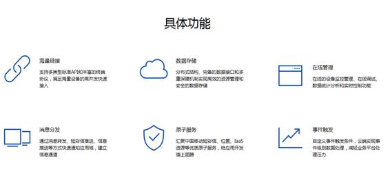

物联网开发板

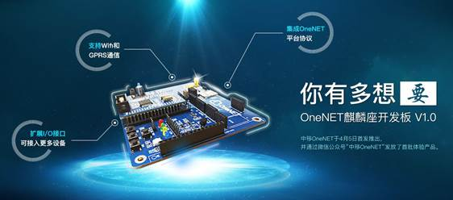

<h3><a name="_Toc450518851">案例应用</a></h3>

<h4>浙江嘉绍大桥照明监控管理系统</h4>

系统方案由路灯照明设备，单灯控制器，集中控制器，OneNET物联网云平台，远程数据控制中心，移动终端软件等组成。主要实现以下功能:

　　主动问询功能：远程监控中心或移动终端通过OneNET物联网云平台可以主动查询每盏灯的开关状态、电流电压、电压、功率、功率因数等数据

　　主动控制功能：远程监控中心或移动终端通过OneNET物联网云平台可以依据控制权限控制任意一盏、一组、一个区域路灯；并依据客户自己要求，实现半夜、关半边及调光降功率的控制，以达到节能效果等功能

　　自动光控功能：依据道路上光照仪采集的光照亮度数据，自动调整道路内各不同区域光照亮度；

　　报警功能：通信中断、灯故障等情况出现时，远程监控中心或移动终端通过OneNet物联网云平台有报警显示

　　地图功能：通过OneNET物联网云平台在电子地图上显示每盏灯的开关状态并对每盏灯、每盏灯远程手动执行开关灯、调光功能。

　　曲线报表功能：可以生成电量报表，并存储于OneNET物联网云平台。

　　远程维护功能：监控设备中的采集和通信模块通过OneNET物联网云平台具备远程参数设置和维护功能。

&nbsp;

&nbsp;

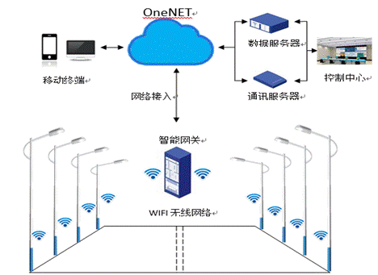

<h4>远程大棚监控系统</h4>

远程大棚监控系统，通过在智能农业大棚内部署各类无线传感终端，实时监测棚内空气温湿度、土壤温度、土壤水分、光照度、CO2浓度等环境参数，并通过无线网络上传到 OneNET平台进行分析，一旦环境偏离植物生长的最适状态，可远程控制加热器、制冷器(通风)、加湿器、除湿器、卷帘机等对环境进行调节，保证植物正常生长。

其主要功能包括：

平台数据分析：无线数据上传、平台综合分析。

环境控制调节：加热、制冷、加湿、除湿、卷帘机等设备的智能远程控制

环境实时监测：空气温湿度、土壤温度、土壤水分、光照、CO2等数据监控。

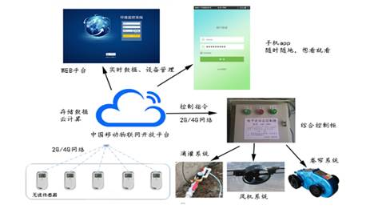

<h4>智能定位防丢电筒</h4>

基于OneNET的智能定位防丢电筒（找TA）以定位、追踪、防丢为基本功能，提供拾音、电筒照明等功能多角度辅助实现老人、儿童等用户人群的安全防丢。找TA主要包括双核定位、远程听音、一键求助、电子围栏、多方监护、历史轨迹查看、一键照明等功能。

双核定位：找TA内置GPS+LBS双核定位芯片，全球无缝追踪，30秒快速响应，精准度更高。

远程拾音：通过手机客户端一键启动远程15秒听音，随时了解父母、儿童所处环境。

一键求助：当他们遇到迷路、身体不适等紧急情况，一键发出求救信号，并自动录音发送到手机客户端，让家人把握最佳救助时机。

电子围栏：个性化定制安全活动范围，老人、儿童一旦越界，手机客户端立即收到越界提醒。

多方监护：一台找TA智能定位防丢电筒可绑定多台手机，一台手机也可监护多台找TA，为老人、儿童更多关爱。

&nbsp;&nbsp;&nbsp; 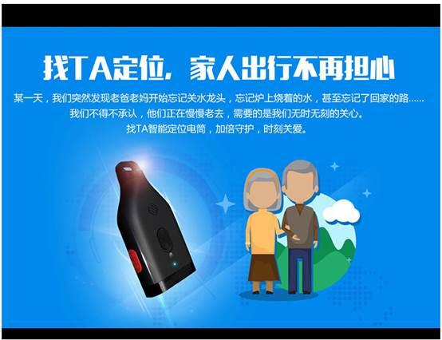

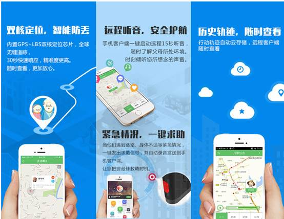

<h4>智慧能源公共服务云平台</h4>

系统架构基于OneNET平台提供底层采集数据的上报、存储和检索，以及设备状态的监控和终端设备的管理。并在此基础上应用基于企业应用图形界面展示工具，实现了针对客户业务的工艺图设计和展示，通过工艺图上节点与采集量测关联，实现数据的动态展示。系统框架采用了多层分布式体系结构作为应用平台主开发架构，以B/S模式作为开发模式，构成多层的实时信息采集、处理、展示的信息监控平台。

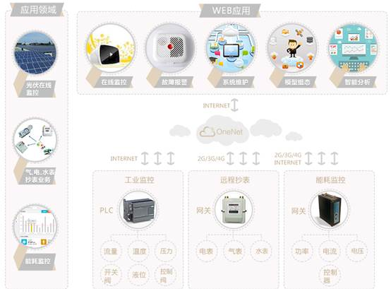

<h4>车辆信息远程监控与管理系统</h4>

车辆信息远程监控与管理系统，借助DTU采集装在车辆不同部件的传感器数据和GPS信息，通过GPRS网络上传至OneNET平台，系统Web端调用 OneNET提供的接口获取这些数据，并进行展示、控制、通知等。通过系统实现对轮胎、发动机、油箱、电瓶、进气管等车辆状态、车辆位置的远程监控及车队
综合管理。

基于OneNET提供的接入协议和平台功能，采用WEB形式打造的车辆信息远程监控系统。系统由终端设备，物联网专用SIM卡，云平台组成，实现了一个典型的“云-管-端”的应用。系统主要包括三大核心功能：在线监控，区域管理，实时报警。

在线监控：能够实时监测车辆的运行状况，监测车辆的位置信息和工作状态，方便用户进行远程管理。

区域管理：运维人员能够更好的监控所属区域内的车辆，及时发现问题，更有针对性的开展车辆维保工作，区域统计功能也便于用户分析车流量等信息。

实时报警：车辆异常状况能够通过终端设备实时上报，并通过短信、邮件发送通知到相关人员。

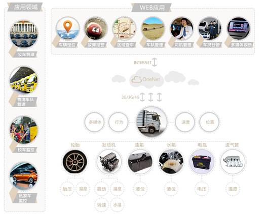

&nbsp;

<h2><a name="_Toc450518852">亚马逊物联</a></h2>

<a
name="AWS_IoT_平台支持您将设备连接到_AWS_服务和其他设备，保证数据和交互的">AWS IoT </a>平台支持您将设备连接到 AWS 服务和其他设备，保证数据和交互的安全，处理设备数据并对其执行操作，以及支持应用程序与即便处于离线状态的设备进行交互。

<h3><a name="_Toc450518853">架构</a></h3>

&nbsp;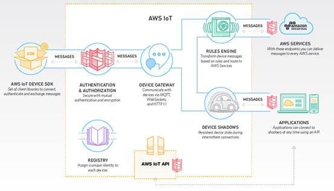

<a name=sdk><b>AWS IoT </b></a><b>设备 SDK</b><b> </b>

AWS IoT 提供有 SDK，以帮助您轻松快速地连接硬件设备或移动应用程序。利用 AWS
IoT 设备 SDK，您的设备可以使用 MQTT、HTTP 或 WebSockets 协议连接和验证 AWS IoT 并与之交换消息。设备 SDK 支持 C、JavaScript 和 Arduino，并且包含客户端库、开发人员指南和制造商移植指南。此外，您还可以使用开源替代资源或自行编写 SDK。

<a name=gateway><b>设备网关</b></a><b>
</b>

AWS IoT 设备网关支持设备安全高效地与 AWS IoT 进行通信。设备网关可以使用发布/订阅模式交换消息，从而支持一对一和一对多的通信。凭借此一对多的通信模式，AWS IoT 将支持互连设备向多名给定主题的订阅者广播数据。设备网关支持 MQTT、WebSocket
和 HTTP 1.1 协议，您可以轻松实现对专有或陈旧协议的支持。设备网关可自动扩展，以支持 10 亿多台设备，而无需预配置基础设施。

<a name=authentication><b>身份验证和授权</b></a><b>
</b>

AWS IoT 在所有连接点处提供相互身份验证和加密，因此，绝不会在无可靠身份的设备和 AWS IoT 之间交换数据。AWS IoT 支持 AWS 身份验证方法（称为“SigV4”）以及基于身份验证的 X.509 证书。使用 HTTP 的连接可以使用任一方法，使用 MQTT 的连接可以使用基于证书的身份验证，使用 WebSockets 的连接可以使用 SigV4。借助 AWS IoT，您可以使用 AWS IoT 生成的证书以及由您的首选证书颁发机构 (CA) 签署的证书。您可以将所选的角色和/或策略映射到每个证书，以便授予设备或应用程序访问权限，或在改变主意时撤消访问权限（甚至都不需触碰设备）。

您可以通过控制台或使用 API 创建、部署并管理设备的证书和策略。这些设备证书可以预配置、激活和与使用 AWS IAM 配置的相关策略关联。如果您选择执行此操作，则会立即撤消单个设备的访问权限。此外，AWS IoT 还支持用户移动应用使用 Amazon Cognito 进行连接，Amazon Cognito 将负责执行必要的操作来为应用用户创建唯一标识符并获取临时的、权限受限的 AWS 凭证。

<a name=registry><b>注册表</b></a><b>
</b>

注册表将创建设备标识并跟踪元数据，如设备的属性和功能。注册表向格式一致的每台设备分配唯一的标识，而不管设备的类型和连接方式为何。此外，它还支持描述设备功能的元数据，例如传感器是否报告温度，以及数据是华氏度还是摄氏度。

注册表允许您存储有关设备的元数据，无需支付额外费用；并且只要您每隔 7 天至少访问或更新注册表条目一次，注册表中的元数据就不会过期。

<a name=shadows><b>设备影子</b></a><b>
</b>

凭借 AWS IoT，您可以创建每台设备的持久虚拟版（或“影子”），它包含设备的最新状态，因此应用程序或其他设备可以读取消息并与此设备进行交互。设备影子保留每台设备的最后报告状态和期望的未来状态，即便设备处于离线状态。您可以通过 API 或使用规则引擎，获取设备的最后报告状态或设置期望的未来状态。

设备影子提供始终可用的 REST API，使得构建与您的设备进行交互的应用程序更加轻松。此外，应用程序可以设置设备的期望未来状态，而无需说明设备的当前状态。AWS IoT 将比较期望未来状态和最后报告状态之间的差异，并命令设备“弥补差异”。

AWS IoT 设备 SDK 使您的设备能够轻松地同步其状态及其影子，并响应通过影子设置的期望的未来状态。

设备影子支持您免费存储设备状态多达一年。如果您至少每年更新一次状态，则设备影子将永久保留状态；否则状态将过期。

<a name=rulesengine><b>规则引擎</b></a><b>
</b>

规则引擎可以构建 IoT 应用程序，这些应用程序将收集、处理和分析互连设备在全局范围内生成的数据并根据数据执行操作，且无需管理任何基础设施。规则引擎评估发布到 AWS IoT 的入站消息，并根据您定义的业务规则转换这些消息并将它们传输到另一台设备或云服务。规则可以应用至一台或多台设备中的数据，并且它可以并行执行一个或多个操作。

规则引擎还可以将消息路由到 AWS 终端节点，包括 AWS Lambda、Amazon Kinesis、Amazon S3、Amazon Machine Learning、Amazon DynamoDB、Amazon CloudWatch 和内置 Kibana 集成的 Amazon Elasticsearch Service。外部终端节点可以使用 AWS Lambda、Amazon Kinesis 和 Amazon Simple Notification Service (SNS) 进行连接。

您可以在管理控制台中或者使用类似 SQL 的语句编写规则。规则可以编写为采用不同的方式表示，具体取决于消息内容。例如，如果温度读数超出特定阈值，则它可以触发规则以便将数据传输到 AWS Lambda。规则还可以编写为考虑云中的其他数据，例如其他设备中的数据。例如，您可以在规则中编写，如果此温度超出其他 5 台设备的平均值 15%，则应采取措施。

规则引擎将提供数十个可用于转换数据的可用功能，并且可以通过 AWS Lambda 创建无限个功能。例如，如果您正在处理各种不同的数值，则可以取传入数字的平均值。规则还会触发在 AWS Lambda 中执行 Java、Node.js
或 Python 代码，从而为您提供最高灵活度以及处理设备数据的能力。

&nbsp;

<h2><a name="_Toc450518854">微软物联</a></h2>

&nbsp;&nbsp;&nbsp;&nbsp; Azure物联网套件主要提供的IoT Hub平台是一个可扩展的多租用户云端平台，同时是一种IoT PaaS服务，除了可使用于Windows设备外，还可支持包括Linux、iOS、Android，以及即时操作系统(RTOS)在内等设备。在这个IoT Hub平台具有强大扩充能力，最多可同时与数以百万台的设备相连，还提供了包括IoT设备登录表(Device
Registry)、数据储存(Data
Storage)，以及安全机制等。

&nbsp;&nbsp;&nbsp; 此外，微软还发布了SDK提供开发人员运用在各种IoT应用的开发服务。目前包括Intel、Freescale、德州仪器、Raspberry Pi等多家厂商都已加入微软的Azure IoT认证计划。

<h3><a name="_Toc450518855">架构</a></h3>

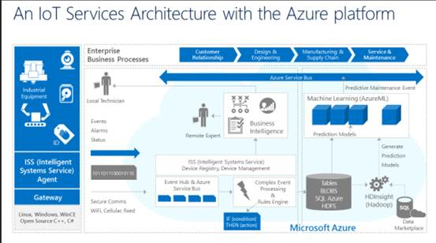

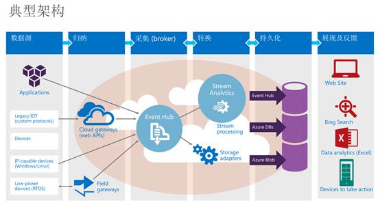

<h2><a name="_Toc450518856">攀多物联</a></h2>

一群来自安防与智慧城市、传感器、通信设备、工业机器人、互联网等行业出身的融合团队，汇集了从硬件到云的最均衡物联网技术战队； 
&nbsp; 致力于打造最方便的物联网产品开发工具，提供一整套纵向的物联网解决方案，信息连接制造业与互联网，让创造变得简单。

架构

&nbsp;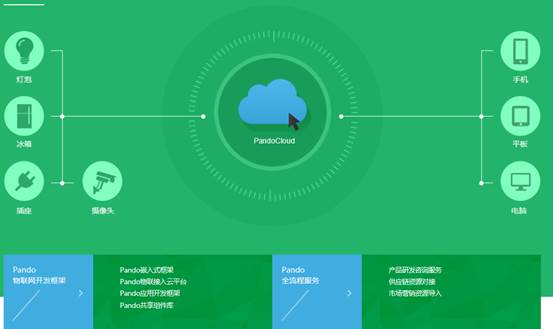

&nbsp;

<h1><a name="_Toc450518857">美国2015</a>年十大创新型B2B物联网公司</h1>

<h2><a name="_Toc450518858">1 Ambyint</a></h2>

使用“Ambyint智能平台”后，每个油井都能够从技术优化中受益，节约了高昂的信息技术成本。在工业物联网的实际应用中，通过将设备与<a href="http://product.it168.com/list/b/0470_1.shtml"
target="_blank" title=传感器>传感器</a>连接在一起，让它们进行‘沟通’，能够对大量数据进行收集和分析，并据此开发具有成本效益的解决方案，实现油井运行的自动化，并通过不断的学习演进取得更好效果。

<h2><a name="_Toc450518859">2 ClickSoftware</a></h2>

ClickSoftware的移动调度解决方案为从事安装、维护、维修服务的技师提供便利，能够优化并实现智能化的调度。在为现场设备提供服务之前，预先收集的信息有助于管理者决策：是否需要派遣技师前往现场，技师是否拥有完成工作所需的技能，是否携带了正确的零部件。ClickSoftware 通过物联网层面的智能化，能够为客户和设备资产提供主动型服务。

ClickSoftware旨在消除服务过程中的摩擦与不便，让服务超出客户预期。对于客户来说，服务的本身就是一种不便，因为服务就要涉及设备停机，就要花费时间预约。通过利用物联网和联网设备，ClickSoftware能够主动安排服务――通常在客户意识到问题之前完成提前安排。

<h2><a name="_Toc450518860">3 Ayla Networks</a>艾拉物联</h2>

成立于2010年的艾拉物联，推出端到端物联网云平台，旨在帮助制造商聚焦自己的核心竞争力，快速打造物联网产品。Ayla平台能够加速物联网产品的开发、技术支持以及产品改进流程。作为PaaS服务，Ayla物联网云平台能够让任何设备实现安全连接、大数据分析，并为最终用户提供功能丰富的体验。

Ayla Networks艾拉物联CEO David Friedman表示：“我们能够帮助制造商推出物联网产品，让他们利用联网设备生成的数据，来形成商业智能反馈环路。物联网中最重要的，就是联网产品生成的数据――我们的客户无需招募专业数据技术团队，就能有效的收集数据，并利用这些数据获得价值。”

<h2><a name="_Toc450518861">4 CRG International</a></h2>

CivicAR让增强现实(AR)技术在智能城市中能够进行实际的运用。它能够在可视化的移动情景中，为市民、员工以及社区提供实时数据、信息以及服务。CivicAR能够整合来自多个数据源的数据――包括： “物”产生的数据、开放数据、代维系统、移动用户数据、环境数据等等――从而为市民提供交通、旅游、公共活动等信息，为公职人员提供现场维护、检查、应急 等服务，以及其他富有价值的全新用户体验。

CivicAR希望利用数字技术的进步在公共事业领域实现突破。我们能够通过增强现实技术(AR)提供多个媒介的实时访问，能够在此前相互孤立的领域之间提供应用服务，从而打造更加完整的联网解决方案。

<h2><a name="_Toc450518862">5 Inrix</a></h2>

交通部门在进行分析时，采用的通常都是假设数据或调查得来的数据，这常常不够客观且成本极高。INRIX的“Insights
Trips”提供了出行数据方面的服务，能够让有关部门追踪人们的出行趋势进行并改善服务。比如，当地交通主管部门可以参考人们观看体育赛事时开始行程、
结束行程的位置数据，来更好地制定交通管制计划。INRIX利用技术、大数据以及云端服务，来解决城市出行挑战，并打造可持续的智能城市。

&nbsp;

<h2><a name="_Toc450518863">6 CrossChx</a></h2>

CrossChx通过打造一个通用患者ID来整合医疗保健数据。他们的旗舰产品SafeChx是一个指纹识别控制台，能够即刻验证患者身份，将他们与自己的病历进行匹配。此外，该系统还能够识别重复病历，从而实现数据校正。

CrossChx 首席执行官Sean Lane表示：“CrossChx成立在一个革命性理念的基础之上――患者身份应当是一项基本权利。不幸的是，现实情形并非如此。每个医疗保健提供者对于 患者的医疗身份都可能拥有不同的看法。在CrossChx，我们致力于从根本上改变医疗保健，为医疗保健提供者打造创新的应用程序，从而帮助他们确定并保护患者身份，精简内部登记程序，营造一个全新的一流患者体验。

<h2><a name="_Toc450518864">7 Tungsten Solutions, LLC</a></h2>

业界致力于让消费者实现便捷的支付，不过到目前为止，大多数创新专注的都是外围的1%。在对医疗保健支付这个万亿美元规模的市场进行具体分析后发
现，67%的市场依旧是基于纸质交易的，而剩下33%基于电子交易的市场也亟待优化。Tungsten
Solutions想让医疗保健和保险支付变得足够透明便捷，为全国人提供一键点击便捷支付，其中包括30%没有银行账户或只是次级银行客户的用户。此 外，Tungsten Solutions已与《财富》世界500强金融机构进行了合作，从而打造一个能够在任何经济‘轨道’上运行的创新支付平台。

<h2><a name="_Toc450518865">8 Ekoor</a></h2>

Ekoor提供绿色Beacon，用于基于位置的营销、客户忠诚计划以及移动支付。该款Beacon可以由室内灯光/阳光提供动力支持。此外，该Beacon还配备有一个备用<a
href="http://product.it168.com/list/b/1304_1.shtml" target="_blank" title=电池>电池</a>，在光照不足的情况下也可以使用。

EKOOR还致力于在智能家庭、智能农业等领域打造绿色物联网平台，并且已经在研发其他一些产品，其中一些智能设备可以由设备周围的能源提供动力支持。EKOOR的使命就是找到这些可能性，并为环境做贡献。

<h2><a name="_Toc450518866">9 Onstream</a></h2>

Onstream提供实时推演应用程序，能够用于打造自我学习、自我管理型设备，对周围环境和用户习惯进行持续学习。Onstream应用程序可以进行扩展，以支持多个联网设备。

随着联网设备变得无处不在，众多新型物联网平台的出现，厂商们有机会打造一个由自主智能的设备构成的世界。Onstream提供了一款成熟的设备认知应用程序，能够将复杂的人工智能技术与友好的界面结合起来，从而打造价格不高、速度更快的认知型设备。

<h2><a name="_Toc450518867">10 StratIS</a></h2>

StratIS的接入、能源、以及自动化管理系统，专为多单元房屋和校园社区而打造。该系统能与Schlage Control Bluetooth门锁等其他物联网设备集成，从而为业主提供多个联网设备的远程控制功能。StratIS让全球的商品住宅楼宇拥有具体到单元的全楼控
制，在提升管理和安全水平的同时，为他们节约能源和维护成本。

<h1><a name="_Toc450518868">物联网行业应用-</a>安防系统</h1>

传统安防系统主要包括三大系统出入控制，视频监控，以及报警。随着物联网技术的发展，传统安防系统与物联网及其产品相结合形成物联网安防，达到安全防护的作用，从而使安防产品智能化。其应用包括安全防护、楼宇安防、智能家居、智能交通、智能医疗、智能环保等领域，以下是我从事多年安防行业的系统做一些介绍，对物联网平台架构有参考作用。

<h2><a name="_Toc450518869">KA</a>综合安防系统</h2>

KA安防管理系统是中、大型安防系统的解决方案,开放结构的控制平台，支持众多的安全自动化设备内含工业级门禁系统、CCTV控制，消防控制、对讲控制等。它作为集成系统的通讯中心，以各自系统，通过TCP/IP连接和串口连接以交换数据，实现互联互控,可以根据客户的，需求改变而灵活地进行扩展，例如增加系统所管理的持卡人，读卡器和工作站的数量，系统有如下主要功能:

<h3><a name="_Toc450518870">功能介绍</a></h3>

<h4>报警/ 事件管理</h4>

<b>出入控制规则</b><b>: </b>多人规则，防返潜，强制进／出，电梯控制,机柜访问控制, 安全威胁等级控制

<b>环境状况识别</b><b>: </b>交互式实时电子地图,
实时列表, 区域管理, 疏散集合管理,
证照对比, 巡更轨迹追踪

<b>警报处理</b><b>: </b>报警优先级管理, 用户自定义声光报警, 可插入报警文本信息, 可预先设定报警响应文本信息, 消息过滤器, 消息转发, 报警升级, 事件群－触发＆联动

<h4>持卡人认证管理功能</h4>

<b>认证信息管理:</b><b> </b>HR系统集成, 访客管理系统, 用户自定义卡片格式, 无限持卡人UDF,
文本日志格式自定义

<b>特殊访问管理:</b> 持卡人信息修改权限, 最长非活跃周期, 临时卡访问, 特别辅助出入（ADA）

<b>视频证照: </b>卡片样式客户化, 照片＆签名提取, 卡片印刷,- 水印,- 全息图像,- 条形码, 智能卡＆磁条卡, 卡号自动管理

<b>合规性管理: </b>刷卡轨迹追踪, 修改痕迹的审计追踪, 强大的报表功能

<h4>配置与集成功能</h4>

<b>企业级集成: </b>开放的API接口 ,ODBC　SQL数据库, 邮件设置SMTP

<b>高实用性:</b> 企业－地区服务器架构, 热备＆冗余, 虚拟环境&nbsp; 

<b>授权认证:</b> 复合密码认证, 基于规则的访问许可组, 数据库分区

<b>楼控系统集成: </b>视频监控系统集成, 电梯控制集成, 内部通话系统集成, , Metasys 楼宇自控集成, 内置多种语言

<h3><a name="_Toc450518871">系统架构</a></h3>

该系统最核心消息路由服务(事件,过滤器)，远程消息服务，以及网络控制器(网关)相关管理服务:设备连接管理，设备数据上传,以及设备配置数据下载与远程控制。这些服务对于设计物联网系统有参考价值。通过这些服务可以使用多种设备，多区域设备互联互控。

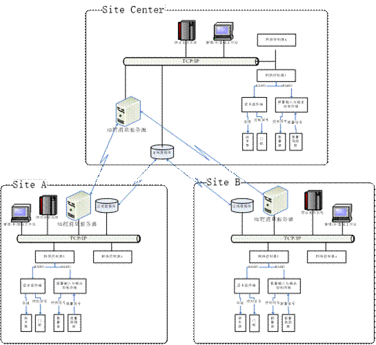

安全防范管理功能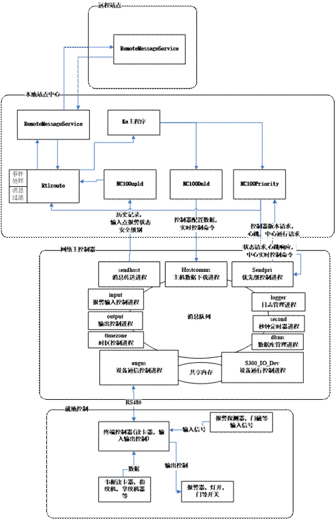

<h2><a name="_Toc450518872">车辆人员出入控制系统</a></h2>

该系统是综合安防平台中的子系统，主要实现根据一、二、三、四类安全区的不同安全等级，对出入的车辆进行授权，实现车辆不停车出入管理。车辆出入管理系统采用RFID电子标签识别+车牌识别的方式，其中电子标签及识别设备要求采用满足行业标准的无源系统，系统由管理服务器、管理工作站、卡管理工作站、道口工作站、车辆综合控制器、车辆检测器、车牌识别设备、电子标签识别设备、网络设备及其它相关设备组成。 
人员进出管理在左岸电厂、右岸电厂、船闸南六、船闸南二、工程建设管理中心、地下电站（预留）和安防系统监控指挥大厅等部位建设人员出入管理系统 ，除监控指挥大厅内为单门双向通过式门禁外，系统其它部位所设门禁一律为无障碍通过方式

该系统架构设计时参照上面的安防系统架构，该系统是定制项目，是按照标书要求来设计的。消息通信机制主要使用zmq来实现。该项目核心架构能够体现物联网三层架构模式。 

<h3><a name="_Toc450518873">系统架构</a></h3>

&nbsp;

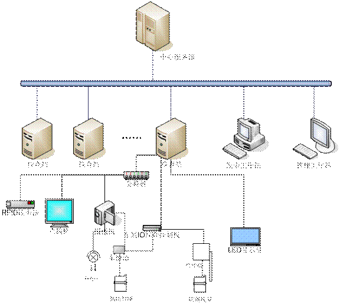

<h3><a name="_Toc450518874">检查站车辆控制器内部架构</a></h3>

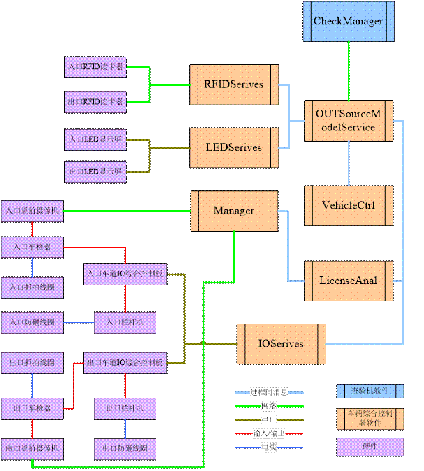

<h2><a name="_Toc450518875">地理信息系统</a></h2>

地理信息系统在物联网平台建设提供基础作用，如果需要构建一套通用的,大范围的物联网平台，GIS是必不可少的，上面《物联网平台介绍》中BAT大巨头都有自己的GIS系统，&nbsp;&nbsp;&nbsp;
百度地图，阿里高德地图，腾讯地图，中国移动物联使用的是百度地图,对于自己GIS物联平台可以使用第三方的GIS系统。下面介绍我所熟悉的地理信息系统，该系统地理信息引擎使用的ESRI
arcgis.这是美国一家商用的地理信息系统商。

该GIS平台主要提供一个分布式的平台，通过不同的配置以插件的方式加入各种不同的业务，可以形成在不同的业务下支持不同的GIS功能，主要功能模块有：

<b>应用服务器：</b>用于支持GIS客户端的业务请求并处理请求；

<b>通信服务器：</b>可以用于基于GIS客户端与GIS客户端之间的通信、GIS客户端与服务器之间的通信；

<b>日志服务：</b>提供平台或平台客户端使用分布式的方式与本地文件两种方式来进行日志管理；

<b>安全服务：</b>提供基于客户端与服务器端的安全权限控制服务，用户的验证服务；

<b>终端接入：</b>支持通用GIS客户端、性能监控客户端、CAD客户端等的接入，以便与GIS业务进行通信；

<b>服务容器：</b>平台提供一些核心的服务，同时也可以插入一些扩展的服务，以扩展平台为相关GIS服务；

<b>业务容器：</b>平台提供业务容器，业务通过业务容器将其相关的业务插入到平台中；

<b>GIS</b><b>的核心业务：</b>提供GIS处理的核心业务，如地图的加载，图层功能，地图的定位等通用GIS业务；

&nbsp;

<h4><a name="_Toc166404617">GIS</a>系统模型</h4>

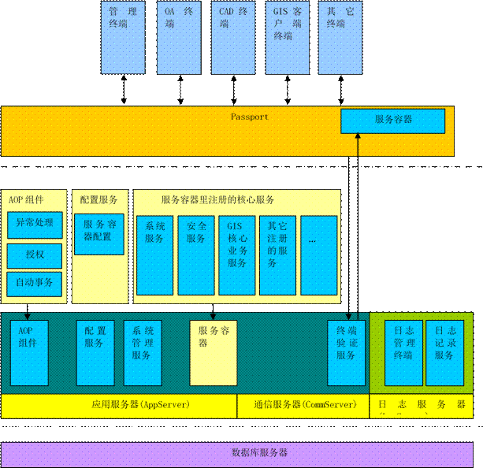

该系统采用多层架构，客户端通过一个Passport来登录到服务器后，获取到一个服务容器，系统根据不同的终端在服务容器中注册不同的服务，以让用户能够获取到相关的服务。

为了管理整个系统的调用日志，本系统的日志采用分布式的架构，也就是说所有需要记录日志的客户端通过日志服务组件提供的登录信息登录到日志服务器中，然后记录相关的日志信息，日志管理终端可以在任何一处实时监控日志服务器中的日志。

&nbsp;

<h4><a name="_Toc166404618">网络结构图</a></h4>

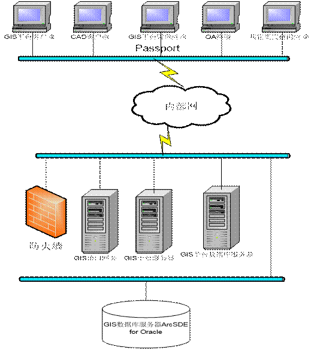

GIS数据库服务器ArcSDE用于为GIS开发平台ArcGIS作数据存储用途；

GIS平台服务器用于部署本平台的应用服务器、通信服务器、日志服务器，也可分开部署；

GIS平台数据库服务器，用于存储本平台所需要的数据库；

GIS接口网关用于接收外部CAD接口的GIS定位请求，此部分因为考虑到接口连接数目可能较多，所以与应用服务器部署到两台不同的计算机上；

各个终端：各种不同的业务终端；

&nbsp;

<h1><a name="_Toc450518876">总结</a></h1>

通过这段时间研究调查物联网行业，对物联网的发展，原理，架构，关键技术，市场上成熟悉物联网解决方案有一定的了解，结合我这些年来参与或设计的项目，特别是安防行业的项目的一些经验,来对物联网现状，未来发展，以及物联网基础平台架构，做一些总结与想法。

&nbsp;物联网提出概念至今差不多有20多年的历史，由于当时外围环境不成熟，物联网的发展还没有得到人们的重视，随着20年多年互联网技术，软件与硬件环境的发展，特别最近5年来云计算发展成熟，为物联网提供很好的基础环境。物联网是在互联网，云计算之上。从互联网出现，它的大概经过如下阶段：互联网1.0时代PC设备互联，各种业务主要绕个人电脑，比如各大门户网站，搜索引擎，电商，IM聊天工具等;互联网2.0时代移动设备的互联，出现针对移动设备的app, 比如微信，手机支付等。互联网3.0时代，进入物联网时代，互联设备不仅仅PC与移动设备，我们身边所有人与人，人与物，物与物进入互联互通，

万物联网。物联网一直被认为是“下一个工业革命”，因为它即将改变人们的生活、工作、娱乐和旅行方式，甚至改变全球政府及企业之间的交互。以下是网上摘录的未来5年内物联网的整体发展态势要点

&nbsp;&nbsp;&nbsp;&nbsp; 1、总的来说，预计到2020年将有340亿台设备接入互联网，而在2015年只有100亿台设备接入互联网。物联网设备将占到240亿台，剩下的100亿台设备为传统的计算机设备（比如智能手机、平板、智能手表等。） 

2、未来5年里，近6万亿美元资金将被投入到物联网解决方案开发上。 

3、企业是物联网解决方法的最大应用实体。物联网可以在三方面提高企业底线：1）降低运营成本；2）提高生产率；3）开拓新市场或开发新产品。 

4、政府也开始重点关注提高生产效率、降低成本并改善居民生活质量。相信未来政府将成为物联网生态系统第二大应用实体。

5、在物联网应用上，消费者略显滞后于企业和政府。但是他们仍将会购买大量物联网设备，并在物联网生态系统上投入重金。

&nbsp;&nbsp;&nbsp;&nbsp; 2008年IBM提出的”智慧地球”,2009年国内温总理提出的”感知中国”,物联网被列为国家发展战略。这一两年国内互联网（BAT），通信（华为,中国移动）的巨头们依靠自己技术与平台优势纷纷推出的自己的物联网基础平台，不过现在暂时只提供企业的接入，个人除了移动物联网外还无法接入，物联网的发展使传统硬件厂商能载上互联网飞速的快车，不断创新。随着巨头门提供的云计算Iaas成熟，中小型企业构建自己Paas, Saas的成本降低了不少，也为”万众创新，大众创业”提供了很好的基础环境。下面从物联网三层架构出发，描述物联网基础平台最基本架构流程。

&nbsp;&nbsp;&nbsp;&nbsp; 首先在物联网中有各种各样的设备接入，它们应用于各个行业，有各自的通信接口与协议，为了这些设备接入物联网，需要有通用的网关来负责各设备接入，协议转换然后通过标准协议接入物联网，现在大部分物联网平台使用mqtt协议接入物联网。

&nbsp;&nbsp;&nbsp;&nbsp; 通过标准协议接入物联网，在网络层需要负责成千上万的设备接入，随着设备的不断增加，会到百万，千万，上亿级，需要有动态扩容能力，需要采用分布式消息路由，而且前端设备有部分会7*24小时在线状态，上层还可以发送命令控制设备。解决设备接入后，终对不同设备的消息，需要规则引警来实现设备的联动控制，比如根据设备类型的各种消息类型，当达到某种条件时后解发事件，执行一些动作。消息路由在传输过程中，需要有消息过滤的功能，过滤一些不必要的消息传送，减少网络的负载。消息在传送的过程中需要考虑消息的安全性。

通过网络层接收到各种消息，会产生大数据，需要对这些大数据进行分析与处理，生成有价值的数据，同时对这些消息进行相应的业务处理。

<h1><a name="_Toc450518877">参考资料</a></h1>

1.张学记&nbsp;&nbsp; 智慧城市:物联网体系统架与应用 电子工业出版社 2014

2.田丰 等&nbsp; 互联网3.0 云脑物联网创造DT新世界&nbsp;
社会科学文献出版社 2016

3.武永卫 等 云计算与分布式系统从并行处理到物联网 机械工业出版社&nbsp; 2013

4.[美] 塞缪尔.格林加德&nbsp;&nbsp; 物联网&nbsp;&nbsp; 2016

5.中国移动物联网白皮书.pdf, 中国移动技术愿景2020+白皮书.pdf

6. 相关网站

&nbsp; 物联中国 <a href="http://www.50cnnet.com/">http://www.50cnnet.com/</a>

&nbsp; Q物联&nbsp; <a href="http://www.qwulian.cn/">http://www.qwulian.cn/</a>

<strong>&nbsp; QQ</strong><strong>物联</strong><strong> </strong><a
href="http://iot.open.qq.com/">http://iot.open.qq.com/</a>

&nbsp; 阿里物联
<a href="https://open.alink.aliyun.com/">https://open.alink.aliyun.com/</a>

<strong>&nbsp; </strong><strong>百度物联</strong><strong> </strong><a
href="http://iot.baidu.com/solution.html">http://iot.baidu.com/solution.html</a>

<strong>&nbsp; </strong><strong>华为物联</strong><strong> </strong><a
href="http://developer.huawei.com/cn/ict/Products/IOT">http://developer.huawei.com/cn/ict/Products/IOT</a>

&nbsp; 中国移动物联网&nbsp; <a href="http://open.iot.10086.cn/">http://open.iot.10086.cn/</a>

&nbsp; 亚马逊物联&nbsp; https://aws.amazon.com/cn/iot/

&nbsp; 微软物联&nbsp; https://www.azure.cn/home/features/event-hubs/

<strong>&nbsp; </strong><strong>京东智能云</strong><strong>&nbsp; </strong><a href="http://devsmart.jd.com/dev/index">http://devsmart.jd.com/dev/index</a>

&nbsp; 机智云&nbsp; <a href="http://www.gizwits.com/">http://www.gizwits.com/</a>

&nbsp; 艾拉物联&nbsp; <a href="http://www.ayla.com.cn/company/about-ayla">http://www.ayla.com.cn/company/about-ayla</a>

&nbsp; 攀多物联&nbsp; <a href="http://www.pandocloud.com/">http://www.pandocloud.com/</a>

&nbsp;

&nbsp;

</body>

</html>
