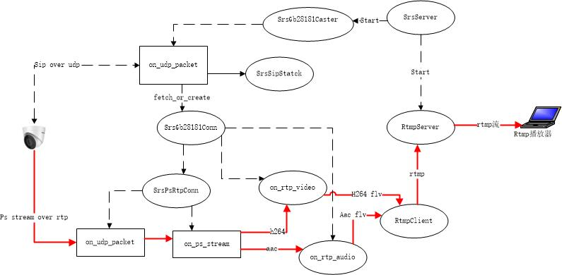

## SRS4.0 GB28181对接实现   
支持gb28181对接， 基于sip over udp信令， ps over rtp,  ps 流格式h264/aac  
实现了常用注册register, 心跳message，请求实时流invite ack bye 几个信令  
[https://github.com/xialixin/srs/tree/dev-28181](https://github.com/xialixin/srs/tree/dev-28181)

### 交互流程
 
 1. 设备端发送register给srs srs检查参数之后回应200 ok, 注册成功
 2. 设备端发送message 心跳给srs  srs回200 ok
 3. srs收到设备第一个心跳之后， 发送invite命令 带sdp媒体描述参数 给设备端，请求设备发送流
 4. 设备收到invite后，发送tring与 响应invite 200 ok
 5. srs收到invite 200 ok， 再发送ack确认收流
 6. 设备收到ack 响应 200 ok， 通过rtp发送ps流
 7. 设备或srs端发送bye命令， srs停止接收流， 设备停止发送流

### 注册
    ipcam              srs
      |---register----->|
      |<---200 ok ----- |   
    
    实例：  

	REGISTER sip:34020000002000000001@3402000000 SIP/2.0
	Via: SIP/2.0/UDP 192.168.137.226:5060;rport;branch=z9hG4bK1079360936
	From: <sip:34020000001320000003@3402000000>;tag=2009999660
	To: <sip:34020000001320000003@3402000000>
	Call-ID: 2085625296
	CSeq: 1 REGISTER
	Contact: <sip:34020000001320000003@192.168.137.226:5060>
	Max-Forwards: 70
	User-Agent: IP Camera
	Expires: 3600
	Content-Length: 0
	
	SIP/2.0 200 OK
	Via: SIP/2.0/UDP 192.168.137.226:5060;rport;branch=z9hG4bK1079360936
	From: <sip:34020000001320000003@340200000>
	To: <sip:34020000001320000003@340200000>
	CSeq: 1 REGISTER
	Call-ID: 2085625296
	Contact: <sip:34020000001320000003@192.168.137.226:5060>
	User-Agent: SRS/4.0.4(Leo)
	Content-Length: 0

### 心跳  
    ipcam              srs
      |---message------>|
      |<----200 ok -----|

    实例：
	MESSAGE sip:34020000002000000001@3402000000 SIP/2.0
	Via: SIP/2.0/UDP 192.168.137.226:5060;rport;branch=z9hG4bK782085639
	From: <sip:34020000001320000003@3402000000>;tag=95345106
	To: <sip:34020000002000000001@3402000000>
	Call-ID: 182406294
	CSeq: 20 MESSAGE
	Content-Type: Application/MANSCDP+xml
	Max-Forwards: 70
	User-Agent: IP Camera
	Content-Length:   160
	
	<?xml version="1.0" encoding="UTF-8"?>
	<Notify>
	<CmdType>Keepalive</CmdType>
	<SN>1</SN>
	<DeviceID>34020000001320000003</DeviceID>
	<Status>OK</Status>
	</Notify>
	SIP/2.0 200 OK
	Via: SIP/2.0/UDP 192.168.137.226:5060;rport;branch=z9hG4bK782085639
	From: <sip:34020000001320000003@340200000>
	To: <sip:34020000002000000001@340200000>
	CSeq: 20 MESSAGE
	Call-ID: 182406294
	User-Agent: SRS/4.0.4(Leo)
	Content-Length: 0
### 实时流请求
    ipcam              srs
      |<----invite------|
      |----->tring----->|
      |----->200 ok---->|
      |<----ack---------|
      |-----200k------->|

    实例：
         
    INVITE sip:34020000001320000003@3402000000 SIP/2.0
	Via: SIP/2.0/UDP 39.100.155.146:15060;rport;branch=z9hG4bK34201775
	From: <sip:34020000002000000001@39.100.155.146:15060>;tag=512351775
	To: <sip:34020000001320000003@3402000000>
	Call-ID: 200001775
	CSeq: 20 INVITE
	Content-Type: Application/SDP
	Contact: <sip:34020000001320000003@3402000000>
	Max-Forwards: 70 
	User-Agent: SRS/4.0.4(Leo)
	Subject: 34020000001320000003:0018119775,34020000002000000001:0
	Content-Length: 251
	
	v=0
	o=34020000001320000003 0 0 IN IP4 39.100.155.146
	s=Play
	c=IN IP4 39.100.155.146
	t=0 0
	m=video 58204 RTP/AVP 96 97 98 99
	a=recvonly
	a=rtpmap:96 PS/90000
	a=rtpmap:97 MPEG4/90000
	a=rtpmap:98 H264/90000
	a=rtpmap:99 H265/90000
	y=0018119775
	SIP/2.0 100 Trying
	Via: SIP/2.0/UDP 39.100.155.146:15060;rport=15060;branch=z9hG4bK34201775
	From: <sip:34020000002000000001@39.100.155.146:15060>;tag=512351775
	To: <sip:34020000001320000003@3402000000>
	Call-ID: 200001775
	CSeq: 20 INVITE
	User-Agent: IP Camera
	Content-Length: 0
	
	SIP/2.0 200 OK
	Via: SIP/2.0/UDP 39.100.155.146:15060;rport=15060;branch=z9hG4bK34201775
	From: <sip:34020000002000000001@39.100.155.146:15060>;tag=512351775
	To: <sip:34020000001320000003@3402000000>;tag=1027615678
	Call-ID: 200001775
	CSeq: 20 INVITE
	Contact: <sip:34020000001320000003@192.168.137.226:5060>
	Content-Type: application/sdp
	User-Agent: IP Camera
	Content-Length:   265
	
	v=0
	o=34020000001320000003 2219 2219 IN IP4 192.168.137.226
	s=Play
	c=IN IP4 192.168.137.226
	t=0 0
	m=video 15060 RTP/AVP 96
	a=setup:active
	a=sendonly
	a=rtpmap:96 PS/90000
	a=username:34020000001320000003
	a=password:12345678
	a=filesize:0
	y=0018119775
	f=
	ACK sip:34020000001320000003@3402000000 SIP/2.0
	Via: SIP/2.0/UDP 39.100.155.146:15060;branch=z9hG4bK34201775
	From: <sip:34020000002000000001@39.100.155.146:15060>;tag=512351775
	To: <sip:34020000001320000003@3402000000>
	Call-ID: 200001775
	CSeq: 20 INVITE
	Max-Forwards: 70
	User-Agent: SRS/4.0.4(Leo)
	Content-Length: 0
	
	MESSAGE sip:34020000002000000001@3402000000 SIP/2.0
	Via: SIP/2.0/UDP 192.168.137.226:5060;rport;branch=z9hG4bK2143953213
	From: <sip:34020000001320000003@3402000000>;tag=1461697108
	To: <sip:34020000002000000001@3402000000>
	Call-ID: 178903055
	CSeq: 20 MESSAGE
	Content-Type: Application/MANSCDP+xml
	Max-Forwards: 70
	User-Agent: IP Camera
	Content-Length:   160
	
	<?xml version="1.0" encoding="UTF-8"?>
	<Notify>
	<CmdType>Keepalive</CmdType>
	<SN>2</SN>
	<DeviceID>34020000001320000003</DeviceID>
	<Status>OK</Status>
	</Notify>
	SIP/2.0 200 OK
	Via: SIP/2.0/UDP 192.168.137.226:5060;rport;branch=z9hG4bK2143953213
	From: <sip:34020000001320000003@340200000>
	To: <sip:34020000002000000001@340200000>
	CSeq: 20 MESSAGE
	Call-ID: 178903055
	User-Agent: SRS/4.0.4(Leo)
	Content-Length: 0 
### 停止流   
    ipcam              srs
      |<-----bye-------|
      |-----200 ok---->|
             or
      |------bye------>|
      |<----200 ok-----|
###程序结构图

相关参数配置： 
  conf/push.gb28181.conf

    listen                  1935;
    max_connections         1000;
    daemon                  off;
    pid                     ./objs/srs28181.pid
    srs_log_tank            console;
    stream_caster {
    	enabled             on;
    	caster              gb28181;

	    #rtmp输出地址，可以参数化
	    #[stream] 代表客户端sip设备编号
	    #[timestamp] 时间戳
	    output              rtmp://127.0.0.1/live/[stream];
	    #sip监听udp端口
	    listen              15060;
    
	    #服务器主机号，可以域名或ip地址
	    #也就是设备端将媒体发送的地址，如果是服务器是内外网
	    #需要写外网地址
	    host                192.168.1.27;
	
	    #服务器端编号
	    #设备端配置编号需要与该值一致，否则无法注册
	    serial              34020000002020000001;
	
	    #服务器端域
	    realm               3402000000;
	
	    #是否转发音频流
	    #目前只支持aac格式，所以需要设备支持aac格式
	    #on:转发音频  
	    #off:不转发音频，只有视频
	    #*注意*!!!:flv 只支持11025  22050  44100 三种
	    #如果设备端没有三种中任何一个，转发时为自动选择一种格式
	    #同时也会将adts的头封装在flv aac raw数据中
	    #这样的话播放器为自动通过adts头自动选择采样频率
	    #像ffplay, vlc都可以，但是flash是没有声音，
	    #因为flash,只支持11025 22050 44100
	    audio_enable        on;
	
	    #服务端发送ack后，接收回应的超时时间，单位为秒
	    #如果指定时间没有回应，认为失败
	    ack_timeout         30;
	
	    #设备心跳维持时间，如果指定时间内(秒）没有接收一个心跳
	    #认为设备离线
	    keepalive_timeout   30;
	
	    #是否等待关键帧之后，再转发，
	    #off:不需等待，直接转发
	    #on:等第一个关键帧后，再转发
	    wait_keyframe       off;
	
	    #日志打印是否打印sip信息
	    #off:不打印
	    #on:打印接收或发送sip命令信息
	    print_sip_message   off;
	    
	    #rtp包空闲等待时间，如果指定时间没有收到任何包
	    #rtp监听连接自动停止，发送BYE命令
	    rtp_idle_timeout    30;
	
	    #rtp接收监听端口范围，最小值
	    rtp_port_min        58200;
	    #rtp接收监听端口范围，最大值
	    rtp_port_max        58300;
	}
	vhost __defaultVhost__ {
	}

