<html>

<head>
<meta http-equiv=Content-Type content="text/html; charset=gb2312">
<meta name=Generator content="Microsoft Word 15 (filtered)">

</head>

<body lang=ZH-CN link=blue vlink="#954F72" style='text-justify-trim:punctuation'>

<h1><a name="_Toc33270492">SRS3.0代码分析</a></h1>

该文档根据阅读srs3.0源代码编写的代码分析笔记(v1.00)

&nbsp;

目录

<a href="#_Toc33270492">SRS3.0代码分析... 1</a>

<a href="#_Toc33270493">SRS简介... 1</a>

<a href="#_Toc33270494">SRS架构... 1</a>

<a href="#_Toc33270495">SRS系统架构... 1</a>

<a href="#_Toc33270496">SRS模块结构... 1</a>

<a href="#_Toc33270497">SRS媒体流发送架构... 1</a>

<a href="#_Toc33270498">SRS类图... 1</a>

<a href="#_Toc33270499">类关系... 1</a>

<a href="#_Toc33270500">SrsServer类... 1</a>

<a href="#_Toc33270501">SrsConnection类... 1</a>

<a href="#_Toc33270502">SrsSource类... 1</a>

<a href="#_Toc33270503">SRS媒体流与类的关系... 1</a>

<a href="#_Toc33270504">SRS线程架构... 1</a>

<a href="#_Toc33270505">SRS通用线程模型... 1</a>

<a href="#_Toc33270506">SRS内部线程结构... 1</a>

<a href="#_Toc33270507">SRS程序流程... 1</a>

<a href="#_Toc33270508">SRS启动流程... 1</a>

<a href="#_Toc33270509">RTMP监听与连接流程... 1</a>

<a href="#_Toc33270510">RTMP媒体流处理流程... 1</a>

<a href="#_Toc33270511">RTMP推流流程... 1</a>

<a href="#_Toc33270512">RTMP拉流流程... 1</a>

&nbsp;

<h1><a name="_Toc33270493">SRS简介</a></h1>

官网简介: SRS定位是运营级的互联网直播服务器集群，追求更好的概念完整性和最简单实现的代码。SRS提供了丰富的接入方案将RTMP流接入SRS， 包括<a
href="https://github.com/ossrs/srs/wiki/v1_CN_SampleRTMP">推送RTMP到SRS</a>、<a href="https://github.com/ossrs/srs/wiki/v2_CN_Streamer">推送RTSP/UDP/FLV到SRS</a>、<a href="https://github.com/ossrs/srs/wiki/v1_CN_Ingest">拉取流到SRS</a>。 SRS还支持将接入的RTMP流进行各种变换，譬如<a href="https://github.com/ossrs/srs/wiki/v1_CN_SampleFFMPEG">将RTMP流转码</a>、<a href="https://github.com/ossrs/srs/wiki/v3_CN_Snapshot">流截图</a>、&nbsp;<a href="https://github.com/ossrs/srs/wiki/v3_CN_SampleForward">转发给其他服务器</a>、<a href="https://github.com/ossrs/srs/wiki/v3_CN_SampleHttpFlv">转封装成HTTP-FLV流</a>、<a href="https://github.com/ossrs/srs/wiki/v3_CN_SampleHLS">转封装成HLS</a>、&nbsp;<a href="https://github.com/ossrs/srs/wiki/v2_CN_DeliveryHDS">转封装成HDS</a>、<a href="https://github.com/ossrs/srs/wiki/v3_CN_DVR">录制成FLV/MP4</a>。SRS包含支大规模集群如CDN业务的关键特性， 譬如<a href="https://github.com/ossrs/srs/wiki/v3_CN_SampleRTMPCluster">RTMP多级集群</a>、<a href="https://github.com/ossrs/srs/wiki/v3_CN_OriginCluster">源站集群</a>、<a href="https://github.com/ossrs/srs/wiki/v3_CN_RtmpUrlVhost">VHOST虚拟服务器&nbsp;</a>、&nbsp;<a href="https://github.com/ossrs/srs/wiki/v1_CN_Reload">无中断服务Reload</a>、<a
href="https://github.com/ossrs/srs/wiki/v3_CN_SampleHttpFlvCluster">HTTP-FLV集群</a>。此外，SRS还提供丰富的应用接口， 包括<a
href="https://github.com/ossrs/srs/wiki/v3_CN_HTTPCallback">HTTP回调</a>、<a href="https://github.com/ossrs/srs/wiki/v2_CN_Security">安全策略Security</a>、<a href="https://github.com/ossrs/srs/wiki/v3_CN_HTTPApi">HTTP API接口</a>、&nbsp;<a
href="https://github.com/ossrs/srs/wiki/v1_CN_BandwidthTestTool">RTMP测速</a>。SRS在源站和CDN集群中都得到了广泛的<a
href="https://github.com/ossrs/srs/wiki/v1_CN_Sample">应用Applications</a>。

srs架构

官网源码仓库: <a
href="https://github.com/ossrs/srs">https://github.com/ossrs/srs</a>

官网wiki: <a
href="https://github.com/ossrs/srs/wiki">https://github.com/ossrs/srs/wiki</a>

&nbsp;&nbsp;&nbsp; 

<h1><a name="_Toc33270494">SRS架构</a></h1>

<h2><a name="_Toc33270495">SRS系统架构</a></h2>

图片来自srs官网wiki

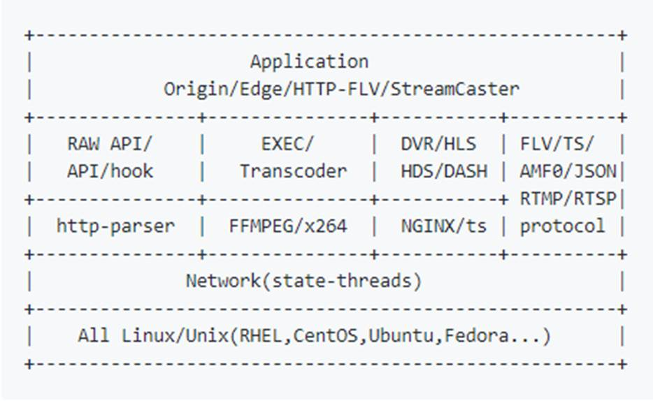

<h2><a name="_Toc33270496">SRS模块结构</a></h2>

图片来自srs官网wiki

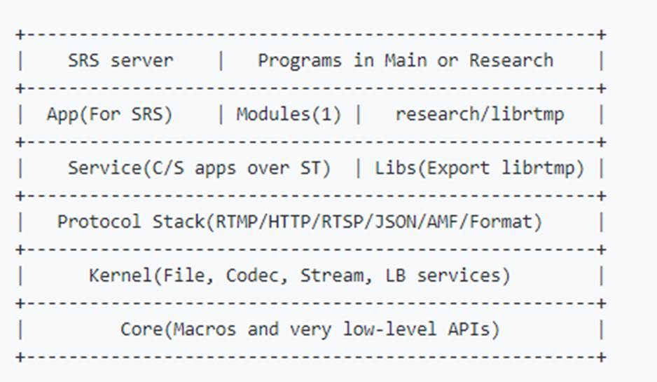

<h2><a name="_Toc33270497">SRS媒体流架构</a></h2>

图片来自srs官网wiki

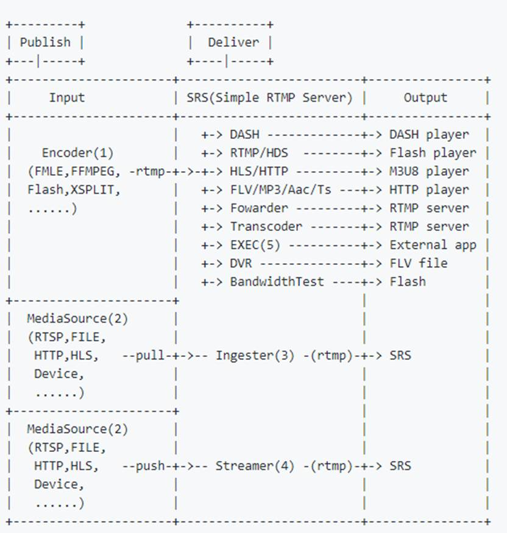

<h1><a name="_Toc33270498">SRS类图</a></h1>

<h2><a name="_Toc33270499">类关系</a></h2>

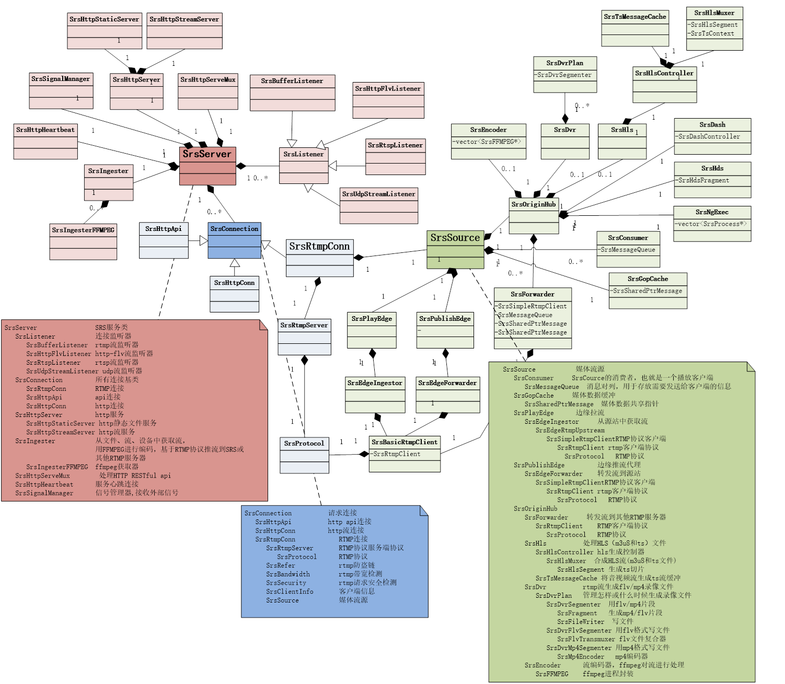

<h2><a name="_Toc33270500">SrsServer类</a></h2>

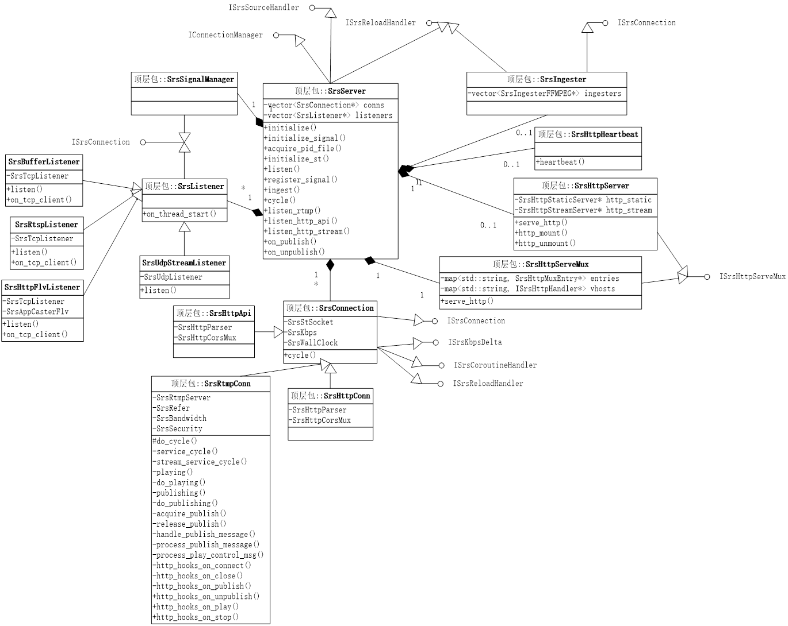

&nbsp;

<h2><a name="_Toc33270501">SrsConnection类</a></h2>

&nbsp;

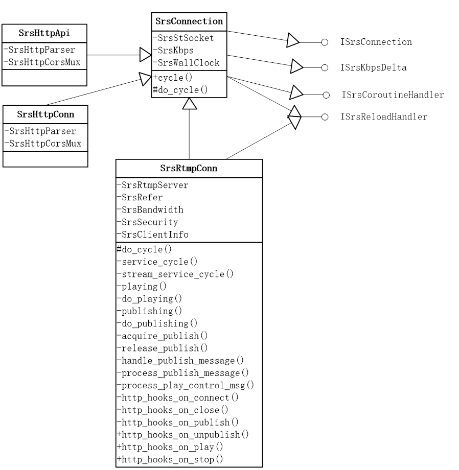

&nbsp;

<h2><a name="_Toc33270502">SrsSource类</a></h2>

….

<h2><a name="_Toc33270503">SRS媒体流与类的关系</a></h2>

&nbsp;&nbsp; srs启动之后，客户端推拉流时，需要调用下面这些主要类来相互协作完成推拉流功能， 该流程描述媒体在srs主要类之间的静态流程。

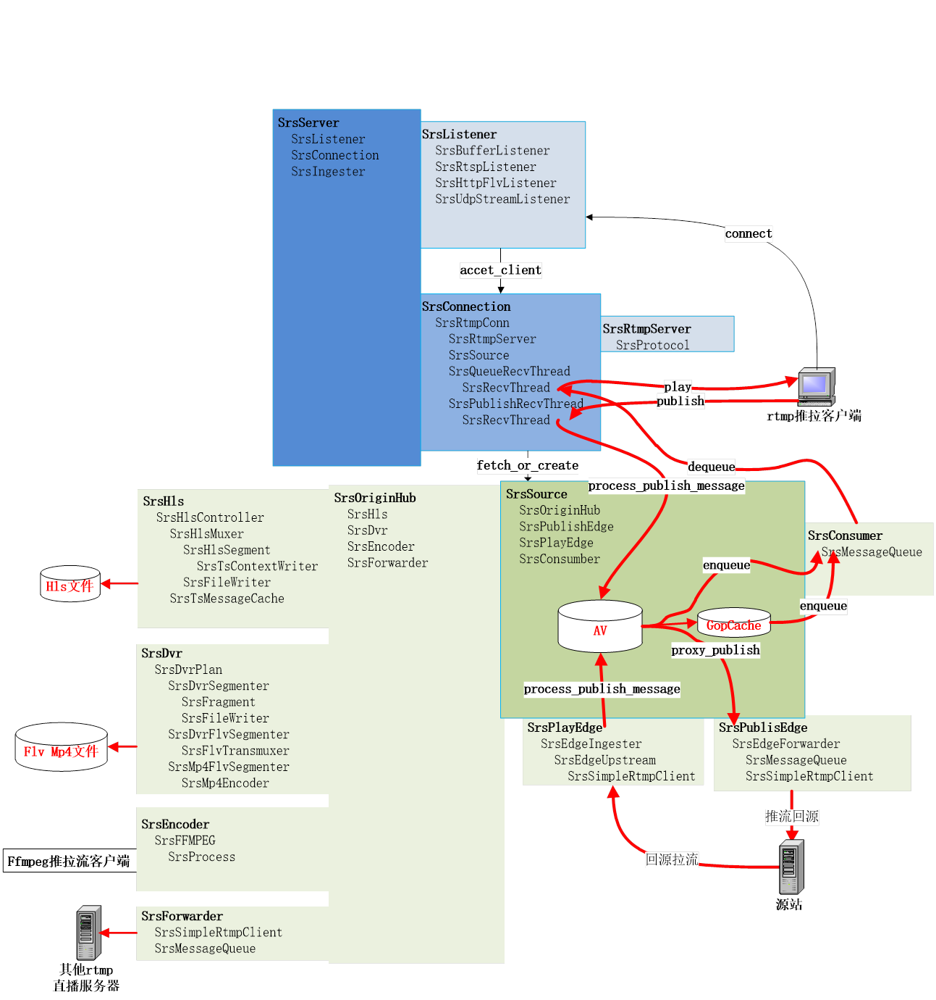

1.&nbsp;&nbsp;&nbsp;&nbsp;
客户端发送rtmp连接请求，SrsListener收到connect请求后，创建一个SrsConnection，每个SrsConnection会启动一个线程来完成相应任务

2.&nbsp;&nbsp;&nbsp;&nbsp;
SrsRtmpConn首先按rtmp协议流程交互成功之后，根据请求url创建流名流类型等标启，同时调用fetch_or_create生成一个处理音视频源的SrsSource,，

<b>如果是推流</b>：

创建SrsPublishRecvThread线程，接收客户端发送过来rtmp数据包，数据包由SrsRtmpServer来处理，如果是音视频数据，由process_publish_message来处理，它会通过SrsSource对媒体流的进行处理

1》 &nbsp;如果该服务是边缘服务，SrsSource直接将媒体proxy publish到源站服务，

2》 &nbsp;否则SrsSource会将publish流放入到每个SrsConsumer的媒体数据对列中,一个SrsConsumber就是一个播放客户端。同时调用SrsOriginHub将媒体流根据配置来生成flv,hls,mp4录相文件，以及是否将发布流转发到其他rtmp服务器等;最后检查如果启用GopCache会将媒体流写入GopCache对列中.用于当一个新的播放请求来时，保证首先能获取一个gop数据，以防播放开始时不黑屏或花屏

<b>如果拉流</b>：

<b>1》 </b>如果是源站拉流同时启用源站集群，如果流不是该源站发布，则根据配置的发送api请求到其他源站，检查是否在其他源站发布了流，如果是，则发送一个redirect，要求拉流客户端重定向指定服务器拉流。<b>注意rtmp重定向信令，如果客户端直接请求的源站，要求rtmp客户端支持redirect，如果srs边缘回源到源站后再重定向，那是没有问题的，因为srs边缘支持redirect</b>

<b>2》 </b>如果不走第1步，则创建一个SrsConsumer与SrsQueueRecvThread线程, 创建SrsConsumer时，如果启用gopcache，首先会将gopcache媒体数据插入SrsConsumer的数据队列中。如果是边缘拉流，则使用SrsPlayEdge回源拉流。将回源拉的媒体流数据插入SrsConsumer的数据队列中

<b>3》 </b>SrsQueueRecvThread线程负责将SrsConsumer的数据队列中的媒体数据发送给客户端。SrsConsumer队列中数据来源于GopCache，源站publish的数据，以及回源拉流的数据

&nbsp;

<h1><a name="_Toc33270504">SRS线程架构</a></h1>

<h2><a name="_Toc33270505">SRS通用线程模型</a></h2>

srs线程内部是使用协程库(State
Threads)实现，

srs线程模型如下

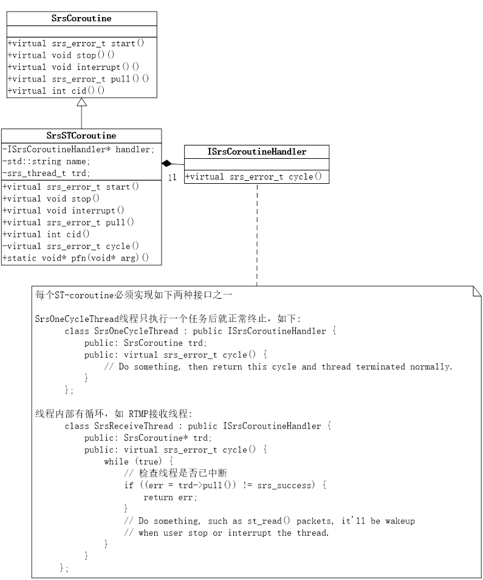

&nbsp;

<h2><a name="_Toc33270506">SRS内部线程结构</a></h2>

&nbsp;

&nbsp;

<h1><a name="_Toc33270507">SRS程序流程</a></h1>

<h2><a name="_Toc33270508">SRS启动流程</a></h2>

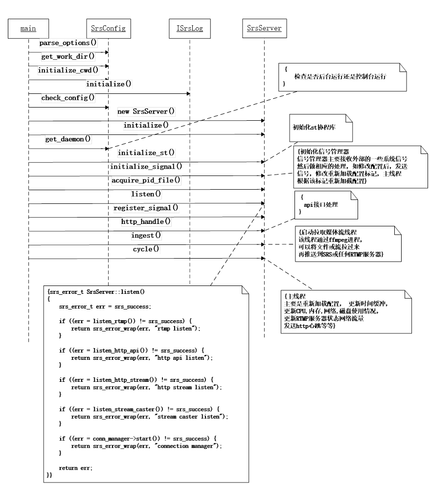

&nbsp;

1.&nbsp;&nbsp;&nbsp;&nbsp;
首先检查解析启动命令参数，初始日志接口，检查配置文件是否正确

2.&nbsp;&nbsp;&nbsp;&nbsp;
创建SrsServer服务，初始化一些变量

3.&nbsp;&nbsp;&nbsp;&nbsp;
检查是否后台运行还是控制台运行

4.&nbsp;&nbsp;&nbsp;&nbsp;
初始化st 协程库，信息号管理器

5.&nbsp;&nbsp;&nbsp;&nbsp;
如果后台运行写进程pid到文件

6.&nbsp;&nbsp;&nbsp;&nbsp;
监听连接：

listen_rtmp: rtmp推流或拉流连接

&nbsp; listen_http_api: api请求连接

&nbsp;&nbsp;listen_http_stream: http拉流连接,http-flv
,http-ts，http-aac，http-mp3

&nbsp;&nbsp;listen_stream_caster: 接收MpegTSOverUdp流请求，rtsp推流请求，http-flv推流请求

7.&nbsp;&nbsp;&nbsp;&nbsp;
初始化http_api接口处理

8.&nbsp;&nbsp;&nbsp;&nbsp;
启动ingest协程，使用ffmpeg, 拉取文件或流转发到本服务

9.&nbsp;&nbsp;&nbsp;&nbsp;
启动主线程

&nbsp;&nbsp;&nbsp;&nbsp;&nbsp;&nbsp;&nbsp;&nbsp;&nbsp;&nbsp;&nbsp;&nbsp;&nbsp;

<h2><a name="_Toc33270509">RTMP监听与连接流程</a></h2>

1.&nbsp;&nbsp;&nbsp;&nbsp;
SerServer调用listern启动rtmp监听线程

2.&nbsp;&nbsp;&nbsp;&nbsp;
客户端发送连接请求，监听线程收到请求后，发送on_tcp_accetpt()事件

3.&nbsp;&nbsp;&nbsp;&nbsp;
SrsrServer处理accetp_client()
创建一个新的SrsRtmpConn,同时启动SrsRtmpConnThread连接线程

4.&nbsp;&nbsp;&nbsp;&nbsp;
SrsRtmpConnThread收到客户端rtmp握手，同时根据rtmp连接流程创建一个rtmp连接

5.&nbsp;&nbsp;&nbsp;&nbsp;
连接成功之后,调用stream_service_cycle对rtmp媒体流处理

<h2><a name="_Toc33270510">RTMP媒体流处理流程</a></h2>

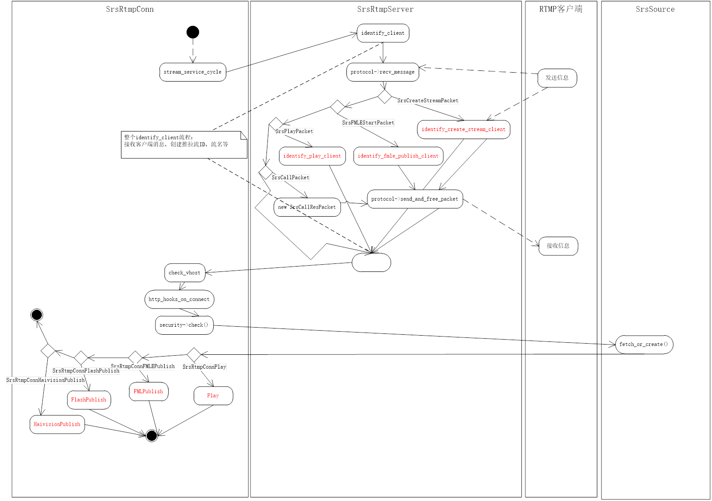

&nbsp;

1.&nbsp;&nbsp;&nbsp;&nbsp;
identify_client 根据客户端请求类型创建流名，流Id，流类型（推拉流）等客户端标识信息

2.&nbsp;&nbsp;&nbsp;&nbsp;
check_vhost 根据配置检查域名是否合法

3.&nbsp;&nbsp;&nbsp;&nbsp;
http_hooks_on_connect 发送on_connect事件

4.&nbsp;&nbsp;&nbsp;&nbsp;
check检测根据配置检查是否允许推拉流

5.&nbsp;&nbsp;&nbsp;&nbsp;
根据请求创建或获取SrsSource对象

6.&nbsp;&nbsp;&nbsp;&nbsp;
根据流类型调用对应的推或拉流流程

&nbsp;

<h2><a name="_Toc33270511">RTMP推流流程</a></h2>

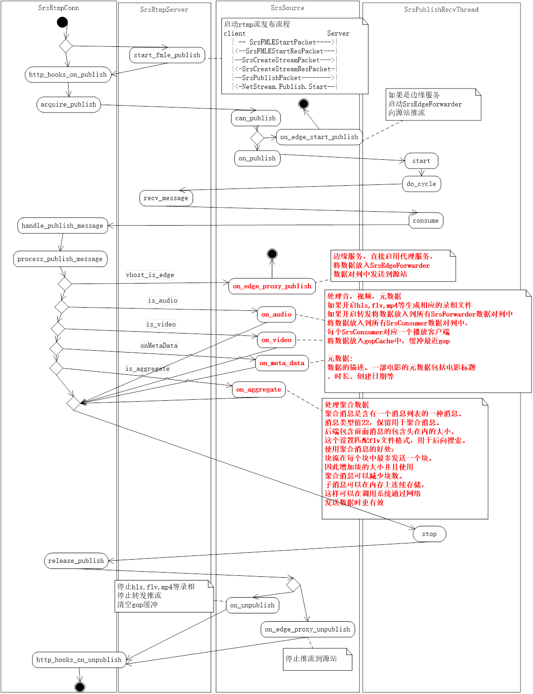

1.&nbsp;&nbsp;&nbsp;&nbsp;
接收客户端发布流交互消息，start_fmle_publish完成发布流交互

2.&nbsp;&nbsp;&nbsp;&nbsp;
发送on_pulibsh事件

3.&nbsp;&nbsp;&nbsp;&nbsp;
SrsSource::can_publish 检查SrsSource流的是否已发布，如果是返回，不再发布

4.&nbsp;&nbsp;&nbsp;&nbsp;
检查是否边缘推流，如果是启动SrsEdgeForwarder线程，将流推向源站

5.&nbsp;&nbsp;&nbsp;&nbsp;
SrsSource::on_publish，如果配置flv,hls,mp4等，则开始录相，如配置转发，则启动转发线程

6.&nbsp;&nbsp;&nbsp;&nbsp;
启动SrsPublishRecvThread,线程，接收客户端数据，调用SrsRtmpConn::handle_publish_message处理数据

7.&nbsp;&nbsp;&nbsp;&nbsp;
SrsRtmpConn:::process_publish_message处理推流数据

8.&nbsp;&nbsp;&nbsp;&nbsp;
如果是边缘推流，将数据SrsEdgeForwarder对列，将数据发送到源站

9.&nbsp;&nbsp;&nbsp;&nbsp;
如是不是边缘推流，调用SrsSource相关方法处理音视频数据. 对hls,mp4,flv录相，转发，gopCache，以其放到SrsConsumber的消息对列中，

每个,SrsConsumber是一个播放客户端

10.&nbsp; 如果停止推流， SrsPublishRecvThread将stop退出线程， 

11.&nbsp; 调用on_edge_proxy_unpublish停止边缘推流线程

12.&nbsp; SrsSource::on_unpublish,停止hls.,mp4,flv, 转发，清容gopCache

13.&nbsp; http_hook_on_unpublish发送on_unpublish事件

<h2><a name="_Toc33270512">RTMP拉流流程</a></h2>

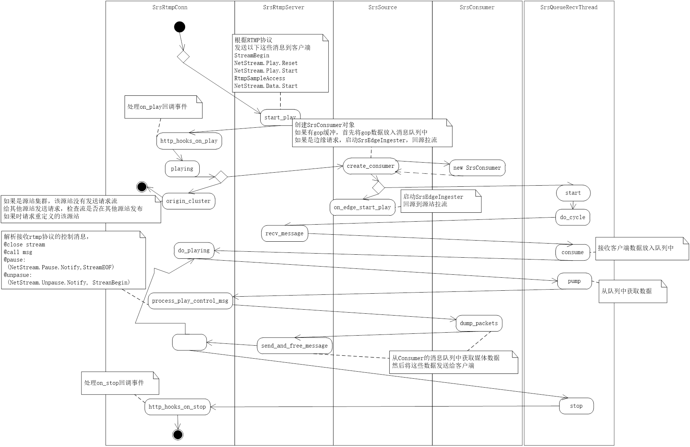

1.&nbsp;&nbsp;&nbsp;&nbsp;
SrsRtmpServer::start_play 根据rtmp协议 完成play流程

2.&nbsp;&nbsp;&nbsp;&nbsp;
SrsRtmpConn::http_hook_on_play 发送on_play事件，

3.&nbsp;&nbsp;&nbsp;&nbsp;
playing检查是否开启源站集群，如果是，且流没有在该源站发布，向其他源站发送请求，检查流在哪个源站发布，如果找到，重定向到该源站

4.&nbsp;&nbsp;&nbsp;&nbsp;
如是不是源站集群，create_consumer创建consumer，同时将gop缓冲数据放入consumer消息队列中，如果是边缘拉流，启动SrsEdgeIngester回源拉流

5.&nbsp;&nbsp;&nbsp;&nbsp;
recv_messae接收客户端信息,放下consumer消息对列中， pump从队列获取消息，process_play_control_msg处理rtmp控制消息

6.&nbsp;&nbsp;&nbsp;&nbsp;
dump_packets从consumber的消息队列中获取媒体数据， send_and_free_message 发送给给客户端

7.&nbsp;&nbsp;&nbsp;&nbsp;
stop停止播， http_hook_on_stop发送on_stop事件

</body>

</html>
