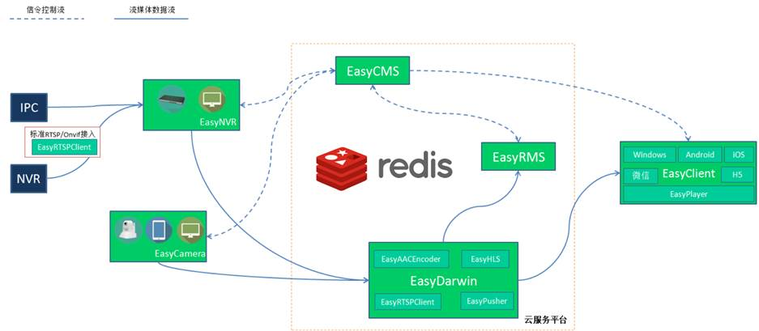
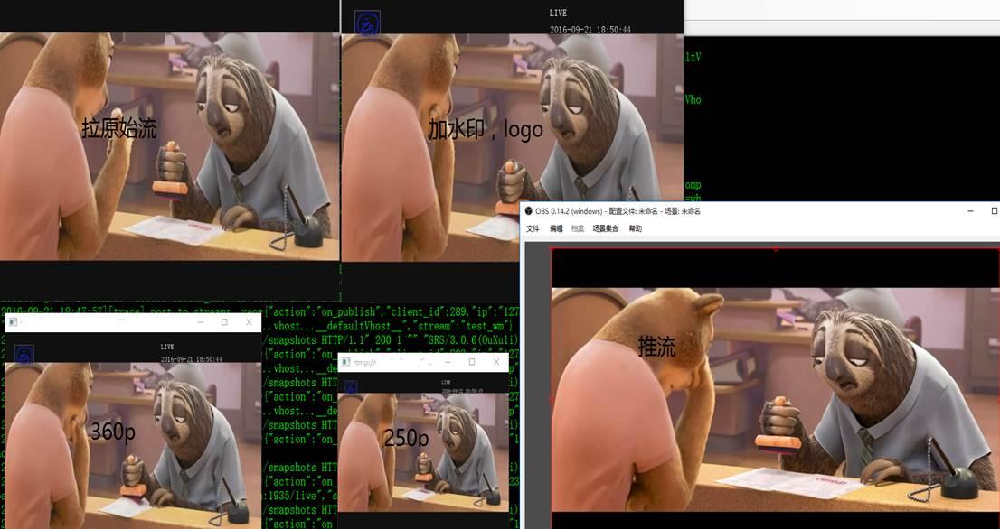
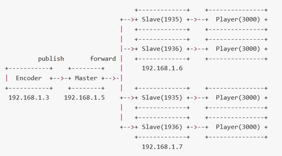
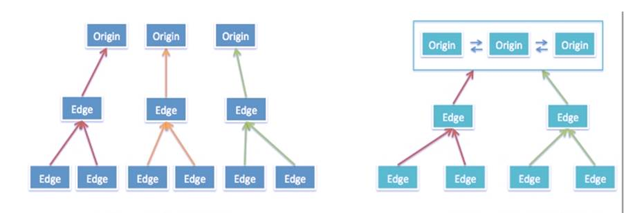
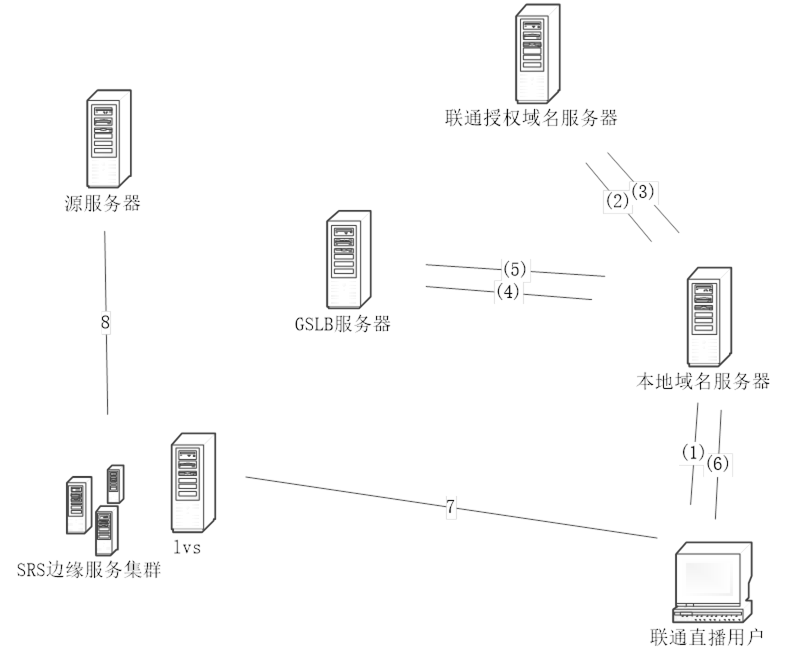
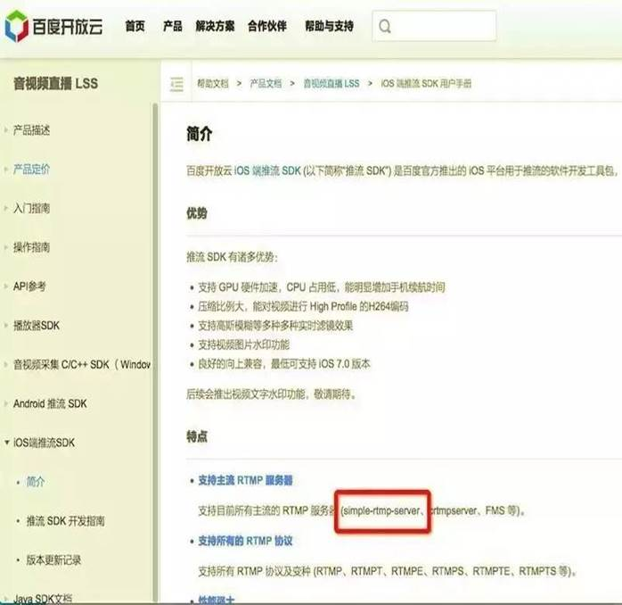
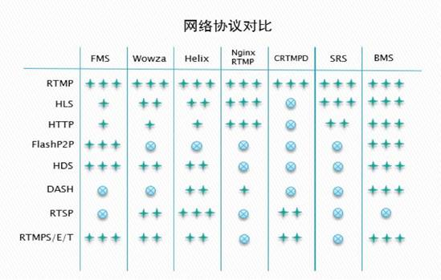
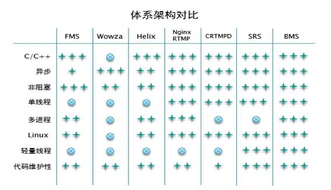
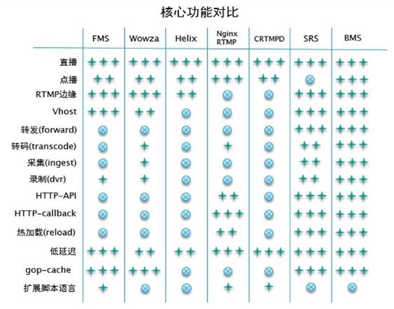

<html>

<head>
<meta http-equiv=Content-Type content="text/html; charset=gb2312">
<meta name=Generator content="Microsoft Word 15 (filtered)">
<title>开源流媒体SRS介绍</title>

</head>

<body lang=ZH-CN link=blue vlink=purple style='text-justify-trim:punctuation'>

<h1><a name="_Toc26097915">开源直播服务srs详细介绍(wiki整理)</a></h1>

目录

<a href="#_Toc26097915">开源直播服务srs详细介绍(wiki整理) 0</a>

<a href="#_Toc26097916">1.&nbsp;&nbsp;&nbsp;&nbsp;&nbsp; 简介... 2</a>

<a href="#_Toc26097917">1.1.&nbsp;&nbsp;&nbsp;&nbsp;&nbsp;&nbsp;&nbsp;&nbsp;&nbsp;&nbsp; SRS功能... 2</a>

<a href="#_Toc26097918">1.2.&nbsp;&nbsp;&nbsp;&nbsp;&nbsp;&nbsp;&nbsp;&nbsp;&nbsp;&nbsp; 架构... 2</a>

<a href="#_Toc26097919">2.&nbsp;&nbsp;&nbsp;&nbsp;&nbsp; 流接入方式... 3</a>

<a href="#_Toc26097920">2.1.&nbsp;&nbsp;&nbsp;&nbsp;&nbsp;&nbsp;&nbsp;&nbsp;&nbsp;&nbsp; 推送RTMP到SRS. 4</a>

<a href="#_Toc26097921">2.2.&nbsp;&nbsp;&nbsp;&nbsp;&nbsp;&nbsp;&nbsp;&nbsp;&nbsp;&nbsp; 分发RTMP流... 4</a>

<a href="#_Toc26097922">2.2.1.&nbsp;&nbsp;&nbsp;&nbsp;&nbsp;&nbsp;&nbsp; 应用场景... 4</a>

<a href="#_Toc26097923">2.2.2.&nbsp;&nbsp;&nbsp;&nbsp;&nbsp;&nbsp;&nbsp;&nbsp;&nbsp;&nbsp;&nbsp;&nbsp;&nbsp; WIKI. 5</a>

<a href="#_Toc26097924">2.2.3.&nbsp;&nbsp;&nbsp;&nbsp;&nbsp;&nbsp;&nbsp; 补充:SRS不支持点播... 5</a>

<a href="#_Toc26097925">2.2.4.&nbsp;&nbsp;&nbsp;&nbsp;&nbsp;&nbsp;&nbsp; 补充:常用的第三方的推流与播放工具... 6</a>

<a href="#_Toc26097926">2.3.&nbsp;&nbsp;&nbsp;&nbsp;&nbsp;&nbsp;&nbsp;&nbsp;&nbsp;&nbsp; 推送RTSP/UDP/FLV 到SRS. 6</a>

<a href="#_Toc26097927">2.3.1.&nbsp;&nbsp;&nbsp;&nbsp;&nbsp;&nbsp;&nbsp; Push MPEG-TS over UDP. 7</a>

<a href="#_Toc26097928">2.3.2.&nbsp;&nbsp;&nbsp;&nbsp;&nbsp;&nbsp;&nbsp; Push RTSP to SRS. 7</a>

<a href="#_Toc26097929">2.3.3.&nbsp;&nbsp;&nbsp;&nbsp;&nbsp;&nbsp;&nbsp; Push HTTP FLV to SRS. 8</a>

<a href="#_Toc26097930">2.3.4.&nbsp;&nbsp;&nbsp;&nbsp;&nbsp;&nbsp;&nbsp; WIKI 8</a>

<a href="#_Toc26097931">2.4.&nbsp;&nbsp;&nbsp;&nbsp;&nbsp;&nbsp;&nbsp;&nbsp;&nbsp;&nbsp; 拉取流到SRS. 9</a>

<a href="#_Toc26097932">2.4.1.&nbsp;&nbsp;&nbsp;&nbsp;&nbsp;&nbsp;&nbsp; 补充:RTSP开源项目... 10</a>

<a href="#_Toc26097933">2.4.2.&nbsp;&nbsp;&nbsp;&nbsp;&nbsp;&nbsp;&nbsp; WIKI 11</a>

<a href="#_Toc26097934">2.5.&nbsp;&nbsp;&nbsp;&nbsp;&nbsp;&nbsp;&nbsp;&nbsp;&nbsp;&nbsp; RTMP流的低延时配置... 11</a>

<a href="#_Toc26097935">2.5.1.&nbsp;&nbsp;&nbsp;&nbsp;&nbsp;&nbsp;&nbsp; 低延时直播应用... 11</a>

<a href="#_Toc26097936">2.5.2.&nbsp;&nbsp;&nbsp;&nbsp;&nbsp;&nbsp;&nbsp; 应用场景... 11</a>

<a href="#_Toc26097937">2.5.3.&nbsp;&nbsp;&nbsp;&nbsp;&nbsp;&nbsp;&nbsp; RTMP和延时... 12</a>

<a href="#_Toc26097938">2.5.4.&nbsp;&nbsp;&nbsp;&nbsp;&nbsp;&nbsp;&nbsp; 累积延迟... 13</a>

<a href="#_Toc26097939">2.5.5.&nbsp;&nbsp;&nbsp;&nbsp;&nbsp;&nbsp;&nbsp; 低延时配置... 14</a>

<a href="#_Toc26097940">2.5.6.&nbsp;&nbsp;&nbsp;&nbsp;&nbsp;&nbsp;&nbsp; WIKI 15</a>

<a href="#_Toc26097941">3.&nbsp;&nbsp;&nbsp;&nbsp;&nbsp; 流变换... 15</a>

<a href="#_Toc26097942">3.1.&nbsp;&nbsp;&nbsp;&nbsp;&nbsp;&nbsp;&nbsp;&nbsp;&nbsp;&nbsp; 将RTMP流转码... 15</a>

<a href="#_Toc26097943">3.1.1.&nbsp;&nbsp;&nbsp;&nbsp;&nbsp;&nbsp;&nbsp; 应用场景... 15</a>

<a href="#_Toc26097944">3.1.2.&nbsp;&nbsp;&nbsp;&nbsp;&nbsp;&nbsp;&nbsp; 工作流程... 16</a>

<a href="#_Toc26097945">3.1.3.&nbsp;&nbsp;&nbsp;&nbsp;&nbsp;&nbsp;&nbsp; 配置... 17</a>

<a href="#_Toc26097946">3.1.4.&nbsp;&nbsp;&nbsp;&nbsp;&nbsp;&nbsp;&nbsp; 转码规则... 17</a>

<a href="#_Toc26097947">3.1.5.&nbsp;&nbsp;&nbsp;&nbsp;&nbsp;&nbsp;&nbsp; Transcode on ARM cpu. 19</a>

<a href="#_Toc26097948">3.1.6.&nbsp;&nbsp;&nbsp;&nbsp;&nbsp;&nbsp;&nbsp; FFMPEG Transcode the Stream by Flash encoder. 20</a>

<a href="#_Toc26097949">3.1.7.&nbsp;&nbsp;&nbsp;&nbsp;&nbsp;&nbsp;&nbsp; 补充:测试效果图... 20</a>

<a href="#_Toc26097950">3.1.8.&nbsp;&nbsp;&nbsp;&nbsp;&nbsp;&nbsp;&nbsp; WIKI 20</a>

<a href="#_Toc26097951">流截图... 20</a>

<a href="#_Toc26097952">WIKI 21</a>

<a href="#_Toc26097953">补充:测试效果图... 21</a>

<a href="#_Toc26097954">转发给其他服务器(Forward) 21</a>

<a href="#_Toc26097955">转封装成HTTP直播流... 22</a>

<a href="#_Toc26097956">转封装成HLS. 25</a>

<a href="#_Toc26097957">转封装成HDS. 28</a>

<a href="#_Toc26097958">录制成FLV. 28</a>

<a href="#_Toc26097959">分发方式比较... 29</a>

<a href="#_Toc26097960">集群与CDN相关功能... 32</a>

<a href="#_Toc26097961">RTMP多级集群... 32</a>

<a href="#_Toc26097962">VHOST虚拟服务器... 37</a>

<a href="#_Toc26097963">无中断服务Reload. 46</a>

<a href="#_Toc26097964">HTTP-FLV集群... 47</a>

<a href="#_Toc26097965">Kafka对接... 48</a>

<a href="#_Toc26097966">应用接口... 48</a>

<a href="#_Toc26097967">HTTP回调... 48</a>

<a href="#_Toc26097968">安全策略Security. 54</a>

<a href="#_Toc26097969">HTTP API接口... 57</a>

<a href="#_Toc26097970">RTMP测速... 71</a>

<a href="#_Toc26097971">其他功能... 74</a>

<a href="#_Toc26097972">Send Minimal Interval 74</a>

<a href="#_Toc26097973">Reduce Sequence
Header. 75</a>

<a href="#_Toc26097974">Publish 1st Packet
Timeout. 75</a>

<a href="#_Toc26097975">Publish Normal
Timeout. 75</a>

<a href="#_Toc26097976">Debug SRS Upnode. 75</a>

<a href="#_Toc26097977">UTC Time. 76</a>

<a href="#_Toc26097978">HLS TS Floor. 76</a>

<a href="#_Toc26097979">HLS Wait Keyframe. 76</a>

<a href="#_Toc26097980">HttpHooks On HLS
Notify. 76</a>

<a href="#_Toc26097981">TCP NoDelay. 77</a>

<a href="#_Toc26097982">ATC Auto. 77</a>

<a href="#_Toc26097983">NGINX RTMP EXEC. 77</a>

<a href="#_Toc26097984">SRS与其他流媒体比较... 78</a>

<a href="#_Toc26097985">流发分 Stream Delivery. 78</a>

<a href="#_Toc26097986">集群 Cluster. 79</a>

<a href="#_Toc26097987">流处理服务 Stream Service. 79</a>

<a href="#_Toc26097988">Efficiency. 79</a>

<a href="#_Toc26097989">Stream Caster. 79</a>

<a href="#_Toc26097990">Debug System.. 80</a>

<a href="#_Toc26097991">Docs. 80</a>

<a href="#_Toc26097992">Others. 80</a>

<a href="#_Toc26097993">市面主要的流媒体服务器对比... 80</a>

<a href="#_Toc26097994">SRS商业版（BMS）简介... 93</a>

<a href="#_Toc26097995">常用的直播平台网站... 96</a>

&nbsp;

<h1 style='margin-left:21.25pt;text-indent:-21.25pt'><a name="_Toc26097916">1.&nbsp;&nbsp;&nbsp; 简介</a></h1>

该文档介绍了开源直播服务器SRS架构、功能以及应用、SRS与其他直播服务器的比较、SRS商业版的功能简介。内容主要来自于SRS WIKI整理，以及网上有关博客内容,有些地方加了补充内容。出掉WIKI上一些讲解配置使用的内容，需要了解这些内容可点击文档中相关wiki链接。

整理这些内容的目的是为了方便查阅，阅读后能对SRS比较全面的了解，特别是对刚接解SRS的使用者。

<h2 style='margin-left:1.0cm;text-indent:-1.0cm'><a name="_Toc26097917">1.1.&nbsp; SRS</a>功能</h2>

SRS提供了丰富的接入方案将RTMP流接入SRS，包括推送RTMP到SRS、推送RTSP/UDP/FLV到SRS、拉取流到SRS。SRS还支持将接入的RTMP流进行各种变换，譬如将RTMP流转码、流截图、转发给其他服务器、转封装成HTTP-FLV流、转封装成HLS、转封装成HDS、录制成FLV。SRS包含支大规模集群如CDN业务的关键特性，譬如RTMP多级集群、VHOST虚拟服务器、无中断服务Reload、HTTP-FLV集群、Kafka对接。此外，SRS还提供丰富的应用接口，包括HTTP回调、安全策略Security、HTTP API接口、RTMP测速。

<h2 style='margin-left:1.0cm;text-indent:-1.0cm'><a
name="_Toc462219404">1.2.&nbsp;
架构</a></h2>

&nbsp;&nbsp;&nbsp;&nbsp;&nbsp;&nbsp;&nbsp;&nbsp;&nbsp;&nbsp;&nbsp;&nbsp;&nbsp;&nbsp;&nbsp;&nbsp;&nbsp;&nbsp;
+---------+&nbsp;&nbsp;&nbsp;&nbsp;&nbsp;&nbsp;&nbsp;&nbsp;&nbsp;&nbsp;&nbsp;&nbsp;&nbsp;
+----------+

&nbsp;&nbsp;&nbsp;&nbsp;&nbsp;&nbsp;&nbsp;&nbsp;&nbsp;&nbsp;&nbsp;&nbsp;&nbsp;&nbsp;&nbsp;&nbsp;&nbsp;&nbsp;
| Publish
|&nbsp;&nbsp;&nbsp;&nbsp;&nbsp;&nbsp;&nbsp;&nbsp;&nbsp;&nbsp;&nbsp;&nbsp;&nbsp;
|&nbsp; Deliver |

&nbsp;&nbsp;&nbsp;&nbsp;&nbsp;&nbsp;&nbsp;&nbsp;&nbsp;&nbsp;&nbsp;&nbsp;&nbsp;&nbsp;&nbsp;&nbsp;&nbsp;&nbsp;
+---|-----+&nbsp;&nbsp;&nbsp;&nbsp;&nbsp;&nbsp;&nbsp;&nbsp;&nbsp;&nbsp;&nbsp;&nbsp;&nbsp;
+----|-----+

+----------------------+-------------------------+----------------+

|&nbsp;&nbsp;&nbsp;&nbsp;
Input&nbsp;&nbsp;&nbsp;&nbsp;&nbsp;&nbsp;&nbsp;&nbsp;&nbsp;&nbsp;&nbsp; |
SRS(Simple RTMP Server) |&nbsp;&nbsp;&nbsp;&nbsp;
Output&nbsp;&nbsp;&nbsp;&nbsp; |

+----------------------+-------------------------+----------------+

|&nbsp;&nbsp;&nbsp;
Encoder(1)&nbsp;&nbsp;&nbsp;&nbsp;&nbsp;&nbsp;&nbsp; |&nbsp;&nbsp; +-&gt;
RTMP/HDS&nbsp; --------+-&gt; Flash player |

|&nbsp; (FMLE,FFMPEG,
-rtmp-+-&gt;-+-&gt; HLS/HTTP ---------+-&gt; M3u8 player&nbsp; |

|&nbsp;
Flash,XSPLIT,&nbsp;&nbsp;&nbsp;&nbsp;&nbsp;&nbsp; |&nbsp;&nbsp; +-&gt;
FLV/MP3/Aac/Ts ---+-&gt; HTTP player&nbsp; |

|&nbsp;
......)&nbsp;&nbsp;&nbsp;&nbsp;&nbsp;&nbsp;&nbsp;&nbsp;&nbsp;&nbsp;&nbsp;&nbsp;
|&nbsp;&nbsp; +-&gt; Fowarder ---------+-&gt; RTMP server&nbsp; |

|&nbsp;&nbsp;&nbsp;&nbsp;&nbsp;&nbsp;&nbsp;&nbsp;&nbsp;&nbsp;&nbsp;&nbsp;&nbsp;&nbsp;&nbsp;&nbsp;&nbsp;&nbsp;&nbsp;&nbsp;&nbsp;
|&nbsp;&nbsp; +-&gt; Transcoder -------+-&gt; RTMP server&nbsp; |

|&nbsp;&nbsp;&nbsp;&nbsp;&nbsp;&nbsp;&nbsp;&nbsp;&nbsp;&nbsp;&nbsp;&nbsp;&nbsp;&nbsp;&nbsp;&nbsp;&nbsp;&nbsp;&nbsp;&nbsp;&nbsp;
|&nbsp;&nbsp; +-&gt; DVR --------------+-&gt; Flv file&nbsp;&nbsp;&nbsp;&nbsp;
|

|&nbsp;&nbsp;&nbsp;&nbsp;&nbsp;&nbsp;&nbsp;&nbsp;&nbsp;&nbsp;&nbsp;&nbsp;&nbsp;&nbsp;&nbsp;&nbsp;&nbsp;&nbsp;&nbsp;&nbsp;&nbsp;
|&nbsp;&nbsp; +-&gt; BandwidthTest ----+-&gt;
flash&nbsp;&nbsp;&nbsp;&nbsp;&nbsp;&nbsp;&nbsp; |

+----------------------+&nbsp;&nbsp;&nbsp;&nbsp;&nbsp;&nbsp;
&nbsp;&nbsp;&nbsp;&nbsp;&nbsp;&nbsp;&nbsp;&nbsp;&nbsp;&nbsp;&nbsp;&nbsp;&nbsp;&nbsp;&nbsp;&nbsp;&nbsp;&nbsp;|&nbsp;&nbsp;&nbsp;&nbsp;&nbsp;&nbsp;&nbsp;&nbsp;&nbsp;&nbsp;&nbsp;&nbsp;&nbsp;&nbsp;&nbsp;
|

|&nbsp;
MediaSource(2)&nbsp;&nbsp;&nbsp;&nbsp;&nbsp;
|&nbsp;&nbsp;&nbsp;&nbsp;&nbsp;&nbsp;&nbsp;&nbsp;&nbsp;&nbsp;&nbsp;&nbsp;&nbsp;&nbsp;&nbsp;&nbsp;&nbsp;&nbsp;&nbsp;&nbsp;&nbsp;&nbsp;&nbsp;&nbsp;
|&nbsp;&nbsp;&nbsp;&nbsp;&nbsp;&nbsp;&nbsp;&nbsp;&nbsp;&nbsp;&nbsp;&nbsp;&nbsp;&nbsp;&nbsp;
|

|&nbsp;
(RTSP,FILE,&nbsp;&nbsp;&nbsp;&nbsp;&nbsp;&nbsp;&nbsp;&nbsp;
|&nbsp;&nbsp;&nbsp;&nbsp;&nbsp;&nbsp;&nbsp;&nbsp;&nbsp;&nbsp;&nbsp;&nbsp;&nbsp;&nbsp;&nbsp;&nbsp;&nbsp;&nbsp;&nbsp;&nbsp;&nbsp;&nbsp;&nbsp;&nbsp;
|&nbsp;&nbsp;&nbsp;&nbsp;&nbsp;&nbsp;&nbsp;&nbsp;&nbsp;&nbsp;&nbsp;&nbsp;&nbsp;&nbsp;&nbsp;
|

|&nbsp;&nbsp; HTTP,HLS,&nbsp;&nbsp;
--pull-+-&gt;-- Ingester(3) -(rtmp)-+-&gt;
SRS&nbsp;&nbsp;&nbsp;&nbsp;&nbsp;&nbsp;&nbsp;&nbsp;&nbsp; |

|&nbsp;&nbsp; Device,&nbsp;&nbsp;&nbsp;
&nbsp;&nbsp;&nbsp;&nbsp;&nbsp;&nbsp;&nbsp;&nbsp;|&nbsp;&nbsp;&nbsp;&nbsp;&nbsp;&nbsp;&nbsp;&nbsp;&nbsp;&nbsp;&nbsp;&nbsp;&nbsp;&nbsp;&nbsp;&nbsp;&nbsp;&nbsp;&nbsp;&nbsp;&nbsp;&nbsp;&nbsp;&nbsp;
|&nbsp;&nbsp;&nbsp;&nbsp;&nbsp;&nbsp;&nbsp;&nbsp;&nbsp;&nbsp;&nbsp;&nbsp;&nbsp;&nbsp;&nbsp;
|

|&nbsp;&nbsp;
......)&nbsp;&nbsp;&nbsp;&nbsp;&nbsp;&nbsp;&nbsp;&nbsp;&nbsp;&nbsp;&nbsp;
|&nbsp;&nbsp;&nbsp;&nbsp;&nbsp;&nbsp;&nbsp;&nbsp;&nbsp;&nbsp;&nbsp;&nbsp;&nbsp;&nbsp;&nbsp;&nbsp;&nbsp;&nbsp;&nbsp;&nbsp;&nbsp;&nbsp;&nbsp;&nbsp;
|&nbsp;&nbsp;&nbsp;&nbsp;&nbsp;&nbsp;&nbsp;&nbsp;&nbsp;&nbsp;&nbsp;&nbsp;&nbsp;&nbsp;&nbsp;
|

+----------------------+&nbsp;&nbsp;&nbsp;&nbsp;&nbsp;&nbsp;&nbsp;&nbsp;&nbsp;&nbsp;&nbsp;&nbsp;&nbsp;&nbsp;&nbsp;&nbsp;&nbsp;&nbsp;&nbsp;&nbsp;&nbsp;&nbsp;&nbsp;&nbsp;
|&nbsp;&nbsp;&nbsp;&nbsp;&nbsp;&nbsp;&nbsp;&nbsp;&nbsp;&nbsp;&nbsp;&nbsp;&nbsp;&nbsp;&nbsp;
|

|&nbsp;
MediaSource(2)&nbsp;&nbsp;&nbsp;&nbsp;&nbsp;
|&nbsp;&nbsp;&nbsp;&nbsp;&nbsp;&nbsp;&nbsp;&nbsp;&nbsp;&nbsp;&nbsp;&nbsp;&nbsp;&nbsp;&nbsp;&nbsp;&nbsp;&nbsp;&nbsp;&nbsp;&nbsp;&nbsp;&nbsp;&nbsp;
|&nbsp;&nbsp;&nbsp;&nbsp;&nbsp;&nbsp;&nbsp;&nbsp;&nbsp;&nbsp;&nbsp;&nbsp;&nbsp;&nbsp;&nbsp;
|

|&nbsp;
(RTSP,FILE,&nbsp;&nbsp;&nbsp;&nbsp;&nbsp;&nbsp;&nbsp;&nbsp;
|&nbsp;&nbsp;&nbsp;&nbsp;&nbsp;&nbsp;&nbsp;&nbsp;&nbsp;&nbsp;&nbsp;&nbsp;&nbsp;&nbsp;&nbsp;&nbsp;&nbsp;&nbsp;&nbsp;&nbsp;&nbsp;&nbsp;&nbsp;&nbsp;
|&nbsp;&nbsp;&nbsp;&nbsp;&nbsp;&nbsp;&nbsp;&nbsp;&nbsp;&nbsp;&nbsp;&nbsp;&nbsp;&nbsp;&nbsp;
|

|&nbsp;&nbsp; HTTP,HLS,&nbsp;&nbsp;
--push-+-&gt;-- Streamer(4) -(rtmp)-+-&gt;
SRS&nbsp;&nbsp;&nbsp;&nbsp;&nbsp;&nbsp;&nbsp;&nbsp;&nbsp; |

|&nbsp;&nbsp;
Device,&nbsp;&nbsp;&nbsp;&nbsp;&nbsp;&nbsp;&nbsp;&nbsp;&nbsp;&nbsp;&nbsp;
|&nbsp;&nbsp;&nbsp;&nbsp;&nbsp;&nbsp;&nbsp;&nbsp;&nbsp;&nbsp;&nbsp;&nbsp;&nbsp;&nbsp;&nbsp;&nbsp;&nbsp;&nbsp;&nbsp;&nbsp;&nbsp;&nbsp;&nbsp;&nbsp;
|&nbsp;&nbsp;&nbsp;&nbsp;&nbsp;&nbsp;&nbsp;&nbsp;&nbsp;&nbsp;&nbsp;&nbsp;&nbsp;&nbsp;&nbsp;
|

|&nbsp;&nbsp;
......)&nbsp;&nbsp;&nbsp;&nbsp;&nbsp;&nbsp;&nbsp;&nbsp;&nbsp;&nbsp;&nbsp;
|&nbsp;&nbsp;&nbsp;&nbsp;&nbsp;&nbsp;&nbsp;&nbsp;&nbsp;&nbsp;&nbsp;&nbsp;&nbsp;&nbsp;&nbsp;&nbsp;&nbsp;&nbsp;&nbsp;&nbsp;&nbsp;&nbsp;&nbsp;&nbsp;
| &nbsp;&nbsp;&nbsp;&nbsp;&nbsp;&nbsp;&nbsp;&nbsp;&nbsp;&nbsp;&nbsp;&nbsp;&nbsp;&nbsp;&nbsp;|

+----------------------+-------------------------+----------------+

<h1 style='margin-left:21.25pt;text-indent:-21.25pt'><a name="_Toc456260508">2.&nbsp;&nbsp;&nbsp; 流接入方式</a></h1>

可以通过以下几种方式将音视频流接入到SRS: 

1.客户端使用编码器将音视频编码成h264 ,aac,mp3使用rtmp协议推送到SRS;

2.使用SRS采取器(Ingester),将各种源(流，文件，设备等)拉过来后，推送给自己;

3.SRS作为服务器侦听并接收其他协议的流（譬如RTSP，MPEG-TS over UDP等等），将协议的流转换成RTMP推送给自己;

<h2 style='margin-left:1.0cm;text-indent:-1.0cm'><a name="_Toc456260509">2.1.&nbsp; 推送RTMP</a>到SRS</h2>

这是SRS的核心功能之一，通过客户端使用rtmp协议将音视频流推送srs。然后使用rtmp播放器连接srs后观看，
Srs目前支持视频H264, 音频AAC、MP3。

<h2 style='margin-left:1.0cm;text-indent:-1.0cm'><a
name="_Toc462219407">2.2.&nbsp;
分发RTMP</a>流</h2>

SRS（Simple RTMP Server）分发RTMP也是核心功能之一，srs的主要定位就是分发RTMP低延时流媒体，同时支持分发HLS流。

<h3 style='margin-left:35.45pt;text-indent:-35.45pt'><a
name="_Toc462219408">2.2.1.&nbsp;&nbsp;
应用场景</a></h3>

RTMP是PC-flash支持最完善的流分发方式，主要的应用场景包括：

<ul type=disc>
 <li class=MsoNormal style='text-align:left'>无插件流媒体应用：十年前各种浏览器插件大行其道，最后adobe的flash一统天下，现在如何观看视频还需要用户装插件，已经是非常罕见的事情。打开浏览器就能用，不用装插件，这是RTMP的最基本的应用方式。</li>
 <li class=MsoNormal style='text-align:left'>适配广泛的播放器：如果没有专业的flash开发人员，那么RTMP会是个很好的选择，只要3行代码就能完成一个播放器，和html5的video标签一样方便。HDS/HLS在PC上，都需要库支持，N行代码很麻烦。</li>
 <li class=MsoNormal style='text-align:left'>苛刻的稳定性支持：RTMP服务器能365x24提供服务，当然http服务器也可以。客户端的稳定性呢？RTMP在flash中连续播放10天 没有问题，flash如果播放HTTP流就真的很难讲。如果在PC上需要客户端长时间播放，稳定播放，选择RTMP会是最佳选择。</li>
 <li class=MsoNormal style='text-align:left'>稳定的较小延迟：RTMP延迟在0.8-3秒，能应用于交互式直播，视频会议，互动式直播等等。如果对延时有一定要求，就不要选择HLS，RTMP会是最佳选择。</li>
 <li class=MsoNormal style='text-align:left'>通用接入标准：RTMP是编码器到服务器的实际标准协议，所有编码器都支持RTMP推送流。选择RTMP作为直播接入协议，能适配多种编码器，不至于绑定到一种编码器。如果服务器只能接入HTTP FLV流，像某些公司做的私有协议，那么对接通用编码器就有问题。何必闭门造车？！绑定用户的方式在于良好的客户关系和优秀的软件质量，而不是上了贼船就 下不了船了。</li>
</ul>

SRS直播将RTMP作为基本协议，以各种方式转码为RTMP后输入到SRS，输出为RTMP和HLS，支持广泛的客户端和各种应用场景。

<h3 style='margin-left:35.45pt;text-indent:-35.45pt'><a
name="_Toc462219409"><code>2.2.2.&nbsp; </code><code>WIKI</code></a></h3>

<a href="https://github.com/ossrs/srs/wiki/v1_CN_SampleRTMP">https://github.com/ossrs/srs/wiki/v1_CN_SampleRTMP</a>

<h3 style='margin-left:35.45pt;text-indent:-35.45pt'><a
name="_Toc462219410">2.2.3.&nbsp;&nbsp;
补充:SRS</a>不支持点播</h3>

SRS不支持点播，一般点播不会使用RTMP作为点播协议，目前点播以HTTP协议为主。Nginx rtmp可以使用rtmp点播.不过在测试过程中发现，托放支持不是很好,国内很少使用rtmp点播，现在点播大都使用http。

<h3 style='margin-left:35.45pt;text-indent:-35.45pt'><a
name="_Toc462219411">2.2.4.&nbsp;&nbsp;&nbsp; 补充</a>:常用的第三方的推流与播放工具</h3>

常用的第三方的推流工具有OBS,&nbsp; XSplit,&nbsp; FMLE,&nbsp;
video_broadcast++(Android)，Broadcast_Me(iPhone),除上面这些工具外，还可以使用ffmpeg

&nbsp;&nbsp;&nbsp; 常用播放器:&nbsp; flash player, ffplay, vlc等。

<h2 style='margin-left:1.0cm;text-indent:-1.0cm'><a name="_Toc456260510">2.3.&nbsp; 推送RTSP/UDP/FLV </a>到SRS</h2>

Streamer（流服务）是SRS作为服务器侦听并接收其他协议的流（譬如RTSP，MPEG-TS over UDP等等），将这些协议的流转换成RTMP推送给自己，以使用RTMP/HLS/HTTP分发流。

常见的应用场景包括：

Push MPEG-TS over UDP to SRS：通过UDP协议，将MPEG-TS推送到SRS，分发为RTMP/HLS/HTTP流。

Push RTSP to SRS：通过RTSP协议，将流推送到SRS，分发为RTMP/HLS/HTTP流。

POST FLV over HTTP to SRS: 通过HTTP协议，将FLV流POST到SRS，分发为RTMP/HLS/HTTP流。

备注：Streamer将其他支持的协议推送RTMP给SRS后，所有SRS的功能都能支持。譬如，推RTSP流给 Streamer，Streamer转成RTMP推送给SRS，若vhost是edge，SRS将RTMP流转发给源站。或者将RTMP流转码，或者直接转发。另外，所有分发方法都是可用的，譬如推RTSP流给Streamer，Streamer转成RTMP推给SRS，以RTMP/HLS/HTTP分发。

<h3 style='margin-left:35.45pt;text-indent:-35.45pt'><a
name="_Toc462219413">2.3.1.&nbsp;&nbsp;
Push MPEG-TS over UDP</a></h3>

SRS可以侦听一个udp端口，编码器将流推送到这个udp端口（SPTS）后，SRS会转成一路RTMP流。后面RTMP流能支持的功能都支持。

配置如下，参考<code>conf/push.mpegts.over.udp.conf</code>：

<code>#
the streamer cast stream from other protocol to SRS over RTMP.</code>

<code>#
@see https://github.com/ossrs/srs/tree/develop#stream-architecture</code>

<code>stream_caster
{</code>

<code>&nbsp;&nbsp;&nbsp;
enabled&nbsp;&nbsp;&nbsp;&nbsp;&nbsp;&nbsp;&nbsp;&nbsp; on;</code>

<code>&nbsp;&nbsp;&nbsp;
caster&nbsp;&nbsp;&nbsp;&nbsp;&nbsp;&nbsp;&nbsp;&nbsp;&nbsp; mpegts_over_udp;</code>

<code>&nbsp;&nbsp;&nbsp;
output&nbsp;&nbsp;&nbsp;&nbsp;&nbsp;&nbsp;&nbsp;&nbsp;&nbsp;
rtmp://127.0.0.1/live/livestream;</code>

<code>&nbsp;&nbsp;&nbsp;
listen&nbsp;&nbsp;&nbsp;&nbsp;&nbsp;&nbsp;&nbsp;&nbsp;&nbsp; 1935;</code>

<code>}</code>

参考：<a
href="https://github.com/ossrs/srs/issues/250#issuecomment-72321769">https://github.com/ossrs/srs/issues/250#issuecomment-72321769</a>

<h3 style='margin-left:35.45pt;text-indent:-35.45pt'><a
name="_Toc462219414">2.3.2.&nbsp;&nbsp;
Push RTSP to SRS</a></h3>

SRS可以侦听一个tcp端口，编码器将流推送到这个tcp端口（RTSP）后，SRS会转成一路RTMP流。后面RTMP流能支持的功能都支持。

配置如下，参考<code>conf/push.rtsp.conf</code>：

<code>#
the streamer cast stream from other protocol to SRS over RTMP.</code>

<code>#
@see https://github.com/ossrs/srs/tree/develop#stream-architecture</code>

<code>stream_caster
{</code>

<code>&nbsp;&nbsp;&nbsp;
enabled&nbsp;&nbsp;&nbsp;&nbsp;&nbsp;&nbsp;&nbsp;&nbsp; on;</code>

<code>&nbsp;&nbsp;&nbsp;
caster&nbsp;&nbsp;&nbsp;&nbsp;&nbsp;&nbsp;&nbsp;&nbsp;&nbsp; rtsp;</code>

<code>&nbsp;&nbsp;&nbsp;
output&nbsp;&nbsp;&nbsp;&nbsp;&nbsp;&nbsp;&nbsp;&nbsp;&nbsp;
rtmp://127.0.0.1/[app]/[stream];</code>

<code>&nbsp;&nbsp;&nbsp;
listen&nbsp;&nbsp;&nbsp;&nbsp;&nbsp;&nbsp;&nbsp;&nbsp;&nbsp; 554;</code>

<code>&nbsp;&nbsp;&nbsp;
rtp_port_min&nbsp;&nbsp;&nbsp; 57200;</code>

<code>&nbsp;&nbsp;&nbsp;
rtp_port_max&nbsp;&nbsp;&nbsp; 57300;</code>

<code>}</code>

参考：<a
href="https://github.com/ossrs/srs/issues/133#issuecomment-75531884">https://github.com/ossrs/srs/issues/133#issuecomment-75531884</a>

<h3 style='margin-left:35.45pt;text-indent:-35.45pt'><a
name="_Toc462219415">2.3.3.&nbsp;&nbsp;
Push HTTP FLV to SRS</a></h3>

SRS可以侦听一个HTTP端口，编码器将流推送到这个http端口后，SRS会转成一路RTMP流。所有RTMP流的功能都能支持。

配置如下，参考<code>conf/push.flv.conf</code>：

<pre><code># the streamer cast stream from other protocol to SRS over RTMP.</code></pre><pre><code># @see https://github.com/ossrs/srs/tree/develop#stream-architecture</code></pre><pre><code>stream_caster {</code></pre><pre><code>&nbsp;&nbsp;&nbsp; enabled&nbsp;&nbsp;&nbsp; &nbsp;&nbsp;&nbsp;&nbsp;&nbsp;on;</code></pre><pre><code>&nbsp;&nbsp;&nbsp; caster&nbsp;&nbsp;&nbsp;&nbsp;&nbsp;&nbsp;&nbsp;&nbsp;&nbsp; flv;</code></pre><pre><code>&nbsp;&nbsp;&nbsp; output&nbsp;&nbsp;&nbsp;&nbsp;&nbsp;&nbsp;&nbsp;&nbsp;&nbsp; rtmp://127.0.0.1/[app]/[stream];</code></pre><pre><code>&nbsp;&nbsp;&nbsp; listen&nbsp;&nbsp;&nbsp;&nbsp;&nbsp;&nbsp;&nbsp;&nbsp;&nbsp; 8936;</code></pre><pre><code>}</code></pre>

这个配置时，客户端推流的地址，例如：<code>http://127.0.0.1:8936/live/sea.flv</code> 
播放RTMP流地址是：<code>rtmp://127.0.0.1/live/sea</code> 
播放HLS流地址是：<code>http://127.0.0.1:8080/live/sea.m3u8</code>

注意：需要配置HTTP服务器和HLS，参考<code>conf/push.flv.conf</code>

<h3 style='margin-left:35.45pt;text-indent:-35.45pt'><a
name="_Toc462219416">2.3.4.&nbsp;&nbsp;
WIKI</a></h3>

<a
href="https://github.com/ossrs/srs/wiki/v2_CN_Streamer">https://github.com/ossrs/srs/wiki/v2_CN_Streamer</a>

<h2 style='margin-left:1.0cm;text-indent:-1.0cm'><a name="_Toc456260511">2.4.&nbsp; 拉取流到SRS</a></h2>

采集(Ingest)指的是将文件（flv，mp4，mkv，avi，rmvb等等），流（RTMP，RTMPT，RTMPS，RTSP，HTTP，HLS等等），设备等的数据，转封装为RTMP流（若编码不是h264/aac则需要转码），推送到SRS。采集基本上就是使用FFMPEG作为编码器，或者转封装器，将外部流主动抓取到SRS。

采集的主要应用场景包括：

1.虚拟直播：将文件编码为直播流。可以指定多个文件后，SRS会循环播放。

2.RTSP摄像头对接：以前安防摄像头都支持访问RTSP地址，RTSP 无法在互联网播放。可以将RTSP采集后，以RTMP推送到SRS，后面的东西就不用讲了。

3.直接采集设备：SRS采集功能可以作为编码器采集设备上的未压缩图像数据，譬如video4linux和alsa设备，编码为h264/aac后输出RTMP到SRS。

4.将HTTP流采集为RTMP：有些老的设备，能输出HTTP的ts或FLV流，可以采集后转封装为RTMP，支持HLS输出。

总之，采集的应用场景主要是“SRS拉流”；能拉任意的流，只要ffmpeg支持；不是h264/aac都没有关系，ffmpeg能转码。SRS默认是支持“推流”，即等待编码器推流上来，可以是专门的编码设备，FMLE，ffmpeg，xsplit，flash,
obs等等。

如此，SRS的接入方式可以是“推流到SRS”和“SRS主动拉流”，基本上作为源站的功能就完善了。

<h3 style='margin-left:35.45pt;text-indent:-35.45pt'><a name="_Toc462219417">2.4.1.&nbsp;&nbsp; 补充:RTSP</a>开源项目</h3>

“推送RTSP/UDP/FLV 到SRS”功能目前版本SRS中，还是实验性功能，不是特别稳定，测试rtsp过程中, 声音正常，视频有花屏，SRS商业版应该这些功能已经稳定，因为SRS原作者2016春节后更新很慢，现在主要做商业版。

RTSP协议主要在安防监控，iptv项目使用特别多。现在市场上网络摄象机（IPC）中rtsp是标配。而现在互联网播放端通用的基本是rtmp,hls，移动端通用的主要是hls。未来IPC走互联网越来越多。所以对于通用型直播平台来说，多协议转换是非常重要的功能。

常用的rtsp开源流媒体服务器有live555（http://www.live555.com）,Easydarwin（http://www.easydarwin.org）等。

目前EasyDarwin流媒体云平台整套解决方案包括有：EasyCMS(中心管理服务、跨平台、支持分布式部署)，EasyDarwin(流媒体服务、跨平台、支持分布式部署)，EasyRMS(云录像服务、跨平台、支持分布式部署)，EasyCamera(开源流媒体云摄像机方案、支持ARM、Android)，EasyNVR(将标准RTSP/Onvif摄像机接入到云平台)，EasyPlayer（流媒体播放器），EasyClient（云平台客户端）， 以及周边众多工具库(EasyHLS / EasyRTSPClient / EasyPusher / EasyAACEncoder)，后续也将继续扩展的录像、回放等多种服务和工具集，各个功能单元既可以独立使用于项目，又可以整体使用，形成一个完整、简单、易用、高效的流媒体解决方案。

<h3 style='margin-left:35.45pt;text-indent:-35.45pt'><a name="_Toc26097933">2.4.2.&nbsp;&nbsp; WIKI</a></h3>

<a
href="https://github.com/ossrs/srs/wiki/v1_CN_Ingest">https://github.com/ossrs/srs/wiki/v1_CN_Ingest</a>

&nbsp;

<h2 style='margin-left:1.0cm;text-indent:-1.0cm'><a
name="_Toc462219420">2.5.&nbsp;
RTMP</a>流的低延时配置</h2>

RTMP流的延时一般在1-3秒，比HLS的延时小，hls延时10-30秒左右。

<h3 style='margin-left:35.45pt;text-indent:-35.45pt'><a
name="_Toc462219421">2.5.1.&nbsp;&nbsp;
低延时直播应用</a></h3>

直播应用中，RTMP和HLS基本上可以覆盖所有客户端观看（参考：<a href="https://github.com/ossrs/srs/wiki/v1_CN_DeliveryHLS">DeliveryHLS</a>），HLS主要是延时比较大，RTMP主要优势在于延时低。

<h3 style='margin-left:35.45pt;text-indent:-35.45pt'><a
name="_Toc462219422">2.5.2.&nbsp;&nbsp;
应用场景</a></h3>

低延时应用场景包括：

<ul type=disc>
 <li class=MsoNormal style='text-align:left'>互动式直播：譬如2013年大行其道的美女主播，游戏直播等等各种主播，流媒体分发给用户观看。用户可以文字聊天和主播互动。</li>
 <li class=MsoNormal style='text-align:left'>视频会议：SRS的DEMO就有视频会议应用，我们要是有同事出差在外地，就用这个视频会议开内部会议。其实会议1秒延时无所谓，因为人家讲完话后，其他人需要思考，思考的延时也会在1秒左右。当然如果用视频会议吵架就不行。</li>
 <li class=MsoNormal style='text-align:left'>其他：监控，直播也有些地方需要对延迟有要求，互联网上RTMP协议的延迟基本上能够满足要求。</li>
</ul>

<h3 style='margin-left:35.45pt;text-indent:-35.45pt'><a
name="_Toc462219423">2.5.3.&nbsp;&nbsp;
RTMP</a>和延时</h3>

RTMP的特点如下：

<ul type=disc>
 <li class=MsoNormal style='text-align:left'>Adobe支持得很好：RTMP实际上是现在编码器输出的工业标准协议，基本上所有的编码器（摄像头之类）都支持RTMP输出。原因在于PC市场巨大，PC主要是Windows，Windows的浏览器基本上都支持flash，Flash又支持RTMP支持得灰常好。</li>
 <li class=MsoNormal style='text-align:left'>适合长时间播放：因为RTMP支持的很完善，所以能做到flash播放RTMP流长时间不断流，当时测试是100万秒，即10天多可以连续播放。 对于商用流媒体应用，客户端的稳定性当然也是必须的，否则最终用户看不了还怎么玩？我就知道有个教育客户，最初使用播放器播放http流，需要播放不同的 文件，结果就总出问题，如果换成服务器端将不同的文件转换成RTMP流，客户端就可以一直播放；该客户走RTMP方案后，经过CDN分发，没听说客户端出 问题了。</li>
 <li class=MsoNormal style='text-align:left'>延迟较低：比起YY的那种UDP私有协议，RTMP算延迟大的（延迟在1-3秒），比起HTTP流的延时（一般在10秒以上）RTMP算低延时。 一般的直播应用，只要不是电话类对话的那种要求，RTMP延迟是可以接受的。在一般的视频会议（参考SRS的视频会议延时）应用中，RTMP延时也能接 受，原因是别人在说话的时候我们一般在听，实际上1秒延时没有关系，我们也要思考（话说有些人的CPU处理速度还没有这么快）。</li>
 <li class=MsoNormal style='text-align:left'>有累积延迟：技术一定要知道弱点，RTMP有个弱点就是累积误差，原因是RTMP基于TCP不会丢包。所以当网络状态差时，服务器会将包缓存起 来，导致累积的延迟；待网络状况好了，就一起发给客户端。这个的对策就是，当客户端的缓冲区很大，就断开重连。当然SRS也提供配置。</li>
</ul>

<h3 style='margin-left:35.45pt;text-indent:-35.45pt'><a
name="_Toc462219424">2.5.4.&nbsp;&nbsp;
累积延迟</a></h3>

除了GOP-Cache，还有一个有关系，就是累积延迟。SRS可以配置直播队列的长度，服务器会将数据放在直播队列中，如果超过这个长度就清空到最后一个I帧：

<pre>vhost your_vhost {</pre><pre>&nbsp;&nbsp;&nbsp; # the max live queue length in seconds.</pre><pre>&nbsp;&nbsp;&nbsp; # if the messages in the queue exceed the max length, </pre><pre>&nbsp;&nbsp;&nbsp;&nbsp;# drop the old whole gop.</pre><pre>&nbsp;&nbsp;&nbsp; # default: 30</pre><pre>&nbsp;&nbsp;&nbsp; queue_length&nbsp;&nbsp;&nbsp; 10;</pre><pre>}</pre>

当然这个不能配置太小，譬如GOP是1秒，queue_length是1秒，这样会导致有1秒数据就清空，会导致跳跃。

有更好的方法？有的。延迟基本上就等于客户端的缓冲区长度，因为延迟大多由于网络带宽低，服务器缓存后一起发给客户端，现象就是客户端的缓冲区变大了，譬如NetStream.BufferLength=5秒，那么说明缓冲区中至少有5秒数据。

处理累积延迟的最好方法，是客户端检测到缓冲区有很多数据了，如果可以的话，就重连服务器。当然如果网络一直不好，那就没有办法了。

<h3 style='margin-left:35.45pt;text-indent:-35.45pt'><a
name="_Toc462219425">2.5.5.&nbsp;&nbsp;
低延时配置</a></h3>

考虑GOP-Cache和累积延迟，推荐的低延时配置如下（参考min.delay.com）：

# the listen ports,
split by space.

listen&nbsp;&nbsp;&nbsp;&nbsp;&nbsp;&nbsp;&nbsp;&nbsp;&nbsp;&nbsp;&nbsp;&nbsp;&nbsp;
1935;

vhost __defaultVhost__ {

&nbsp;&nbsp;&nbsp; #
whether cache the last gop.

&nbsp;&nbsp;&nbsp; # if
on, cache the last gop and dispatch to client,

&nbsp;&nbsp;&nbsp; #&nbsp;&nbsp;
to enable fast startup for client, client play immediately.

&nbsp;&nbsp;&nbsp; # if
off, send the latest media data to client,

&nbsp;&nbsp;&nbsp; #&nbsp;&nbsp;
client need to wait for the next Iframe to decode and show the video.

&nbsp;&nbsp;&nbsp; #
set to off if requires min delay;

&nbsp;&nbsp;&nbsp; #
set to on if requires client fast startup.

&nbsp;&nbsp;&nbsp; #
default: on

&nbsp;&nbsp;&nbsp;
gop_cache&nbsp;&nbsp;&nbsp;&nbsp;&nbsp;&nbsp; off;

&nbsp;&nbsp;&nbsp; #
the max live queue length in seconds.

&nbsp;&nbsp;&nbsp; # if
the messages in the queue exceed the max length, 

&nbsp;&nbsp;&nbsp; #
drop the old whole gop.

&nbsp;&nbsp;&nbsp; #
default: 30

&nbsp;&nbsp;&nbsp;
queue_length&nbsp;&nbsp;&nbsp; 10;

}

当然，服务器的性能也要考虑，不可以让一个SRS进程跑太高带宽，一般CPU在80%以下不会影响延迟，连接数参考<a href="https://github.com/ossrs/srs/wiki/v1_CN_Performance">性能</a>。

<h3 style='margin-left:35.45pt;text-indent:-35.45pt'><a
name="_Toc462219426">2.5.6.&nbsp;&nbsp;
WIKI</a></h3>

<a
href="https://github.com/ossrs/srs/wiki/v3_CN_SampleRealtime">https://github.com/ossrs/srs/wiki/v3_CN_SampleRealtime</a>

&nbsp;

<h1 style='margin-left:21.25pt;text-indent:-21.25pt'><a name="_Toc456260512">3.&nbsp;&nbsp;&nbsp; 流</a>变换</h1>

SRS还支持将接入的RTMP流进行各种变换，譬如将RTMP流转码、流截图、转发给其他服务器、转封装成HTTP-FLV流、转封装成HLS、转封装成HDS、录制成FLV等。

<h2 style='margin-left:1.0cm;text-indent:-1.0cm'><a name="_Toc456260513">3.1.&nbsp; 将RTMP</a>流转码</h2>

SRS通过FFMPEG对RTMP直播流转码，SRS在收到编码器推送的直播流后，可以对直播流进行转码，输出RTMP流到服务器（也可以到SRS自己）。如使用该功能将直播流转换多码率流，或者给流添加水印等。

<h3 style='margin-left:35.45pt;text-indent:-35.45pt'><a
name="_Toc462219429">3.1.1.&nbsp;&nbsp;
应用场景</a></h3>

转码的重要应用场景包括：

<ol start=1 type=1>
 <li class=MsoNormal style='text-align:left'>推送一路高码率，转多路输出。譬如：游戏直播中，推送一路1080p流到SRS，SRS可以转码输出1080p/720p/576p多路，低码率可以给移动设备观看。这样节省了推流带宽（一般源站为BGP带宽，很贵），也减轻了客户端压力（譬如客户端边玩游戏边直播）。</li>
 <li class=MsoNormal style='text-align:left'>支持多屏输出。譬如：网页推流（主播）编码为vp6/mp3或speex，推流到SRS后无法支持HLS（要求h264+aac），可以转码成h264+aac后切片成HLS或者推送到其他服务器再分发。</li>
 <li class=MsoNormal style='text-align:left'>加水印。适用于需要对流进行加水印的情况，譬如打上自己的logo。SRS支持文字水印和图片水印，也可以支持视频作为水印，或者将两路流叠加（参考ffmpeg的用法）。</li>
 <li class=MsoNormal style='text-align:left'>截图。 </li>
 <li class=MsoNormal style='text-align:left'>其他滤镜：SRS支持所有ffmpeg的滤镜。</li>
</ol>

<h3 style='margin-left:35.45pt;text-indent:-35.45pt'><a
name="_Toc462219430">3.1.2.&nbsp;&nbsp;
工作流程</a></h3>

SRS转码的主要流程包括：

1.&nbsp;&nbsp;&nbsp;&nbsp; 编码器推送RTMP流到SRS的vhost。

2.&nbsp;&nbsp;&nbsp;&nbsp; SRS的vhost若配置了转码，则进行转码。

3.&nbsp;&nbsp;&nbsp;&nbsp; 转码后，按照配置，推送到SRS本身或者其他RTMP服务器。

<h3 style='margin-left:35.45pt;text-indent:-35.45pt'><a
name="_Toc462219431">3.1.3.&nbsp;&nbsp;
配置</a></h3>

SRS可以对vhost的所有的流转码，或者对某些app的流转码，或者对某些流转码。

对app或流转码时，只要在transcode后面加app和stream就可以。譬如：

<pre>listen&nbsp;&nbsp;&nbsp;&nbsp;&nbsp;&nbsp;&nbsp;&nbsp;&nbsp;&nbsp;&nbsp;&nbsp;&nbsp; 1935;</pre><pre>vhost __defaultVhost__ {</pre><pre>&nbsp;&nbsp;&nbsp; # 对app为live的所有流转码</pre><pre>&nbsp;&nbsp;&nbsp; transcode live{</pre><pre>&nbsp;&nbsp;&nbsp; }</pre><pre>}</pre>

以及对指定的流转码：

<pre>listen&nbsp;&nbsp;&nbsp;&nbsp;&nbsp;&nbsp;&nbsp;&nbsp;&nbsp;&nbsp;&nbsp;&nbsp;&nbsp; 1935;</pre><pre>vhost __defaultVhost__ {</pre><pre>&nbsp;&nbsp;&nbsp; # 对app为live并且流名称为livestream的流转码</pre><pre>&nbsp;&nbsp;&nbsp; transcode live/livestream{</pre><pre>&nbsp;&nbsp;&nbsp; }</pre><pre>}</pre>

<h3 style='margin-left:35.45pt;text-indent:-35.45pt'><a
name="_Toc462219432">3.1.4.&nbsp;&nbsp;
转码规则</a></h3>

SRS的转码参数全是FFMPEG的参数，有些参数SRS做了自定义，见下表。

<table class=MsoNormalTable border=0 cellpadding=0 style='background:#E5E5E5'>
 <thead>
  <tr>
   <td style='padding:.75pt .75pt .75pt .75pt'>
   
<b>SRS</b><b>参数</b>

   </td>
   <td style='padding:.75pt .75pt .75pt .75pt'>
   
<b>FFMPEG</b><b>参数</b>

   </td>
   <td style='padding:.75pt .75pt .75pt .75pt'>
   
<b>实例</b>

   </td>
   <td style='padding:.75pt .75pt .75pt .75pt'>
   
<b>说明</b>

   </td>
  </tr>
 </thead>
 <tr>
  <td style='padding:.75pt .75pt .75pt .75pt'>
  
vcodec

  </td>
  <td style='padding:.75pt .75pt .75pt .75pt'>
  
vcodec

  </td>
  <td style='padding:.75pt .75pt .75pt .75pt'>
  
ffmpeg ... -vcodec
  libx264 ...

  </td>
  <td style='padding:.75pt .75pt .75pt .75pt'>
  
指定视频编码器

  </td>
 </tr>
 <tr>
  <td style='padding:.75pt .75pt .75pt .75pt'>
  
vbitrate

  </td>
  <td style='padding:.75pt .75pt .75pt .75pt'>
  
b:v

  </td>
  <td style='padding:.75pt .75pt .75pt .75pt'>
  
ffmpeg ... -b:v
  500000 ...

  </td>
  <td style='padding:.75pt .75pt .75pt .75pt'>
  
输出的视频码率

  </td>
 </tr>
 <tr>
  <td style='padding:.75pt .75pt .75pt .75pt'>
  
vfps

  </td>
  <td style='padding:.75pt .75pt .75pt .75pt'>
  
r

  </td>
  <td style='padding:.75pt .75pt .75pt .75pt'>
  
ffmpeg ... -r 25 ...

  </td>
  <td style='padding:.75pt .75pt .75pt .75pt'>
  
输出的视频帧率

  </td>
 </tr>
 <tr>
  <td style='padding:.75pt .75pt .75pt .75pt'>
  
vwidth/vheight

  </td>
  <td style='padding:.75pt .75pt .75pt .75pt'>
  
s

  </td>
  <td style='padding:.75pt .75pt .75pt .75pt'>
  
ffmpeg ... -s 400x300
  -aspect 400:300 ...

  </td>
  <td style='padding:.75pt .75pt .75pt .75pt'>
  
输出的视频宽度x高度，以及宽高比

  </td>
 </tr>
 <tr>
  <td style='padding:.75pt .75pt .75pt .75pt'>
  
vthreads

  </td>
  <td style='padding:.75pt .75pt .75pt .75pt'>
  
threads

  </td>
  <td style='padding:.75pt .75pt .75pt .75pt'>
  
ffmpeg ... -threads 8
  ...

  </td>
  <td style='padding:.75pt .75pt .75pt .75pt'>
  
编码线程数

  </td>
 </tr>
 <tr>
  <td style='padding:.75pt .75pt .75pt .75pt'>
  
vprofile

  </td>
  <td style='padding:.75pt .75pt .75pt .75pt'>
  
profile:v

  </td>
  <td style='padding:.75pt .75pt .75pt .75pt'>
  
ffmpeg ... -profile:v
  high ...

  </td>
  <td style='padding:.75pt .75pt .75pt .75pt'>
  
编码x264的profile

  </td>
 </tr>
 <tr>
  <td style='padding:.75pt .75pt .75pt .75pt'>
  
vpreset

  </td>
  <td style='padding:.75pt .75pt .75pt .75pt'>
  
preset

  </td>
  <td style='padding:.75pt .75pt .75pt .75pt'>
  
ffmpeg ... -preset
  medium ...

  </td>
  <td style='padding:.75pt .75pt .75pt .75pt'>
  
编码x264的preset

  </td>
 </tr>
 <tr>
  <td style='padding:.75pt .75pt .75pt .75pt'>
  
acodec

  </td>
  <td style='padding:.75pt .75pt .75pt .75pt'>
  
acodec

  </td>
  <td style='padding:.75pt .75pt .75pt .75pt'>
  
ffmpeg ... -acodec
  libfdk_aac ...

  </td>
  <td style='padding:.75pt .75pt .75pt .75pt'>
  
音频编码器

  </td>
 </tr>
 <tr>
  <td style='padding:.75pt .75pt .75pt .75pt'>
  
abitrate

  </td>
  <td style='padding:.75pt .75pt .75pt .75pt'>
  
b:a

  </td>
  <td style='padding:.75pt .75pt .75pt .75pt'>
  
ffmpeg ... -b:a 70000
  ...

  </td>
  <td style='padding:.75pt .75pt .75pt .75pt'>
  
音频输出码率。libaacplus：16-72k。libfdk_aac没有限制。

  </td>
 </tr>
 <tr>
  <td style='padding:.75pt .75pt .75pt .75pt'>
  
asample_rate

  </td>
  <td style='padding:.75pt .75pt .75pt .75pt'>
  
ar

  </td>
  <td style='padding:.75pt .75pt .75pt .75pt'>
  
ffmpeg ... -ar 44100
  ...

  </td>
  <td style='padding:.75pt .75pt .75pt .75pt'>
  
音频采样率

  </td>
 </tr>
 <tr>
  <td style='padding:.75pt .75pt .75pt .75pt'>
  
achannels

  </td>
  <td style='padding:.75pt .75pt .75pt .75pt'>
  
ac

  </td>
  <td style='padding:.75pt .75pt .75pt .75pt'>
  
ffmpeg ... -ac 2 ...

  </td>
  <td style='padding:.75pt .75pt .75pt .75pt'>
  
音频声道

  </td>
 </tr>
</table>

另外，还有三个是可以加其他ffmpeg参数：

<ul type=disc>
 <li class=MsoNormal style='text-align:left'>vfilter：添加在vcodec之前的滤镜参数。</li>
 <li class=MsoNormal style='text-align:left'>vparams：添加在vcodec之后，acodec之前的视频编码参数。</li>
 <li class=MsoNormal style='text-align:left'>aparams：添加在acodec之后，-y之前的音频编码参数。</li>
</ul>

SRS的ffmpeg转码器可以使用ffmpeg所有功能如:

1 不转码只复制流：可以配置vcodec/acodec
copy，实现不转码。譬如，视频为h264编码，但是音频是mp3/speex，需要转码音频为aac，然后切片为HLS输出。

2 禁用视频或者音频：可以禁用视频或者音频，只输出音频或视频。譬如，电台可以丢弃视频，对音频转码为aac后输出HLS。该配置只输出纯音频，编码为aac。

conf/full.conf中有很多FFMPEG转码配置的实例，也可以参考ffmpeg的命令行。

<ul type=disc>
 <li class=MsoNormal style='text-align:left'>mirror.transcode.srs.com 将视频流上半截，翻转到下半截，看起来像个镜子。</li>
 <li class=MsoNormal style='text-align:left'>drawtext.transcode.srs.com 加文字水印。</li>
 <li class=MsoNormal style='text-align:left'>crop.transcode.srs.com 剪裁视频。</li>
 <li class=MsoNormal style='text-align:left'>logo.transcode.srs.com 添加图片logo。</li>
 <li class=MsoNormal style='text-align:left'>audio.transcode.srs.com 只对音频转码。</li>
 <li class=MsoNormal style='text-align:left'>copy.transcode.srs.com 不转码只转封装，类似于SRS的Forward。</li>
 <li class=MsoNormal style='text-align:left'>all.transcode.srs.com 转码参数的详细说明。</li>
 <li class=MsoNormal style='text-align:left'>ffempty.transcode.srs.com 一个ffmpeg的mock，不转码只打印参数。</li>
 <li class=MsoNormal style='text-align:left'>app.transcode.srs.com 对指定的app的流转码。</li>
 <li class=MsoNormal style='text-align:left'>stream.transcode.srs.com 对指定的流转码。</li>
 <li class=MsoNormal style='text-align:left'>vn.transcode.srs.com 只输出音频，禁止视频输出。</li>
</ul>

<h3 style='margin-left:35.45pt;text-indent:-35.45pt'><a
name="_Toc462219433">3.1.5.&nbsp;&nbsp;
Transcode on ARM cpu</a></h3>

SRS可以在ARM下调用系统的ffmpeg转码，参考：<a href="https://github.com/ossrs/srs/wiki/v1_CN_ARMTranscode">Raspberry pi 转码</a>

注意：使用自己的工具时，需要禁用ffmpeg，但是打开transcode选项：<code>--with-transcode --without-ffmpeg</code>，这样就不会编译ffmpeg，但是编译了直播转码功能。参考

<h3 style='margin-left:35.45pt;text-indent:-35.45pt'><a
name="_Toc462219434">3.1.6.&nbsp;&nbsp;
FFMPEG Transcode the Stream by Flash encoder</a></h3>

flash可以当作编码器推流，参考演示中的编码器或者视频会议。flash只支持speex/nellymoser/pcma/pcmu，但flash会有一个特性，没有声音时就没有音频包。FFMPEG会依赖于这些音频包，如果没有会认为没有音频。

所以FFMPEG用来转码flash推上来的RTMP流时，可能会有一个问题：ffmpeg认为没有音频。

另外，FFMPEG取flash的流的时间会很长，也可能是在等待这些音频包。

<h3 style='margin-left:35.45pt;text-indent:-35.45pt'><a name="_Toc26097949">3.1.7.&nbsp;&nbsp; 补充:</a>测试效果图</h3>

<h3 style='margin-left:35.45pt;text-indent:-35.45pt'><a
name="_Toc462219435">3.1.8.&nbsp;&nbsp;
WIKI</a></h3>

<a
href="https://github.com/ossrs/srs/wiki/v1_CN_SampleFFMPEG">https://github.com/ossrs/srs/wiki/v1_CN_SampleFFMPEG</a>

&nbsp;

<h2><a
name="_Toc456260514">流截图</a></h2>

&nbsp;使用SRS实现截图有以下几种方式可以实现：

<ol start=1 type=1>
 <li class=MsoNormal style='text-align:left'>HttpCallback：使用HTTP回调，收到on_publish事件后开启ffmpeg进程截图，收到on_unpublish事件后停止ffmpeg进程。</li>
 <li class=MsoNormal style='text-align:left'>Transcoder：转码可以配置为截图，实际上是通过ffmpeg命令将直播流按一帧数据转换为图片。</li>
</ol>

<h3><a name="_Toc462219437">WIKI</a></h3>

<a
href="https://github.com/ossrs/srs/wiki/v3_CN_Snapshot">https://github.com/ossrs/srs/wiki/v3_CN_Snapshot</a>

&nbsp;

<h3><a name="_Toc462219438">补充:</a>测试效果图</h3>

<h3><a
name="_Toc456260515">转发给其他服务器</a>(Forward)</h3>

&nbsp;&nbsp; &nbsp;SRS可以将送到SRS的流转发给其他RTMP服务器，实现简单集群/热备功能，也可以实现一路流热备（譬如编码器由于带宽限制，只能送一路流到RTMP服务器，要求RTMP服务器能将这路流也转发给其他RTMP备用服务器，实现主备容错集群）。

Forward就是SRS将流拷贝输出给其他的RTMP服务器，以SRS转发给SRS为例：

主SRS：Master,
编码器推流到主SRS，主SRS将流处理的同时，将流转发到备SRS

备SRS：Slave,
主SRS转发流到备SRS，就像编码器推送流到备用SRS一样。

该功能会在集群与CDN相关功能章节做详细的介绍

forward也可以用作搭建小型集群。架构图如下：

<pre>&nbsp;&nbsp;&nbsp;&nbsp;&nbsp;&nbsp;&nbsp;&nbsp;&nbsp;&nbsp;&nbsp;&nbsp;&nbsp;&nbsp;&nbsp;&nbsp;&nbsp;&nbsp;&nbsp;&nbsp;&nbsp;&nbsp;&nbsp;&nbsp;&nbsp;&nbsp;&nbsp;&nbsp;&nbsp;&nbsp;&nbsp;&nbsp;&nbsp; </pre>

<h4><a name="_Toc462219440">WIKI</a> </h4>

<a
href="https://github.com/ossrs/srs/wiki/v3_CN_SampleForward">https://github.com/ossrs/srs/wiki/v3_CN_SampleForward</a>

&nbsp;

<h3><a
name="_Toc456260516">转封装成HTTP</a>直播流</h3>

SRS支持将RTMP流转封装为HTTP流，HTTP流格式可以flv, ts,mp3,aac等。

<h4><a name="_Toc462219442">HTTP TS Live Stream</a></h4>

SRS支持将RTMP流转封装为HTTP ts流，即在publish发布RTMP流时，在SRS的http模块中挂载一个对应的http地址（根据配置），用户在访问这个http ts文件时，从rtmp流转封装为ts分发给用户。

<h4><a name="_Toc462219443">HTTP Mp3 Live Stream</a></h4>

SRS支持将rtmp流中的视频丢弃，将音频流转封装为mp3格式，在SRS的http模块中挂载对应的http地址（根据配置），用户在访问这个http mp3文件时，从rtmp转封装为mp3分发给用户。

<h4><a name="_Toc462219444">HTTP Aac Live Stream</a></h4>

SRS支持将rtmp流中的视频丢弃，将音频流转封装为aac格式，在SRS的http模块中挂载对应的http地址（根据配置），用户在访问这个http aac文件时，从rtmp转封装为aac分发给用户。

<h4><a name="_Toc462219445">HTTP FLV Live Stream</a></h4>

SRS支持将RTMP流转封装为HTTP flv流，即在publish发布RTMP流时，在SRS的http模块中挂载一个对应的http地址（根据配置），用户在访问这个http flv文件时，从rtmp流转封装为flv分发给用户

<h5>What is HTTP FLV</h5>

所有的HTTP FLV流都是一个HTTP FLV地址，譬如：<code>http://ossrs.net:8081/live/livestream.flv</code>，但是，流的形式却至少有三种：

<ol start=1 type=1>
 <li class=MsoNormal style='text-align:left'>FLV文件，渐进式HTTP流。放一个文件到nginx目录，可以访问下载在播放器播放，这是HTTP FLV文件，也就是渐进式下载流。所谓渐进式下载，也就是用户观看时无法从未下载的地方开始看。</li>
 <li class=MsoNormal style='text-align:left'>FLV伪流。一般说的HTTP FLV，比上面的渐进式流高级一点，譬如，一个120分钟的电影，作为渐进式流播放时，用户需要从60分钟开始看，如何支持呢？因为nginx是当做文件 下载的，无法直接跳转到第60分钟（nginx也不知道60分钟对应的字节偏移是多少呀）。后来有人就支持这种跳着播放，通过指定时间服务器从指定的位置
     开始给流，这种支持flv?start=，就是http flv的伪流，本质上还是点播流。</li>
 <li class=MsoNormal style='text-align:left'>FLV直播流。SRS所指的HTTP FLV流，是严格意义上的直播流，有RTMP的所有特征，譬如集群、低延迟、热备、GOP cache，而且有HTTP的优势，譬如302、穿墙、通用。由于SRS内部实现了HTTP服务器，所以SRS是在边缘将RTMP流转换成HTTP 流，SRS集群内部还是使用RTMP分发。当前唯一将RTMP和HTTP协议都解析的服务器，目前只有SRS和nginx-rtmp，可惜nginx- rtmp没有实现这个流。</li>
</ol>

用一句话概括，SRS的HTTP FLV就是增强的RTMP，真正的实时流媒体分发。

<h5>Confuse HTTP FLV</h5>

SRS的HTTP FLV容易和下面的几种分发方式混淆：

<ol start=1 type=1>
 <li class=MsoNormal style='text-align:left'>RTMPT：这个实际上是最接近SRS的HTTP FLV的概念的。但是从本质上来讲，rtmpt是基于HTTP的RTMP，所以还是RTMP而不是FLV。</li>
 <li class=MsoNormal style='text-align:left'>HDL/HFL：国内一些厂家的HXX流，就是FLV流，主要和SRS的区别在于服务器集群内部SRS还是走RTMP，所以延迟可能会有很大差异。SRS的HTTP FLV和RTMP延迟一样，0.8-3秒。</li>
 <li class=MsoNormal style='text-align:left'>HDS：这个差的太远了，不是一个东西。HDS和HLS像，但是HTTP FLV和他们两个都完全不像。</li>
</ol>

<h5>Why HTTP FLV</h5>

为何要整个HTTP FLV出来呢？当下HTTP FLV流正大行其道。主要的优势在于：

<ol start=1 type=1>
 <li class=MsoNormal style='text-align:left'>互联网流媒体实时领域，还是RTMP。HTTP-FLV和RTMP的延迟一样，因此可以满足延迟的要求。</li>
 <li class=MsoNormal style='text-align:left'>穿墙：很多防火墙会墙掉RTMP，但是不会墙HTTP，因此HTTP FLV出现奇怪问题的概率很小。</li>
 <li class=MsoNormal style='text-align:left'>调度：RTMP也有个302，可惜是播放器as中支持的，HTTP FLV流就支持302方便CDN纠正DNS的错误。</li>
 <li class=MsoNormal style='text-align:left'>容错：SRS的HTTP FLV回源时可以回多个，和RTMP一样，可以支持多级热备。</li>
 <li class=MsoNormal style='text-align:left'>通用：Flash可以播RTMP，也可以播HTTP FLV。自己做的APP，也都能支持。主流播放器也都支持http flv的播放。</li>
 <li class=MsoNormal style='text-align:left'>简单：FLV是最简单的流媒体封装，HTTP是最广泛的协议，这两个到一起维护性很高，比RTMP简单多了。</li>
</ol>

Srs除了支持http-flv直播流外，现可以支持HTTP TS Live Stream，HTTP Mp3 Live Stream，HTTP Aac Live Stream

备注：若需要同时分发不同的http live stream，可以使用forward到其他vhost，不同的vhost配置不同的http live stream。

HSTRS(http
stream trigger rtmp source)由HTTP流触发的RTMP回源，该功能可以用于构建HTTP-FLV集群，即HTTP-FLV流的合并回源，以及HTTP-FLV在没有流时的等待standby。

HSTRS需要开启配置项http_remux的hstrs，默认是开启的

&nbsp;

<h4><a name="_Toc462219446">点播FLV</a>流</h4>

<h5>HTTP VOD</h5>

推荐以下的方式：

<ul type=disc>
 <li class=MsoNormal style='text-align:left'>点播建议用http分发，http服务器一大堆。 SRS能将直播流录制为flv文件，并且提供了一些工具来支持flv点播流， 但是应该使用其他的HTTP服务器分发flv文件。</li>
 <li class=MsoNormal style='text-align:left'>总之，srs不支持点播，只支持直播。这是官方回答。</li>
</ul>

点播FLV流的主要流程是：

<ul type=disc>
 <li class=MsoNormal style='text-align:left'>服务器录制直播为FLV文件，或者上传FLV点播文件资源，到SRS的HTTP根目录：<code>objs/nginx/html</code> </li>
 <li class=MsoNormal style='text-align:left'>HTTP服务器必须要支持flv的start=offset，譬如nginx的flv模块，或者SRS的实验性HTTP服务器。</li>
 <li class=MsoNormal style='text-align:left'>使用<code>research/librtmp/objs/srs_flv_injecter</code>将FLV的时间和对于的offset（文件偏移量）写入FLV的metadata。</li>
 <li class=MsoNormal style='text-align:left'>播放器请求FLV文件，譬如：<code>http://192.168.1.170:8080/sample.flv</code> </li>
 <li class=MsoNormal style='text-align:left'>用户点击进度条进行SEEK，譬如SEEK到300秒。</li>
 <li class=MsoNormal style='text-align:left'>播放器根据inject的时间和offset对应关系找出准确的关键帧的offset。譬如：300秒偏移是<code>6638860</code>
     </li>
 <li class=MsoNormal style='text-align:left'>根据offset发起新请求：<code>http://192.168.1.170:8080/sample.flv?start=6638860</code> </li>
</ul>

备注：SRS还不支持限速，会以最快的速度将文件发给客户端。 备注：SRS还提供了查看FLV文件内容的工具<code>research/librtmp/objs/srs_flv_parser</code>，可以看到metadata和每个tag信息。

<h4><a name="_Toc462219447">SRS Embeded HTTP server</a></h4>

SRS支持http-api，因此也能解析HTTP协议（目前是部分支持），所以也实现了一个简单的HTTP服务器。

SRS的HTTP服务器已经重写，稳定可以商用。

对于一些嵌入式设备，并发也不高时，可以考虑使用SRS的HTTP服务器分发HLS，这样比较简单。

<h4><a name="_Toc462219448">Wiki</a></h4>

&nbsp;<a
href="https://github.com/ossrs/srs/wiki/v2_CN_DeliveryHttpStream">https://github.com/ossrs/srs/wiki/v2_CN_DeliveryHttpStream</a>

<h3><a
name="_Toc456260517">转封装成HLS</a></h3>

SRS支持HLS/RTMP两种成熟而且广泛应用的流媒体分发方式。

RTMP指Adobe的RTMP(Realtime Message Protocol)，广泛应用于低延时直播，也是编码器和服务器对接的实际标准协议，在PC（Flash）上有最佳观看体验和最佳稳定性。

HLS指Apple的HLS(Http
Live Streaming)，本身就是Live（直播）的，不过Vod（点播）也能支持。HLS是Apple平台的标准流媒体协议，和RTMP在PC上一样支持得天衣无缝。

HLS主要的应用场景包括：

<ul type=disc>
 <li class=MsoNormal style='text-align:left'>跨平台：PC主要的直播方案是RTMP，也有一些库能播放HLS，譬如jwplayer，基于osmf的hls插件也一大堆。所以实际上如果选一种协议能跨PC/Android/IOS，那就是HLS。</li>
 <li class=MsoNormal style='text-align:left'>IOS上苛刻的稳定性要求：IOS上最稳定的当然是HLS，稳定性不差于RTMP在PC-flash上的表现。</li>
 <li class=MsoNormal style='text-align:left'>友好的CDN分发方式：目前CDN对于RTMP也是基本协议，但是HLS分发的基础是HTTP，所以CDN的接入和分发会比RTMP更加完善。能在各种CDN之间切换，RTMP也能，只是可能需要对接测试。</li>
 <li class=MsoNormal style='text-align:left'>简单：HLS作为流媒体协议非常简单，apple支持得也很完善。Android对HLS的支持也会越来越完善。至于DASH/HDS，好像没有什么特别的理由，就像linux已经大行其道而且开放，其他的系统很难再广泛应用。</li>
</ul>

总之，SRS支持HLS主要是作为输出的分发协议，直播以RTMP+HLS分发，满总各种应用场景。点播以HLS为主。

<h4><a name="_Toc462219450">各种分发流协议介绍</a></h4>

<table class=MsoNormalTable border=0 cellpadding=0 style='background:#E5E5E5'>
 <thead>
  <tr>
   <td width=48 style='width:35.95pt;background:#8DB3E2;padding:.75pt .75pt .75pt .75pt'>
   
<b>分发</b>

   </td>
   <td width=69 style='width:51.75pt;background:#8DB3E2;padding:.75pt .75pt .75pt .75pt'>
   
<b>平台</b>

   </td>
   <td style='background:#8DB3E2;padding:.75pt .75pt .75pt .75pt'>
   
<b>协议</b>

   </td>
   <td style='background:#8DB3E2;padding:.75pt .75pt .75pt .75pt'>
   
<b>公司</b>

   </td>
   <td style='background:#8DB3E2;padding:.75pt .75pt .75pt .75pt'>
   
<b>说明</b>

   </td>
  </tr>
 </thead>
 <tr>
  <td width=48 style='width:35.95pt;background:#8DB3E2;padding:.75pt .75pt .75pt .75pt'>
  
RTMP

  </td>
  <td width=69 style='width:51.75pt;background:#8DB3E2;padding:.75pt .75pt .75pt .75pt'>
  
Windows Flash

  </td>
  <td style='background:#8DB3E2;padding:.75pt .75pt .75pt .75pt'>
  
RTMP

  </td>
  <td style='background:#8DB3E2;padding:.75pt .75pt .75pt .75pt'>
  
Adobe

  </td>
  <td style='background:#8DB3E2;padding:.75pt .75pt .75pt .75pt'>
  
主流的低延时分发方式， 
  Adobe对RTMP是Flash原生支持方式， 
  FMS（Adobe Media Server前身）， 
  就是Flash Media Server的简写，可见Flash播放RTMP是多么“原生”， 
  就像浏览器打开http网页一样“原生”， 
  经测试，Flash播放RTMP流可以10天以上不间断播放。

  </td>
 </tr>
 <tr>
  <td width=48 style='width:35.95pt;background:#8DB3E2;padding:.75pt .75pt .75pt .75pt'>
  
HLS

  </td>
  <td width=69 style='width:51.75pt;background:#8DB3E2;padding:.75pt .75pt .75pt .75pt'>
  
Apple/ 
  Android

  </td>
  <td style='background:#8DB3E2;padding:.75pt .75pt .75pt .75pt'>
  
HTTP

  </td>
  <td style='background:#8DB3E2;padding:.75pt .75pt .75pt .75pt'>
  
Apple/ 
  Google

  </td>
  <td style='background:#8DB3E2;padding:.75pt .75pt .75pt .75pt'>
  
延时一个切片以上（一般10秒以上）， 
  Apple平台上HLS的效果比PC的RTMP还要好， 
  而且Apple所有设备都支持， 
  Android最初不支持HLS，后来也支持了， 
  但测试发现支持得还不如Apple， 
  不过观看是没有问题，稳定性稍差， 
  所以有些公司专门做Android上的流媒体播放器。

  </td>
 </tr>
 <tr>
  <td width=48 style='width:35.95pt;background:#8DB3E2;padding:.75pt .75pt .75pt .75pt'>
  
HDS

  </td>
  <td width=69 style='width:51.75pt;background:#8DB3E2;padding:.75pt .75pt .75pt .75pt'>
  
-

  </td>
  <td style='background:#8DB3E2;padding:.75pt .75pt .75pt .75pt'>
  
HTTP

  </td>
  <td style='background:#8DB3E2;padding:.75pt .75pt .75pt .75pt'>
  
Adobe

  </td>
  <td style='background:#8DB3E2;padding:.75pt .75pt .75pt .75pt'>
  
Adobe自己的HLS， 
  协议方面做得是复杂而且没有什么好处， 
  国内没有什么应用，传说国外有， 
  SRS2.0以后已经支持。

  </td>
 </tr>
 <tr>
  <td width=48 style='width:35.95pt;background:#8DB3E2;padding:.75pt .75pt .75pt .75pt'>
  
<a
  href="http://en.wikipedia.org/wiki/Dynamic_Adaptive_Streaming_over_HTTP">DASH</a>

  </td>
  <td width=69 style='width:51.75pt;background:#8DB3E2;padding:.75pt .75pt .75pt .75pt'>
  
-

  </td>
  <td style='background:#8DB3E2;padding:.75pt .75pt .75pt .75pt'>
  
HTTP

  </td>
  <td style='background:#8DB3E2;padding:.75pt .75pt .75pt .75pt'>
  
-

  </td>
  <td style='background:#8DB3E2;padding:.75pt .75pt .75pt .75pt'>
  
Dynamic Adaptive
  Streaming over HTTP (DASH)， 
  一些公司提出的HLS， 
  国内还没有应用，国外据说有用了， 
  nginx-rtmp好像已经支持了， 
  明显这个还不成熟。

  </td>
 </tr>
</table>

<h4><a name="_Toc462219451">HLS Introduction</a></h4>

HLS是提供一个m3u8地址，Apple的Safari浏览器直接就能打开m3u8地址，譬如：

<pre>http://demo.srs.com/live/livestream.m3u8</pre>

Android不能直接打开，需要使用html5的video标签，然后在浏览器中打开这个页面即可，譬如：

<pre>&lt;!-- livestream.html --&gt;</pre><pre>&lt;video width=&quot;640&quot; height=&quot;360&quot;</pre><pre>&nbsp;&nbsp;&nbsp;&nbsp;&nbsp;&nbsp;&nbsp; autoplay controls autobuffer </pre><pre>&nbsp;&nbsp;&nbsp;&nbsp;&nbsp;&nbsp;&nbsp;&nbsp;src=&quot;http://demo.srs.com/live/livestream.m3u8&quot;</pre><pre>&nbsp;&nbsp;&nbsp;&nbsp;&nbsp;&nbsp;&nbsp; type=&quot;application/vnd.apple.mpegurl&quot;&gt;</pre><pre>&lt;/video&gt;</pre>

HLS的<a
href="https://github.com/ossrs/srs/blob/master/trunk/doc/hls-m3u8-draft-pantos-http-live-streaming-12.txt">m3u8</a>，是一个ts的列表，也就是告诉浏览器可以播放这些ts文件，譬如：

<pre>#EXTM3U</pre><pre>#EXT-X-VERSION:3</pre><pre>#EXT-X-MEDIA-SEQUENCE:64</pre><pre>#EXT-X-TARGETDURATION:12</pre><pre>#EXTINF:11.550</pre><pre>livestream-64.ts</pre><pre>#EXTINF:5.250</pre><pre>livestream-65.ts</pre><pre>#EXTINF:7.700</pre><pre>livestream-66.ts</pre><pre>#EXTINF:6.850</pre><pre>livestream-67.ts</pre>

有几个关键的参数，这些参数在SRS的配置文件中都有配置项：

<ul type=disc>
 <li class=MsoNormal style='text-align:left'>EXT-X-TARGETDURATION：所有切片的最大时长。有些Apple设备这个参数不正确会无法播放。SRS会自动计算出ts文件的最大时长，然后更新m3u8时会自动更新这个值。用户不必自己配置。</li>
 <li class=MsoNormal style='text-align:left'>EXTINF：ts切片的实际时长，SRS提供配置项hls_fragment，但实际上的ts时长还受gop影响，详见下面配置HLS的说明。</li>
 <li class=MsoNormal style='text-align:left'>ts文件的数目：SRS可配置hls_window，指定m3u8中保存多少个切片，SRS会自动清理旧的切片。</li>
 <li class=MsoNormal style='text-align:left'>livestream-67.ts：SRS会自动维护ts切片的文件名，在编码器重推之后，这个编号会继续增长，保证流的连续性。直到SRS重启，这个编号才重置为0。</li>
</ul>

譬如，每个ts切片为10秒，窗口为60秒，那么m3u8中会保存6个ts切片。

<h4><a name="_Toc462219452">HLS Workflow</a></h4>

HLS的主要流程是：

<ol start=1 type=1>
 <li class=MsoNormal style='text-align:left'>FFMPEG或FMLE或编码器，推送RTMP流到SRS，编码为H264/AAC（其他编码需要SRS转码）</li>
 <li class=MsoNormal style='text-align:left'>SRS将RTMP切片成TS，并生成M3U8。若流非H264和AAC，则停止输出HLS（可使用SRS转码到SRS其他vhost或流，然后再切HLS）。</li>
 <li class=MsoNormal style='text-align:left'>访问m3u8，srs内置的http服务器（或者通用http服务器）提供HTTP服务。</li>
</ol>

注意：SRS只需要在Vhost上配置HLS，会自动根据流的app创建目录，但是配置的hls_path必须自己创建

<h4><a name="_Toc462219453">Wiki</a></h4>

<a
href="https://github.com/ossrs/srs/wiki/v1_CN_DeliveryHLS">https://github.com/ossrs/srs/wiki/v1_CN_DeliveryHLS</a>

<h4><a name="_Toc462219454">补充:</a>直播时移</h4>

使用hls可以实现时移回看功能。时移回看功能实际m3u8文件还是按直播的方式，只不过里面的ts片段播放列表，不是从直播实时流生成，而是从历史ts文件中来生成播放列表。直播生成的ts片段，需要按时间目录存放，比如2016071209目录存放9点内生成所有ts片段，ts文件需要按格式:“时间戳_Ts片长.ts”来存放。时移回看时根据指定时间搜索ts文件片段，生成直播m3u8文件。SRS可以使用on_hls事件来对直播流生成ts文件按时间目录下转存，也可以通进脚本解析srs生成的直播m3u8文件来转存ts片段。后一种方法也可以适用于nginx rtmp 的hls中。

通过直播时移，用户可以随时回到当前时间点之前的任意时间点开始回看。回看的时间可以根据自己需求来定，可以一天，七天，一个月等。

&nbsp;

<h3><a
name="_Toc456260518">转封装成HDS</a></h3>

&nbsp;HDS指Adobe的Http Dynamic Stream，和Apple的<a href="https://github.com/ossrs/srs/wiki/v2_CN_DeliveryHLS">HLS</a>类似。

<h4>&nbsp;<a name="_Toc462219456">Wiki</a></h4>

<a
href="https://github.com/ossrs/srs/wiki/v2_CN_DeliveryHDS">https://github.com/ossrs/srs/wiki/v2_CN_DeliveryHDS</a>

&nbsp;

<h3><a
name="_Toc456260519">录制成FLV</a></h3>

SRS可以将RTMP流录制成flv文件。

DVR的计划即决定什么时候关闭flv文件，打开新的flv文件，主要的录制计划包括：

<b>session</b><b>：</b>按照session来关闭flv文件，即编码器停止推流时关闭flv，整个session录制为一个flv。

<b>segment</b><b>：</b>按照时间分段录制，flv文件时长配置为dvr_duration和dvr_wait_keyframe。注意：若不按关键帧切flv（即dvr_wait_keyframe配置为off），所以会导致后面的flv启动时会花屏。

<b>time_jitter: </b>时间戳抖动算法。full使用完全的时间戳矫正；zero只是保证从0开始；off不矫正时间戳。

<b>dvr_path:</b> 录制的路径，规则如下：

按年月日以及流信息生成子目录。便于做软链，或者避免一个目录的文件太多（貌似超过几万linux会支持不了）。

1.按日期和时间以及流信息生成文件名。便于搜索。

2.提供日期和时间，以及流信息的变量，以中括号代表变量。

3.保留目前的方式，按照时间戳生成文件名，保存在一个文件夹。若没有指定文件名（只指定了目录），则默认使用[stream].[timestamp].flv作为文件名，和目前保持一致。

DVR的apply决定了是否对某个流开启dvr，默认的all是对所有开启。 这个功能是SRS实现nginx提供的control module的一个基础，而且更丰富。 也就是可以支持用户调用<a href="https://github.com/ossrs/srs/wiki/v3_CN_HTTPApi">http raw
api</a>控制是否以及何时DVR。

&nbsp;

<h4><a name="_Toc462219458">Wiki</a></h4>

<a
href="https://github.com/ossrs/srs/wiki/v3_CN_DVR">https://github.com/ossrs/srs/wiki/v3_CN_DVR</a>

&nbsp;

<h3><a
name="_Toc456260520">分发方式比较</a></h3>

互联网上的两种主要的分发方式：<a href="https://github.com/ossrs/srs/wiki/v1_CN_DeliveryHLS">HLS</a>和<a href="https://github.com/ossrs/srs/wiki/v1_CN_DeliveryRTMP">RTMP</a>，什么时候用谁，完全决定于应用场景。还有其他的分发方式，这些分发方式不属于互联网常见和通用的方式，不予以比较：

<ul type=disc>
 <li class=MsoNormal style='text-align:left'>UDP：譬如YY的实时应用，视频会议等等，或者RTSP之类。这类应用的特点就是实时性要求特别高，以毫秒计算。TCP家族协议根本就满足不了要求，所以HTTP/TCP都不靠谱。这类应用没有通用的方案，必须自己实现分发（服务端）和播放（客户端）。</li>
 <li class=MsoNormal style='text-align:left'>P2P：譬如RTMFP或者各家自己的协议。这类应用的特点是节省带宽。目前PC/flash上的RTMFP比较成熟，Android上的P2P属于起步群雄纷争标准不一，IOS上P2P应该没有听说过。</li>
 <li class=MsoNormal style='text-align:left'>RTSP：这种不是互联网上的主要应用，在其他领域譬如安防等有广泛应用。</li>
</ul>

另外，HTTP的也分为几种：

<ul type=disc>
 <li class=MsoNormal style='text-align:left'>HTTP progressive：早期流媒体服务器分发http文件时，以普通的http文件分发，这种叫做渐进式下载，意思就是如果文件很大譬如1小时时长 1GB大小，想从中间开始播放是不行的。但这种方式已经是作古了，很多http服务器支持http文件的seek，就是从中间开始播放。</li>
 <li class=MsoNormal style='text-align:left'>HTTP stream：支持seek的HTTP流，譬如各家视频网站的点播分发方式。或者稍微复杂点的，譬如把一个大文件切几段之后分发。目前在pc/flash上点播国内的主流分发是这种方式。</li>
 <li class=MsoNormal style='text-align:left'>HLS：这种是现在适配方式最广（除了flash, 需要额外的as库支持），在PC上有vlc，Android/IOS原生播放器就支持播放HLS，HTML5里面的url可以写HLS地址。总之，在移动端是以HLS为主。</li>
 <li class=MsoNormal style='text-align:left'>HDS：adobe自己的HLS。</li>
 <li class=MsoNormal style='text-align:left'>DASH：各家提出的HLS，目前还没有广泛应用。</li>
</ul>

对比以下互联网上用的流媒体分发方式：

<ul type=disc>
 <li class=MsoNormal style='text-align:left'>HLS：apple的HLS，支持点播和直播。</li>
 <li class=MsoNormal style='text-align:left'>HTTP：即HTTP stream，各家自己定义的http流，应用于国内点播视频网站。</li>
 <li class=MsoNormal style='text-align:left'>RTMP：直播应用，对实时性有一定要求，以PC为主。</li>
</ul>

<h4><a name="_Toc462219460">RTMP</a></h4>

RTMP本质上是流协议，主要的优势是：

<ul type=disc>
 <li class=MsoNormal style='text-align:left'>实时性高：RTMP的实时性在3秒之内，经过多层CDN节点分发后，实时性也在3秒左右。在一些实时性有要求的应用中以RTMP为主。</li>
 <li class=MsoNormal style='text-align:left'>支持加密：RTMPE和RTMPS为加密协议。虽然HLS也有加密，但在PC平台上flash对RTMPE/RTMPS支持应该比较不错。</li>
 <li class=MsoNormal style='text-align:left'>稳定性高：在PC平台上flash播放的最稳定方式是RTMP，如果做CDN或者大中型集群分发，选择稳定性高的协议一定是必要的。HTTP也很稳定，但HTTP是在协议上稳定；稳定性不只是服务端的事情，在集群分发，服务器管理，主备切换，客户端的支持上，RTMP在PC分发这种方式上还是很有优势。</li>
 <li class=MsoNormal style='text-align:left'>编码器接入：编码器输出到互联网（还可以输出为udp组播之类广电应用），主要是RTMP。譬如专业编码器，或者flash网页编码器，或者FMLE，或者ffmpeg，都支持RTMP输出。若需要接入多种设备，譬如提供云服务；或者希望网页直接采集摄像头；或者能在不同编码器之间切换，那么RTMP作为服务器的输入协议会是最好的选择。</li>
 <li class=MsoNormal style='text-align:left'>系统容错：容错有很多种级别，RTMP的集群实现时可以指定N上层，在错误时切换不会影响到下层或者客户端，另外RTMP的流没有标识，切到其他的服务器的流也可以继续播放。HLS的流热备切换没有这么容易。若对于直播的容错要求高，譬如降低出问题的概率，选择RTMP会是很好的选择。</li>
 <li class=MsoNormal style='text-align:left'>可监控：在监控系统或者运维系统的角度看，流协议应该比较合适监控。HTTP的流监控感觉没有那么完善。这个不算绝对优势，但比较有利。</li>
</ul>

RTMP的劣势是：

<ul type=disc>
 <li class=MsoNormal style='text-align:left'>协议复杂：RTMP协议比起HTTP复杂很多，导致性能低下。测试发现两台服务器直连100Gbps网络中，HTTP能跑到60Gbps，但是 RTMP只能跑到10Gbps，CPU占用率RTMP要高很多。复杂协议导致在研发，扩展，维护软件系统时都没有HTTP那么方便，所以HTTP服务器现在大行其道，apache/nginx/tomcat，N多HTTP服务器；而RTMP协议虽然早就公开，但是真正在大规模中分发表现良好的没有，adobe自己的FMS在CDN中都经常出问题。</li>
 <li class=MsoNormal style='text-align:left'>Cache麻烦：流协议做缓存不方便。譬如点播，若做RTMP流协议，边缘缓存RTMP会很麻烦。如果是HTTP，缓存其实也很麻烦，但是HTTP服务器的缓存已经做了很久，所以只需要使用就好。这是为何点播都走HTTP的原因。</li>
</ul>

<h4><a name="_Toc462219461">HTTP</a></h4>

HTTP说的是HTTP流，譬如各大视频网站的点播流。

HTTP本质上还是文件分发，主要的优势是：

<ul type=disc>
 <li class=MsoNormal style='text-align:left'>性能很高：HTTP的性能没得说，协议简单，各种HTTP高性能服务器也完善。如果分发的量特别大，譬如点播视频网站，没有直播的实时性要求，HTTP协议是最好选择。</li>
 <li class=MsoNormal style='text-align:left'>没有碎片：HTTP比HLS没有碎片，HTTP分发大文件会比小文件分发方便很多。特别是存储，小文件的性能超低，是个硬伤。</li>
 <li class=MsoNormal style='text-align:left'>穿墙：互联网不可能不开放HTTP协议，否则就不叫互联网。所以任何端口封掉，也不会导致HTTP流看不了。（不过RTMP也能穿墙，用RTMPT协议）。</li>
</ul>

HTTP的劣势是：

<ul type=disc>
 <li class=MsoNormal style='text-align:left'>实时性差：基本上没有实时性这个说法。</li>
 <li class=MsoNormal style='text-align:left'>原生支持不好：就PC上flash对于HTTP流支持还可以，Android/IOS上似乎只能mp4，总之移动端对于HTTP的支持不是很完善。</li>
</ul>

<h4><a name="_Toc462219462">HLS</a></h4>

HLS是Apple的开放标准，在Android3?以上也原生支持.

HLS的主要优势是：

<ul type=disc>
 <li class=MsoNormal style='text-align:left'>性能高：和HTTP一样。</li>
 <li class=MsoNormal style='text-align:left'>穿墙：和HTTP一样。</li>
 <li class=MsoNormal style='text-align:left'>原生支持很好：IOS上支持完美。Android上支持差些。PC/flash上现在也有各种as插件支持HLS。</li>
</ul>

HLS的主要劣势是：

<ul type=disc>
 <li class=MsoNormal style='text-align:left'>实时性差：基本上HLS的延迟在10秒以上。</li>
 <li class=MsoNormal style='text-align:left'>文件碎片：若分发HLS，码流低，切片较小时，小文件分发不是很友好。特别是一些对存储比较敏感的情况，譬如源站的存储，嵌入式的SD卡。</li>
</ul>

<h4><a name="_Toc462219463">应用方式</a></h4>

推荐的方式是：

<ul type=disc>
 <li class=MsoNormal style='text-align:left'>编码器输出RTMP协议。</li>
 <li class=MsoNormal style='text-align:left'>流媒体系统接入使用RTMP协议。</li>
 <li class=MsoNormal style='text-align:left'>流媒体系统内部直播分发使用RTMP。</li>
 <li class=MsoNormal style='text-align:left'>PC+直播+实时性要求高：使用flash播放RTMP。</li>
 <li class=MsoNormal style='text-align:left'>PC+直播+没有实时性要求：使用RTMP或者HLS均可。</li>
 <li class=MsoNormal style='text-align:left'>PC+点播：使用HTTP或者HLS。</li>
 <li class=MsoNormal style='text-align:left'>Apple IOS/OSX：都使用HLS（实时性要求高得自己解析RTMP，或者使用外部库，譬如<a
     href="https://www.vitamio.org">https://www.vitamio.org</a>, 开源播放器ijkplayer : <a
     href="https://github.com/Bilibili/ijkplayer">https://github.com/Bilibili/ijkplayer</a>）</li>
</ul>

Andorid：和IOS一样，不过可以确定的是可以自己开发支持RTMP。

<h2><a
name="_Toc456260521">集群与CDN</a>相关功能</h2>

SRS包含支大规模集群如CDN业务的关键特性，譬如RTMP多级集群、VHOST虚拟服务器、无中断服务Reload、HTTP-FLV集群、Kafka对接。

<h3><a
name="_Toc456260522">RTMP</a>多级集群</h3>

SRS可以使用edge搭建大规模集群，使用forward搭建小规模集群。

<h4><a name="_Toc462219466">Edge</a>边缘服务器</h4>

&nbsp;&nbsp;&nbsp; SRS的Edge提供访问时回源机制，在CDN/VDN等流众多的应用场景中有重大意义， forward/ingest方案会造成大量带宽浪费。同时，SRS的Edge能对接所有的RTMP源站服务器， 不像FMS的Edge只能对接FMS源站（有私有协议）；另外，SRS的Edge支持SRS源站的所有逻辑
（譬如转码，转发，HLS，DVR等等），也就是说可以选择在源站切片HLS，也可以直接在边缘切片HLS。

备注：Edge一般负载高，SRS支持的并发足够跑满千兆网带宽了。

Edge的主要应用场景：

<ul type=disc>
 <li class=MsoNormal style='text-align:left'>CDN/VDN大规模集群，客户众多流众多需要按需回源。</li>
 <li class=MsoNormal style='text-align:left'>小规模集群，但是流比较多，需要按需回源。</li>
 <li class=MsoNormal style='text-align:left'>骨干带宽低，边缘服务器强悍，可以使用多层edge，降低上层BGP带宽。</li>
</ul>

注意：edge可以从源站拉流，也可以将流转发给源站。也就是说，播放edge上的流时，edge会回源拉流；推流到edge上时，edge会直接将流转发给源站。

注意：若只需要中转流给源站，不必用forward，直接使用edge模式即可。可以直接支持推流 和拉流的中转，简单快捷。Forward应用于目标服务器是多个，譬如将一路流主动送给多路服务器；edge虽然配置了多台服务器，但是只用了一台，有故障时才切换。

注意：优先使用edge，除非知道必须用forward，才使用forward。

<h5>概念</h5>

所谓边缘edge服务器，就是边缘直播缓存服务器，配置时指定为remote模式和origin（指定一个或多个源站IP），这个边缘edge服务器就是源站的缓存了。

当用户推流到边缘服务器时，边缘直接将流转发给源站。譬如源站在北京BGP机房，湖南有个电信ADSL用户要推流发布自己的直播流，要是直接推流到北京BGP可能效果不是很好，可以在湖南电信机房部署一个边缘，用户推流到湖南边缘，边缘转发给北京源站BGP。

当用户播放边缘服务器的流时，边缘服务器看有没有缓存，若缓存了就直接将流发给客户端。 若没有缓存，则发起一路回源链接，从源站取数据源源不断放到自己的缓存队列。也就是说，
多个客户端连接到边缘时，只有一路回源。这种结构在CDN是最典型的部署结构。譬如北京源站，在全国32个省每个省都部署了10台服务器，一共就有320台边缘，假设每个省1台边缘服务器都有 2000用户观看，那么就有64万用户，每秒钟集群发送640Gbps数据；而回源链接只有320个， 实现了大规模分发。

边缘edge服务器，实际上是解决大并发问题产生的分布式集群结构。SRS的边缘可以指定多个源站， 在源站出现故障时会自动切换到下一个源站，不影响用户观看，具有最佳的容错性，用户完全不会觉察。

<h5>HLS边缘</h5>

Edge指的是RTMP边缘，也就是说，配置为Edge后，流推送到源站（Origin）时，Edge不会切片生成HLS。

HLS切片配置在源站，只有源站会在推流上来就产生HLS切片。边缘只有在访问时才会回源（这个时候 也会生成HLS，但单独访问边缘的HLS是不行的）。

也就是说，HLS的边缘需要使用WEB服务器缓存，譬如nginx反向代理，squid，或者traffic server等。

补充：<a
href="https://github.com/ossrs/srs/issues/466">https://github.com/ossrs/srs/issues/466</a> srs作者考虑hls回源功能也就是HLS+

<h5>下行边缘结构设计</h5>

下行边缘指的是下行加速边缘，即客户端播放边缘服务器的流，边缘服务器从上层或源站取流。

SRS下行边缘是非常重要的功能，需要考虑以下因素：

<ul type=disc>
 <li class=MsoNormal style='text-align:left'>以后支持多进程时结构变动最小。</li>
 <li class=MsoNormal style='text-align:left'>和目前所有功能的对接良好。</li>
 <li class=MsoNormal style='text-align:left'>支持平滑切换，源站和边缘两种角色。</li>
</ul>

权衡后，SRS下行边缘的结构设计如下：

<ul type=disc>
 <li class=MsoNormal style='text-align:left'>客户端连接到SRS</li>
 <li class=MsoNormal style='text-align:left'>开始播放SRS的流</li>
 <li class=MsoNormal style='text-align:left'>若流存在则直接播放。</li>
 <li class=MsoNormal style='text-align:left'>若流不存在，则从源站开始取流。</li>
 <li class=MsoNormal style='text-align:left'>其他流的功能，譬如转码/转发/采集等等。</li>
</ul>

核心原则是：

<ul type=disc>
 <li class=MsoNormal style='text-align:left'>边缘服务器在没有流时，向源站拉取流。</li>
 <li class=MsoNormal style='text-align:left'>当流建立起来后，边缘完全变成源站服务器，对流的处理逻辑保持一致。</li>
 <li class=MsoNormal style='text-align:left'>支持回多个源站，错误时切换。这样可以支持上层服务器热备。</li>
</ul>

备注：RTMP多进程（计划中）的核心原则是用多进程作为完全镜像代理，连接到本地的服务器
（源站或边缘），完全不考虑其他业务因素，透明代理。这样可以简单，而且利用多CPU能力。 HTTP多进程是不考虑支持的，用NGINX是最好选择，SRS的HTTP服务器只是用在嵌入式设备中,没有性能要求的场合。

<h5>上行边缘结构设计</h5>

上行边缘指的是上行推流加速，客户端推流到边缘服务器，边缘将流转发给源站服务器。

考虑到下行和上行可能同时发生在一台边缘服务器，所以上行边缘只能用最简单的代理方式， 完全将流代理到上层或源站服务器。也就是说，只有在下行边缘时，边缘服务器才会启用其他的功能，譬如HLS转发等等。

上行边缘主要流程是：

<ul type=disc>
 <li class=MsoNormal style='text-align:left'>客户端连接到SRS</li>
 <li class=MsoNormal style='text-align:left'>开始推流到SRS。</li>
 <li class=MsoNormal style='text-align:left'>开始转发到源站服务器。</li>
</ul>

<h5>边缘的难点</h5>

RTMP边缘对于SRS来讲问题不大，主要是混合了reload和HLS功能的边缘服务器，会是一个难点。

譬如，用户在访问边缘上的HLS流时，是使用nginx反向代理回源，还是使用RTMP回源后在边缘切片？ 对于前者，需要部署srs作为RTMP边缘，nginx作为HLS边缘，管理两个服务器自然是比一个要费劲。 若使用后者，即RTMP回源后边缘切片，能节省骨干带宽，只有一路回源，难点在于访问HLS时要发起 RTMP回源连接。

正因为业务逻辑会是边缘服务器的难点，所以SRS对于上行边缘，采取直接代理方式，并没有采取边缘缓存方式。所谓边缘缓存方式，即推流到边缘时边缘也会当作源站直接缓存（作为源站），
然后转发给源站。边缘缓存方式看起来先进，这个边缘节点不必回源，实际上加大了集群的逻辑难度， 不如直接作为代理方式简单。

<h4><a name="_Toc462219467">Forward</a>小规模集群</h4>

srs定位为直播服务器，其中一项重要的功能是forward，即将服务器的流转发到其他服务器。

forward本身是用做热备，即用户推一路流上来，可以被SRS转发（或者转码后转发）到多个slave源站，CDN边缘可以回多个slave源，实现故障热备的功能，构建强容错系统。

注意：edge可以从源站拉流，也可以将流转发给源站。也就是说，播放edge上的流时，edge会回源拉流；推流到edge上时，edge会直接将流转发给源站。

若只需要中转流给源站，不必用forward，直接使用edge模式即可。可以直接支持推流和拉流的中转，简单快捷。Forward应用于目标服务器是多个，譬如将一路流主动送给多路服务器；edge虽然配置了多台服务器，但是只用了一台，有故障时才切换。优先使用edge，除非知道必须用forward，才使用forward。

<h5>Keywords</h5>

为了和edge方式区分，forward定义一次词汇如下：

<ul type=disc>
 <li class=MsoNormal style='text-align:left'>master：主服务器，编码器推流到这个服务器，或者用ingest流到服务器。总之，master就是主服务器，负责转发流给其他服务器。</li>
 <li class=MsoNormal style='text-align:left'>slave：从服务器，主服务器转发流到这个服务器。</li>
</ul>

如果结合edge集群方式，一般而言master和slave都是origin（源站服务器），edge边缘服务器可以从master或者slave回源取流。

实际上master和slave也可以是edge，但是不推荐，这种组合方式太多了，测试没有办法覆盖到。因此，强烈建议简化服务器的结构，只有origin（源站服务器）才配置转发，edge（边缘服务器）只做边缘。

<h5>For Small Cluster</h5>

forward也可以用作搭建小型集群。架构图如下：

<pre>&nbsp;&nbsp;&nbsp;&nbsp;&nbsp;&nbsp;&nbsp;&nbsp;&nbsp;&nbsp;&nbsp;&nbsp;&nbsp;&nbsp;&nbsp;&nbsp;&nbsp;&nbsp;&nbsp;&nbsp;&nbsp;&nbsp;&nbsp;&nbsp;&nbsp;&nbsp;&nbsp;&nbsp;&nbsp;&nbsp;&nbsp;&nbsp;&nbsp; </pre><pre>&nbsp;</pre>

<h5>Forward VS Edge</h5>

Forward架构和CDN架构的最大区别在于，CDN属于大规模集群，边缘节点会有成千上万台，源站2台（做热备），还需要有中间层。CDN的客户很多，流也会有很多。所以假若源站将每个流都转发给边缘，会造成巨大的浪费（有很多流只有少数节点需要）。

可见，forward只适用于所有边缘节点都需要所有的流。CDN是某些边缘节点需要某些流。

forward的瓶颈在于流的数目，假设每个SRS只侦听一个端口：

系统中流的数目 = 编码器的流数目 × 节点数目
× 端口数目

考虑5个节点，每个节点起4个端口，即有20个SRS边缘。编码器出5路流，则有<code>20 * 5 = 100</code><code>路流</code>。

同样的架构，对于CDN的边缘节点来讲，系统的流数为<code>用户访问边缘节点的流</code>，假设没有用户访问，系统中就没有流量。某个区域的用户访问某个节点上的流，系统中只有一路流，而不是forward广播式的多路流。

另外，forward需要播放器随机访问多个端口，实现负载均衡，或者播放器访问api服务器，api服务器实现负载均衡，对于CDN来讲也不合适（需要客户改播放器）。

总之，forward适用于小型规模的集群，不适用于CDN大规模集群应用。

<h5>其他使用场景</h5>

forward还可以结合hls和transcoder功能使用，即在源站将流转码，然后forward到Slave节点，Slave节点支持rtmp同时切HLS。

因为用户推上来的流，或者编码器（譬如FMLE）可能不是h264+aac，需要先转码为h264+aac（可以只转码音频）后才能切片为hls。

需要结合vhost，先将流transcode送到另外一个vhost，这个vhost将流转发到Slave。这样可以只转发转码的流。

参考vhost，hls和transcoder相关wiki。

<h4><a name="_Toc462219468">WIKI</a></h4>

<a
href="https://github.com/ossrs/srs/wiki/v3_CN_SampleRTMPCluster">https://github.com/ossrs/srs/wiki/v3_CN_SampleRTMPCluster</a>

<h4><a name="_Toc462219469">补充:</a>源站集群问题</h4>

&nbsp;&nbsp; &nbsp;目前srs多个边缘回多个源站时，某一时刻只能选择一个源站。 
因此，如果流推到N(N&gt;=3)个源站中的两个，譬如做热备时，一定有一个源站是没有流的；这个时候边缘如果回源到这个源站，就会导致没有流；而边缘还得等待，因为边缘是无法知道源站没有这个流。 
&nbsp;&nbsp; &nbsp;从热备和负载均衡的角度看，应该支持多个源站，这些源站之间需要通信和同步状态，这样边缘在连接到没有流的源站时，源站可以告知边缘正确的源站是谁，也就是源站集群。

源站集群实现可通过RTMP重定向和实时动态反馈调度算法让多个彼此独立的源站服务器建立通信，将它们组织成一个松耦合的虚拟“超级源站”，与之的交互，就像与一个超性能、高可用的单台源站交互一样。

&nbsp;&nbsp;&nbsp;&nbsp;&nbsp;&nbsp;&nbsp;&nbsp;&nbsp;
传统源站结构图&nbsp;&nbsp;&nbsp;&nbsp;&nbsp;&nbsp;&nbsp;&nbsp;&nbsp;&nbsp;&nbsp;&nbsp;&nbsp;&nbsp;&nbsp;&nbsp;&nbsp;&nbsp;&nbsp;&nbsp;&nbsp;&nbsp;&nbsp;&nbsp;
&nbsp;&nbsp;&nbsp;&nbsp;&nbsp;&nbsp;&nbsp;&nbsp;&nbsp;&nbsp;&nbsp;&nbsp;&nbsp;&nbsp;&nbsp;&nbsp;&nbsp;&nbsp;&nbsp;&nbsp;&nbsp;&nbsp;&nbsp;&nbsp;&nbsp;&nbsp;&nbsp;&nbsp;&nbsp;&nbsp;&nbsp;&nbsp;&nbsp;&nbsp;&nbsp;&nbsp;&nbsp;&nbsp;&nbsp;&nbsp;&nbsp;&nbsp;&nbsp;&nbsp;&nbsp;&nbsp;&nbsp;源站集群结构图

<h3><a
name="_Toc456260523">VHOST</a>虚拟服务器</h3>

<h4><a name="_Toc462219471">RTMP</a>的URL/Vhost规则</h4>

RTMP的url其实很简单，vhost其实也没有什么新的概念，但是对于没有使用过的同学来讲，还是很容易混淆。几乎每个新人都必问的问题：RTMP那个URL推流时应该填什么，什么是vhost，什么是app？

<h4><a name="_Toc462219472">应用场景</a></h4>

Vhost的主要应用场景包括：

<ul type=disc>
 <li class=MsoNormal style='text-align:left'>一个分发网络支持多个客户：譬如CDN，一个分发网络中，有N个客户公用一套流媒体系统，如何区分用户，计费，监控等等？通过app么？大家可能都叫做live之类。最好是通过各自的域名。</li>
 <li class=MsoNormal style='text-align:left'>不同的应用配置：譬如FMLE推上来的流是h264+mp3，可以将音频转码后放到其他的vhost分发hls，这样接入h264+mp3的vhost就不用切hls。</li>
</ul>

总之，vhost作为应用配置的单元，能隔离客户，应用不同的配置。

<h4><a name="_Toc462219473">标准RTMP URL</a></h4>

标准RTMP URL指的是最大兼容的RTMP URL，基本上所有的服务器和播放器都能识别的URL，和HTTP URL其实很相似，例如：

<table class=MsoNormalTable border=1 cellspacing=0 cellpadding=0 width="100%"
 style='width:100.0%;background:#E5E5E5;border-collapse:collapse;border:none'>
 <thead>
  <tr>
   <td width="34%" style='width:34.84%;border:solid #DDDDDD 1.0pt;padding:4.5pt 9.75pt 4.5pt 9.75pt'>
   
<b>HTTP</b>

   </td>
   <td width="16%" style='width:16.36%;border:solid #DDDDDD 1.0pt;border-left:
   none;padding:4.5pt 9.75pt 4.5pt 9.75pt'>
   
<b>Schema</b>

   </td>
   <td width=83 style='width:62.15pt;border:solid #DDDDDD 1.0pt;border-left:
   none;padding:4.5pt 9.75pt 4.5pt 9.75pt'>
   
<b>Host</b>

   </td>
   <td width=48 style='width:36.2pt;border:solid #DDDDDD 1.0pt;border-left:
   none;padding:4.5pt 9.75pt 4.5pt 9.75pt'>
   
<b>Port</b>

   </td>
   <td width=58 style='width:43.65pt;border:solid #DDDDDD 1.0pt;border-left:
   none;padding:4.5pt 9.75pt 4.5pt 9.75pt'>
   
<b>App</b>

   </td>
   <td width=94 style='width:70.15pt;border:solid #DDDDDD 1.0pt;border-left:
   none;padding:4.5pt 9.75pt 4.5pt 9.75pt'>
   
<b>Stream</b>

   </td>
  </tr>
 </thead>
 <tr>
  <td width="34%" style='width:34.84%;border:solid #DDDDDD 1.0pt;border-top:
  none;padding:4.5pt 9.75pt 4.5pt 9.75pt'>
  
<a
  href="http://192.168.1.10/players/srs_player.html">http://192.168.1.10:80/players/srs_player.html</a>

  </td>
  <td width="16%" style='width:16.36%;border-top:none;border-left:none;
  border-bottom:solid #DDDDDD 1.0pt;border-right:solid #DDDDDD 1.0pt;
  padding:4.5pt 9.75pt 4.5pt 9.75pt'>
  
http

  </td>
  <td width=83 style='width:62.15pt;border-top:none;border-left:none;
  border-bottom:solid #DDDDDD 1.0pt;border-right:solid #DDDDDD 1.0pt;
  padding:4.5pt 9.75pt 4.5pt 9.75pt'>
  
192.168.1.10

  </td>
  <td width=48 style='width:36.2pt;border-top:none;border-left:none;border-bottom:
  solid #DDDDDD 1.0pt;border-right:solid #DDDDDD 1.0pt;padding:4.5pt 9.75pt 4.5pt 9.75pt'>
  
80

  </td>
  <td width=58 style='width:43.65pt;border-top:none;border-left:none;
  border-bottom:solid #DDDDDD 1.0pt;border-right:solid #DDDDDD 1.0pt;
  padding:4.5pt 9.75pt 4.5pt 9.75pt'>
  
players

  </td>
  <td width=94 style='width:70.15pt;border-top:none;border-left:none;
  border-bottom:solid #DDDDDD 1.0pt;border-right:solid #DDDDDD 1.0pt;
  padding:4.5pt 9.75pt 4.5pt 9.75pt'>
  
srs_player.html

  </td>
 </tr>
 <tr>
  <td width="34%" style='width:34.84%;border:solid #DDDDDD 1.0pt;border-top:
  none;padding:4.5pt 9.75pt 4.5pt 9.75pt'>
  
rtmp://192.168.1.10:1935/live/livestream

  </td>
  <td width="16%" style='width:16.36%;border-top:none;border-left:none;
  border-bottom:solid #DDDDDD 1.0pt;border-right:solid #DDDDDD 1.0pt;
  padding:4.5pt 9.75pt 4.5pt 9.75pt'>
  
rtmp

  </td>
  <td width=83 style='width:62.15pt;border-top:none;border-left:none;
  border-bottom:solid #DDDDDD 1.0pt;border-right:solid #DDDDDD 1.0pt;
  padding:4.5pt 9.75pt 4.5pt 9.75pt'>
  
192.168.1.10

  </td>
  <td width=48 style='width:36.2pt;border-top:none;border-left:none;border-bottom:
  solid #DDDDDD 1.0pt;border-right:solid #DDDDDD 1.0pt;padding:4.5pt 9.75pt 4.5pt 9.75pt'>
  
1935

  </td>
  <td width=58 style='width:43.65pt;border-top:none;border-left:none;
  border-bottom:solid #DDDDDD 1.0pt;border-right:solid #DDDDDD 1.0pt;
  padding:4.5pt 9.75pt 4.5pt 9.75pt'>
  
live

  </td>
  <td width=94 style='width:70.15pt;border-top:none;border-left:none;
  border-bottom:solid #DDDDDD 1.0pt;border-right:solid #DDDDDD 1.0pt;
  padding:4.5pt 9.75pt 4.5pt 9.75pt'>
  
livestream

  </td>
 </tr>
</table>

其中：

<ul type=disc>
 <li class=MsoNormal style='color:#333333;text-align:left'>Schema：协议头，HTTP为HTTP或HTTPS，RTMP为RTMP/RTMPS/RTMPE/RTMPT等众多协议，还有新出的RTMFP。</li>
 <li class=MsoNormal style='color:#333333;text-align:left'>Host：主机，表示要连接的主机，可以为主机DNS名称或者IP地址。商用时，一般不会用IP地址，而是DNS名称，这样可以用CDN分发内容（CDN一般使用DNS调度，即不同网络和地理位置的用户，通过DNS解析到的IP不一样，实现用户的就近访问）。</li>
 <li class=MsoNormal style='color:#333333;text-align:left'>Port：端口，HTTP默认为80，RTMP默认为1935。当端口没有指定时，使用默认端口。</li>
 <li class=MsoNormal style='color:#333333;text-align:left'>Path：路径，HTTP访问的文件路径。</li>
 <li class=MsoNormal style='color:#333333;text-align:left'>App：RTMP的Application（应用）名称，可以类比为文件夹。以文件夹来分类不同的流，没有特殊约定，可以任意划分。</li>
 <li class=MsoNormal style='color:#333333;text-align:left'>Stream：RTMP的Stream（流）名称，可以类比为文件。</li>
</ul>

<h4><a name="_Toc462219474">NoVhost</a></h4>

其实，vhost大多数用户都用不到，而且不推荐用，有点复杂。一般的用户用app就可以了。因为vhost/app/stream，只是一个分类方法而已；vhost需要在配置文件中说明，app/stream都不需要配置。

什么时候用vhost？如果你是提供服务，譬如你有100个客户，都要用一套平台，走同样的流媒体服务器分发。那可以每个客户一个vhost，这样他们的app和stream可以相同都可以。

一般的用法，举个例子，有个视频网站，自己搭建服务器，所以只有他自己一个客户，就不要用vhost了。假设视频网站提供聊天服务，聊天有不同的话题类型，譬如：军事栏目，读书栏目，历史栏目三个分类，每个分类下面有很多聊天室。只要这么配置就好：

listen&nbsp;&nbsp;&nbsp;&nbsp;&nbsp;&nbsp;&nbsp;&nbsp;&nbsp;&nbsp;&nbsp;&nbsp;&nbsp;
1935;

vhost __defaultVhost__ {

}

生成网页时，譬如军事栏目的网页，都用app名称为military，某个聊天室叫做火箭，这个页面的流可以用：rtmp://yourdomain.com/military/rock，编码器也推这个流，所有观看这个军事栏目/火箭聊天室的页面的人，都播放这个流。

军事栏目另外的网页，都用同样的app名称military，但是流不一样，譬如某个聊天室叫做雷达，这个页面的流可以用：rtmp://yourdomain.com/military/radar，推流和观看一样。

如此类推，军事栏目页面生成时，不用更改srs的任何配置。也就是说，新增聊天室，不用改服务器配置；新增分类，譬如加个公开课的聊天室，也不用改服务器配置。足够简单！

另外，读书栏目可以用app名称为reader，栏目下的某个聊天室叫红楼梦，这个页面的流可以用：rtmp://yourdomain.com/reader/red_mansion，所有在这个聊天室的人都是播放这个流。

<h4><a name="_Toc462219475">Vhost</a>的应用</h4>

RTMP的Vhost和HTTP的Vhost概念是一样的：虚拟主机。详见下表（假设域名demo.srs.com被解析到IP为192.168.1.10的服务器）：

<table class=MsoNormalTable border=0 cellpadding=0 style='background:#E5E5E5'>
 <thead>
  <tr>
   <td style='padding:.75pt .75pt .75pt .75pt'>
   
<b>HTTP</b>

   </td>
   <td width=92 style='width:68.65pt;padding:.75pt .75pt .75pt .75pt'>
   
<b>Host</b>

   </td>
   <td width=45 style='width:33.9pt;padding:.75pt .75pt .75pt .75pt'>
   
<b>Port</b>

   </td>
   <td width=120 style='width:89.9pt;padding:.75pt .75pt .75pt .75pt'>
   
<b>Vhost</b>

   </td>
  </tr>
 </thead>
 <tr>
  <td style='padding:.75pt .75pt .75pt .75pt'>
  
<a
  href="http://demo.srs.com:80/players/srs_player.html">http://demo.srs.com:80/players/srs_player.html</a>

  </td>
  <td width=92 style='width:68.65pt;padding:.75pt .75pt .75pt .75pt'>
  
192.168.1.10

  </td>
  <td width=45 style='width:33.9pt;padding:.75pt .75pt .75pt .75pt'>
  
80

  </td>
  <td width=120 style='width:89.9pt;padding:.75pt .75pt .75pt .75pt'>
  
demo.srs.com

  </td>
 </tr>
 <tr>
  <td style='padding:.75pt .75pt .75pt .75pt'>
  
rtmp://demo.srs.com:1935/live/livestream

  </td>
  <td width=92 style='width:68.65pt;padding:.75pt .75pt .75pt .75pt'>
  
192.168.1.10

  </td>
  <td width=45 style='width:33.9pt;padding:.75pt .75pt .75pt .75pt'>
  
1935

  </td>
  <td width=120 style='width:89.9pt;padding:.75pt .75pt .75pt .75pt'>
  
demo.srs.com

  </td>
 </tr>
</table>

Vhost主要的作用是：

<ul type=disc>
 <li class=MsoNormal style='text-align:left'>支持多用户：当一台服务器需要服务多个客户，譬如CDN有cctv（央视）和wasu（华数传媒）两个客户时，如何隔离他们两个的资源？相当于不同的用户共用一台计算机，他们可以在自己的文件系统建立同样的文件目录结构，但是彼此不会冲突。</li>
 <li class=MsoNormal style='text-align:left'>域名调度：CDN分发内容时，需要让用户访问离自己最近的边缘节点，边缘节点再从源站或上层节点获取数据，达到加速访问的效果。一般的做法就是Host是DNS域名，这样可以根据用户的信息解析到不同的节点。</li>
 <li class=MsoNormal style='text-align:left'>支持多配置：有时候需要使用不同的配置，考虑一个支持多终端（PC/Apple/Android）的应用，PC上RTMP分发，Apple和 Android是HLS分发，如何让PC延迟最低，同时HLS也能支持，而且终端播放时尽量地址一致（降低终端开发难度）？可以使用两个Vhost，PC 和HLS；PC配置为最低延迟的RTMP，并且将流转发给HLS的Vhost，可以对音频转码（可能不是H264/AAC）后切片为HLS。PC和HLS
     这两个Vhost的配置肯定是不一样的，播放时，流名称是一样，只需要使用不同的Host就可以。</li>
</ul>

<h4><a name="_Toc462219476">Vhost</a>支持多用户</h4>

假设cctv和wasu都运行在一台边缘节点(192.168.1.10)上，用户访问这两个媒体的流时，Vhost的作用见下表：

<table class=MsoNormalTable border=0 cellpadding=0 style='background:#E5E5E5'>
 <thead>
  <tr>
   <td style='padding:.75pt .75pt .75pt .75pt'>
   
<b>RTMP</b>

   </td>
   <td width=86 style='width:64.4pt;padding:.75pt .75pt .75pt .75pt'>
   
<b>Host</b>

   </td>
   <td width=38 style='width:1.0cm;padding:.75pt .75pt .75pt .75pt'>
   
<b>Port</b>

   </td>
   <td width=83 style='width:62.3pt;padding:.75pt .75pt .75pt .75pt'>
   
<b>Vhost</b>

   </td>
   <td width=36 style='width:26.85pt;padding:.75pt .75pt .75pt .75pt'>
   
<b>App</b>

   </td>
   <td width=84 style='width:63.05pt;padding:.75pt .75pt .75pt .75pt'>
   
<b>Stream</b>

   </td>
  </tr>
 </thead>
 <tr>
  <td style='padding:.75pt .75pt .75pt .75pt'>
  
rtmp://show.cctv.cn/live/livestream

  </td>
  <td width=86 style='width:64.4pt;padding:.75pt .75pt .75pt .75pt'>
  
192.168.1.10

  </td>
  <td width=38 style='width:1.0cm;padding:.75pt .75pt .75pt .75pt'>
  
1935

  </td>
  <td width=83 style='width:62.3pt;padding:.75pt .75pt .75pt .75pt'>
  
show.cctv.cn

  </td>
  <td width=36 style='width:26.85pt;padding:.75pt .75pt .75pt .75pt'>
  
live

  </td>
  <td width=84 style='width:63.05pt;padding:.75pt .75pt .75pt .75pt'>
  
livestream

  </td>
 </tr>
 <tr>
  <td style='padding:.75pt .75pt .75pt .75pt'>
  
rtmp://show.wasu.cn/live/livestream

  </td>
  <td width=86 style='width:64.4pt;padding:.75pt .75pt .75pt .75pt'>
  
192.168.1.10

  </td>
  <td width=38 style='width:1.0cm;padding:.75pt .75pt .75pt .75pt'>
  
1935

  </td>
  <td width=83 style='width:62.3pt;padding:.75pt .75pt .75pt .75pt'>
  
show.wasu.cn

  </td>
  <td width=36 style='width:26.85pt;padding:.75pt .75pt .75pt .75pt'>
  
live

  </td>
  <td width=84 style='width:63.05pt;padding:.75pt .75pt .75pt .75pt'>
  
livestream

  </td>
 </tr>
</table>

在边缘节点（192.168.1.10）上的SRS，需要配置Vhost，例如：

<pre>listen&nbsp;&nbsp;&nbsp;&nbsp;&nbsp;&nbsp;&nbsp;&nbsp;&nbsp;&nbsp;&nbsp;&nbsp;&nbsp; 1935;</pre><pre>vhost show.cctv.cn {</pre><pre>}</pre><pre>vhost show.wasu.cn {</pre><pre>}</pre>

<h4><a name="_Toc462219477">补充:Vhost</a>域名调度</h4>

&nbsp;&nbsp; 每个客户都有自己的域名。使用这个域名推流或拉流,如rtmp://pull.test.com/live/stream，然后通过下面这些流程，向边缘服务器推流或拉流。

1.&nbsp; 首先pull.test.com通过本地域名服务器解析到对应运营商的授权服务器，

2.&nbsp; 授权服务器通过CNAME记录，将请求转向全局负载均衡GLBS，GLBS使用智能调度算法，将请求解析到离用户最近本地负载均衡，获取虚拟服务器地址，

3.&nbsp; 用户使用虚拟服务器地址，通过本地负载均衡调试算法，选择一台负载最轻的srs边缘服务器。用户最终向使用这台服务器推流或拉流。

大概流程如下图所示

<h4><a name="_Toc462219478">Vhost</a>支持多配置</h4>

以上面举的例子，若cctv需要延迟最低（意味着启动时只有声音，画面是黑屏），而wasu需要快速启动（打开就能看到视频，服务器cache了最后一个gop，延迟会较大）。

只需要对这两个Vhost进行不同的配置，例如：

<pre>listen&nbsp;&nbsp;&nbsp;&nbsp;&nbsp;&nbsp;&nbsp;&nbsp;&nbsp;&nbsp;&nbsp;&nbsp;&nbsp; 1935;</pre><pre>vhost show.cctv.cn {</pre><pre
style='text-indent:21.0pt'>chunk_size 128;</pre><pre style='text-indent:21.0pt'>gop_cache&nbsp;&nbsp;&nbsp;&nbsp;&nbsp;&nbsp; off;</pre><pre>}</pre><pre>vhost show.wasu.cn {</pre><pre
style='text-indent:21.0pt'>chunk_size 4906;</pre><pre style='text-indent:21.0pt'>gop_cache&nbsp;&nbsp;&nbsp;&nbsp;&nbsp;&nbsp; on;</pre><pre>}</pre>

总之，这两个Vhost的配置完全没有关系，不会相互影响。

<h4><a name="_Toc462219479">__defaultVhost__</a></h4>

FMS的__defaultVhost__是默认的vhost，当用户请求的vhost没有匹配成功时，若配置了defaultVhost，则使用它来提供服务。若匹配失败，也没有defaultVhost，则返回错误。

譬如，服务器192.168.1.10上的SRS配置如下：

<pre>listen&nbsp;&nbsp;&nbsp;&nbsp;&nbsp;&nbsp;&nbsp;&nbsp;&nbsp;&nbsp;&nbsp;&nbsp;&nbsp; 1935;</pre><pre>vhost demo.srs.com {</pre><pre>&nbsp;&nbsp;&nbsp; enabled&nbsp;&nbsp;&nbsp;&nbsp;&nbsp;&nbsp;&nbsp;&nbsp; on;</pre><pre>}</pre>

那么，当用户访问以下vhost时：

<ul type=disc>
 <li class=MsoNormal style='text-align:left'>rtmp://demo.srs.com/live/livestream：成功，匹配vhost为demo.srs.com</li>
 <li class=MsoNormal style='text-align:left'>rtmp://192.168.1.10/live/livestream：失败，没有找到vhost，也没有defaultVhost。</li>
</ul>

defaultVhost和其他vhost的规则一样，只是用来匹配那些没有匹配成功的vhost的请求的。

<h4><a name="_Toc462219480">访问指定的Vhost</a></h4>

如何访问某台服务器上的Vhost？有两个方法：

<ul type=disc>
 <li class=MsoNormal style='text-align:left'>配置hosts：因为Vhost实际上就是DNS解析，所以可以配置客户端的hosts，将域名（Vhost）解析到指定的服务器，就可以访问这台服务器上的指定的vhost。</li>
 <li class=MsoNormal style='text-align:left'>使用app的参数：需要服务器支持。在app后面带参数指定要访问的Vhost。SRS支持?vhost=VHOST和...vhost...VHOST这两种方式，后面的方式是避免一些播放器不识别？和=等特殊字符。</li>
</ul>

普通用户不用这么麻烦，直接访问RTMP地址就好了，有时候运维需要看某台机器上的Vhost的流是否有问题，就需要这种特殊的访问方式。考虑下面的例子：

<pre>RTMP URL: rtmp://demo.srs.com/live/livestream</pre><pre>边缘节点数目：50台</pre><pre>边缘节点IP：192.168.1.100 至 192.168.1.150</pre><pre>边缘节点SRS配置：</pre><pre>&nbsp;&nbsp;&nbsp; listen&nbsp;&nbsp;&nbsp;&nbsp;&nbsp;&nbsp;&nbsp;&nbsp;&nbsp;&nbsp;&nbsp;&nbsp;&nbsp; 1935;</pre><pre>&nbsp;&nbsp;&nbsp; vhost demo.srs.com {</pre><pre>&nbsp;&nbsp;&nbsp;&nbsp;&nbsp;&nbsp;&nbsp; mode remote;</pre><pre>&nbsp;&nbsp;&nbsp;&nbsp;&nbsp;&nbsp;&nbsp; origin: xxxxxxx;</pre><pre>&nbsp;&nbsp;&nbsp; }</pre>

各种访问方式见下表：

<table class=MsoNormalTable border=0 cellpadding=0 style='background:#E5E5E5'>
 <thead>
  <tr>
   <td style='padding:.75pt .75pt .75pt .75pt'>
   
<b>用户</b>

   </td>
   <td style='padding:.75pt .75pt .75pt .75pt'>
   
<b>RTMP URL</b>

   </td>
   <td style='padding:.75pt .75pt .75pt .75pt'>
   
<b>hosts</b><b>设置</b>

   </td>
   <td style='padding:.75pt .75pt .75pt .75pt'>
   
<b>目标</b>

   </td>
  </tr>
 </thead>
 <tr>
  <td style='padding:.75pt .75pt .75pt .75pt'>
  
普通用户

  </td>
  <td style='padding:.75pt .75pt .75pt .75pt'>
  
rtmp://demo.srs.com/live/livestream

  </td>
  <td style='padding:.75pt .75pt .75pt .75pt'>
  
无

  </td>
  <td style='padding:.75pt .75pt .75pt .75pt'>
  
由DNS 
  解析到指定边缘

  </td>
 </tr>
 <tr>
  <td style='padding:.75pt .75pt .75pt .75pt'>
  
运维

  </td>
  <td style='padding:.75pt .75pt .75pt .75pt'>
  
rtmp://demo.srs.com/live/livestream

  </td>
  <td style='padding:.75pt .75pt .75pt .75pt'>
  
192.168.1.100
  demo.srs.com

  </td>
  <td style='padding:.75pt .75pt .75pt .75pt'>
  
查看192.168.1.100上的流

  </td>
 </tr>
 <tr>
  <td style='padding:.75pt .75pt .75pt .75pt'>
  
运维

  </td>
  <td style='padding:.75pt .75pt .75pt .75pt'>
  
rtmp://192.168.1.100/live? 
  vhost=demo.srs.com/livestream

  </td>
  <td style='padding:.75pt .75pt .75pt .75pt'>
  
无

  </td>
  <td style='padding:.75pt .75pt .75pt .75pt'>
  
查看192.168.1.100上的流

  </td>
 </tr>
 <tr>
  <td style='padding:.75pt .75pt .75pt .75pt'>
  
运维

  </td>
  <td style='padding:.75pt .75pt .75pt .75pt'>
  
rtmp://192.168.1.100/live 
  ...vhost...demo.srs.com/livestream

  </td>
  <td style='padding:.75pt .75pt .75pt .75pt'>
  
无

  </td>
  <td style='padding:.75pt .75pt .75pt .75pt'>
  
查看192.168.1.100上的流

  </td>
 </tr>
</table>

访问其他服务器的流也类似。

<h4><a name="_Toc462219481">FMLE</a>的奇怪URL方式</h4>

FMLE推流时，URL那个地方，有三个可以输入的框，参考<a
href="http://help.adobe.com/en_US/FlashMediaLiveEncoder/3.0/Using/WS5b3ccc516d4fbf351e63e3d11c104ba878-7ff7.html">Adobe FMLE</a>：

<ul type=disc>
 <li class=MsoNormal style='color:#333333;text-align:left'>FMS URL: 需要输入rtmp://host:port/app，例如：rtmp://demo.srs.com/live</li>
 <li class=MsoNormal style='color:#333333;text-align:left'>Backup URL: 备份的服务器，格式同FMS URL。若指定了备份服务器，FMLE会同时推送给这两个服务器。</li>
 <li class=MsoNormal style='color:#333333;text-align:left'>Stream: 流名称，例如：livestream</li>
</ul>

实际上是将RTMP URL分成了两部分，stream前面那部分和stream。为何要这么搞？我猜想有以下原因：

<ul type=disc>
 <li class=MsoNormal style='color:#333333;text-align:left'>支持多级app和Stream：我们目前举的例子都是一级app和一级stream，实际上RTMP支持多级app和stream，就像子文件夹，实际上很少用得到。所以SRS的URL都是一个地址，默认最后一个/后面就是stream，前面是app。</li>
 <li class=MsoNormal style='color:#333333;text-align:left'>支持流名称带参数：Adobe的鬼HLS/HDS非常之麻烦，那个地址是个恶心的完全不一致。参考<a
     href="http://help.adobe.com/en_US/flashmediaserver/devguide/WSd391de4d9c7bd609-52e437a812a3725dfa0-8000.html#WSd391de4d9c7bd609-52e437a812a3725dfa0-7ff5">FMS livepkgr</a>，例如发布一个rtmp，并切片成HLS：</li>
</ul>

FMLE:

FMS
URL: rtmp://demo.srs.com/livepkgr

Stream:
livestream?adbe-live-event=liveevent

&nbsp;

Client:

RTMP:&nbsp;
rtmp://demo.srs.com/livepkgr/livestream

HLS:
http://demo.srs.com/hls-live/livepkgr/_definst_/liveevent/livestream.m3u8

HDS: http://demo.srs.com/hds-live/livepkgr/_definst_/liveevent/livestream.f4m

没有比这个更恶心的东西了。比较SRS的简洁方案：

FMLE:

FMS
URL: rtmp://demo.srs.com/livepkgr

Stream:
livestream

&nbsp;

Client:

RTMP:
rtmp://demo.srs.com/livepkgr/livestream

HLS:
http://demo.srs.com/livepkgr/livestream.m3u8

HDS: not support yet.

既然谈到了RTMP URL中的参数，下一章就说说这个。

<h4><a name="_Toc462219482">RTMP URL</a>参数</h4>

RTMP URL一般是不带参数，类似于http的query，有时候为了特殊的要求，会在RTMP URL中带参数，譬如：

<ul type=disc>
 <li class=MsoNormal style='color:#333333;text-align:left'>Vhost：前面讲过，在app后面加参数，可以访问指定服务器的指定Vhost。这个SRS的特殊约定，方便排错。</li>
 <li class=MsoNormal style='color:#333333;text-align:left'>FMLE的Stream后面的参数，指定event之类的。SRS不需要这么麻烦，HLS是内置支持，无需这种复杂的配置。Callback也是http的，FMS为了支持服务器端脚本，需要很复杂的配置和复杂的参数，实在是很麻烦的设计。</li>
 <li class=MsoNormal style='color:#333333;text-align:left'>token认证：SRS还未实现。在连接服务器时，在app后面指定token（方式和vhost一样），例如rtmp://server/live?vhost=xxx&amp;token=xxx/livestream，服务器可以取出token，进行验证，若验证失败则断开连接，这种是比Refer更高级的防盗链。</li>
</ul>

app和stream后面带参数，这两者有何区别，为何SRS把参数放在app后面？客户端播放流的as3代码大约是：

//
how to play url: rtmp://demo.srs.com/live/livestream

conn
= new NetConnection();

conn.connect(&quot;rtmp://demo.srs.com/live&quot;);

&nbsp;

stream
= new NetStream(conn);

stream.play(&quot;livestream&quot;);

从RTMP协议的角度来看：

<ul type=disc>
 <li class=MsoNormal style='color:#333333;text-align:left'>NetConnection.connect(vhost+app)：这一步会完成握手，connect到vhost，切换到app。类似于登录到vhost后，cd到app这个目录。也就是vhost的验证，都可以在这一步做，也就是指定vhost也是在一步了，所以app后面跟的参数都是和vhost/app相关的。</li>
 <li class=MsoNormal style='color:#333333;text-align:left'>NetStream.play(stream)：这一步是播放指定的直播流。所以和stream相关的事件，都可以传递参数，譬如Adobe的event。SRS是没有这些事件的，流启动时，若配置了HLS会自动开始切片。</li>
</ul>

<h4><a name="_Toc462219483">SRS</a>的URL规则</h4>

SRS只做简化的事情，绝对不把简单的事情搞复杂。

SRS的RTMP URL使用标准的RTMP URL，一般不需要对app和stream加参数，或者更改他们的意义。除了两个地方：

<ul type=disc>
 <li class=MsoNormal style='color:#333333;text-align:left'>vhost支持参数访问：为了方便运维访问某台服务器的vhost，不需要设置hosts。不影响普通用户。</li>
 <li class=MsoNormal style='color:#333333;text-align:left'>支持token验证：为了支持token验证，在app后面带参数，这个是token验证必须的方式。</li>
</ul>

另外，SRS建议用户使用一级app和一级stream，不使用多级app和多级stream。譬如：

//
不推荐使用的多级app或stream

rtmp://demo.srs.com/show/live/livestream

rtmp://demo.srs.com/show/live/livestream/2013

srs播放器(srs_player)和srs编码器(srs_publisher)不支持多级app和stream，他们认为最后一个斜杠（/）后面的就是stream，前面的是app。即：

//
srs_player和srs_publisher的解析方式：

//
play or publish the following rtmp URL:

rtmp://demo.srs.com/show/live/livestream/2013

schema:
rtmp

host/vhost:
demo.srs.com

app:
show/live/livestream

stream: 2013

做此简化的好处是，srs播放器和编码器，只需要指定一个url，而且两者的url是一样的。

SRS常见的三种RTMP
URL，详细见下表：

<table class=MsoNormalTable border=1 cellspacing=0 cellpadding=0 width="100%"
 style='width:100.0%;background:#E5E5E5;border-collapse:collapse;border:none'>
 <thead>
  <tr>
   <td style='border:solid #DDDDDD 1.0pt;padding:4.5pt 9.75pt 4.5pt 9.75pt'>
   
<b>URL</b>

   </td>
   <td style='border:solid #DDDDDD 1.0pt;border-left:none;padding:4.5pt 9.75pt 4.5pt 9.75pt'>
   
<b>说明</b>

   </td>
  </tr>
 </thead>
 <tr>
  <td style='border:solid #DDDDDD 1.0pt;border-top:none;padding:4.5pt 9.75pt 4.5pt 9.75pt'>
  
rtmp://demo.srs.com/live/livestream

  </td>
  <td style='border-top:none;border-left:none;border-bottom:solid #DDDDDD 1.0pt;
  border-right:solid #DDDDDD 1.0pt;padding:4.5pt 9.75pt 4.5pt 9.75pt'>
  
普通用户的标准访问方式，观看直播流

  </td>
 </tr>
 <tr>
  <td style='border:solid #DDDDDD 1.0pt;border-top:none;padding:4.5pt 9.75pt 4.5pt 9.75pt'>
  
rtmp://192.168.1.10/live?vhost=demo.srs.com/livestream

  </td>
  <td style='border-top:none;border-left:none;border-bottom:solid #DDDDDD 1.0pt;
  border-right:solid #DDDDDD 1.0pt;padding:4.5pt 9.75pt 4.5pt 9.75pt'>
  
运维对特定服务器排错

  </td>
 </tr>
 <tr>
  <td style='border:solid #DDDDDD 1.0pt;border-top:none;padding:4.5pt 9.75pt 4.5pt 9.75pt'>
  
rtmp://demo.srs.com/live?key=ER892ID839KD9D0A1D87D/livestream

  </td>
  <td style='border-top:none;border-left:none;border-bottom:solid #DDDDDD 1.0pt;
  border-right:solid #DDDDDD 1.0pt;padding:4.5pt 9.75pt 4.5pt 9.75pt'>
  
token验证用户，或者带宽测试的key验证

  </td>
 </tr>
</table>

<h4><a name="_Toc462219484">WIKI</a></h4>

<a
href="https://github.com/ossrs/srs/wiki/v1_CN_RtmpUrlVhost">https://github.com/ossrs/srs/wiki/v1_CN_RtmpUrlVhost</a>

&nbsp;

<h3><a
name="_Toc456260524">无中断服务Reload</a></h3>

SRS配置完全支持Reload，即在不中断服务时应用配置的修改。

<h4><a name="_Toc462219486">NotSupportedFeatures</a></h4>

不支持reload的功能包括：

<ul type=disc>
 <li class=MsoNormal style='text-align:left'>deamon，是否后台启动。</li>
 <li class=MsoNormal style='text-align:left'>mode，vhost的模式。</li>
</ul>

daemon选项当然是不支持reload的。

mode选项，即决定vhost是源站还是边缘，不支持reload。若修改mode之后reload会导致server异常退出，由看门狗重启。原因在于：

<ul type=disc>
 <li class=MsoNormal style='text-align:left'>源站和边缘角色切换过于复杂。</li>
 <li class=MsoNormal style='text-align:left'>一般源站会建立设备组，全部做源站，不会突然变成边缘</li>
 <li class=MsoNormal style='text-align:left'>上层和源站重启后，对最终用户没有影响，只是表现会切换上层的卡顿（客户端缓冲区设为3秒以上时，卡顿都不会出现）。</li>
</ul>

一个修改vhost的mode属性的workaround：

<ul type=disc>
 <li class=MsoNormal style='text-align:left'>删除vhost并reload。</li>
 <li class=MsoNormal style='text-align:left'>确认vhost已经删除了。</li>
 <li class=MsoNormal style='text-align:left'>添加vhost，使用新的mode，并reload。</li>
</ul>

<h4><a name="_Toc462219487">应用场景</a></h4>

Reload主要应用场景：

<ul type=disc>
 <li class=MsoNormal style='text-align:left'>配置快速生效：不用重启服务，修改配置后，只需要<code>killall -1 srs</code>即可生效配置。</li>
 <li class=MsoNormal style='text-align:left'>不中断服务：商用服务器往往时时刻刻都在服务用户，如何将一个转码流的码率调低？如何禁用某些频道的HLS？如何添加和删除频道？而且还中断现有用户的服务？使用Reload。</li>
</ul>

<h4><a name="_Toc462219488">使用方法</a></h4>

Reload的方法为：<code>killall -1 srs</code>

或者指定发送的SRS进程：<code>kill -1 7635</code>

使用启动脚本：<code>/etc/init.d/srs reload</code>

&nbsp;

<h4><a name="_Toc462219489">WIKI</a></h4>

<a
href="https://github.com/ossrs/srs/wiki/v1_CN_Reload">https://github.com/ossrs/srs/wiki/v1_CN_Reload</a>

&nbsp;

<h3><a
name="_Toc456260525">HTTP-FLV</a>集群</h3>

http-flv集群实际使用edge边缘集群模式，在边缘服务器上启动http-flv功能，当用户通过输入地址如:http://demo.srs.com/live/test.flv使用http-flv访问时，会在边缘转换成rtmp, 然后rtmp回源。结构如下: 用户&lt; -------http-flv------&gt; 边缘&lt; -------rtmp-------- &gt; 源。http-ts http-aac, http-aac集群原理也一样。按原理来说Hls集群也可以采用这种模式来实现，不过目前srs开源没有实现hls集群，只能通过反回代理方式,如squid, nginx，SRS商业版实现了hls集群，也就是他们说的hls+。请参考：<a
href="https://github.com/ossrs/srs/issues/466">https://github.com/ossrs/srs/issues/466</a>

http-flv详细内容请参考“<a
href="https://github.com/ossrs/srs/wiki/v2_CN_SampleHttpFlv">转封装成HTTP直播流</a>”章节

SRS的HTTP FLV边缘只能使用单进程，如何做到多进程呢？可以使用HTTP反向代理，SRS提供了go-sharp，支持根据SRS边缘的负载均衡以及心跳检测。参考：<a
href="https://github.com/simple-rtmp-server/go-sharp">go-sharp</a>

<h4><a name="_Toc462219491">WIKI</a></h4>

<a
href="https://github.com/ossrs/srs/wiki/v3_CN_SampleHttpFlvCluster">https://github.com/ossrs/srs/wiki/v3_CN_SampleHttpFlvCluster</a>

<h3><a
name="_Toc456260526">Kafka</a>对接</h3>

SRS可以将信息以JSON形式发送到KAFKA集群，Spark等大数据系统从Kafka获取数据并处理。

&nbsp;

目前SRS会将如下事件写入Kafka集群：

<ol start=1 type=1>
 <li class=MsoNormal style='text-align:left'>accept: 当收到客户端连接时。</li>
 <li class=MsoNormal style='text-align:left'>close: 当关闭客户端连接时。</li>
</ol>

<h4><a name="_Toc462219493">WIKI</a></h4>

<a
href="https://github.com/ossrs/srs/wiki/v3_CN_Kafka">https://github.com/ossrs/srs/wiki/v3_CN_Kafka</a>

&nbsp;

<h2><a
name="_Toc456260527">应用接口</a></h2>

SRS还提供丰富的应用接口，包括HTTP回调、安全策略Security、HTTP API接口、RTMP测速。

<h3><a
name="_Toc456260528">HTTP</a>回调</h3>

SRS不支持服务器脚本，服务器端定制有一个重要的替代功能，就是HTTP回调。譬如当客户端连接到SRS时，回调指定的http地址，这样可以实现验证功能。

<h4><a name="_Toc462219496">服务器脚本</a></h4>

SRS不支持服务器端脚本，所谓服务器端脚本，指的是服务器可以加载外部脚本文件，解释并执行。

支持服务器脚本的服务器有FMS，语言是actionscript1.0；nginx支持的是lua。

SRS不支持服务器脚本的原因有：

<ul type=disc>
 <li class=MsoNormal style='text-align:left'>不Simple：违反了SRS(Simple RTMP Server)的第一个S，支持扩展脚本，出错的几率也扩展了。</li>
 <li class=MsoNormal style='text-align:left'>实际用处很小：我在国内知名的CDN公司工作时，所在部门就是用FMS，当然FMS不提供源码，所以只能支持服务器脚本来定制。结果商用起来很费劲，基本上每天出问题，而且还没法查原因。所以实际的用处很小。</li>
 <li class=MsoNormal style='text-align:left'>SRS支持HTTP调用：调用外部http，实际上也是一种扩展方式，SRS支持这种较好的方式。譬如当用户连接上SRS时，会调用HTTP接口，可以做验证。</li>
 <li class=MsoNormal style='text-align:left'>SRS开源：为何要定制脚本？重要的一个原因就是闭源，SRS开源，可以修改源码。</li>
 <li class=MsoNormal style='text-align:left'>SRS代码定制简单：SRS整个服务器实现代码才2万行，nginx-rtmp是3万行+nginx的14万行，定制SRS要简单很多。而且SRS是“同步”处理的，逻辑很少。</li>
</ul>

综上所述，SRS暂时不考虑支持扩展脚本，这个东西没啥用。

&nbsp;

<h4><a name="_Toc462219497">HTTP callback events</a></h4>

SRS的回调事件包括：

<table class=MsoNormalTable border=0 cellpadding=0 style='background:#F2F2F2'>
 <thead>
  <tr style='page-break-inside:avoid'>
   <td style='padding:.75pt .75pt .75pt .75pt'>
   
<b>事件</b>

   </td>
   <td width=192 style='width:144.2pt;padding:.75pt .75pt .75pt .75pt'>
   
<b>数据</b>

   </td>
   <td width=280 style='width:209.75pt;padding:.75pt .75pt .75pt .75pt'>
   
<b>说明</b>

   </td>
  </tr>
 </thead>
 <tr style='page-break-inside:avoid'>
  <td style='padding:.75pt .75pt .75pt .75pt'>
  
on_connect

  </td>
  <td width=192 style='width:144.2pt;padding:.75pt .75pt .75pt .75pt'>
  
{ 
  &quot;action&quot;: &quot;on_connect&quot;, 
  &quot;client_id&quot;: 1985, 
  &quot;ip&quot;: &quot;192.168.1.10&quot;,  
  &quot;vhost&quot;: &quot;video.test.com&quot;,  
  &quot;app&quot;: &quot;live&quot;, 
  &quot;tcUrl&quot;: &quot;rtmp://x/x?key=xxx&quot;, 
  &quot;pageUrl&quot;: &quot;http://x/x.html&quot; 
  }

  </td>
  <td width=280 style='width:209.75pt;padding:.75pt .75pt .75pt .75pt'>
  
当客户端连接到指定的vhost和app时

  </td>
 </tr>
 <tr style='page-break-inside:avoid'>
  <td style='padding:.75pt .75pt .75pt .75pt'>
  
on_close

  </td>
  <td width=192 style='width:144.2pt;padding:.75pt .75pt .75pt .75pt'>
  
{ 
  &quot;action&quot;: &quot;on_close&quot;, 
  &quot;client_id&quot;: 1985, 
  &quot;ip&quot;: &quot;192.168.1.10&quot;,  
  &quot;vhost&quot;: &quot;video.test.com&quot;,  
  &quot;app&quot;: &quot;live&quot;,  
  &quot;send_bytes&quot;: 10240,  
  &quot;recv_bytes&quot;: 10240  
  }

  </td>
  <td width=280 style='width:209.75pt;padding:.75pt .75pt .75pt .75pt'>
  
当客户端关闭连接，或者SRS主动关闭连接时

  </td>
 </tr>
 <tr style='page-break-inside:avoid'>
  <td style='padding:.75pt .75pt .75pt .75pt'>
  
on_publish

  </td>
  <td width=192 style='width:144.2pt;padding:.75pt .75pt .75pt .75pt'>
  
{ 
  &quot;action&quot;: &quot;on_publish&quot;, 
  &quot;client_id&quot;: 1985, 
  &quot;ip&quot;: &quot;192.168.1.10&quot;,  
  &quot;vhost&quot;: &quot;video.test.com&quot;,  
  &quot;app&quot;: &quot;live&quot;, 
  &quot;stream&quot;: &quot;livestream&quot; 
  }

  </td>
  <td width=280 style='width:209.75pt;padding:.75pt .75pt .75pt .75pt'>
  
当客户端发布流时，譬如flash/FMLE方式推流到服务器

  </td>
 </tr>
 <tr style='page-break-inside:avoid'>
  <td style='padding:.75pt .75pt .75pt .75pt'>
  
on_unpublish

  </td>
  <td width=192 style='width:144.2pt;padding:.75pt .75pt .75pt .75pt'>
  
{ 
  &quot;action&quot;: &quot;on_unpublish&quot;, 
  &quot;client_id&quot;: 1985, 
  &quot;ip&quot;: &quot;192.168.1.10&quot;,  
  &quot;vhost&quot;: &quot;video.test.com&quot;,  
  &quot;app&quot;: &quot;live&quot;, 
  &quot;stream&quot;: &quot;livestream&quot; 
  }

  </td>
  <td width=280 style='width:209.75pt;padding:.75pt .75pt .75pt .75pt'>
  
当客户端停止发布流时

  </td>
 </tr>
 <tr style='page-break-inside:avoid'>
  <td style='padding:.75pt .75pt .75pt .75pt'>
  
on_play

  </td>
  <td width=192 style='width:144.2pt;padding:.75pt .75pt .75pt .75pt'>
  
{ 
  &quot;action&quot;: &quot;on_play&quot;, 
  &quot;client_id&quot;: 1985, 
  &quot;ip&quot;: &quot;192.168.1.10&quot;,  
  &quot;vhost&quot;: &quot;video.test.com&quot;,  
  &quot;app&quot;: &quot;live&quot;, 
  &quot;stream&quot;: &quot;livestream&quot;, 
  &quot;pageUrl&quot;: &quot;<a
  href="http://www.test.com/live.html">http://www.test.com/live.html</a>&quot; 
  }

  </td>
  <td width=280 style='width:209.75pt;padding:.75pt .75pt .75pt .75pt'>
  
当客户端开始播放流时

  </td>
 </tr>
 <tr style='page-break-inside:avoid'>
  <td style='padding:.75pt .75pt .75pt .75pt'>
  
on_stop

  </td>
  <td width=192 style='width:144.2pt;padding:.75pt .75pt .75pt .75pt'>
  
{ 
  &quot;action&quot;: &quot;on_stop&quot;, 
  &quot;client_id&quot;: 1985, 
  &quot;ip&quot;: &quot;192.168.1.10&quot;,  
  &quot;vhost&quot;: &quot;video.test.com&quot;,  
  &quot;app&quot;: &quot;live&quot;, 
  &quot;stream&quot;: &quot;livestream&quot; 
  }

  </td>
  <td width=280 style='width:209.75pt;padding:.75pt .75pt .75pt .75pt'>
  
当客户端停止播放时。备注：停止播放可能不会关闭连接，还能再继续播放。

  </td>
 </tr>
 <tr style='page-break-inside:avoid'>
  <td style='padding:.75pt .75pt .75pt .75pt'>
  
on_dvr

  </td>
  <td width=192 style='width:144.2pt;padding:.75pt .75pt .75pt .75pt'>
  
{ 
  &quot;action&quot;: &quot;on_dvr&quot;, 
  &quot;client_id&quot;: 1985, 
  &quot;ip&quot;: &quot;192.168.1.10&quot;,  
  &quot;vhost&quot;: &quot;video.test.com&quot;,  
  &quot;app&quot;: &quot;live&quot;, 
  &quot;stream&quot;: &quot;livestream&quot;, 
  &quot;cwd&quot;: &quot;/opt&quot;, 
  &quot;file&quot;: &quot;./l.xxx.flv&quot; 
  }

  </td>
  <td width=280 style='width:209.75pt;padding:.75pt .75pt .75pt .75pt'>
  
当DVR录制关闭一个flv文件时

  </td>
 </tr>
</table>

其中，

<ul type=disc>
 <li class=MsoNormal style='text-align:left'>事件：发生该事件时，即回调指定的HTTP地址。</li>
 <li class=MsoNormal style='text-align:left'>HTTP地址：可以支持多个，以空格分隔，SRS会依次回调这些接口。</li>
 <li class=MsoNormal style='text-align:left'>数据：SRS将数据POST到HTTP接口。</li>
 <li class=MsoNormal style='text-align:left'>返回值：SRS要求HTTP服务器返回HTTP200并且response内容为整数错误码（0表示成功），其他错误码会断开客户端连接。</li>
</ul>

<h4><a name="_Toc462219498">基于http</a>回调的认证</h4>

<h5>DRM</h5>

DRM重要的功能就是防盗链，只有允许的用户，才能访问服务器的流。有多种DRM的方式：

<ul type=disc>
 <li class=MsoNormal style='text-align:left'>refer防盗链：检查用户从哪个网站过来的。譬如不是从公司的页面过来的人都不让看。</li>
 <li class=MsoNormal style='text-align:left'>token防盗链：用户在播放时，必须先申请token，SRS会回调http检查这个token合法性。</li>
 <li class=MsoNormal style='text-align:left'>FMS token
     tranverse：边缘RTMP服务器收到每个连接，都去上行节点验证，即token穿越认证。</li>
 <li class=MsoNormal style='text-align:left'>Access服务器：专门的access服务器负责DRM。譬如adobe的access服务器。</li>
 <li class=MsoNormal style='text-align:left'>推流认证：adobe的RTMP推流时，支持几种认证方式，这个也可以归于防盗链概念。</li>
</ul>

<h5>Refer Authentication</h5>

SRS支持refer防盗链，adobe的flash在播放RTMP流时，会把页面的http url放在请求中， as客户端代码不可以更改。当然如果用自己的客户端，不用flash播放流，就可以随意伪造了； 尽管如此，refer防盗链还是能防住相当一部分盗链。

配置Refer防盗链，在vhost中开启refer即可，可以指定publish和play的refer：

<pre># the vhost for antisuck.</pre><pre>vhost refer.anti_suck.com {</pre><pre>&nbsp;&nbsp;&nbsp; # refer hotlink-denial.</pre><pre>&nbsp;&nbsp;&nbsp; refer {</pre><pre>&nbsp;&nbsp;&nbsp;&nbsp;&nbsp;&nbsp;&nbsp; # whether enable the refer hotlink-denial.</pre><pre>&nbsp;&nbsp;&nbsp;&nbsp;&nbsp;&nbsp;&nbsp; # default: off.</pre><pre>&nbsp;&nbsp;&nbsp;&nbsp;&nbsp;&nbsp;&nbsp; enabled&nbsp;&nbsp;&nbsp;&nbsp;&nbsp;&nbsp;&nbsp;&nbsp; on;</pre><pre>&nbsp;&nbsp;&nbsp;&nbsp;&nbsp;&nbsp;&nbsp; # the common refer for play and publish.</pre><pre>&nbsp;&nbsp;&nbsp;&nbsp;&nbsp;&nbsp;&nbsp; # if the page url of client not in the refer, access denied.</pre><pre>&nbsp;&nbsp;&nbsp;&nbsp;&nbsp;&nbsp;&nbsp; # if not specified this field, allow all.</pre><pre>&nbsp;&nbsp;&nbsp;&nbsp;&nbsp;&nbsp;&nbsp; # default: not specified.</pre><pre>&nbsp;&nbsp;&nbsp;&nbsp;&nbsp;&nbsp;&nbsp; all&nbsp;&nbsp;&nbsp;&nbsp;&nbsp;&nbsp;&nbsp;&nbsp;&nbsp;&nbsp; github.com github.io;</pre><pre>&nbsp;&nbsp;&nbsp;&nbsp;&nbsp;&nbsp;&nbsp; # refer for publish clients specified.</pre><pre>&nbsp;&nbsp;&nbsp;&nbsp;&nbsp;&nbsp;&nbsp; # the common refer is not overrided by this.</pre><pre>&nbsp;&nbsp;&nbsp;&nbsp;&nbsp;&nbsp;&nbsp; # if not specified this field, allow all.</pre><pre>&nbsp;&nbsp;&nbsp;&nbsp;&nbsp;&nbsp;&nbsp; # default: not specified.</pre><pre>&nbsp;&nbsp;&nbsp;&nbsp;&nbsp;&nbsp;&nbsp; publish&nbsp;&nbsp; github.com github.io;</pre><pre>&nbsp;&nbsp;&nbsp;&nbsp;&nbsp;&nbsp;&nbsp; # refer for play clients specified.</pre><pre>&nbsp;&nbsp;&nbsp;&nbsp;&nbsp;&nbsp;&nbsp; # the common refer is not overrided by this.</pre><pre>&nbsp;&nbsp;&nbsp;&nbsp;&nbsp;&nbsp;&nbsp; # if not specified this field, allow all.</pre><pre>&nbsp;&nbsp;&nbsp;&nbsp;&nbsp;&nbsp;&nbsp; # default: not specified.</pre><pre>&nbsp;&nbsp;&nbsp;&nbsp;&nbsp;&nbsp;&nbsp; play&nbsp;&nbsp;&nbsp;&nbsp;&nbsp; github.com github.io;</pre><pre>&nbsp;&nbsp;&nbsp; }</pre><pre>}</pre>

备注：SRS1/2的Refer配置方法和SRS3不一致，SRS3兼容SRS1/2的配置方法。

<h5>Token Authentication</h5>

token类似于refer，不过是放在RTMP url中，或者在connect的请求参数中：

<ul type=disc>
 <li class=MsoNormal style='text-align:left'>token在RTMP url，譬如：<code>rtmp://vhost/app?token=xxxx/stream</code>，这样服务器在on_connect回调接口中， 就会把url带过去验证。</li>
 <li class=MsoNormal style='text-align:left'>token在connect的参数中：as函数NetConnection.connect(url,
     token)，服务器也可以拿到这个token。注意：SRS目前不支持。</li>
</ul>

token比refer更强悍，可以指定超时时间，可以变更token之类。可惜就是需要服务器端做定制，做验证。 SRS提供http回调来做验证，已经有人用这种方式做了，比较简单靠谱。

举个常用的token认证的例子：

<ol start=1 type=1>
 <li class=MsoNormal style='text-align:left'>用户在web页面登录，服务器可以生成一个token，譬如token=md5(time+id+私钥+有效期)=88195f8943e5c944066725df2b1706f8</li>
 <li class=MsoNormal style='text-align:left'>服务器返回给用户一个地址，带token，譬如：rtmp://192.168.1.10/live?time=1402307089&amp;
     expire=3600&amp;token=88195f8943e5c944066725df2b1706f8/livestream</li>
 <li class=MsoNormal style='text-align:left'>配置srs的http回调，<code>on_connect
     http://127.0.0.1:8085/api/v1/clients;</code></li>
 <li class=MsoNormal style='text-align:left'>用户播放时，srs会回调那个地址，解析请求的内容，里面的tcUrl就有那些认证信息。 按同样的算法验证，如果md5变了就返回错误，srs就会拒绝连接。如果返回0就会接受连接。</li>
</ol>

<h5>TokenTraverse</h5>

Token防盗链的穿越，指的是在origin-edge集群中，客户播放edge边缘服务器的流时， 边缘将认证的token发送给源站进行验证，即token穿越。

FMS的edge和FMS的origin使用私有协议，使用一个连接回源取数据，一个连接回源传输控制命令， 譬如token穿越就是在这个连接做的。

token认证建议使用http方式，也就是说客户端连接到边缘时，边缘使用http回调方式验证token。 像fms那种token穿越，是需要走RTMP协议，其他开源服务器一般都不支持这种方式（中国特色）。

SRS可以支持类似fms的token穿越，不过实现方式稍微有区别，不是采用fms edge的私有协议，
而是每次新开一个连接回源验证，验证通过后边缘才提供服务。也就是边缘先做一个完全的代理。

SRS这种方式的特点是：

<ul type=disc>
 <li class=MsoNormal style='text-align:left'>在token认证上，能和fms源站对接，fms源站感觉不到什么区别。</li>
 <li class=MsoNormal style='text-align:left'>每次边缘都会新开连接去验证，开销会大一些；而且只限于connect事件验证，马上验证过后就会收到disconnect事件。</li>
 <li class=MsoNormal style='text-align:left'>会导致源站的短连接过多（连接验证token，断开），不过可以加一层fms edge解决，这样比所有都是fms edge要好。</li>
</ul>

对于源站短连接过多的问题，可以加一层fms边缘缓解，假设1000个客户端连接到边缘：

<ul type=disc>
 <li class=MsoNormal style='text-align:left'>srs =&gt; 客户fms 这种方案，会有1000个连接去回源验证，然后断开。</li>
 <li class=MsoNormal style='text-align:left'>srs =&gt; cdn-fms
     =&gt; 客户fms 这种方案，会有1000个连接去cdn的fms去验证，只有1个连接去客户那边验证。</li>
</ul>

SRS的token穿越(traverse)的配置，参考<code>edge.token.traverse.conf</code>：

<pre>listen&nbsp;&nbsp;&nbsp;&nbsp;&nbsp;&nbsp;&nbsp;&nbsp;&nbsp;&nbsp;&nbsp;&nbsp;&nbsp; 1935;</pre><pre>vhost __defaultVhost__ {</pre><pre>&nbsp;&nbsp;&nbsp; cluster {</pre><pre>&nbsp;&nbsp;&nbsp;&nbsp;&nbsp;&nbsp;&nbsp; mode&nbsp;&nbsp;&nbsp;&nbsp;&nbsp;&nbsp;&nbsp;&nbsp;&nbsp;&nbsp;&nbsp; remote;</pre><pre>&nbsp;&nbsp;&nbsp;&nbsp;&nbsp;&nbsp;&nbsp; origin&nbsp;&nbsp;&nbsp;&nbsp;&nbsp;&nbsp;&nbsp;&nbsp;&nbsp; 127.0.0.1:19350;</pre><pre>&nbsp;&nbsp;&nbsp;&nbsp;&nbsp;&nbsp;&nbsp; token_traverse&nbsp; on;</pre><pre>&nbsp;&nbsp;&nbsp; }</pre><pre>}</pre>

<h5>Access服务器</h5>

SRS暂时不支持。

<h5>推流认证</h5>

SRS暂时不支持，是RTMP特殊的握手协议。

<h4><a name="_Toc462219499">默认的HTTP</a>服务器</h4>

SRS自带了一个默认的处理HTTP Callback的服务器，启动时需要指定端口，譬如8085端口。

启动方法：<code>python research/api-server/server.py 8085</code>

<h4><a name="_Toc462219500">Wiki</a></h4>

<a
href="https://github.com/ossrs/srs/wiki/v3_CN_HTTPCallback">https://github.com/ossrs/srs/wiki/v3_CN_HTTPCallback</a>

<h3><a
name="_Toc456260529">安全策略Security</a></h3>

<h4><a name="_Toc462219502">Security</a></h4>

SRS提供了禁用或允许客户端的简单安全策略。

<h4><a name="_Toc462219503">Config</a></h4>

Vhost中安全策略的配置：

<pre><code>vhost your_vhost {</code></pre><pre><code>&nbsp;&nbsp;&nbsp; # security for host to allow or deny clients.</code></pre><pre><code>&nbsp;&nbsp;&nbsp; # @see https://github.com/ossrs/srs/issues/211&nbsp;&nbsp; </code></pre><pre><code>&nbsp;&nbsp;&nbsp;&nbsp;security {</code></pre><pre><code>&nbsp;&nbsp;&nbsp;&nbsp;&nbsp;&nbsp;&nbsp; # whether enable the security for vhost.</code></pre><pre><code>&nbsp;&nbsp;&nbsp;&nbsp;&nbsp;&nbsp;&nbsp; # default: off</code></pre><pre><code>&nbsp;&nbsp;&nbsp;&nbsp;&nbsp;&nbsp;&nbsp; enabled&nbsp;&nbsp;&nbsp;&nbsp;&nbsp;&nbsp;&nbsp;&nbsp; on;</code></pre><pre><code>&nbsp;&nbsp;&nbsp;&nbsp;&nbsp;&nbsp;&nbsp; # the security list, each item format as:</code></pre><pre><code>&nbsp;&nbsp;&nbsp;&nbsp;&nbsp;&nbsp;&nbsp; #&nbsp;&nbsp;&nbsp;&nbsp;&nbsp;&nbsp; allow|deny&nbsp;&nbsp;&nbsp; publish|play&nbsp;&nbsp;&nbsp; all|&lt;ip&gt;</code></pre><pre><code>&nbsp;&nbsp;&nbsp;&nbsp;&nbsp;&nbsp;&nbsp; # for example:</code></pre><pre><code>&nbsp;&nbsp;&nbsp;&nbsp;&nbsp;&nbsp;&nbsp; #&nbsp;&nbsp;&nbsp;&nbsp;&nbsp;&nbsp; allow&nbsp;&nbsp;&nbsp;&nbsp;&nbsp;&nbsp;&nbsp;&nbsp;&nbsp;&nbsp; publish&nbsp;&nbsp;&nbsp;&nbsp; all;</code></pre><pre><code>&nbsp;&nbsp;&nbsp;&nbsp;&nbsp;&nbsp;&nbsp; #&nbsp;&nbsp;&nbsp;&nbsp;&nbsp;&nbsp; deny&nbsp;&nbsp;&nbsp;&nbsp;&nbsp;&nbsp;&nbsp;&nbsp;&nbsp;&nbsp;&nbsp; publish&nbsp;&nbsp;&nbsp;&nbsp; all;</code></pre><pre><code>&nbsp;&nbsp;&nbsp;&nbsp;&nbsp;&nbsp;&nbsp; #&nbsp;&nbsp;&nbsp;&nbsp;&nbsp;&nbsp; allow&nbsp;&nbsp;&nbsp;&nbsp;&nbsp;&nbsp;&nbsp;&nbsp;&nbsp;&nbsp; publish&nbsp;&nbsp;&nbsp;&nbsp; 127.0.0.1;</code></pre><pre><code>&nbsp;&nbsp;&nbsp;&nbsp;&nbsp;&nbsp;&nbsp; #&nbsp;&nbsp;&nbsp;&nbsp;&nbsp;&nbsp; deny&nbsp;&nbsp;&nbsp;&nbsp;&nbsp;&nbsp;&nbsp;&nbsp;&nbsp;&nbsp;&nbsp; publish&nbsp;&nbsp;&nbsp;&nbsp; 127.0.0.1;</code></pre><pre><code>&nbsp;&nbsp;&nbsp;&nbsp;&nbsp;&nbsp; &nbsp;#&nbsp;&nbsp;&nbsp;&nbsp;&nbsp;&nbsp; allow&nbsp;&nbsp;&nbsp;&nbsp;&nbsp;&nbsp;&nbsp;&nbsp;&nbsp;&nbsp; play&nbsp;&nbsp;&nbsp;&nbsp;&nbsp;&nbsp;&nbsp; all;</code></pre><pre><code>&nbsp;&nbsp;&nbsp;&nbsp;&nbsp;&nbsp;&nbsp; #&nbsp;&nbsp;&nbsp;&nbsp;&nbsp;&nbsp; deny&nbsp;&nbsp;&nbsp;&nbsp;&nbsp;&nbsp;&nbsp;&nbsp;&nbsp;&nbsp;&nbsp; play&nbsp;&nbsp;&nbsp;&nbsp;&nbsp;&nbsp;&nbsp; all;</code></pre><pre><code>&nbsp;&nbsp;&nbsp;&nbsp;&nbsp;&nbsp;&nbsp; #&nbsp;&nbsp;&nbsp;&nbsp;&nbsp;&nbsp; allow&nbsp;&nbsp;&nbsp;&nbsp;&nbsp;&nbsp;&nbsp;&nbsp;&nbsp;&nbsp; play&nbsp;&nbsp;&nbsp;&nbsp;&nbsp;&nbsp;&nbsp; 127.0.0.1;</code></pre><pre><code>&nbsp;&nbsp;&nbsp;&nbsp;&nbsp;&nbsp;&nbsp; #&nbsp;&nbsp;&nbsp;&nbsp;&nbsp;&nbsp; deny&nbsp;&nbsp;&nbsp;&nbsp;&nbsp;&nbsp;&nbsp;&nbsp;&nbsp;&nbsp;&nbsp; play&nbsp;&nbsp;&nbsp;&nbsp;&nbsp;&nbsp;&nbsp; 127.0.0.1;</code></pre><pre><code>&nbsp;&nbsp;&nbsp;&nbsp;&nbsp;&nbsp;&nbsp; # SRS apply the following simple strategies one by one:</code></pre><pre><code>&nbsp;&nbsp;&nbsp;&nbsp;&nbsp;&nbsp;&nbsp; #&nbsp;&nbsp;&nbsp;&nbsp;&nbsp;&nbsp; 1. allow all if security disabled.</code></pre><pre><code>&nbsp;&nbsp;&nbsp;&nbsp;&nbsp;&nbsp;&nbsp; #&nbsp;&nbsp;&nbsp;&nbsp;&nbsp;&nbsp; 2. default to deny all when security enabled.</code></pre><pre><code>&nbsp;&nbsp;&nbsp;&nbsp;&nbsp;&nbsp;&nbsp; #&nbsp;&nbsp;&nbsp;&nbsp;&nbsp;&nbsp; 3. allow if matches allow strategy.</code></pre><pre><code>&nbsp;&nbsp;&nbsp;&nbsp;&nbsp;&nbsp;&nbsp; #&nbsp;&nbsp;&nbsp;&nbsp;&nbsp;&nbsp; 4. deny if matches deny strategy.</code></pre><pre><code>&nbsp;&nbsp;&nbsp;&nbsp;&nbsp;&nbsp;&nbsp; allow&nbsp;&nbsp;&nbsp;&nbsp;&nbsp;&nbsp;&nbsp;&nbsp;&nbsp;&nbsp; play&nbsp;&nbsp;&nbsp;&nbsp;&nbsp;&nbsp;&nbsp; all;</code></pre><pre><code>&nbsp;&nbsp;&nbsp;&nbsp;&nbsp;&nbsp;&nbsp; allow&nbsp;&nbsp;&nbsp;&nbsp;&nbsp;&nbsp;&nbsp;&nbsp;&nbsp;&nbsp; publish&nbsp;&nbsp;&nbsp;&nbsp; all;</code></pre><pre><code>&nbsp;&nbsp;&nbsp; }</code></pre><pre><code>}</code></pre>

SRS应用安全策略的方式是:

<ul type=disc>
 <li class=MsoNormal style='text-align:left'>若securty没有开启，则允许所有。</li>
 <li class=MsoNormal style='text-align:left'>若security开启了，默认禁止所有。</li>
 <li class=MsoNormal style='text-align:left'>允许客户端，若找到了匹配的允许策略。</li>
 <li class=MsoNormal style='text-align:left'>禁用客户端，若找到了匹配的禁用策略。</li>
</ul>

参考配置文件<code>conf/security.deny.publish.conf</code>.

<h4><a name="_Toc462219504">Kickoff Client</a></h4>

可以踢掉连接的用户，SRS提供了HTTP RESTful接口：

<pre><code>DELETE /api/v1/clients/{id}</code></pre>

可以先查询到需要踢掉的Client的ID：

<pre><code>GET /api/v1/clients</code></pre>

若需要踢掉推流的Client，可以从streams接口中查询推流client的id：

<pre><code>GET /api/v1/streams</code></pre><pre><code>or GET /api/v1/streams/6745</code></pre>

流信息中的<code>stream.publish.cid</code>就是推流的客户端id：

<pre><code>1. GET http://192.168.1.170:1985/api/v1/streams/6745</code></pre><pre><code>2. Response stream.publish.cid:</code></pre><pre><code>stream: {</code></pre><pre><code>&nbsp;&nbsp;&nbsp; publish: {</code></pre><pre><code>&nbsp;&nbsp;&nbsp;&nbsp;&nbsp;&nbsp;&nbsp; active: true,</code></pre><pre><code>&nbsp;&nbsp;&nbsp;&nbsp;&nbsp;&nbsp;&nbsp; cid: 107</code></pre><pre><code>&nbsp;&nbsp;&nbsp; }</code></pre><pre><code>}</code></pre><pre><code>3. DELETE http://192.168.1.170:1985/api/v1/clients/107</code></pre>

备注：HTTP请求可以使用<a href="http://ossrs.net/srs.release/http-rest/index.html">HTTP REST Tool</a>

备注：HTTP请求还可以使用Linux的工具<code>curl</code>，常见的请求如下：

<pre><code>curl -v -X GET http://192.168.1.170:1985/api/v1/clients/426 &amp;&amp; echo &quot;&quot;</code></pre><pre><code>curl -v -X DELETE http://192.168.1.170:1985/api/v1/clients/426 &amp;&amp; echo &quot;&quot;</code></pre>

<h4><a name="_Toc462219505">Reload</a></h4>

当Reload改变security配置后，只影响新连接的客户端，已经连接的客户端不受影响。

<h4><a name="_Toc462219506">Wiki</a></h4>

<a
href="https://github.com/ossrs/srs/wiki/v2_CN_Security">https://github.com/ossrs/srs/wiki/v2_CN_Security</a>

&nbsp;

<h3><a
name="_Toc456260530">HTTP API</a>接口</h3>

SRS提供HTTP接口，供外部程序管理服务器，并支持跨域（js可以直接控制和获取服务器的各种信息）。

<h4><a name="_Toc462219508">设计原则</a></h4>

SRS的HTTP接口遵循最简单原则，主要包括：

<ul type=disc>
 <li class=MsoNormal style='text-align:left'>只提供json数据格式接口，要求请求和响应的数据全都是json。</li>
 <li class=MsoNormal style='text-align:left'>不提供html数据，譬如运行SRS后，浏览器打开HTTP接口或HTTP服务地址，看到的是json，不是html。</li>
 <li class=MsoNormal style='text-align:left'>发生错误时，支持HTTP错误码，或者json中的code错误码。</li>
</ul>

<h4><a name="_Toc462219509">Config</a></h4>

配置文件需要开启http-api：

<pre>listen&nbsp;&nbsp;&nbsp;&nbsp;&nbsp;&nbsp;&nbsp;&nbsp;&nbsp;&nbsp;&nbsp;&nbsp;&nbsp; 1935;</pre><pre># system statistics section.</pre><pre># the main cycle will retrieve the system stat,</pre><pre># for example, the cpu/mem/network/disk-io data,</pre><pre># the http api, for instance, /api/v1/summaries will show these data.</pre><pre># @remark the heartbeat depends on the network,</pre><pre>#&nbsp;&nbsp;&nbsp;&nbsp;&nbsp;&nbsp; for example, the eth0 maybe the device which index is 0.</pre><pre>stats {</pre><pre>&nbsp;&nbsp;&nbsp; # the index of device ip.</pre><pre>&nbsp;&nbsp;&nbsp; # we may retrieve more than one network device.</pre><pre>&nbsp;&nbsp;&nbsp; # default: 0</pre><pre>&nbsp;&nbsp;&nbsp; network&nbsp;&nbsp;&nbsp;&nbsp;&nbsp;&nbsp;&nbsp;&nbsp; 0;</pre><pre>&nbsp;&nbsp;&nbsp; # the device name to stat the disk iops.</pre><pre>&nbsp;&nbsp;&nbsp; # ignore the device of /proc/diskstats if not configed.</pre><pre>&nbsp;&nbsp;&nbsp; disk&nbsp;&nbsp;&nbsp;&nbsp;&nbsp;&nbsp;&nbsp;&nbsp;&nbsp;&nbsp;&nbsp; sda sdb xvda xvdb;</pre><pre>}</pre><pre># api of srs.</pre><pre># the http api config, export for external program to manage srs.</pre><pre># user can access http api of srs in browser directly, for instance, to access by:</pre><pre>#&nbsp;&nbsp;&nbsp;&nbsp;&nbsp;&nbsp; curl http://192.168.1.170:1985/api/v1/reload</pre><pre># which will reload srs, like cmd killall -1 srs, but the js can also invoke the http api,</pre><pre># where the cli can only be used in shell/terminate.</pre><pre>http_api {</pre><pre>&nbsp;&nbsp;&nbsp; # whether http api is enabled.</pre><pre>&nbsp;&nbsp;&nbsp; # default: off</pre><pre>&nbsp;&nbsp;&nbsp; enabled&nbsp;&nbsp;&nbsp;&nbsp;&nbsp;&nbsp;&nbsp;&nbsp; on;</pre><pre>&nbsp;&nbsp;&nbsp; # the http api listen entry is &lt;[ip:]port&gt;</pre><pre>&nbsp;&nbsp;&nbsp; # for example, 192.168.1.100:1985</pre><pre>&nbsp;&nbsp;&nbsp; # where the ip is optional, default to 0.0.0.0, that is 1985 equals to 0.0.0.0:1985</pre><pre>&nbsp;&nbsp;&nbsp; # default: 1985</pre><pre>&nbsp;&nbsp;&nbsp; listen&nbsp;&nbsp;&nbsp;&nbsp;&nbsp;&nbsp;&nbsp;&nbsp;&nbsp; 1985;</pre><pre>&nbsp;&nbsp;&nbsp; # whether enable crossdomain request.</pre><pre>&nbsp;&nbsp;&nbsp; # default: on</pre><pre>&nbsp;&nbsp;&nbsp; crossdomain&nbsp;&nbsp;&nbsp;&nbsp; on;</pre><pre>&nbsp;&nbsp;&nbsp; # the HTTP RAW API is more powerful api to change srs state and reload.</pre><pre>&nbsp;&nbsp;&nbsp; raw_api {</pre><pre>&nbsp;&nbsp;&nbsp;&nbsp;&nbsp;&nbsp;&nbsp; # whether enable the HTTP RAW API.</pre><pre>&nbsp;&nbsp;&nbsp;&nbsp;&nbsp;&nbsp;&nbsp; # default: off</pre><pre>&nbsp;&nbsp;&nbsp;&nbsp;&nbsp;&nbsp;&nbsp; enabled&nbsp;&nbsp;&nbsp;&nbsp;&nbsp;&nbsp;&nbsp;&nbsp;&nbsp;&nbsp;&nbsp;&nbsp; off;</pre><pre>&nbsp;&nbsp;&nbsp;&nbsp;&nbsp;&nbsp;&nbsp; # whether enable rpc reload.</pre><pre>&nbsp;&nbsp;&nbsp;&nbsp;&nbsp;&nbsp;&nbsp; # default: off</pre><pre>&nbsp;&nbsp;&nbsp;&nbsp;&nbsp;&nbsp;&nbsp; allow_reload&nbsp;&nbsp;&nbsp;&nbsp;&nbsp;&nbsp;&nbsp; off;</pre><pre>&nbsp;&nbsp;&nbsp;&nbsp;&nbsp;&nbsp;&nbsp; # whether enable rpc query.</pre><pre>&nbsp;&nbsp;&nbsp;&nbsp;&nbsp;&nbsp;&nbsp; # default: off</pre><pre>&nbsp;&nbsp;&nbsp;&nbsp;&nbsp;&nbsp;&nbsp; allow_query&nbsp;&nbsp;&nbsp;&nbsp;&nbsp;&nbsp;&nbsp;&nbsp; off;</pre><pre>&nbsp;&nbsp;&nbsp;&nbsp;&nbsp;&nbsp;&nbsp; # whether enable rpc update.</pre><pre>&nbsp;&nbsp;&nbsp;&nbsp;&nbsp;&nbsp;&nbsp; # default: off</pre><pre>&nbsp;&nbsp;&nbsp;&nbsp;&nbsp;&nbsp;&nbsp; allow_update&nbsp;&nbsp;&nbsp;&nbsp;&nbsp;&nbsp;&nbsp; off;</pre><pre>&nbsp;&nbsp;&nbsp; }</pre><pre>}</pre><pre>vhost __defaultVhost__ {</pre><pre>}</pre>

其中，<code>http_api</code>开启了HTTP API，<code>stats</code>配置了SRS后台统计的信息，包括：

<ul type=disc>
 <li class=MsoNormal style='text-align:left'>network: 这个配置了heartbeat使用的网卡ip，即SRS主动汇报的网卡信息。参考<a
     href="https://github.com/ossrs/srs/wiki/v1_CN_Heartbeat">Heartbeat</a> </li>
 <li class=MsoNormal style='text-align:left'>disk: 这个配置了需要统计的磁盘的IOPS，可以通过<code>cat /proc/diskstats</code>命令获得名称，譬如阿里云的磁盘名称叫xvda.</li>
</ul>

<h4><a name="_Toc462219510">访问api</a></h4>

直接在浏览器中就可以访问，或者用curl发起http请求。

SRS提供了api的面包屑，可以从根目录开始导航，不需要任何记忆。一般的字段包括：

<ul type=disc>
 <li class=MsoNormal style='text-align:left'>code表示错误码，按照linux惯例，0表示成功。</li>
 <li class=MsoNormal style='text-align:left'>urls表示是面包屑导航，该api下面的子api（链接）。</li>
 <li class=MsoNormal style='text-align:left'>data表示最后一级提供服务的api，返回的数据。</li>
</ul>

另外，提供服务的api按照HTTP RESTful规则是复数，譬如versions/authors，表示资源。HTTP的各种方法表示操作，譬如GET查询，PUT更新，DELETE删除。参考：<a href="http://www.redmine.org/projects/redmine/wiki/Rest_api">Redmine HTTP Rest api</a>

根目录：

<pre># curl http://192.168.1.170:1985/</pre><pre>&nbsp;&nbsp;&nbsp; &quot;urls&quot;: {</pre><pre>&nbsp;&nbsp;&nbsp;&nbsp;&nbsp;&nbsp;&nbsp; &quot;api&quot;: &quot;the api root&quot;</pre><pre>&nbsp;&nbsp;&nbsp; }</pre>

返回的urls表示子链接可以访问。接着访问：

<pre># curl http://192.168.1.170:1985/api/</pre><pre>&nbsp;&nbsp;&nbsp; &quot;urls&quot;: {</pre><pre>&nbsp;&nbsp;&nbsp;&nbsp;&nbsp;&nbsp;&nbsp; &quot;v1&quot;: &quot;the api version 1.0&quot;</pre><pre>&nbsp;&nbsp;&nbsp; }</pre>

继续：

<pre># curl http://192.168.1.170:1985/api/v1/</pre><pre>&nbsp;&nbsp;&nbsp; &quot;urls&quot;: {</pre><pre>&nbsp;&nbsp;&nbsp;&nbsp;&nbsp;&nbsp;&nbsp; &quot;versions&quot;: &quot;the version of SRS&quot;,</pre><pre>&nbsp;&nbsp;&nbsp;&nbsp;&nbsp;&nbsp;&nbsp; &quot;authors&quot;: &quot;the primary authors and contributors&quot;</pre><pre>&nbsp;&nbsp;&nbsp; }</pre>

继续：

<pre># curl http://192.168.1.170:1985/api/v1/versions</pre><pre>&nbsp;&nbsp;&nbsp;&nbsp;&nbsp;&nbsp;&nbsp; &quot;major&quot;: 0,</pre><pre>&nbsp;&nbsp;&nbsp;&nbsp;&nbsp;&nbsp;&nbsp; &quot;minor&quot;: 9,</pre><pre>&nbsp;&nbsp;&nbsp;&nbsp;&nbsp;&nbsp;&nbsp; &quot;revision&quot;: 43,</pre><pre>&nbsp;&nbsp;&nbsp;&nbsp;&nbsp;&nbsp;&nbsp; &quot;version&quot;: &quot;0.9.43&quot;</pre>

或者：

<pre># curl http://192.168.1.170:1985/api/v1/authors</pre><pre>&nbsp;&nbsp;&nbsp;&nbsp;&nbsp;&nbsp;&nbsp; &quot;primary_authors&quot;: &quot;winlin,wenjie.zhao&quot;,</pre><pre>&nbsp;&nbsp;&nbsp;&nbsp;&nbsp;&nbsp;&nbsp; &quot;contributors_link&quot;: &quot;https://github.com/ossrs/srs/blob/master/AUTHORS.txt&quot;,</pre><pre>&nbsp;&nbsp;&nbsp;&nbsp;&nbsp;&nbsp;&nbsp; &quot;contributors&quot;: &quot;winlin&lt;winlin@vip.126.com&gt; wenjie.zhao&lt;740936897@qq.com&gt; xiangcheng.liu&lt;liuxc0116@foxmail.com&gt; naijia.liu&lt;youngcow@youngcow.net&gt; alcoholyi&lt;alcoholyi@qq.com&gt; &quot;</pre>

SRS的API属于“自解释型，HTTP RESTful API”

<h4><a name="_Toc462219511">Error Code</a></h4>

SRS可能返回HTTP错误，即Status不等于200；或者在HTTP Status为200时，响应的json的code不为0.

譬如，返回HTTP错误：

<pre><code>winlin:~ winlin$ curl -v http://127.0.0.1:1985 &amp;&amp; echo &quot;&quot;</code></pre><pre><code>&lt; HTTP/1.1 404 Not Found</code></pre><pre><code>&lt; Connection: Keep-Alive</code></pre><pre><code>&lt; Content-Length: 9</code></pre><pre><code>&lt; Content-Type: text/plain; charset=utf-8</code></pre><pre><code>&lt; Server: SRS/2.0.184</code></pre><pre><code>&lt; </code></pre><pre><code>Not Found</code></pre>

譬如，HTTP200时内容中code不等于0：

<pre><code>winlin:~ winlin$ curl -v http://127.0.0.1:1985/api/v1/tests/errors &amp;&amp; echo &quot;&quot;</code></pre><pre><code>&lt; HTTP/1.1 200 OK</code></pre><pre><code>&lt; Connection: Keep-Alive</code></pre><pre><code>&lt; Content-Length: 12</code></pre><pre><code>&lt; Content-Type: application/json</code></pre><pre><code>&lt; Server: SRS/2.0.184</code></pre><pre><code>&lt; </code></pre><pre><code>{&quot;code&quot;:100}</code></pre>

用户应该处理这两种错误。

<h4><a name="_Toc462219512">Crossdomain</a></h4>

SRS HTTP API支持跨域，js可以直接调用srs的http api。

SRS支持两种跨域方式：

<ul type=disc>
 <li class=MsoNormal style='text-align:left'>OPTIONS: jquery可以直接跨域请求API，浏览器会发送一个OPTIONS跨域请求，SRS允许跨域后，浏览器再次发起API请求。</li>
 <li class=MsoNormal style='text-align:left'>JSONP:
     jquery/angularjs可以发起JSONP跨域请求，服务器会将响应作为js文件，内容是调用一个函数，函数名由QueryString中的callback指定。</li>
 <li class=MsoNormal style='text-align:left'>JSONP-DELETE:
     JSONP只能GET，因此DELETE方法是由QueryString的method指定的。</li>
</ul>

JSONP实例，例如：

<pre><code>GET http://localhost:1985/api/v1/vhosts/?callback=JSON_CALLBACK</code></pre><pre><code>JSON_CALLBACK({&quot;code&quot;:0,&quot;server&quot;:13449})</code></pre><pre><code>GET http://localhost:1985/api/v1/vhosts/100?callback=JSON_CALLBACK&amp;method=DELETE</code></pre><pre><code>JSON_CALLBACK({&quot;code&quot;:0})</code></pre>

<h4><a name="_Toc462219513">Server ID</a></h4>

SRS返回的api中都会带有<code>server</code>的信息，即Server的ID，用来标识服务器。客户端在获取信息时，必须检查ServerID是否改变，改变时就是服务器重启，之前所有的数据都应该作废了。

<h4><a name="_Toc462219514">API</a>及描述</h4>

SRS提供了API的导航，即所有支持的API及描述。

地址是：<code>http://192.168.1.170:1985/api/v1</code>，主要包含的子api有：

<table class=MsoNormalTable border=0 cellspacing=30 cellpadding=0
 style='background:#F2F2F2'>
 <thead>
  <tr>
   <td style='padding:.75pt .75pt .75pt .75pt'>
   
<b>API</b>

   </td>
   <td style='padding:.75pt .75pt .75pt .75pt'>
   
<b>Example</b>

   </td>
   <td style='padding:.75pt .75pt .75pt .75pt'>
   
<b>Description</b>

   </td>
  </tr>
 </thead>
 <tr>
  <td style='padding:.75pt .75pt .75pt .75pt'>
  
server

  </td>
  <td style='padding:.75pt .75pt .75pt .75pt'>
  
4481

  </td>
  <td style='padding:.75pt .75pt .75pt .75pt'>
  
服务器标识

  </td>
 </tr>
 <tr>
  <td style='padding:.75pt .75pt .75pt .75pt'>
  
versions

  </td>
  <td style='padding:.75pt .75pt .75pt .75pt'>
  
/api/v1/versions

  </td>
  <td style='padding:.75pt .75pt .75pt .75pt'>
  
获取服务器版本信息

  </td>
 </tr>
 <tr>
  <td style='padding:.75pt .75pt .75pt .75pt'>
  
summaries

  </td>
  <td style='padding:.75pt .75pt .75pt .75pt'>
  
/api/v1/summaries

  </td>
  <td style='padding:.75pt .75pt .75pt .75pt'>
  
获取服务器的摘要信息

  </td>
 </tr>
 <tr>
  <td style='padding:.75pt .75pt .75pt .75pt'>
  
rusages

  </td>
  <td style='padding:.75pt .75pt .75pt .75pt'>
  
/api/v1/rusages

  </td>
  <td style='padding:.75pt .75pt .75pt .75pt'>
  
获取服务器资源使用信息

  </td>
 </tr>
 <tr>
  <td style='padding:.75pt .75pt .75pt .75pt'>
  
self_proc_stats

  </td>
  <td style='padding:.75pt .75pt .75pt .75pt'>
  
/api/v1/self_proc_stats

  </td>
  <td style='padding:.75pt .75pt .75pt .75pt'>
  
获取服务器进程信息

  </td>
 </tr>
 <tr>
  <td style='padding:.75pt .75pt .75pt .75pt'>
  
system_proc_stats

  </td>
  <td style='padding:.75pt .75pt .75pt .75pt'>
  
/api/v1/system_proc_stats

  </td>
  <td style='padding:.75pt .75pt .75pt .75pt'>
  
获取服务器所有进程情况

  </td>
 </tr>
 <tr>
  <td style='padding:.75pt .75pt .75pt .75pt'>
  
meminfos

  </td>
  <td style='padding:.75pt .75pt .75pt .75pt'>
  
/api/v1/meminfos

  </td>
  <td style='padding:.75pt .75pt .75pt .75pt'>
  
获取服务器内存使用情况

  </td>
 </tr>
 <tr>
  <td style='padding:.75pt .75pt .75pt .75pt'>
  
authors

  </td>
  <td style='padding:.75pt .75pt .75pt .75pt'>
  
/api/v1/authors

  </td>
  <td style='padding:.75pt .75pt .75pt .75pt'>
  
获取作者、版权和License信息

  </td>
 </tr>
 <tr>
  <td style='padding:.75pt .75pt .75pt .75pt'>
  
features

  </td>
  <td style='padding:.75pt .75pt .75pt .75pt'>
  
/api/v1/features

  </td>
  <td style='padding:.75pt .75pt .75pt .75pt'>
  
获取系统支持的功能列表

  </td>
 </tr>
 <tr>
  <td style='padding:.75pt .75pt .75pt .75pt'>
  
requests

  </td>
  <td style='padding:.75pt .75pt .75pt .75pt'>
  
/api/v1/requests

  </td>
  <td style='padding:.75pt .75pt .75pt .75pt'>
  
获取请求的信息，即当前发起的请求的详细信息

  </td>
 </tr>
 <tr>
  <td style='padding:.75pt .75pt .75pt .75pt'>
  
vhosts

  </td>
  <td style='padding:.75pt .75pt .75pt .75pt'>
  
/api/v1/vhosts

  </td>
  <td style='padding:.75pt .75pt .75pt .75pt'>
  
获取服务器上的vhosts信息

  </td>
 </tr>
 <tr>
  <td style='padding:.75pt .75pt .75pt .75pt'>
  
streams

  </td>
  <td style='padding:.75pt .75pt .75pt .75pt'>
  
/api/v1/streams

  </td>
  <td style='padding:.75pt .75pt .75pt .75pt'>
  
获取服务器的streams信息

  </td>
 </tr>
 <tr>
  <td style='padding:.75pt .75pt .75pt .75pt'>
  
clients

  </td>
  <td style='padding:.75pt .75pt .75pt .75pt'>
  
/api/v1/clients

  </td>
  <td style='padding:.75pt .75pt .75pt .75pt'>
  
获取服务器的clients信息，默认获取前10个

  </td>
 </tr>
 <tr>
  <td style='padding:.75pt .75pt .75pt .75pt'>
  
configs

  </td>
  <td style='padding:.75pt .75pt .75pt .75pt'>
  
/api/v1/configs

  </td>
  <td style='padding:.75pt .75pt .75pt .75pt'>
  
CUID配置，RAW API

  </td>
 </tr>
</table>

<h4><a name="_Toc462219515">Summaries</a></h4>

SRS提供系统的摘要信息接口，譬如当前的内存、CPU、网络、负载使用率。

地址为：<code>http://192.168.1.170:1985/api/v1/summaries</code>

<h4><a name="_Toc462219516">Vhosts</a></h4>

SRS提供获取所有vhost的接口，vhost中的server为srs的id，用来标识是否服务器重启了。

地址为：<code>http://192.168.1.170:1985/api/v1/vhosts</code>

还可以继续处理某个vhost的信息，譬如<code>http://192.168.1.170:1985/api/v1/vhosts/3756</code>

<h4><a name="_Toc462219517">Streams</a></h4>

SRS提供获取所有stream的接口，stream中的server为srs的id，用来标识是否服务器重启了。vhost为stream所属的vhost的id。

地址为：<code>http://192.168.1.170:1985/api/v1/streams</code>

还可以继续处理某个stream的信息，譬如<code>http://192.168.1.170:1985/api/v1/streams/3756</code>

<h4><a name="_Toc462219518">Clients</a></h4>

SRS提供查询客户端信息的接口，和Vhosts或Streams不一样的是，Clients查询时需要指定start和count(默认start为0，count为10，即查询头10个clients)。

地址为：<code>http://192.168.1.170:1985/api/v1/clients</code>

还可以继续处理某个client的信息，譬如<code>http://192.168.1.170:1985/api/v1/clients/3756</code>

<h4><a name="_Toc462219519">Kickoff Client</a></h4>

可以踢掉连接的用户，SRS提供了HTTP RESTful接口：

<pre><code>DELETE /api/v1/clients/{id}</code></pre>

可以先查询到需要踢掉的Client的ID：

<pre><code>GET /api/v1/clients</code></pre>

若需要踢掉推流的Client，可以从streams接口中查询推流client的id：

<pre><code>GET /api/v1/streams</code></pre><pre><code>or GET /api/v1/streams/6745</code></pre>

流信息中的<code>stream.publish.cid</code>就是推流的客户端id：

<pre><code>1. GET http://192.168.1.170:1985/api/v1/streams/6745</code></pre><pre><code>2. Response stream.publish.cid:</code></pre><pre><code>stream: {</code></pre><pre><code>&nbsp;&nbsp;&nbsp; publish: {</code></pre><pre><code>&nbsp;&nbsp;&nbsp;&nbsp;&nbsp;&nbsp;&nbsp; active: true,</code></pre><pre><code>&nbsp;&nbsp;&nbsp;&nbsp;&nbsp;&nbsp;&nbsp; cid: 107</code></pre><pre><code>&nbsp;&nbsp;&nbsp; }</code></pre><pre><code>}</code></pre><pre><code>3. DELETE http://192.168.1.170:1985/api/v1/clients/107</code></pre>

备注：HTTP请求可以使用<a href="http://ossrs.net/srs.release/http-rest/index.html">HTTP REST Tool</a>

备注：HTTP请求还可以使用Linux的工具<code>curl</code>，常见的请求如下：

<pre><code>curl -v -X GET http://192.168.1.170:1985/api/v1/clients/426 &amp;&amp; echo &quot;&quot;</code></pre><pre><code>curl -v -X DELETE http://192.168.1.170:1985/api/v1/clients/426 &amp;&amp; echo &quot;&quot;</code></pre>

<h4><a name="_Toc462219520">Persistence Config</a></h4>

可以发送信号<code>SIGUSR1</code>给SRS，用来将当前系统的配置写入配置文件。主要用于：

<ol start=1 type=1>
 <li class=MsoNormal style='text-align:left'>去掉注释，没有用的配置，格式化配置。</li>
 <li class=MsoNormal style='text-align:left'>支持HTTP API写入配置，通过HTTP API改变配置后写入然后Reload，参考：<a href="https://github.com/ossrs/srs/issues/319">HTTP RAW API</a>.</li>
</ol>

命令实例：

<pre><code>killall -s SIGUSR1 srs</code></pre><pre><code>killall -30 srs</code></pre>

写出来的配置文件可能是：

<pre><code>listen 1935;</code></pre><pre><code>max_connections 1000;</code></pre><pre><code>daemon off;</code></pre><pre><code>srs_log_tank console;</code></pre><pre><code>pithy_print_ms 1000;</code></pre><pre><code>http_api {</code></pre><pre><code>&nbsp;&nbsp;&nbsp; enabled on;</code></pre><pre><code>&nbsp;&nbsp;&nbsp; listen 1985;</code></pre><pre><code>}</code></pre><pre><code>http_server {</code></pre><pre><code>&nbsp;&nbsp;&nbsp; enabled on;</code></pre><pre><code>&nbsp;&nbsp;&nbsp; listen 8080;</code></pre><pre><code>}</code></pre><pre><code>stream_caster {</code></pre><pre><code>&nbsp;&nbsp;&nbsp; enabled off;</code></pre><pre><code>&nbsp;&nbsp;&nbsp; caster flv;</code></pre><pre><code>&nbsp;&nbsp;&nbsp; output rtmp://127.0.0.1/[app]/[stream];</code></pre><pre><code>&nbsp;&nbsp;&nbsp; listen 8936;</code></pre><pre><code>}</code></pre><pre><code>vhost __defaultVhost__ {</code></pre><pre><code>&nbsp;&nbsp;&nbsp; ingest livestream {</code></pre><pre><code>&nbsp;&nbsp;&nbsp;&nbsp;&nbsp;&nbsp;&nbsp; enabled on;</code></pre><pre><code>&nbsp;&nbsp;&nbsp;&nbsp;&nbsp;&nbsp;&nbsp; input {</code></pre><pre><code>&nbsp;&nbsp;&nbsp;&nbsp;&nbsp;&nbsp;&nbsp;&nbsp;&nbsp;&nbsp;&nbsp; type file;</code></pre><pre><code>&nbsp;&nbsp;&nbsp;&nbsp;&nbsp;&nbsp;&nbsp;&nbsp;&nbsp;&nbsp;&nbsp; url doc/source.200kbps.768x320.flv;</code></pre><pre><code>&nbsp;&nbsp;&nbsp;&nbsp;&nbsp;&nbsp;&nbsp; }</code></pre><pre><code>&nbsp;&nbsp;&nbsp;&nbsp;&nbsp;&nbsp;&nbsp; ffmpeg ./objs/ffmpeg/bin/ffmpeg;</code></pre><pre><code>&nbsp;&nbsp;&nbsp;&nbsp;&nbsp;&nbsp;&nbsp; engine {</code></pre><pre><code>&nbsp;&nbsp;&nbsp;&nbsp;&nbsp;&nbsp;&nbsp;&nbsp;&nbsp;&nbsp;&nbsp; enabled off;</code></pre><pre><code>&nbsp;&nbsp;&nbsp;&nbsp;&nbsp;&nbsp;&nbsp;&nbsp;&nbsp;&nbsp;&nbsp; output rtmp://127.0.0.1:[port]/live?vhost=[vhost]/livestream;</code></pre><pre><code>&nbsp;&nbsp;&nbsp;&nbsp;&nbsp;&nbsp;&nbsp; }</code></pre><pre><code>&nbsp;&nbsp;&nbsp; }</code></pre><pre><code>&nbsp;&nbsp;&nbsp; http_remux {</code></pre><pre><code>&nbsp;&nbsp;&nbsp;&nbsp;&nbsp;&nbsp;&nbsp; enabled off;</code></pre><pre><code>&nbsp;&nbsp;&nbsp;&nbsp;&nbsp;&nbsp;&nbsp; mount [vhost]/[app]/[stream].flv;</code></pre><pre><code>&nbsp;&nbsp;&nbsp;&nbsp;&nbsp;&nbsp;&nbsp; hstrs on;</code></pre><pre><code>&nbsp;&nbsp;&nbsp; }</code></pre><pre><code>}</code></pre>

<h4><a name="_Toc462219521">HTTP RAW API</a></h4>

SRS支持RAW API，一般的服务器只能提供读(Read)形式的API，譬如获取系统状态之类，但是SRS提供写(Write)形式的API，譬如Reload和修改系统配置等所有改写系统的行为。

<b>注意:</b> 必须在<code>http_api</code>配置中，开启<code>http_api.raw_api.enabled</code>才能允许HTTP RAW API，否则会返回错误代码是1061。

<pre><code>http_api {</code></pre><pre><code>&nbsp;&nbsp;&nbsp; enabled&nbsp;&nbsp;&nbsp;&nbsp;&nbsp;&nbsp;&nbsp;&nbsp; on;</code></pre><pre><code>&nbsp;&nbsp;&nbsp; listen&nbsp;&nbsp;&nbsp;&nbsp;&nbsp;&nbsp;&nbsp;&nbsp;&nbsp; 1985;</code></pre><pre><code>&nbsp;&nbsp;&nbsp; raw_api {</code></pre><pre><code>&nbsp;&nbsp;&nbsp;&nbsp;&nbsp;&nbsp;&nbsp; enabled&nbsp;&nbsp;&nbsp;&nbsp;&nbsp;&nbsp;&nbsp;&nbsp;&nbsp;&nbsp;&nbsp;&nbsp; on;</code></pre><pre><code>&nbsp;&nbsp;&nbsp;&nbsp;&nbsp;&nbsp;&nbsp; allow_reload&nbsp;&nbsp;&nbsp;&nbsp;&nbsp;&nbsp;&nbsp; on;</code></pre><pre><code>&nbsp;&nbsp;&nbsp;&nbsp;&nbsp;&nbsp;&nbsp; allow_query&nbsp;&nbsp;&nbsp;&nbsp;&nbsp;&nbsp;&nbsp;&nbsp; on;</code></pre><pre><code>&nbsp;&nbsp;&nbsp;&nbsp;&nbsp;&nbsp;&nbsp; allow_update&nbsp;&nbsp;&nbsp;&nbsp;&nbsp;&nbsp;&nbsp; on;</code></pre><pre><code>&nbsp;&nbsp;&nbsp; }</code></pre><pre><code>}</code></pre>

SRS支持的HTTP RAW API包括：

<ul type=disc>
 <li class=MsoNormal style='text-align:left'><a
     href="https://github.com/ossrs/srs/wiki/v3_CN_HTTPApi#raw">Raw</a>: 查看HTTP RAW API的配置。</li>
 <li class=MsoNormal style='text-align:left'><a
     href="https://github.com/ossrs/srs/wiki/v3_CN_HTTPApi#reload">Reload</a>: 支持reload配置。</li>
 <li class=MsoNormal style='text-align:left'><a
     href="https://github.com/ossrs/srs/wiki/v3_CN_HTTPApi#raw-query">Query</a>: 查询全局和Vhost配置。</li>
 <li class=MsoNormal style='text-align:left'><a
     href="https://github.com/ossrs/srs/wiki/v3_CN_HTTPApi#raw-update">Update</a>: 更新全局和Vhost配置。</li>
 <li class=MsoNormal style='text-align:left'><a
     href="https://github.com/ossrs/srs/wiki/v3_CN_HTTPApi#raw-vhost">Vhost</a>: Vhost操作是Update的子集。</li>
 <li class=MsoNormal style='text-align:left'><a
     href="https://github.com/ossrs/srs/wiki/v3_CN_HTTPApi#raw-dvr">DVR</a>: DVR操作是Update的子集。</li>
</ul>

<h5>Raw</h5>

<table class=MsoNormalTable border=0 cellspacing=30 cellpadding=0
 style='background:#E5E5E5'>
 <thead>
  <tr>
   <td width=85 style='width:63.8pt;padding:.75pt .75pt .75pt .75pt'>
   
<b>Key</b>

   </td>
   <td width=460 style='width:345.05pt;padding:.75pt .75pt .75pt .75pt'>
   
<b>DESC</b>

   </td>
  </tr>
 </thead>
 <tr>
  <td width=85 style='width:63.8pt;padding:.75pt .75pt .75pt .75pt'>
  
feature

  </td>
  <td width=460 style='width:345.05pt;padding:.75pt .75pt .75pt .75pt'>
  
查询服务器端HTTP RAW API的配置

  </td>
 </tr>
 <tr>
  <td width=85 style='width:63.8pt;padding:.75pt .75pt .75pt .75pt'>
  
url

  </td>
  <td width=460 style='width:345.05pt;padding:.75pt .75pt .75pt .75pt'>
  
<code>/api/v1/raw?rpc=raw</code>

  </td>
 </tr>
 <tr>
  <td width=85 style='width:63.8pt;padding:.75pt .75pt .75pt .75pt'>
  
curl

  </td>
  <td width=460 style='width:345.05pt;padding:.75pt .75pt .75pt .75pt'>
  
<code>curl
  http://127.0.0.1:1985/api/v1/raw?rpc=raw</code>

  </td>
 </tr>
 <tr>
  <td width=85 style='width:63.8pt;padding:.75pt .75pt .75pt .75pt'>
  
config

  </td>
  <td width=460 style='width:345.05pt;padding:.75pt .75pt .75pt .75pt'>
  
不需要

  </td>
 </tr>
 <tr>
  <td width=85 style='width:63.8pt;padding:.75pt .75pt .75pt .75pt'>
  
params

  </td>
  <td width=460 style='width:345.05pt;padding:.75pt .75pt .75pt .75pt'>
  
无参数

  </td>
 </tr>
</table>

<h5>RAW Reload</h5>

&nbsp;

<table class=MsoNormalTable border=0 cellspacing=30 cellpadding=0
 style='background:#E5E5E5'>
 <thead>
  <tr>
   <td width=85 style='width:63.8pt;padding:.75pt .75pt .75pt .75pt'>
   
<b>Key</b>

   </td>
   <td width=460 style='width:345.05pt;padding:.75pt .75pt .75pt .75pt'>
   
<b>DESC</b>

   </td>
  </tr>
 </thead>
 <tr>
  <td width=85 style='width:63.8pt;padding:.75pt .75pt .75pt .75pt'>
  
feature

  </td>
  <td width=460 style='width:345.05pt;padding:.75pt .75pt .75pt .75pt'>
  
可以重新加载配置，和<code>killall -1 srs</code>的效果是一样的

  </td>
 </tr>
 <tr>
  <td width=85 style='width:63.8pt;padding:.75pt .75pt .75pt .75pt'>
  
url

  </td>
  <td width=460 style='width:345.05pt;padding:.75pt .75pt .75pt .75pt'>
  
<code>/api/v1/raw?rpc=reload</code>

  </td>
 </tr>
 <tr>
  <td width=85 style='width:63.8pt;padding:.75pt .75pt .75pt .75pt'>
  
curl

  </td>
  <td width=460 style='width:345.05pt;padding:.75pt .75pt .75pt .75pt'>
  
<code>curl
  http://127.0.0.1:1985/api/v1/raw?rpc=reload</code>

  </td>
 </tr>
 <tr>
  <td width=85 style='width:63.8pt;padding:.75pt .75pt .75pt .75pt'>
  
config

  </td>
  <td width=460 style='width:345.05pt;padding:.75pt .75pt .75pt .75pt'>
  
<code>allow_reload
  on;</code>

  </td>
 </tr>
 <tr>
  <td width=85 style='width:63.8pt;padding:.75pt .75pt .75pt .75pt'>
  
params

  </td>
  <td width=460 style='width:345.05pt;padding:.75pt .75pt .75pt .75pt'>
  
无参数

  </td>
 </tr>
</table>

<h5>RAW Query</h5>

<table class=MsoNormalTable border=0 cellspacing=30 cellpadding=0 width=570
 style='width:427.5pt;background:#E5E5E5'>
 <thead>
  <tr>
   <td width=57 style='width:42.55pt;padding:.75pt .75pt .75pt .75pt'>
   
<b>Key</b>

   </td>
   <td width=507 style='width:380.45pt;padding:.75pt .75pt .75pt .75pt'>
   
<b>DESC</b>

   </td>
  </tr>
 </thead>
 <tr>
  <td width=57 style='width:42.55pt;padding:.75pt .75pt .75pt .75pt'>
  
feature

  </td>
  <td width=507 style='width:380.45pt;padding:.75pt .75pt .75pt .75pt'>
  
查询服务器全局配置

  </td>
 </tr>
 <tr>
  <td width=57 style='width:42.55pt;padding:.75pt .75pt .75pt .75pt'>
  
url

  </td>
  <td width=507 style='width:380.45pt;padding:.75pt .75pt .75pt .75pt'>
  
<code>/api/v1/raw?rpc=query&amp;scope=global</code>

  </td>
 </tr>
 <tr>
  <td width=57 style='width:42.55pt;padding:.75pt .75pt .75pt .75pt'>
  
curl

  </td>
  <td width=507 style='width:380.45pt;padding:.75pt .75pt .75pt .75pt'>
  
<code>curl
  'http://127.0.0.1:1985/api/v1/raw?rpc=query&amp;scope=global'</code>

  </td>
 </tr>
 <tr>
  <td width=57 style='width:42.55pt;padding:.75pt .75pt .75pt .75pt'>
  
config

  </td>
  <td width=507 style='width:380.45pt;padding:.75pt .75pt .75pt .75pt'>
  
<code>allow_query
  on;</code>

  </td>
 </tr>
 <tr>
  <td width=57 style='width:42.55pt;padding:.75pt .75pt .75pt .75pt'>
  
params

  </td>
  <td width=507 style='width:380.45pt;padding:.75pt .75pt .75pt .75pt'>
  
<code>scope=global</code>，查询服务器的全局配置

  </td>
 </tr>
 <tr>
  <td width=57 style='width:42.55pt;padding:.75pt .75pt .75pt .75pt'>
  
&nbsp;

  </td>
  <td width=507 style='width:380.45pt;padding:.75pt .75pt .75pt .75pt'>
  
<code>&nbsp;</code>

  </td>
 </tr>
</table>

&nbsp;

<table class=MsoNormalTable border=0 cellspacing=30 cellpadding=0 width=570
 style='width:427.5pt;background:#F2F2F2'>
 <thead>
  <tr>
   <td style='padding:.75pt .75pt .75pt .75pt'>
   
<b>Key</b>

   </td>
   <td width=520 style='width:389.95pt;padding:.75pt .75pt .75pt .75pt'>
   
<b>DESC</b>

   </td>
  </tr>
 </thead>
 <tr>
  <td style='padding:.75pt .75pt .75pt .75pt'>
  
feature

  </td>
  <td width=520 style='width:389.95pt;padding:.75pt .75pt .75pt .75pt'>
  
查询服务器最小全局配置

  </td>
 </tr>
 <tr>
  <td style='padding:.75pt .75pt .75pt .75pt'>
  
url

  </td>
  <td width=520 style='width:389.95pt;padding:.75pt .75pt .75pt .75pt'>
  
<code>/api/v1/raw?rpc=query&amp;scope=minimal</code>

  </td>
 </tr>
 <tr>
  <td style='padding:.75pt .75pt .75pt .75pt'>
  
curl

  </td>
  <td width=520 style='width:389.95pt;padding:.75pt .75pt .75pt .75pt'>
  
<code>curl
  'http://127.0.0.1:1985/api/v1/raw?rpc=query&amp;scope=minimal'</code>

  </td>
 </tr>
 <tr>
  <td style='padding:.75pt .75pt .75pt .75pt'>
  
config

  </td>
  <td width=520 style='width:389.95pt;padding:.75pt .75pt .75pt .75pt'>
  
<code>allow_query
  on;</code>

  </td>
 </tr>
 <tr>
  <td style='padding:.75pt .75pt .75pt .75pt'>
  
params

  </td>
  <td width=520 style='width:389.95pt;padding:.75pt .75pt .75pt .75pt'>
  
<code>scope=minimal</code>，查询服务器的最小全局配置

  </td>
 </tr>
</table>

&nbsp;

<table class=MsoNormalTable border=0 cellspacing=30 cellpadding=0
 style='background:#E5E5E5'>
 <thead>
  <tr>
   <td width=47 style='width:35.45pt;padding:.75pt .75pt .75pt .75pt'>
   
<b>Key</b>

   </td>
   <td width=506 style='width:379.85pt;padding:.75pt .75pt .75pt .75pt'>
   
<b>DESC</b>

   </td>
  </tr>
 </thead>
 <tr>
  <td width=47 style='width:35.45pt;padding:.75pt .75pt .75pt .75pt'>
  
feature

  </td>
  <td width=506 style='width:379.85pt;padding:.75pt .75pt .75pt .75pt'>
  
查询服务器指定的Vhost配置

  </td>
 </tr>
 <tr>
  <td width=47 style='width:35.45pt;padding:.75pt .75pt .75pt .75pt'>
  
url

  </td>
  <td width=506 style='width:379.85pt;padding:.75pt .75pt .75pt .75pt'>
  
<code>/api/v1/raw?rpc=query&amp;scope=vhost&amp;vhost=__defaultVhost__</code>

  </td>
 </tr>
 <tr>
  <td width=47 style='width:35.45pt;padding:.75pt .75pt .75pt .75pt'>
  
curl

  </td>
  <td width=506 style='width:379.85pt;padding:.75pt .75pt .75pt .75pt'>
  
<code>curl
  'http://127.0.0.1:1985/api/v1/raw?rpc=query&amp;scope=vhost&amp;vhost=__defaultVhost__'</code>

  </td>
 </tr>
 <tr>
  <td width=47 style='width:35.45pt;padding:.75pt .75pt .75pt .75pt'>
  
config

  </td>
  <td width=506 style='width:379.85pt;padding:.75pt .75pt .75pt .75pt'>
  
<code>allow_query
  on;</code>

  </td>
 </tr>
 <tr>
  <td width=47 style='width:35.45pt;padding:.75pt .75pt .75pt .75pt'>
  
params

  </td>
  <td width=506 style='width:379.85pt;padding:.75pt .75pt .75pt .75pt'>
  
<code>scope=vhost&amp;vhost=xxx</code>，查询服务器的指定的Vhost的配置

  </td>
 </tr>
</table>

<h5>RAW Update</h5>

<table class=MsoNormalTable border=0 cellspacing=30 cellpadding=0
 style='background:#E5E5E5'>
 <thead>
  <tr>
   <td width=66 style='width:49.65pt;padding:.75pt .75pt .75pt .75pt'>
   
<b>Key</b>

   </td>
   <td width=488 style='width:365.65pt;padding:.75pt .75pt .75pt .75pt'>
   
<b>DESC</b>

   </td>
  </tr>
 </thead>
 <tr>
  <td width=66 style='width:49.65pt;padding:.75pt .75pt .75pt .75pt'>
  
feature

  </td>
  <td width=488 style='width:365.65pt;padding:.75pt .75pt .75pt .75pt'>
  
更新服务器侦听端口

  </td>
 </tr>
 <tr>
  <td width=66 style='width:49.65pt;padding:.75pt .75pt .75pt .75pt'>
  
url

  </td>
  <td width=488 style='width:365.65pt;padding:.75pt .75pt .75pt .75pt'>
  
<code>/api/v1/raw?rpc=update&amp;scope=listen&amp;value=1935,1936</code>

  </td>
 </tr>
 <tr>
  <td width=66 style='width:49.65pt;padding:.75pt .75pt .75pt .75pt'>
  
curl

  </td>
  <td width=488 style='width:365.65pt;padding:.75pt .75pt .75pt .75pt'>
  
<code>curl
  'http://127.0.0.1:1985/api/v1/raw?rpc=update&amp;scope=listen&amp;value=1935,1936'</code>

  </td>
 </tr>
 <tr>
  <td width=66 style='width:49.65pt;padding:.75pt .75pt .75pt .75pt'>
  
config

  </td>
  <td width=488 style='width:365.65pt;padding:.75pt .75pt .75pt .75pt'>
  
<code>allow_update
  on;</code>

  </td>
 </tr>
 <tr>
  <td width=66 style='width:49.65pt;padding:.75pt .75pt .75pt .75pt'>
  
params

  </td>
  <td width=488 style='width:365.65pt;padding:.75pt .75pt .75pt .75pt'>
  
<code>scope=listen&amp;value=1935,1936</code>，指定侦听的端口列表

  </td>
 </tr>
 <tr>
  <td width=66 style='width:49.65pt;padding:.75pt .75pt .75pt .75pt'>
  
require

  </td>
  <td width=488 style='width:365.65pt;padding:.75pt .75pt .75pt .75pt'>
  
参数必须是整数端口列表，多个端口时以逗号分割，譬如：1935,1936,1937

  </td>
 </tr>
</table>

&nbsp;

<table class=MsoNormalTable border=0 cellspacing=30 cellpadding=0
 style='background:#F2F2F2'>
 <thead>
  <tr>
   <td width=66 style='width:49.65pt;padding:.75pt .75pt .75pt .75pt'>
   
<b>Key</b>

   </td>
   <td width=488 style='width:365.65pt;padding:.75pt .75pt .75pt .75pt'>
   
<b>DESC</b>

   </td>
  </tr>
 </thead>
 <tr>
  <td width=66 style='width:49.65pt;padding:.75pt .75pt .75pt .75pt'>
  
feature

  </td>
  <td width=488 style='width:365.65pt;padding:.75pt .75pt .75pt .75pt'>
  
更新服务器PID文件

  </td>
 </tr>
 <tr>
  <td width=66 style='width:49.65pt;padding:.75pt .75pt .75pt .75pt'>
  
url

  </td>
  <td width=488 style='width:365.65pt;padding:.75pt .75pt .75pt .75pt'>
  
<code>/api/v1/raw?rpc=update&amp;scope=pid&amp;value=./objs/srs.pid</code>

  </td>
 </tr>
 <tr>
  <td width=66 style='width:49.65pt;padding:.75pt .75pt .75pt .75pt'>
  
curl

  </td>
  <td width=488 style='width:365.65pt;padding:.75pt .75pt .75pt .75pt'>
  
<code>curl
  'http://127.0.0.1:1985/api/v1/raw?rpc=update&amp;scope=pid&amp;value=./objs/srs.pid'</code>

  </td>
 </tr>
 <tr>
  <td width=66 style='width:49.65pt;padding:.75pt .75pt .75pt .75pt'>
  
config

  </td>
  <td width=488 style='width:365.65pt;padding:.75pt .75pt .75pt .75pt'>
  
<code>allow_update
  on;</code>

  </td>
 </tr>
 <tr>
  <td width=66 style='width:49.65pt;padding:.75pt .75pt .75pt .75pt'>
  
params

  </td>
  <td width=488 style='width:365.65pt;padding:.75pt .75pt .75pt .75pt'>
  
<code>scope=pid&amp;value=./objs/srs.pid</code>，指定新的PID文件

  </td>
 </tr>
 <tr>
  <td width=66 style='width:49.65pt;padding:.75pt .75pt .75pt .75pt'>
  
require

  </td>
  <td width=488 style='width:365.65pt;padding:.75pt .75pt .75pt .75pt'>
  
文件路径必须以./，/tmp/或/var/开头，并且扩展名必须是.pid，譬如：/var/srs.pid

  </td>
 </tr>
</table>

&nbsp;

<table class=MsoNormalTable border=0 cellspacing=30 cellpadding=0
 style='background:#E5E5E5'>
 <thead>
  <tr>
   <td width=66 style='width:49.65pt;padding:.75pt .75pt .75pt .75pt'>
   
<b>Key</b>

   </td>
   <td width=488 style='width:365.65pt;padding:.75pt .75pt .75pt .75pt'>
   
<b>DESC</b>

   </td>
  </tr>
 </thead>
 <tr>
  <td width=66 style='width:49.65pt;padding:.75pt .75pt .75pt .75pt'>
  
feature

  </td>
  <td width=488 style='width:365.65pt;padding:.75pt .75pt .75pt .75pt'>
  
设置RTMP全局chunk_size

  </td>
 </tr>
 <tr>
  <td width=66 style='width:49.65pt;padding:.75pt .75pt .75pt .75pt'>
  
url

  </td>
  <td width=488 style='width:365.65pt;padding:.75pt .75pt .75pt .75pt'>
  
<code>/api/v1/raw?rpc=update&amp;scope=chunk_size&amp;value=60000</code>

  </td>
 </tr>
 <tr>
  <td width=66 style='width:49.65pt;padding:.75pt .75pt .75pt .75pt'>
  
curl

  </td>
  <td width=488 style='width:365.65pt;padding:.75pt .75pt .75pt .75pt'>
  
<code>curl 'http://127.0.0.1:1985/api/v1/raw?rpc=update&amp;scope=chunk_size&amp;value=60000'</code>

  </td>
 </tr>
 <tr>
  <td width=66 style='width:49.65pt;padding:.75pt .75pt .75pt .75pt'>
  
config

  </td>
  <td width=488 style='width:365.65pt;padding:.75pt .75pt .75pt .75pt'>
  
<code>allow_update
  on;</code>

  </td>
 </tr>
 <tr>
  <td width=66 style='width:49.65pt;padding:.75pt .75pt .75pt .75pt'>
  
params

  </td>
  <td width=488 style='width:365.65pt;padding:.75pt .75pt .75pt .75pt'>
  
<code>scope=chunk_size&amp;value=60000</code>，指定新的全局chunk_size

  </td>
 </tr>
 <tr>
  <td width=66 style='width:49.65pt;padding:.75pt .75pt .75pt .75pt'>
  
require

  </td>
  <td width=488 style='width:365.65pt;padding:.75pt .75pt .75pt .75pt'>
  
chunk_size必须是数字，并且在[128, 65535]中，譬如：60000

  </td>
 </tr>
</table>

&nbsp;

<table class=MsoNormalTable border=0 cellspacing=30 cellpadding=0
 style='background:#F2F2F2'>
 <thead>
  <tr>
   <td width=66 style='width:49.65pt;padding:.75pt .75pt .75pt .75pt'>
   
<b>Key</b>

   </td>
   <td width=488 style='width:365.65pt;padding:.75pt .75pt .75pt .75pt'>
   
<b>DESC</b>

   </td>
  </tr>
 </thead>
 <tr>
  <td width=66 style='width:49.65pt;padding:.75pt .75pt .75pt .75pt'>
  
feature

  </td>
  <td width=488 style='width:365.65pt;padding:.75pt .75pt .75pt .75pt'>
  
设置ffmpeg的全局日志路径

  </td>
 </tr>
 <tr>
  <td width=66 style='width:49.65pt;padding:.75pt .75pt .75pt .75pt'>
  
url

  </td>
  <td width=488 style='width:365.65pt;padding:.75pt .75pt .75pt .75pt'>
  
<code>/api/v1/raw?rpc=update&amp;scope=ff_log_dir&amp;value=./objs</code>

  </td>
 </tr>
 <tr>
  <td width=66 style='width:49.65pt;padding:.75pt .75pt .75pt .75pt'>
  
curl

  </td>
  <td width=488 style='width:365.65pt;padding:.75pt .75pt .75pt .75pt'>
  
<code>curl
  'http://127.0.0.1:1985/api/v1/raw?rpc=update&amp;scope=ff_log_dir&amp;value=./objs'</code>

  </td>
 </tr>
 <tr>
  <td width=66 style='width:49.65pt;padding:.75pt .75pt .75pt .75pt'>
  
config

  </td>
  <td width=488 style='width:365.65pt;padding:.75pt .75pt .75pt .75pt'>
  
<code>allow_update
  on;</code>

  </td>
 </tr>
 <tr>
  <td width=66 style='width:49.65pt;padding:.75pt .75pt .75pt .75pt'>
  
params

  </td>
  <td width=488 style='width:365.65pt;padding:.75pt .75pt .75pt .75pt'>
  
<code>scope=ff_log_dir&amp;value=./objs</code>，指定新的全局ff_log_dir

  </td>
 </tr>
 <tr>
  <td width=66 style='width:49.65pt;padding:.75pt .75pt .75pt .75pt'>
  
require

  </td>
  <td width=488 style='width:365.65pt;padding:.75pt .75pt .75pt .75pt'>
  
ff_log_dir必须以./, /tmp/或/var/开头。譬如：./objs

  </td>
 </tr>
</table>

&nbsp;

<table class=MsoNormalTable border=0 cellspacing=30 cellpadding=0
 style='background:#E5E5E5'>
 <thead>
  <tr>
   <td width=66 style='width:49.65pt;padding:.75pt .75pt .75pt .75pt'>
   
<b>Key</b>

   </td>
   <td width=488 style='width:365.65pt;padding:.75pt .75pt .75pt .75pt'>
   
<b>DESC</b>

   </td>
  </tr>
 </thead>
 <tr>
  <td width=66 style='width:49.65pt;padding:.75pt .75pt .75pt .75pt'>
  
feature

  </td>
  <td width=488 style='width:365.65pt;padding:.75pt .75pt .75pt .75pt'>
  
设置SRS的日志容器

  </td>
 </tr>
 <tr>
  <td width=66 style='width:49.65pt;padding:.75pt .75pt .75pt .75pt'>
  
url

  </td>
  <td width=488 style='width:365.65pt;padding:.75pt .75pt .75pt .75pt'>
  
<code>/api/v1/raw?rpc=update&amp;scope=srs_log_tank&amp;value=file</code>

  </td>
 </tr>
 <tr>
  <td width=66 style='width:49.65pt;padding:.75pt .75pt .75pt .75pt'>
  
curl

  </td>
  <td width=488 style='width:365.65pt;padding:.75pt .75pt .75pt .75pt'>
  
<code>curl 'http://127.0.0.1:1985/api/v1/raw?rpc=update&amp;scope=srs_log_tank&amp;value=file'</code>

  </td>
 </tr>
 <tr>
  <td width=66 style='width:49.65pt;padding:.75pt .75pt .75pt .75pt'>
  
config

  </td>
  <td width=488 style='width:365.65pt;padding:.75pt .75pt .75pt .75pt'>
  
<code>allow_update
  on;</code>

  </td>
 </tr>
 <tr>
  <td width=66 style='width:49.65pt;padding:.75pt .75pt .75pt .75pt'>
  
params

  </td>
  <td width=488 style='width:365.65pt;padding:.75pt .75pt .75pt .75pt'>
  
<code>scope=srs_log_tank&amp;value=file</code>，设置新的日志容器

  </td>
 </tr>
 <tr>
  <td width=66 style='width:49.65pt;padding:.75pt .75pt .75pt .75pt'>
  
require

  </td>
  <td width=488 style='width:365.65pt;padding:.75pt .75pt .75pt .75pt'>
  
srs_log_tank必须是file或console。譬如：file

  </td>
 </tr>
</table>

&nbsp;

<table class=MsoNormalTable border=0 cellspacing=30 cellpadding=0
 style='background:#F2F2F2'>
 <thead>
  <tr>
   <td width=66 style='width:49.65pt;padding:.75pt .75pt .75pt .75pt'>
   
<b>Key</b>

   </td>
   <td width=488 style='width:365.65pt;padding:.75pt .75pt .75pt .75pt'>
   
<b>DESC</b>

   </td>
  </tr>
 </thead>
 <tr>
  <td width=66 style='width:49.65pt;padding:.75pt .75pt .75pt .75pt'>
  
feature

  </td>
  <td width=488 style='width:365.65pt;padding:.75pt .75pt .75pt .75pt'>
  
设置SRS的日志级别

  </td>
 </tr>
 <tr>
  <td width=66 style='width:49.65pt;padding:.75pt .75pt .75pt .75pt'>
  
url

  </td>
  <td width=488 style='width:365.65pt;padding:.75pt .75pt .75pt .75pt'>
  
<code>/api/v1/raw?rpc=update&amp;scope=srs_log_level&amp;value=trace</code>

  </td>
 </tr>
 <tr>
  <td width=66 style='width:49.65pt;padding:.75pt .75pt .75pt .75pt'>
  
curl

  </td>
  <td width=488 style='width:365.65pt;padding:.75pt .75pt .75pt .75pt'>
  
<code>curl
  'http://127.0.0.1:1985/api/v1/raw?rpc=update&amp;scope=srs_log_level&amp;value=trace'</code>

  </td>
 </tr>
 <tr>
  <td width=66 style='width:49.65pt;padding:.75pt .75pt .75pt .75pt'>
  
config

  </td>
  <td width=488 style='width:365.65pt;padding:.75pt .75pt .75pt .75pt'>
  
<code>allow_update
  on;</code>

  </td>
 </tr>
 <tr>
  <td width=66 style='width:49.65pt;padding:.75pt .75pt .75pt .75pt'>
  
params

  </td>
  <td width=488 style='width:365.65pt;padding:.75pt .75pt .75pt .75pt'>
  
<code>scope=srs_log_level&amp;value=trace</code>，设置新的日志级别

  </td>
 </tr>
 <tr>
  <td width=66 style='width:49.65pt;padding:.75pt .75pt .75pt .75pt'>
  
require

  </td>
  <td width=488 style='width:365.65pt;padding:.75pt .75pt .75pt .75pt'>
  
srs_log_level必须是verbose,info,trace,warn,error。譬如：trace

  </td>
 </tr>
</table>

&nbsp;

<table class=MsoNormalTable border=0 cellspacing=30 cellpadding=0
 style='background:#E5E5E5'>
 <thead>
  <tr>
   <td width=66 style='width:49.65pt;padding:.75pt .75pt .75pt .75pt'>
   
<b>Key</b>

   </td>
   <td width=488 style='width:365.65pt;padding:.75pt .75pt .75pt .75pt'>
   
<b>DESC</b>

   </td>
  </tr>
 </thead>
 <tr>
  <td width=66 style='width:49.65pt;padding:.75pt .75pt .75pt .75pt'>
  
feature

  </td>
  <td width=488 style='width:365.65pt;padding:.75pt .75pt .75pt .75pt'>
  
设置SRS的日志文件路径

  </td>
 </tr>
 <tr>
  <td width=66 style='width:49.65pt;padding:.75pt .75pt .75pt .75pt'>
  
url

  </td>
  <td width=488 style='width:365.65pt;padding:.75pt .75pt .75pt .75pt'>
  
<code>/api/v1/raw?rpc=update&amp;scope=srs_log_file&amp;value=./objs/srs.log</code>

  </td>
 </tr>
 <tr>
  <td width=66 style='width:49.65pt;padding:.75pt .75pt .75pt .75pt'>
  
curl

  </td>
  <td width=488 style='width:365.65pt;padding:.75pt .75pt .75pt .75pt'>
  
<code>curl 'http://127.0.0.1:1985/api/v1/raw?rpc=update&amp;scope=srs_log_file&amp;value=./objs/srs.log'</code>

  </td>
 </tr>
 <tr>
  <td width=66 style='width:49.65pt;padding:.75pt .75pt .75pt .75pt'>
  
config

  </td>
  <td width=488 style='width:365.65pt;padding:.75pt .75pt .75pt .75pt'>
  
<code>allow_update
  on;</code>

  </td>
 </tr>
 <tr>
  <td width=66 style='width:49.65pt;padding:.75pt .75pt .75pt .75pt'>
  
params

  </td>
  <td width=488 style='width:365.65pt;padding:.75pt .75pt .75pt .75pt'>
  
<code>scope=srs_log_file&amp;value=./objs/srs.log</code>，设置新的日志文件路径

  </td>
 </tr>
 <tr>
  <td width=66 style='width:49.65pt;padding:.75pt .75pt .75pt .75pt'>
  
require

  </td>
  <td width=488 style='width:365.65pt;padding:.75pt .75pt .75pt .75pt'>
  
srs_log_file必须是.log类型，并且在./, /var/, /tmp/开头。譬如：./objs/srs.log

  </td>
 </tr>
</table>

&nbsp;

<table class=MsoNormalTable border=0 cellspacing=30 cellpadding=0
 style='background:#F2F2F2'>
 <thead>
  <tr>
   <td width=66 style='width:49.65pt;padding:.75pt .75pt .75pt .75pt'>
   
<b>Key</b>

   </td>
   <td width=488 style='width:365.65pt;padding:.75pt .75pt .75pt .75pt'>
   
<b>DESC</b>

   </td>
  </tr>
 </thead>
 <tr>
  <td width=66 style='width:49.65pt;padding:.75pt .75pt .75pt .75pt'>
  
feature

  </td>
  <td width=488 style='width:365.65pt;padding:.75pt .75pt .75pt .75pt'>
  
设置SRS能服务的最大连接数，包含RTMP和HTTP连接

  </td>
 </tr>
 <tr>
  <td width=66 style='width:49.65pt;padding:.75pt .75pt .75pt .75pt'>
  
url

  </td>
  <td width=488 style='width:365.65pt;padding:.75pt .75pt .75pt .75pt'>
  
<code>/api/v1/raw?rpc=update&amp;scope=max_connections&amp;value=1000</code>

  </td>
 </tr>
 <tr>
  <td width=66 style='width:49.65pt;padding:.75pt .75pt .75pt .75pt'>
  
curl

  </td>
  <td width=488 style='width:365.65pt;padding:.75pt .75pt .75pt .75pt'>
  
<code>curl 'http://127.0.0.1:1985/api/v1/raw?rpc=update&amp;scope=max_connections&amp;value=1000'</code>

  </td>
 </tr>
 <tr>
  <td width=66 style='width:49.65pt;padding:.75pt .75pt .75pt .75pt'>
  
config

  </td>
  <td width=488 style='width:365.65pt;padding:.75pt .75pt .75pt .75pt'>
  
<code>allow_update
  on;</code>

  </td>
 </tr>
 <tr>
  <td width=66 style='width:49.65pt;padding:.75pt .75pt .75pt .75pt'>
  
params

  </td>
  <td width=488 style='width:365.65pt;padding:.75pt .75pt .75pt .75pt'>
  
<code>scope=max_connections&amp;value=1000</code>，设置新的最大连接数

  </td>
 </tr>
 <tr>
  <td width=66 style='width:49.65pt;padding:.75pt .75pt .75pt .75pt'>
  
require

  </td>
  <td width=488 style='width:365.65pt;padding:.75pt .75pt .75pt .75pt'>
  
max_connections必须是整型，并且在[10, 65535]范围内。譬如：1000

  </td>
 </tr>
 <tr>
  <td width=66 style='width:49.65pt;padding:.75pt .75pt .75pt .75pt'>
  
&nbsp;

  </td>
  <td width=488 style='width:365.65pt;padding:.75pt .75pt .75pt .75pt'>
  
&nbsp;

  </td>
 </tr>
</table>

&nbsp;

<table class=MsoNormalTable border=0 cellspacing=30 cellpadding=0
 style='background:#E5E5E5'>
 <thead>
  <tr>
   <td width=66 style='width:49.65pt;padding:.75pt .75pt .75pt .75pt'>
   
<b>Key</b>

   </td>
   <td width=488 style='width:365.65pt;padding:.75pt .75pt .75pt .75pt'>
   
<b>DESC</b>

   </td>
  </tr>
 </thead>
 <tr>
  <td width=66 style='width:49.65pt;padding:.75pt .75pt .75pt .75pt'>
  
feature

  </td>
  <td width=488 style='width:365.65pt;padding:.75pt .75pt .75pt .75pt'>
  
是否开启utc时间，影响日志和包含时间的路径，譬如DVR和HLS

  </td>
 </tr>
 <tr>
  <td width=66 style='width:49.65pt;padding:.75pt .75pt .75pt .75pt'>
  
url

  </td>
  <td width=488 style='width:365.65pt;padding:.75pt .75pt .75pt .75pt'>
  
<code>/api/v1/raw?rpc=update&amp;scope=utc_time&amp;value=false</code>

  </td>
 </tr>
 <tr>
  <td width=66 style='width:49.65pt;padding:.75pt .75pt .75pt .75pt'>
  
curl

  </td>
  <td width=488 style='width:365.65pt;padding:.75pt .75pt .75pt .75pt'>
  
<code>curl
  'http://127.0.0.1:1985/api/v1/raw?rpc=update&amp;scope=utc_time&amp;value=false'</code>

  </td>
 </tr>
 <tr>
  <td width=66 style='width:49.65pt;padding:.75pt .75pt .75pt .75pt'>
  
config

  </td>
  <td width=488 style='width:365.65pt;padding:.75pt .75pt .75pt .75pt'>
  
<code>allow_update
  on;</code>

  </td>
 </tr>
 <tr>
  <td width=66 style='width:49.65pt;padding:.75pt .75pt .75pt .75pt'>
  
params

  </td>
  <td width=488 style='width:365.65pt;padding:.75pt .75pt .75pt .75pt'>
  
<code>scope=utc_time&amp;value=false</code>，设置是否开启utc时间

  </td>
 </tr>
 <tr>
  <td width=66 style='width:49.65pt;padding:.75pt .75pt .75pt .75pt'>
  
require

  </td>
  <td width=488 style='width:365.65pt;padding:.75pt .75pt .75pt .75pt'>
  
utc_time是bool，必须是true或false。譬如：false

  </td>
 </tr>
</table>

&nbsp;

<table class=MsoNormalTable border=0 cellspacing=30 cellpadding=0
 style='background:#F2F2F2'>
 <thead>
  <tr>
   <td width=66 style='width:49.65pt;padding:.75pt .75pt .75pt .75pt'>
   
<b>Key</b>

   </td>
   <td width=488 style='width:365.65pt;padding:.75pt .75pt .75pt .75pt'>
   
<b>DESC</b>

   </td>
  </tr>
 </thead>
 <tr>
  <td width=66 style='width:49.65pt;padding:.75pt .75pt .75pt .75pt'>
  
feature

  </td>
  <td width=488 style='width:365.65pt;padding:.75pt .75pt .75pt .75pt'>
  
设置全局的pithy打印时间间隔

  </td>
 </tr>
 <tr>
  <td width=66 style='width:49.65pt;padding:.75pt .75pt .75pt .75pt'>
  
url

  </td>
  <td width=488 style='width:365.65pt;padding:.75pt .75pt .75pt .75pt'>
  
<code>/api/v1/raw?rpc=update&amp;scope=pithy_print_ms&amp;value=10000</code>

  </td>
 </tr>
 <tr>
  <td width=66 style='width:49.65pt;padding:.75pt .75pt .75pt .75pt'>
  
curl

  </td>
  <td width=488 style='width:365.65pt;padding:.75pt .75pt .75pt .75pt'>
  
<code>curl 'http://127.0.0.1:1985/api/v1/raw?rpc=update&amp;scope=pithy_print_ms&amp;value=10000'</code>

  </td>
 </tr>
 <tr>
  <td width=66 style='width:49.65pt;padding:.75pt .75pt .75pt .75pt'>
  
config

  </td>
  <td width=488 style='width:365.65pt;padding:.75pt .75pt .75pt .75pt'>
  
<code>allow_update
  on;</code>

  </td>
 </tr>
 <tr>
  <td width=66 style='width:49.65pt;padding:.75pt .75pt .75pt .75pt'>
  
params

  </td>
  <td width=488 style='width:365.65pt;padding:.75pt .75pt .75pt .75pt'>
  
<code>scope=pithy_print_ms&amp;value=10000</code>，设置新的pithy打印时间间隔

  </td>
 </tr>
 <tr style='height:22.85pt'>
  <td width=66 style='width:49.65pt;padding:.75pt .75pt .75pt .75pt;height:
  22.85pt'>
  
require

  </td>
  <td width=488 style='width:365.65pt;padding:.75pt .75pt .75pt .75pt;
  height:22.85pt'>
  
pithy_print_ms单位是毫秒，在[100,300000]范围内。譬如：10000

  </td>
 </tr>
</table>

<h5>RAW Vhost</h5>

Vhost操作是Update的一个子集。

<table class=MsoNormalTable border=0 cellspacing=30 cellpadding=0
 style='background:#E5E5E5'>
 <thead>
  <tr>
   <td width=66 style='width:49.65pt;padding:.75pt .75pt .75pt .75pt'>
   
<b>Key</b>

   </td>
   <td width=488 style='width:365.65pt;padding:.75pt .75pt .75pt .75pt'>
   
<b>DESC</b>

   </td>
  </tr>
 </thead>
 <tr>
  <td width=66 style='width:49.65pt;padding:.75pt .75pt .75pt .75pt'>
  
feature

  </td>
  <td width=488 style='width:365.65pt;padding:.75pt .75pt .75pt .75pt'>
  
新增vhost，指定vhost名称

  </td>
 </tr>
 <tr>
  <td width=66 style='width:49.65pt;padding:.75pt .75pt .75pt .75pt'>
  
url

  </td>
  <td width=488 style='width:365.65pt;padding:.75pt .75pt .75pt .75pt'>
  
<code>/api/v1/raw?rpc=update&amp;scope=vhost&amp;value=ossrs.net&amp;param=create</code>

  </td>
 </tr>
 <tr>
  <td width=66 style='width:49.65pt;padding:.75pt .75pt .75pt .75pt'>
  
curl

  </td>
  <td width=488 style='width:365.65pt;padding:.75pt .75pt .75pt .75pt'>
  
<code>curl 'http://127.0.0.1:1985/api/v1/raw?rpc=update&amp;scope=vhost&amp;value=ossrs.net&amp;param=create'</code>

  </td>
 </tr>
 <tr>
  <td width=66 style='width:49.65pt;padding:.75pt .75pt .75pt .75pt'>
  
config

  </td>
  <td width=488 style='width:365.65pt;padding:.75pt .75pt .75pt .75pt'>
  
<code>allow_update
  on;</code>

  </td>
 </tr>
 <tr>
  <td width=66 style='width:49.65pt;padding:.75pt .75pt .75pt .75pt'>
  
params

  </td>
  <td width=488 style='width:365.65pt;padding:.75pt .75pt .75pt .75pt'>
  
<code>scope=vhost&amp;value=ossrs.net&amp;param=create</code>，创建新的vhost

  </td>
 </tr>
 <tr>
  <td width=66 style='width:49.65pt;padding:.75pt .75pt .75pt .75pt'>
  
require

  </td>
  <td width=488 style='width:365.65pt;padding:.75pt .75pt .75pt .75pt'>
  
新创建的vhost必须是不存在的。注意禁用的vhost也算是存在的vhost。

  </td>
 </tr>
</table>

&nbsp;

<table class=MsoNormalTable border=0 cellspacing=30 cellpadding=0
 style='background:#F2F2F2'>
 <thead>
  <tr>
   <td width=66 style='width:49.65pt;padding:.75pt .75pt .75pt .75pt'>
   
<b>Key</b>

   </td>
   <td width=488 style='width:365.65pt;padding:.75pt .75pt .75pt .75pt'>
   
<b>DESC</b>

   </td>
  </tr>
 </thead>
 <tr>
  <td width=66 style='width:49.65pt;padding:.75pt .75pt .75pt .75pt'>
  
feature

  </td>
  <td width=488 style='width:365.65pt;padding:.75pt .75pt .75pt .75pt'>
  
修改禁用的vhost名称

  </td>
 </tr>
 <tr>
  <td width=66 style='width:49.65pt;padding:.75pt .75pt .75pt .75pt'>
  
url

  </td>
  <td width=488 style='width:365.65pt;padding:.75pt .75pt .75pt .75pt'>
  
<code>/api/v1/raw?rpc=update&amp;scope=vhost&amp;value=ossrs.net&amp;param=update&amp;data=new.ossrs.net</code>

  </td>
 </tr>
 <tr>
  <td width=66 style='width:49.65pt;padding:.75pt .75pt .75pt .75pt'>
  
curl

  </td>
  <td width=488 style='width:365.65pt;padding:.75pt .75pt .75pt .75pt'>
  
<code>curl
  'http://127.0.0.1:1985/api/v1/raw?rpc=update&amp;scope=vhost&amp;value=ossrs.net&amp;param=update&amp;data=new.ossrs.net'</code>

  </td>
 </tr>
 <tr>
  <td width=66 style='width:49.65pt;padding:.75pt .75pt .75pt .75pt'>
  
config

  </td>
  <td width=488 style='width:365.65pt;padding:.75pt .75pt .75pt .75pt'>
  
<code>allow_update
  on;</code>

  </td>
 </tr>
 <tr>
  <td width=66 style='width:49.65pt;padding:.75pt .75pt .75pt .75pt'>
  
params

  </td>
  <td width=488 style='width:365.65pt;padding:.75pt .75pt .75pt .75pt'>
  
<code>scope=vhost&amp;value=ossrs.net&amp;param=update&amp;data=new.ossrs.net</code>，修改vhost名称为新名称

  </td>
 </tr>
 <tr>
  <td width=66 style='width:49.65pt;padding:.75pt .75pt .75pt .75pt'>
  
require

  </td>
  <td width=488 style='width:365.65pt;padding:.75pt .75pt .75pt .75pt'>
  
需要修改的vhost必须存在，并且是禁用状态。

  </td>
 </tr>
</table>

&nbsp;

<table class=MsoNormalTable border=0 cellspacing=30 cellpadding=0
 style='background:#F2F2F2'>
 <thead>
  <tr>
   <td width=66 style='width:49.65pt;padding:.75pt .75pt .75pt .75pt'>
   
<b>Key</b>

   </td>
   <td width=488 style='width:365.65pt;padding:.75pt .75pt .75pt .75pt'>
   
<b>DESC</b>

   </td>
  </tr>
 </thead>
 <tr>
  <td width=66 style='width:49.65pt;padding:.75pt .75pt .75pt .75pt'>
  
feature

  </td>
  <td width=488 style='width:365.65pt;padding:.75pt .75pt .75pt .75pt'>
  
禁用vhost

  </td>
 </tr>
 <tr>
  <td width=66 style='width:49.65pt;padding:.75pt .75pt .75pt .75pt'>
  
url

  </td>
  <td width=488 style='width:365.65pt;padding:.75pt .75pt .75pt .75pt'>
  
<code>/api/v1/raw?rpc=update&amp;scope=vhost&amp;value=ossrs.net&amp;param=disable</code>

  </td>
 </tr>
 <tr>
  <td width=66 style='width:49.65pt;padding:.75pt .75pt .75pt .75pt'>
  
curl

  </td>
  <td width=488 style='width:365.65pt;padding:.75pt .75pt .75pt .75pt'>
  
<code>curl 'http://127.0.0.1:1985/api/v1/raw?rpc=update&amp;scope=vhost&amp;value=ossrs.net&amp;param=disable'</code>

  </td>
 </tr>
 <tr>
  <td width=66 style='width:49.65pt;padding:.75pt .75pt .75pt .75pt'>
  
config

  </td>
  <td width=488 style='width:365.65pt;padding:.75pt .75pt .75pt .75pt'>
  
<code>allow_update
  on;</code>

  </td>
 </tr>
 <tr>
  <td width=66 style='width:49.65pt;padding:.75pt .75pt .75pt .75pt'>
  
params

  </td>
  <td width=488 style='width:365.65pt;padding:.75pt .75pt .75pt .75pt'>
  
<code>scope=vhost&amp;value=ossrs.net&amp;param=disable</code>，禁用vhost

  </td>
 </tr>
 <tr>
  <td width=66 style='width:49.65pt;padding:.75pt .75pt .75pt .75pt'>
  
require

  </td>
  <td width=488 style='width:365.65pt;padding:.75pt .75pt .75pt .75pt'>
  
要禁用的vhost必须存在并且是启用状态。

  </td>
 </tr>
</table>

&nbsp;

<table class=MsoNormalTable border=0 cellspacing=30 cellpadding=0
 style='background:#E5E5E5'>
 <thead>
  <tr>
   <td width=66 style='width:49.65pt;padding:.75pt .75pt .75pt .75pt'>
   
<b>Key</b>

   </td>
   <td width=488 style='width:365.65pt;padding:.75pt .75pt .75pt .75pt'>
   
<b>DESC</b>

   </td>
  </tr>
 </thead>
 <tr>
  <td width=66 style='width:49.65pt;padding:.75pt .75pt .75pt .75pt'>
  
feature

  </td>
  <td width=488 style='width:365.65pt;padding:.75pt .75pt .75pt .75pt'>
  
启用vhost

  </td>
 </tr>
 <tr>
  <td width=66 style='width:49.65pt;padding:.75pt .75pt .75pt .75pt'>
  
url

  </td>
  <td width=488 style='width:365.65pt;padding:.75pt .75pt .75pt .75pt'>
  
<code>/api/v1/raw?rpc=update&amp;scope=vhost&amp;value=ossrs.net&amp;param=enable</code>

  </td>
 </tr>
 <tr>
  <td width=66 style='width:49.65pt;padding:.75pt .75pt .75pt .75pt'>
  
curl

  </td>
  <td width=488 style='width:365.65pt;padding:.75pt .75pt .75pt .75pt'>
  
<code>curl
  'http://127.0.0.1:1985/api/v1/raw?rpc=update&amp;scope=vhost&amp;value=ossrs.net&amp;param=enable'</code>

  </td>
 </tr>
 <tr>
  <td width=66 style='width:49.65pt;padding:.75pt .75pt .75pt .75pt'>
  
config

  </td>
  <td width=488 style='width:365.65pt;padding:.75pt .75pt .75pt .75pt'>
  
<code>allow_update
  on;</code>

  </td>
 </tr>
 <tr>
  <td width=66 style='width:49.65pt;padding:.75pt .75pt .75pt .75pt'>
  
params

  </td>
  <td width=488 style='width:365.65pt;padding:.75pt .75pt .75pt .75pt'>
  
<code>scope=vhost&amp;value=ossrs.net&amp;param=enable</code>，启用vhost

  </td>
 </tr>
 <tr>
  <td width=66 style='width:49.65pt;padding:.75pt .75pt .75pt .75pt'>
  
require

  </td>
  <td width=488 style='width:365.65pt;padding:.75pt .75pt .75pt .75pt'>
  
要启用的vhost必须存在并且是禁用状态。

  </td>
 </tr>
</table>

<h5>RAW DVR</h5>

DVR操作是Update的一个子集。

<table class=MsoNormalTable border=0 cellspacing=30 cellpadding=0
 style='background:#E5E5E5'>
 <thead>
  <tr>
   <td width=76 style='width:2.0cm;padding:.75pt .75pt .75pt .75pt'>
   
<b>Key</b>

   </td>
   <td width=478 style='width:358.6pt;padding:.75pt .75pt .75pt .75pt'>
   
<b>DESC</b>

   </td>
  </tr>
 </thead>
 <tr>
  <td width=76 style='width:2.0cm;padding:.75pt .75pt .75pt .75pt'>
  
feature

  </td>
  <td width=478 style='width:358.6pt;padding:.75pt .75pt .75pt .75pt'>
  
开启Vhost的某个流的DVR

  </td>
 </tr>
 <tr>
  <td width=76 style='width:2.0cm;padding:.75pt .75pt .75pt .75pt'>
  
url

  </td>
  <td width=478 style='width:358.6pt;padding:.75pt .75pt .75pt .75pt'>
  
/api/v1/raw?rpc=update&amp;scope=dvr&amp;value=ossrs.net&amp;param=enable&amp;data=live/livestream

  </td>
 </tr>
 <tr>
  <td width=76 style='width:2.0cm;padding:.75pt .75pt .75pt .75pt'>
  
curl

  </td>
  <td width=478 style='width:358.6pt;padding:.75pt .75pt .75pt .75pt'>
  
curl 'http://127.0.0.1:1985/api/v1/raw?rpc=update&amp;scope=dvr&amp;value=ossrs.net&amp;param=enable&amp;data=live/livestream'

  </td>
 </tr>
 <tr>
  <td width=76 style='width:2.0cm;padding:.75pt .75pt .75pt .75pt'>
  
config

  </td>
  <td width=478 style='width:358.6pt;padding:.75pt .75pt .75pt .75pt'>
  
allow_update on;

  </td>
 </tr>
 <tr>
  <td width=76 style='width:2.0cm;padding:.75pt .75pt .75pt .75pt'>
  
params

  </td>
  <td width=478 style='width:358.6pt;padding:.75pt .75pt .75pt .75pt'>
  
scope=dvr&amp;value=ossrs.net&amp;param=enable&amp;data=live/livestream，对Vhost的Stream开启DVR

  </td>
 </tr>
 <tr>
  <td width=76 style='width:2.0cm;padding:.75pt .75pt .75pt .75pt'>
  
require

  </td>
  <td width=478 style='width:358.6pt;padding:.75pt .75pt .75pt .75pt'>
  
必须Vhost的DVR是开启状态。

  </td>
 </tr>
</table>

&nbsp;

<table class=MsoNormalTable border=0 cellspacing=30 cellpadding=0
 style='background:#F2F2F2'>
 <thead>
  <tr>
   <td width=76 style='width:2.0cm;padding:.75pt .75pt .75pt .75pt'>
   
<b>Key</b>

   </td>
   <td width=478 style='width:358.6pt;padding:.75pt .75pt .75pt .75pt'>
   
<b>DESC</b>

   </td>
  </tr>
 </thead>
 <tr>
  <td width=76 style='width:2.0cm;padding:.75pt .75pt .75pt .75pt'>
  
feature

  </td>
  <td width=478 style='width:358.6pt;padding:.75pt .75pt .75pt .75pt'>
  
关闭Vhost的某个流的DVR

  </td>
 </tr>
 <tr>
  <td width=76 style='width:2.0cm;padding:.75pt .75pt .75pt .75pt'>
  
url

  </td>
  <td width=478 style='width:358.6pt;padding:.75pt .75pt .75pt .75pt'>
  
/api/v1/raw?rpc=update&amp;scope=dvr&amp;value=ossrs.net&amp;param=disable&amp;data=live/livestream

  </td>
 </tr>
 <tr>
  <td width=76 style='width:2.0cm;padding:.75pt .75pt .75pt .75pt'>
  
curl

  </td>
  <td width=478 style='width:358.6pt;padding:.75pt .75pt .75pt .75pt'>
  
curl 'http://127.0.0.1:1985/api/v1/raw?rpc=update&amp;scope=dvr&amp;value=ossrs.net&amp;param=disable&amp;data=live/livestream'

  </td>
 </tr>
 <tr>
  <td width=76 style='width:2.0cm;padding:.75pt .75pt .75pt .75pt'>
  
config

  </td>
  <td width=478 style='width:358.6pt;padding:.75pt .75pt .75pt .75pt'>
  
allow_update on;

  </td>
 </tr>
 <tr>
  <td width=76 style='width:2.0cm;padding:.75pt .75pt .75pt .75pt'>
  
params

  </td>
  <td width=478 style='width:358.6pt;padding:.75pt .75pt .75pt .75pt'>
  
scope=dvr&amp;value=ossrs.net&amp;param=disable&amp;data=live/livestream，对Vhost的Stream关闭DVR

  </td>
 </tr>
 <tr>
  <td width=76 style='width:2.0cm;padding:.75pt .75pt .75pt .75pt'>
  
require

  </td>
  <td width=478 style='width:358.6pt;padding:.75pt .75pt .75pt .75pt'>
  
必须Vhost的DVR是开启状态。

  </td>
 </tr>
</table>

&nbsp;

<h4><a name="_Toc462219522">WIKI</a></h4>

<a
href="https://github.com/ossrs/srs/wiki/v3_CN_HTTPApi">https://github.com/ossrs/srs/wiki/v3_CN_HTTPApi</a>

&nbsp;

<h3><a
name="_Toc456260531">RTMP</a>测速</h3>

视频很卡，播放不了，缓冲区突然很大，推流上不来，都有可能是带宽过低，SRS支持测试客户端到服务器的带宽。

<h4><a name="_Toc462219524">SRS</a>配置</h4>

SRS配置一般是单独加一个vhost支持测速。SRS的配置<code>conf/bandwidth.conf</code>。譬如：

<pre>listen&nbsp;&nbsp;&nbsp;&nbsp;&nbsp;&nbsp;&nbsp;&nbsp;&nbsp;&nbsp;&nbsp; &nbsp;&nbsp;1935;</pre><pre>vhost __defaultVhost__ {</pre><pre>}</pre><pre>&nbsp;</pre><pre>vhost bandcheck.srs.com {</pre><pre>&nbsp;&nbsp;&nbsp; enabled&nbsp;&nbsp;&nbsp;&nbsp;&nbsp;&nbsp;&nbsp;&nbsp; on;</pre><pre>&nbsp;&nbsp;&nbsp; chunk_size&nbsp;&nbsp;&nbsp;&nbsp;&nbsp; 65000;</pre><pre>&nbsp;&nbsp;&nbsp; bandcheck {</pre><pre>&nbsp;&nbsp;&nbsp;&nbsp;&nbsp;&nbsp;&nbsp; enabled&nbsp;&nbsp;&nbsp;&nbsp;&nbsp;&nbsp;&nbsp;&nbsp; on;</pre><pre>&nbsp;&nbsp;&nbsp;&nbsp;&nbsp;&nbsp;&nbsp; key&nbsp;&nbsp;&nbsp;&nbsp;&nbsp;&nbsp;&nbsp;&nbsp;&nbsp;&nbsp;&nbsp;&nbsp; &quot;35c9b402c12a7246868752e2878f7e0e&quot;;</pre><pre>&nbsp;&nbsp;&nbsp;&nbsp;&nbsp;&nbsp;&nbsp; interval&nbsp;&nbsp;&nbsp;&nbsp;&nbsp;&nbsp;&nbsp; 30;</pre><pre>&nbsp;&nbsp;&nbsp;&nbsp;&nbsp;&nbsp;&nbsp; limit_kbps&nbsp;&nbsp;&nbsp;&nbsp;&nbsp; 4000;</pre><pre>&nbsp;&nbsp;&nbsp; }</pre><pre>}</pre>

其中：

<ul type=disc>
 <li class=MsoNormal style='text-align:left'>key：服务器的key，若客户端给出的key和配置的不一致，断开连接。</li>
 <li class=MsoNormal style='text-align:left'>interval：测速的间隔，单位为秒，可为小数。若连续发起测速，时间间隔小于interval，服务器拒绝连接。</li>
 <li class=MsoNormal style='text-align:left'>limit_kbps：测速的最大带宽，即可以测出来的最大带宽，防止服务器收到攻击。</li>
</ul>

<strong>假设服务器的IP是：192.168.1.170</strong>

<h4><a name="_Toc462219525">Flash</a>测速工具</h4>

启动后用带宽测试客户端就可以查看：<a
href="http://winlinvip.github.io/srs.release/trunk/research/players/srs_bwt.html?server=192.168.1.170">http://winlinvip.github.io/srs.release/trunk/research/players/srs_bwt.html?server=192.168.1.170</a>

备注：请将所有实例的IP地址192.168.1.170都换成部署的服务器IP地址。

检测完毕后会提示带宽，譬如：

<pre>检测结束: 192.168.1.170 上行: 1965 kbps 下行: 3631 kbps 测试时间: 6.0 秒</pre><pre>server:SRS 0.9.156 (github.com/winlinvip/simple-rtmp-server), </pre><pre>authors:winlin,wenjie.zhao, srs_id:123, srs_pid:32057, ip:192.168.1.170</pre>

<h4><a name="_Toc462219526">测速库</a></h4>

我提供了AS和JS的库，可以直接调用来和服务器测速。

AS的库，直接拷贝文件<code>SrsBandwidth.as</code>到工程，调用即可（参考注释说明）：

<ul type=disc>
 <li class=MsoNormal style='text-align:left'>AS库对象：<a
     href="https://github.com/ossrs/srs/blob/master/trunk/research/players/srs_bwt/src/SrsBandwidth.as">SrsBandwidth.as</a> </li>
 <li class=MsoNormal style='text-align:left'>AS调用对象（主对象）：<a
     href="https://github.com/ossrs/srs/blob/master/trunk/research/players/srs_bwt/src/srs_bwt.as">srs_bwt.as</a>，如何调用<code>SrsBandwidth.as</code>的实例。</li>
</ul>

JS的库，需要拷贝<code>srs_bwt.swf</code>和<code>srs.bandwidth.js</code>，调用方法参考js说明：

<ul type=disc>
 <li class=MsoNormal style='text-align:left'>JS库对象：<a
     href="https://github.com/ossrs/srs/blob/master/trunk/research/players/srs_bwt/src/srs.bandwidth.js">srs.bandwidth.js</a> </li>
 <li class=MsoNormal style='text-align:left'>JS调用对象（页面）：<a
     href="https://github.com/ossrs/srs/blob/master/trunk/research/players/srs_bwt.html">srs_bwt.html</a>，如何调用<code>srs.bandwidth.js</code>的实例。</li>
</ul>

备注：JS需要调用swf导出的js函数，由Flash发送RTMP包测速，因此js库依赖于as。可以导入Flex工程自己编译，或者使用已经编译好的<a
href="https://github.com/ossrs/srs/blob/master/trunk/research/players/srs_bwt/release/srs_bwt.swf">srs_bwt.swf</a>

<h4><a name="_Toc462219527">Linux</a>工具测速</h4>

另外，SRS还提供了带宽检测命令行工具：

<pre>[winlin@dev6 srs]$ cd objs/research/librtmp/</pre><pre>[winlin@dev6 librtmp]$ ./srs_bandwidth_check </pre><pre>RTMP bandwidth check/test with server.</pre><pre>Usage: ./srs_bandwidth_check &lt;rtmp_url&gt;</pre><pre>&nbsp;&nbsp; rtmp_url&nbsp;&nbsp;&nbsp;&nbsp; RTMP bandwidth url to check. format: rtmp://server:port/app?key=xxx,vhost=xxx</pre><pre>For example:</pre><pre>&nbsp;&nbsp; ./srs_bandwidth_check rtmp://127.0.0.1:1935/app?key=35c9b402c12a7246868752e2878f7e0e,vhost=bandcheck.srs.com</pre><pre>&nbsp;&nbsp; ./srs_bandwidth_check rtmp://127.0.0.1:1935/app?key=35c9b402c12a7246868752e2878f7e0e,vhost=bandcheck.srs.com&gt;/dev/null</pre><pre>@remark, output text to stdout, while json to stderr.</pre>

直接执行将打印文本和json信息：

<pre><code>[winlin@dev6 librtmp]$ ./srs_bandwidth_check rtmp://127.0.0.1:1935/app?key=35c9b402c12a7246868752e2878f7e0e,vhost=bandcheck.srs.com</code></pre><pre><code>RTMP bandwidth check/test with server.</code></pre><pre><code>srs(simple-rtmp-server) client librtmp library.</code></pre><pre><code>version: 0.9.158</code></pre><pre><code>bandwidth check/test url: rtmp://127.0.0.1:1935/app?key=35c9b402c12a7246868752e2878f7e0e,vhost=bandcheck.srs.com</code></pre><pre><code>simple handshake success</code></pre><pre><code>connect vhost/app success</code></pre><pre><code>bandwidth check/test success</code></pre><pre><code>&nbsp;</code></pre><pre><code>SRS 0.9.158 (github.com/winlinvip/simple-rtmp-server), winlin,wenjie.zhao</code></pre><pre><code>127.0.0.1, 0.9.158, srs_pid=15264, srs_id=107</code></pre><pre><code>duration: 6395ms(3165+3148)</code></pre><pre><code>play: 3578kbps</code></pre><pre><code>publish: 4035kbps</code></pre><pre><code>&nbsp;</code></pre><pre><code>terminate with ret=0</code></pre><pre><code>&nbsp;</code></pre><pre><code>{&quot;code&quot;:0,</code></pre><pre><code>&quot;srs_server&quot;:&quot;SRS 0.9.158 (github.com/winlinvip/simple-rtmp-server)&quot;, </code></pre><pre><code>&quot;srs_primary_authors&quot;:&quot;winlin,wenjie.zhao&quot;, </code></pre><pre><code>&quot;srs_server_ip&quot;:&quot;127.0.0.1&quot;, </code></pre><pre><code>&quot;srs_version&quot;:&quot;0.9.158&quot;, </code></pre><pre><code>&quot;srs_pid&quot;:15264, </code></pre><pre><code>&quot;srs_id&quot;:107, </code></pre><pre><code>&quot;duration&quot;:6395, </code></pre><pre><code>&quot;play_duration&quot;:3165, </code></pre><pre><code>&quot;play_kbps&quot;:3148, </code></pre><pre><code>&quot;publish_kbps&quot;:3578}</code></pre>

可以只打印json信息，将stdout定向到/dev/null：

<pre><code>[winlin@dev6 librtmp]$ ./srs_bandwidth_check rtmp://127.0.0.1:1935/app?key=35c9b402c12a7246868752e2878f7e0e,vhost=bandcheck.srs.com&gt;/dev/null </code></pre><pre><code>{&quot;code&quot;:0,</code></pre><pre><code>&quot;srs_server&quot;:&quot;SRS 0.9.158 (github.com/winlinvip/simple-rtmp-server)&quot;, </code></pre><pre><code>&quot;srs_primary_authors&quot;:&quot;winlin,wenjie.zhao&quot;, </code></pre><pre><code>&quot;srs_server_ip&quot;:&quot;127.0.0.1&quot;, </code></pre><pre><code>&quot;srs_version&quot;:&quot;0.9.158&quot;, </code></pre><pre><code>&quot;srs_pid&quot;:15264, </code></pre><pre><code>&quot;srs_id&quot;:109, </code></pre><pre><code>&quot;duration&quot;:6354, </code></pre><pre><code>&quot;play_duration&quot;:3092, </code></pre><pre><code>&quot;play_kbps&quot;:3177, </code></pre><pre><code>&quot;publish_kbps&quot;:3662}</code></pre>

<h4><a name="_Toc462219528">WIKI</a></h4>

<a
href="https://github.com/ossrs/srs/wiki/v1_CN_BandwidthTestTool">https://github.com/ossrs/srs/wiki/v1_CN_BandwidthTestTool</a>

&nbsp;

<h2><a name="_Toc462219529">其他功能</a></h2>

SRS提供了一些特殊的配置，主要用来和各种系统对接的设置。

<h3><a name="_Toc462219530">Send
Minimal Interval</a></h3>

<pre><code>vhost __defaultVhost__ {</code></pre><pre><code>&nbsp;&nbsp;&nbsp; # for play client, both RTMP and other stream clients,</code></pre><pre><code>&nbsp;&nbsp;&nbsp; # for instance, the HTTP FLV stream clients.</code></pre><pre><code>&nbsp;&nbsp;&nbsp; play {</code></pre><pre><code>&nbsp;&nbsp;&nbsp;&nbsp;&nbsp;&nbsp;&nbsp; # the minimal packets send interval in ms,</code></pre><pre><code>&nbsp;&nbsp;&nbsp;&nbsp;&nbsp;&nbsp;&nbsp; # used to control the ndiff of stream by srs_rtmp_dump,</code></pre><pre><code>&nbsp;&nbsp;&nbsp;&nbsp;&nbsp;&nbsp;&nbsp; # for example, some device can only accept some stream which</code></pre><pre><code>&nbsp;&nbsp;&nbsp;&nbsp;&nbsp;&nbsp;&nbsp; # delivery packets in constant interval(not cbr).</code></pre><pre><code>&nbsp;&nbsp;&nbsp;&nbsp;&nbsp;&nbsp;&nbsp; # @remark 0 to disable the minimal interval.</code></pre><pre><code>&nbsp;&nbsp;&nbsp;&nbsp;&nbsp;&nbsp;&nbsp; # @remark &gt;0 to make the srs to send message one by one.</code></pre><pre><code>&nbsp;&nbsp;&nbsp;&nbsp;&nbsp;&nbsp;&nbsp; # @remark user can get the right packets interval in ms by srs_rtmp_dump.</code></pre><pre><code>&nbsp;&nbsp;&nbsp;&nbsp;&nbsp;&nbsp;&nbsp; # default: 0</code></pre><pre><code>&nbsp;&nbsp;&nbsp;&nbsp;&nbsp;&nbsp;&nbsp; send_min_interval&nbsp;&nbsp;&nbsp;&nbsp;&nbsp;&nbsp; 10.0;</code></pre><pre><code>&nbsp;&nbsp;&nbsp; }</code></pre><pre><code>}</code></pre>

<h3><a name="_Toc462219531">Reduce
Sequence Header</a></h3>

<pre><code>vhost __defaultVhost__ {</code></pre><pre><code>&nbsp;&nbsp;&nbsp; # for play client, both RTMP and other stream clients,</code></pre><pre><code>&nbsp;&nbsp;&nbsp; # for instance, the HTTP FLV stream clients.</code></pre><pre><code>&nbsp;&nbsp;&nbsp; play {</code></pre><pre><code>&nbsp;&nbsp;&nbsp;&nbsp;&nbsp;&nbsp;&nbsp; # whether reduce the sequence header,</code></pre><pre><code>&nbsp;&nbsp;&nbsp;&nbsp;&nbsp;&nbsp;&nbsp; # for some client which cannot got duplicated sequence header,</code></pre><pre><code>&nbsp;&nbsp;&nbsp;&nbsp;&nbsp;&nbsp;&nbsp; # while the sequence header is not changed yet.</code></pre><pre><code>&nbsp;&nbsp;&nbsp;&nbsp;&nbsp;&nbsp;&nbsp; # default: off</code></pre><pre><code>&nbsp;&nbsp;&nbsp;&nbsp;&nbsp;&nbsp;&nbsp; reduce_sequence_header&nbsp; on;</code></pre><pre><code>&nbsp;&nbsp;&nbsp; }</code></pre><pre><code>}</code></pre>

<h3><a name="_Toc462219532">Publish
1st Packet Timeout</a></h3>

<pre><code>vhost __defaultVhost__ {</code></pre><pre><code>&nbsp;&nbsp;&nbsp; # the config for FMLE/Flash publisher, which push RTMP to SRS.</code></pre><pre><code>&nbsp;&nbsp;&nbsp; publish {</code></pre><pre><code>&nbsp;&nbsp;&nbsp;&nbsp;&nbsp;&nbsp;&nbsp; # the 1st packet timeout in ms for encoder.</code></pre><pre><code>&nbsp;&nbsp;&nbsp;&nbsp;&nbsp;&nbsp;&nbsp; # default: 20000</code></pre><pre><code>&nbsp;&nbsp;&nbsp;&nbsp;&nbsp;&nbsp;&nbsp; firstpkt_timeout&nbsp;&nbsp;&nbsp; 20000;</code></pre><pre><code>&nbsp;&nbsp;&nbsp; }</code></pre><pre><code>}</code></pre>

<h3><a name="_Toc462219533">Publish
Normal Timeout</a></h3>

<pre><code>vhost __defaultVhost__ {</code></pre><pre><code>&nbsp;&nbsp;&nbsp; # the config for FMLE/Flash publisher, which push RTMP to SRS.</code></pre><pre><code>&nbsp;&nbsp;&nbsp; publish {</code></pre><pre><code>&nbsp;&nbsp;&nbsp;&nbsp;&nbsp;&nbsp;&nbsp; # the normal packet timeout in ms for encoder.</code></pre><pre><code>&nbsp;&nbsp;&nbsp;&nbsp;&nbsp;&nbsp;&nbsp; # default: 5000</code></pre><pre><code>&nbsp;&nbsp;&nbsp;&nbsp;&nbsp;&nbsp;&nbsp; normal_timeout&nbsp;&nbsp;&nbsp;&nbsp;&nbsp; 7000;</code></pre><pre><code>&nbsp;&nbsp;&nbsp; }</code></pre><pre><code>}</code></pre>

<h3><a name="_Toc462219534">Debug
SRS Upnode</a></h3>

<pre><code>vhost __defaultVhost__ {</code></pre><pre><code>&nbsp;&nbsp;&nbsp; # when upnode(forward to, edge push to, edge pull from) is srs,</code></pre><pre><code>&nbsp;&nbsp;&nbsp; # it's strongly recommend to open the debug_srs_upnode,</code></pre><pre><code>&nbsp;&nbsp;&nbsp; # when connect to upnode, it will take the debug info, </code></pre><pre><code>&nbsp;&nbsp;&nbsp;&nbsp;# for example, the id, source id, pid.</code></pre><pre><code>&nbsp;&nbsp;&nbsp; # please see: https://github.com/ossrs/srs/wiki/v1_CN_SrsLog</code></pre><pre><code>&nbsp;&nbsp;&nbsp; # default: on</code></pre><pre><code>&nbsp;&nbsp;&nbsp; debug_srs_upnode&nbsp;&nbsp;&nbsp; on;</code></pre><pre><code>}</code></pre>

<h3><a name="_Toc462219535">UTC
Time</a></h3>

<pre><code># whether use utc_time to generate the time struct,</code></pre><pre><code># if off, use localtime() to generate it,</code></pre><pre><code># if on, use gmtime() instead, which use UTC time.</code></pre><pre><code># default: off</code></pre><pre><code>utc_time&nbsp;&nbsp; &nbsp;&nbsp;&nbsp;&nbsp;&nbsp;&nbsp;&nbsp;&nbsp;&nbsp;off;</code></pre>

<h3><a name="_Toc462219536">HLS TS
Floor</a></h3>

<pre><code>vhost __defaultVhost__ {</code></pre><pre><code>&nbsp;&nbsp;&nbsp; hls {</code></pre><pre><code>&nbsp;&nbsp;&nbsp;&nbsp;&nbsp;&nbsp;&nbsp; # whether use floor for the hls_ts_file path generation.</code></pre><pre><code>&nbsp;&nbsp;&nbsp;&nbsp;&nbsp;&nbsp;&nbsp; # if on, use floor(timestamp/hls_fragment) as the variable [timestamp],</code></pre><pre><code>&nbsp;&nbsp;&nbsp;&nbsp;&nbsp;&nbsp;&nbsp; #&nbsp;&nbsp;&nbsp;&nbsp;&nbsp;&nbsp; and use enahanced algorithm to calc deviation for segment.</code></pre><pre><code>&nbsp;&nbsp;&nbsp;&nbsp;&nbsp;&nbsp;&nbsp; # @remark when floor on, recommend the hls_segment&gt;=2*gop.</code></pre><pre><code>&nbsp;&nbsp;&nbsp;&nbsp;&nbsp;&nbsp;&nbsp; # default: off</code></pre><pre><code>&nbsp;&nbsp;&nbsp;&nbsp;&nbsp;&nbsp;&nbsp; hls_ts_floor&nbsp;&nbsp;&nbsp; off;</code></pre><pre><code>&nbsp;&nbsp;&nbsp; }</code></pre><pre><code>}</code></pre>

<h3><a name="_Toc462219537">HLS
Wait Keyframe</a></h3>

<pre><code>vhost __defaultVhost__ {</code></pre><pre><code>&nbsp;&nbsp;&nbsp; hls {</code></pre><pre><code>&nbsp;&nbsp;&nbsp;&nbsp;&nbsp;&nbsp;&nbsp; # whether wait keyframe to reap segment,</code></pre><pre><code>&nbsp;&nbsp;&nbsp;&nbsp;&nbsp;&nbsp;&nbsp; # if off, reap segment when duration exceed the fragment,</code></pre><pre><code>&nbsp;&nbsp;&nbsp;&nbsp;&nbsp;&nbsp;&nbsp; # if on, reap segment when duration exceed and got keyframe.</code></pre><pre><code>&nbsp;&nbsp;&nbsp;&nbsp;&nbsp;&nbsp;&nbsp; # default: on</code></pre><pre><code>&nbsp;&nbsp;&nbsp;&nbsp;&nbsp;&nbsp;&nbsp; hls_wait_keyframe&nbsp;&nbsp;&nbsp;&nbsp;&nbsp;&nbsp; on;</code></pre><pre><code>&nbsp;&nbsp;&nbsp; }</code></pre><pre><code>}</code></pre>

<h3><a name="_Toc462219538">HttpHooks
On HLS Notify</a></h3>

<pre><code>vhost __defaultVhost__ {</code></pre><pre><code>&nbsp;&nbsp;&nbsp; http_hooks {</code></pre><pre><code>&nbsp;&nbsp;&nbsp;&nbsp;&nbsp;&nbsp;&nbsp; # when srs reap a ts file of hls, call this hook,</code></pre><pre><code>&nbsp;&nbsp;&nbsp;&nbsp;&nbsp;&nbsp;&nbsp; # used to push file to cdn network, by get the ts file from cdn network.</code></pre><pre><code>&nbsp;&nbsp;&nbsp;&nbsp;&nbsp;&nbsp;&nbsp; # so we use HTTP GET and use the variable following:</code></pre><pre><code>&nbsp;&nbsp;&nbsp;&nbsp;&nbsp;&nbsp;&nbsp; #&nbsp;&nbsp;&nbsp;&nbsp;&nbsp;&nbsp; [app], replace with the app.</code></pre><pre><code>&nbsp;&nbsp;&nbsp;&nbsp;&nbsp;&nbsp;&nbsp; #&nbsp;&nbsp;&nbsp;&nbsp;&nbsp;&nbsp; [stream], replace with the stream.</code></pre><pre><code>&nbsp;&nbsp;&nbsp;&nbsp;&nbsp;&nbsp;&nbsp; #&nbsp;&nbsp;&nbsp;&nbsp;&nbsp;&nbsp; [ts_url], replace with the ts url.</code></pre><pre><code>&nbsp;&nbsp;&nbsp;&nbsp;&nbsp;&nbsp;&nbsp; # ignore any return data of server.</code></pre><pre><code>&nbsp;&nbsp;&nbsp;&nbsp;&nbsp;&nbsp;&nbsp; # @remark random select a url to report, not report all.</code></pre><pre><code>&nbsp;&nbsp;&nbsp;&nbsp;&nbsp;&nbsp;&nbsp; on_hls_notify&nbsp;&nbsp; http://127.0.0.1:8085/api/v1/hls/[app]/[stream][ts_url];</code></pre><pre><code>&nbsp;&nbsp;&nbsp; }</code></pre><pre><code>}</code></pre>

<h3><a name="_Toc462219539">TCP
NoDelay</a></h3>

<pre><code>vhost __defaultVhost__ {</code></pre><pre><code>&nbsp;&nbsp;&nbsp; # whether enable the TCP_NODELAY</code></pre><pre><code>&nbsp;&nbsp;&nbsp; # if on, set the nodelay of fd by setsockopt</code></pre><pre><code>&nbsp;&nbsp;&nbsp; # default: off</code></pre><pre><code>&nbsp;&nbsp;&nbsp; tcp_nodelay&nbsp;&nbsp;&nbsp;&nbsp; on;</code></pre><pre><code>}</code></pre>

<h3><a name="_Toc462219540">ATC Auto</a></h3>

<pre><code>vhost __defaultVhost__ {</code></pre><pre><code>&nbsp;&nbsp;&nbsp; # for play client, both RTMP and other stream clients,</code></pre><pre><code>&nbsp;&nbsp;&nbsp; # for instance, the HTTP FLV stream clients.</code></pre><pre><code>&nbsp;&nbsp;&nbsp; play {</code></pre><pre><code>&nbsp;&nbsp;&nbsp;&nbsp;&nbsp;&nbsp;&nbsp; # whether enable the auto atc,</code></pre><pre><code>&nbsp;&nbsp;&nbsp;&nbsp;&nbsp;&nbsp;&nbsp; # if enabled, detect the bravo_atc=&quot;true&quot; in onMetaData packet,</code></pre><pre><code>&nbsp;&nbsp;&nbsp;&nbsp;&nbsp;&nbsp;&nbsp; # set atc to on if matched.</code></pre><pre><code>&nbsp;&nbsp;&nbsp;&nbsp;&nbsp;&nbsp;&nbsp; # always ignore the onMetaData if atc_auto is off.</code></pre><pre><code>&nbsp;&nbsp;&nbsp;&nbsp;&nbsp;&nbsp;&nbsp; # default: off</code></pre><pre><code>&nbsp;&nbsp;&nbsp;&nbsp;&nbsp;&nbsp;&nbsp; atc_auto&nbsp;&nbsp;&nbsp;&nbsp;&nbsp;&nbsp;&nbsp; off;</code></pre><pre><code>&nbsp;&nbsp;&nbsp; }</code></pre><pre><code>}</code></pre>

<h3><a name="_Toc462219541">NGINX
RTMP EXEC</a></h3>

NGINX-RTMP支持的EXEC方式，参考<a
href="https://github.com/arut/nginx-rtmp-module/wiki/Directives#exec">nginx exec</a>，SRS只支持常用的几种。下面是exec的支持情况：

<ol start=1 type=1>
 <li class=MsoNormal style='text-align:left'>exec/exec_publish:
     当发布流时调用，支持。</li>
 <li class=MsoNormal style='text-align:left'>exec_pull: 不支持。</li>
 <li class=MsoNormal style='text-align:left'>exec_play: 不支持。</li>
 <li class=MsoNormal style='text-align:left'>exec_record_done:
     不支持。</li>
</ol>

<h4><a name="_Toc462219542">Config</a></h4>

SRS EXEC的配置参考<code>conf/exec.conf</code>，如下：

<pre><code>vhost __defaultVhost__ {</code></pre><pre><code>&nbsp;&nbsp;&nbsp; # the exec used to fork process when got some event.</code></pre><pre><code>&nbsp;&nbsp;&nbsp; exec {</code></pre><pre><code>&nbsp;&nbsp;&nbsp;&nbsp;&nbsp;&nbsp;&nbsp; # whether enable the exec.</code></pre><pre><code>&nbsp;&nbsp;&nbsp;&nbsp;&nbsp;&nbsp;&nbsp; # default: off.</code></pre><pre><code>&nbsp;&nbsp;&nbsp;&nbsp;&nbsp;&nbsp;&nbsp; enabled&nbsp;&nbsp;&nbsp;&nbsp; off;</code></pre><pre><code>&nbsp;&nbsp;&nbsp;&nbsp;&nbsp;&nbsp;&nbsp; # when publish stream, exec the process with variables:</code></pre><pre><code>&nbsp;&nbsp;&nbsp;&nbsp;&nbsp;&nbsp;&nbsp; #&nbsp;&nbsp;&nbsp;&nbsp;&nbsp;&nbsp; [vhost] the input stream vhost.</code></pre><pre><code>&nbsp;&nbsp;&nbsp;&nbsp;&nbsp;&nbsp;&nbsp; #&nbsp;&nbsp;&nbsp;&nbsp;&nbsp;&nbsp; [port] the intput stream port.</code></pre><pre><code>&nbsp;&nbsp;&nbsp;&nbsp;&nbsp;&nbsp;&nbsp; #&nbsp;&nbsp;&nbsp;&nbsp;&nbsp;&nbsp; [app] the input stream app.</code></pre><pre><code>&nbsp;&nbsp;&nbsp;&nbsp;&nbsp;&nbsp;&nbsp; #&nbsp;&nbsp;&nbsp;&nbsp;&nbsp;&nbsp; [stream] the input stream name.</code></pre><pre><code>&nbsp;&nbsp;&nbsp;&nbsp;&nbsp;&nbsp;&nbsp; #&nbsp;&nbsp;&nbsp;&nbsp;&nbsp;&nbsp; [engine] the tanscode engine name.</code></pre><pre><code>&nbsp;&nbsp;&nbsp;&nbsp;&nbsp;&nbsp;&nbsp; # other variables for exec only:</code></pre><pre><code>&nbsp; &nbsp;&nbsp;&nbsp;&nbsp;&nbsp;&nbsp;#&nbsp;&nbsp;&nbsp;&nbsp;&nbsp;&nbsp; [url] the rtmp url which trigger the publish.</code></pre><pre><code>&nbsp;&nbsp;&nbsp;&nbsp;&nbsp;&nbsp;&nbsp; #&nbsp;&nbsp;&nbsp;&nbsp;&nbsp;&nbsp; [tcUrl] the client request tcUrl.</code></pre><pre><code>&nbsp;&nbsp;&nbsp;&nbsp;&nbsp;&nbsp;&nbsp; #&nbsp;&nbsp;&nbsp;&nbsp;&nbsp;&nbsp; [swfUrl] the client request swfUrl.</code></pre><pre><code>&nbsp;&nbsp;&nbsp;&nbsp;&nbsp;&nbsp;&nbsp; #&nbsp;&nbsp;&nbsp;&nbsp;&nbsp;&nbsp; [pageUrl] the client request pageUrl.</code></pre><pre><code>&nbsp;&nbsp;&nbsp;&nbsp;&nbsp;&nbsp;&nbsp; # @remark empty to ignore this exec.</code></pre><pre><code>&nbsp;&nbsp;&nbsp;&nbsp;&nbsp;&nbsp;&nbsp; publish&nbsp;&nbsp;&nbsp;&nbsp; ./objs/ffmpeg/bin/ffmpeg -f flv -i [url] -c copy -y ./[stream].flv;</code></pre><pre><code>&nbsp;&nbsp;&nbsp; }</code></pre><pre><code>}</code></pre>

&nbsp;

<h2><a name="_Toc462219543">SRS</a>与其他流媒体比较</h2>

<h3><a name="_Toc462219544">流发分 Stream Delivery</a></h3>

<table class=MsoNormalTable border=0 cellspacing=30 cellpadding=0
 style='background:#E5E5E5'>
 <thead>
  <tr>
   <td style='padding:.75pt .75pt .75pt .75pt'>
   
<b>Feature</b>

   </td>
   <td style='padding:.75pt .75pt .75pt .75pt'>
   
<b>SRS</b>

   </td>
   <td style='padding:.75pt .75pt .75pt .75pt'>
   
<b>NGINX</b>

   </td>
   <td style='padding:.75pt .75pt .75pt .75pt'>
   
<b>CRTMPD</b>

   </td>
   <td style='padding:.75pt .75pt .75pt .75pt'>
   
<b>FMS</b>

   </td>
   <td style='padding:.75pt .75pt .75pt .75pt'>
   
<b>WOWZA</b>

   </td>
  </tr>
 </thead>
 <tr>
  <td style='padding:.75pt .75pt .75pt .75pt'>
  
RTMP

  </td>
  <td style='padding:.75pt .75pt .75pt .75pt'>
  
Stable

  </td>
  <td style='padding:.75pt .75pt .75pt .75pt'>
  
Stable

  </td>
  <td style='padding:.75pt .75pt .75pt .75pt'>
  
Stable

  </td>
  <td style='padding:.75pt .75pt .75pt .75pt'>
  
Stable

  </td>
  <td style='padding:.75pt .75pt .75pt .75pt'>
  
Stable

  </td>
 </tr>
 <tr>
  <td style='padding:.75pt .75pt .75pt .75pt'>
  
HLS

  </td>
  <td style='padding:.75pt .75pt .75pt .75pt'>
  
Stable

  </td>
  <td style='padding:.75pt .75pt .75pt .75pt'>
  
Stable

  </td>
  <td style='padding:.75pt .75pt .75pt .75pt'>
  
X

  </td>
  <td style='padding:.75pt .75pt .75pt .75pt'>
  
Stable

  </td>
  <td style='padding:.75pt .75pt .75pt .75pt'>
  
Stable

  </td>
 </tr>
 <tr>
  <td style='padding:.75pt .75pt .75pt .75pt'>
  
HDS

  </td>
  <td style='padding:.75pt .75pt .75pt .75pt'>
  
Experiment

  </td>
  <td style='padding:.75pt .75pt .75pt .75pt'>
  
X

  </td>
  <td style='padding:.75pt .75pt .75pt .75pt'>
  
X

  </td>
  <td style='padding:.75pt .75pt .75pt .75pt'>
  
Stable

  </td>
  <td style='padding:.75pt .75pt .75pt .75pt'>
  
Stable

  </td>
 </tr>
 <tr>
  <td style='padding:.75pt .75pt .75pt .75pt'>
  
HTTP FLV

  </td>
  <td style='padding:.75pt .75pt .75pt .75pt'>
  
Stable

  </td>
  <td style='padding:.75pt .75pt .75pt .75pt'>
  
X

  </td>
  <td style='padding:.75pt .75pt .75pt .75pt'>
  
X

  </td>
  <td style='padding:.75pt .75pt .75pt .75pt'>
  
X

  </td>
  <td style='padding:.75pt .75pt .75pt .75pt'>
  
X

  </td>
 </tr>
 <tr>
  <td style='padding:.75pt .75pt .75pt .75pt'>
  
HLS(aonly)

  </td>
  <td style='padding:.75pt .75pt .75pt .75pt'>
  
Stable

  </td>
  <td style='padding:.75pt .75pt .75pt .75pt'>
  
X

  </td>
  <td style='padding:.75pt .75pt .75pt .75pt'>
  
X

  </td>
  <td style='padding:.75pt .75pt .75pt .75pt'>
  
Stable

  </td>
  <td style='padding:.75pt .75pt .75pt .75pt'>
  
Stable

  </td>
 </tr>
 <tr>
  <td style='padding:.75pt .75pt .75pt .75pt'>
  
HTTP Server

  </td>
  <td style='padding:.75pt .75pt .75pt .75pt'>
  
Stable

  </td>
  <td style='padding:.75pt .75pt .75pt .75pt'>
  
Stable

  </td>
  <td style='padding:.75pt .75pt .75pt .75pt'>
  
X

  </td>
  <td style='padding:.75pt .75pt .75pt .75pt'>
  
X

  </td>
  <td style='padding:.75pt .75pt .75pt .75pt'>
  
Stable

  </td>
 </tr>
</table>

<h3><a name="_Toc462219545">集群 Cluster</a></h3>

<table class=MsoNormalTable border=0 cellspacing=30 cellpadding=0
 style='background:#E5E5E5'>
 <thead>
  <tr>
   <td style='padding:.75pt .75pt .75pt .75pt'>
   
<b>Feature</b>

   </td>
   <td style='padding:.75pt .75pt .75pt .75pt'>
   
<b>SRS</b>

   </td>
   <td style='padding:.75pt .75pt .75pt .75pt'>
   
<b>NGINX</b>

   </td>
   <td style='padding:.75pt .75pt .75pt .75pt'>
   
<b>CRTMPD</b>

   </td>
   <td style='padding:.75pt .75pt .75pt .75pt'>
   
<b>FMS</b>

   </td>
   <td width=72 style='width:54.1pt;padding:.75pt .75pt .75pt .75pt'>
   
<b>WOWZA</b>

   </td>
  </tr>
 </thead>
 <tr>
  <td style='padding:.75pt .75pt .75pt .75pt'>
  
RTMP Edge

  </td>
  <td style='padding:.75pt .75pt .75pt .75pt'>
  
Stable

  </td>
  <td style='padding:.75pt .75pt .75pt .75pt'>
  
X

  </td>
  <td style='padding:.75pt .75pt .75pt .75pt'>
  
X

  </td>
  <td style='padding:.75pt .75pt .75pt .75pt'>
  
Stable

  </td>
  <td width=72 style='width:54.1pt;padding:.75pt .75pt .75pt .75pt'>
  
X

  </td>
 </tr>
 <tr>
  <td style='padding:.75pt .75pt .75pt .75pt'>
  
RTMP Backup

  </td>
  <td style='padding:.75pt .75pt .75pt .75pt'>
  
Stable

  </td>
  <td style='padding:.75pt .75pt .75pt .75pt'>
  
X

  </td>
  <td style='padding:.75pt .75pt .75pt .75pt'>
  
X

  </td>
  <td style='padding:.75pt .75pt .75pt .75pt'>
  
X

  </td>
  <td width=72 style='width:54.1pt;padding:.75pt .75pt .75pt .75pt'>
  
X

  </td>
 </tr>
 <tr>
  <td style='padding:.75pt .75pt .75pt .75pt'>
  
VHOST

  </td>
  <td style='padding:.75pt .75pt .75pt .75pt'>
  
Stable

  </td>
  <td style='padding:.75pt .75pt .75pt .75pt'>
  
X

  </td>
  <td style='padding:.75pt .75pt .75pt .75pt'>
  
X

  </td>
  <td style='padding:.75pt .75pt .75pt .75pt'>
  
Stable

  </td>
  <td width=72 style='width:54.1pt;padding:.75pt .75pt .75pt .75pt'>
  
Stable

  </td>
 </tr>
 <tr>
  <td style='padding:.75pt .75pt .75pt .75pt'>
  
Reload

  </td>
  <td style='padding:.75pt .75pt .75pt .75pt'>
  
Stable

  </td>
  <td style='padding:.75pt .75pt .75pt .75pt'>
  
X

  </td>
  <td style='padding:.75pt .75pt .75pt .75pt'>
  
X

  </td>
  <td style='padding:.75pt .75pt .75pt .75pt'>
  
X

  </td>
  <td width=72 style='width:54.1pt;padding:.75pt .75pt .75pt .75pt'>
  
X

  </td>
 </tr>
 <tr>
  <td style='padding:.75pt .75pt .75pt .75pt'>
  
Forward

  </td>
  <td style='padding:.75pt .75pt .75pt .75pt'>
  
Stable

  </td>
  <td style='padding:.75pt .75pt .75pt .75pt'>
  
X

  </td>
  <td style='padding:.75pt .75pt .75pt .75pt'>
  
X

  </td>
  <td style='padding:.75pt .75pt .75pt .75pt'>
  
X

  </td>
  <td width=72 style='width:54.1pt;padding:.75pt .75pt .75pt .75pt'>
  
X

  </td>
 </tr>
 <tr>
  <td style='padding:.75pt .75pt .75pt .75pt'>
  
ATC

  </td>
  <td style='padding:.75pt .75pt .75pt .75pt'>
  
Stable

  </td>
  <td style='padding:.75pt .75pt .75pt .75pt'>
  
X

  </td>
  <td style='padding:.75pt .75pt .75pt .75pt'>
  
X

  </td>
  <td style='padding:.75pt .75pt .75pt .75pt'>
  
X

  </td>
  <td width=72 style='width:54.1pt;padding:.75pt .75pt .75pt .75pt'>
  
X

  </td>
 </tr>
</table>

<h3><a name="_Toc462219546">流处理服务 Stream Service</a></h3>

<table class=MsoNormalTable border=0 cellspacing=30 cellpadding=0
 style='background:#E5E5E5'>
 <thead>
  <tr>
   <td style='padding:.75pt .75pt .75pt .75pt'>
   
<b>Feature</b>

   </td>
   <td style='padding:.75pt .75pt .75pt .75pt'>
   
<b>SRS</b>

   </td>
   <td style='padding:.75pt .75pt .75pt .75pt'>
   
<b>NGINX</b>

   </td>
   <td style='padding:.75pt .75pt .75pt .75pt'>
   
<b>CRTMPD</b>

   </td>
   <td style='padding:.75pt .75pt .75pt .75pt'>
   
<b>FMS</b>

   </td>
   <td style='padding:.75pt .75pt .75pt .75pt'>
   
<b>WOWZA</b>

   </td>
  </tr>
 </thead>
 <tr>
  <td style='padding:.75pt .75pt .75pt .75pt'>
  
DVR

  </td>
  <td style='padding:.75pt .75pt .75pt .75pt'>
  
Stable

  </td>
  <td style='padding:.75pt .75pt .75pt .75pt'>
  
Stable

  </td>
  <td style='padding:.75pt .75pt .75pt .75pt'>
  
X

  </td>
  <td style='padding:.75pt .75pt .75pt .75pt'>
  
X

  </td>
  <td style='padding:.75pt .75pt .75pt .75pt'>
  
Stable

  </td>
 </tr>
 <tr>
  <td style='padding:.75pt .75pt .75pt .75pt'>
  
Transcode

  </td>
  <td style='padding:.75pt .75pt .75pt .75pt'>
  
Stable

  </td>
  <td style='padding:.75pt .75pt .75pt .75pt'>
  
X

  </td>
  <td style='padding:.75pt .75pt .75pt .75pt'>
  
X

  </td>
  <td style='padding:.75pt .75pt .75pt .75pt'>
  
X

  </td>
  <td style='padding:.75pt .75pt .75pt .75pt'>
  
Stable

  </td>
 </tr>
 <tr>
  <td style='padding:.75pt .75pt .75pt .75pt'>
  
HTTP API

  </td>
  <td style='padding:.75pt .75pt .75pt .75pt'>
  
Stable

  </td>
  <td style='padding:.75pt .75pt .75pt .75pt'>
  
Stable

  </td>
  <td style='padding:.75pt .75pt .75pt .75pt'>
  
X

  </td>
  <td style='padding:.75pt .75pt .75pt .75pt'>
  
X

  </td>
  <td style='padding:.75pt .75pt .75pt .75pt'>
  
Stable

  </td>
 </tr>
 <tr>
  <td style='padding:.75pt .75pt .75pt .75pt'>
  
HTTP hooks

  </td>
  <td style='padding:.75pt .75pt .75pt .75pt'>
  
Stable

  </td>
  <td style='padding:.75pt .75pt .75pt .75pt'>
  
X

  </td>
  <td style='padding:.75pt .75pt .75pt .75pt'>
  
X

  </td>
  <td style='padding:.75pt .75pt .75pt .75pt'>
  
X

  </td>
  <td style='padding:.75pt .75pt .75pt .75pt'>
  
X

  </td>
 </tr>
 <tr>
  <td style='padding:.75pt .75pt .75pt .75pt'>
  
GopCache

  </td>
  <td style='padding:.75pt .75pt .75pt .75pt'>
  
Stable

  </td>
  <td style='padding:.75pt .75pt .75pt .75pt'>
  
X

  </td>
  <td style='padding:.75pt .75pt .75pt .75pt'>
  
X

  </td>
  <td style='padding:.75pt .75pt .75pt .75pt'>
  
Stable

  </td>
  <td style='padding:.75pt .75pt .75pt .75pt'>
  
X

  </td>
 </tr>
 <tr>
  <td style='padding:.75pt .75pt .75pt .75pt'>
  
Security

  </td>
  <td style='padding:.75pt .75pt .75pt .75pt'>
  
Stable

  </td>
  <td style='padding:.75pt .75pt .75pt .75pt'>
  
Stable

  </td>
  <td style='padding:.75pt .75pt .75pt .75pt'>
  
X

  </td>
  <td style='padding:.75pt .75pt .75pt .75pt'>
  
X

  </td>
  <td style='padding:.75pt .75pt .75pt .75pt'>
  
Stable

  </td>
 </tr>
 <tr>
  <td style='padding:.75pt .75pt .75pt .75pt'>
  
Token Traverse

  </td>
  <td style='padding:.75pt .75pt .75pt .75pt'>
  
Stable

  </td>
  <td style='padding:.75pt .75pt .75pt .75pt'>
  
X

  </td>
  <td style='padding:.75pt .75pt .75pt .75pt'>
  
X

  </td>
  <td style='padding:.75pt .75pt .75pt .75pt'>
  
Stable

  </td>
  <td style='padding:.75pt .75pt .75pt .75pt'>
  
X

  </td>
 </tr>
</table>

<h3><a name="_Toc462219547">Efficiency</a></h3>

<table class=MsoNormalTable border=0 cellspacing=30 cellpadding=0
 style='background:#E5E5E5'>
 <thead>
  <tr>
   <td style='padding:.75pt .75pt .75pt .75pt'>
   
<b>Feature</b>

   </td>
   <td style='padding:.75pt .75pt .75pt .75pt'>
   
<b>SRS</b>

   </td>
   <td style='padding:.75pt .75pt .75pt .75pt'>
   
<b>NGINX</b>

   </td>
   <td style='padding:.75pt .75pt .75pt .75pt'>
   
<b>CRTMPD</b>

   </td>
   <td style='padding:.75pt .75pt .75pt .75pt'>
   
<b>FMS</b>

   </td>
   <td style='padding:.75pt .75pt .75pt .75pt'>
   
<b>WOWZA</b>

   </td>
  </tr>
 </thead>
 <tr>
  <td style='padding:.75pt .75pt .75pt .75pt'>
  
Concurrency

  </td>
  <td style='padding:.75pt .75pt .75pt .75pt'>
  
7.5k

  </td>
  <td style='padding:.75pt .75pt .75pt .75pt'>
  
3k

  </td>
  <td style='padding:.75pt .75pt .75pt .75pt'>
  
2k

  </td>
  <td style='padding:.75pt .75pt .75pt .75pt'>
  
2k

  </td>
  <td style='padding:.75pt .75pt .75pt .75pt'>
  
3k

  </td>
 </tr>
 <tr>
  <td style='padding:.75pt .75pt .75pt .75pt'>
  
MultipleProcess

  </td>
  <td style='padding:.75pt .75pt .75pt .75pt'>
  
Experiment

  </td>
  <td style='padding:.75pt .75pt .75pt .75pt'>
  
Stable

  </td>
  <td style='padding:.75pt .75pt .75pt .75pt'>
  
X

  </td>
  <td style='padding:.75pt .75pt .75pt .75pt'>
  
X

  </td>
  <td style='padding:.75pt .75pt .75pt .75pt'>
  
X

  </td>
 </tr>
 <tr>
  <td style='padding:.75pt .75pt .75pt .75pt'>
  
RTMP Latency

  </td>
  <td style='padding:.75pt .75pt .75pt .75pt'>
  
0.1s

  </td>
  <td style='padding:.75pt .75pt .75pt .75pt'>
  
3s

  </td>
  <td style='padding:.75pt .75pt .75pt .75pt'>
  
3s

  </td>
  <td style='padding:.75pt .75pt .75pt .75pt'>
  
3s

  </td>
  <td style='padding:.75pt .75pt .75pt .75pt'>
  
3s

  </td>
 </tr>
 <tr>
  <td style='padding:.75pt .75pt .75pt .75pt'>
  
HLS Latency

  </td>
  <td style='padding:.75pt .75pt .75pt .75pt'>
  
10s

  </td>
  <td style='padding:.75pt .75pt .75pt .75pt'>
  
30s

  </td>
  <td style='padding:.75pt .75pt .75pt .75pt'>
  
X

  </td>
  <td style='padding:.75pt .75pt .75pt .75pt'>
  
30s

  </td>
  <td style='padding:.75pt .75pt .75pt .75pt'>
  
30s

  </td>
 </tr>
</table>

<h3><a name="_Toc462219548">Stream Caster</a></h3>

<table class=MsoNormalTable border=0 cellspacing=30 cellpadding=0
 style='background:#E5E5E5'>
 <thead>
  <tr>
   <td style='padding:.75pt .75pt .75pt .75pt'>
   
<b>Feature</b>

   </td>
   <td style='padding:.75pt .75pt .75pt .75pt'>
   
<b>SRS</b>

   </td>
   <td style='padding:.75pt .75pt .75pt .75pt'>
   
<b>NGINX</b>

   </td>
   <td style='padding:.75pt .75pt .75pt .75pt'>
   
<b>CRTMPD</b>

   </td>
   <td style='padding:.75pt .75pt .75pt .75pt'>
   
<b>FMS</b>

   </td>
   <td style='padding:.75pt .75pt .75pt .75pt'>
   
<b>WOWZA</b>

   </td>
  </tr>
 </thead>
 <tr>
  <td style='padding:.75pt .75pt .75pt .75pt'>
  
Ingest

  </td>
  <td style='padding:.75pt .75pt .75pt .75pt'>
  
Stable

  </td>
  <td style='padding:.75pt .75pt .75pt .75pt'>
  
X

  </td>
  <td style='padding:.75pt .75pt .75pt .75pt'>
  
X

  </td>
  <td style='padding:.75pt .75pt .75pt .75pt'>
  
X

  </td>
  <td style='padding:.75pt .75pt .75pt .75pt'>
  
X

  </td>
 </tr>
 <tr>
  <td style='padding:.75pt .75pt .75pt .75pt'>
  
Push MPEGTS

  </td>
  <td style='padding:.75pt .75pt .75pt .75pt'>
  
Experiment

  </td>
  <td style='padding:.75pt .75pt .75pt .75pt'>
  
X

  </td>
  <td style='padding:.75pt .75pt .75pt .75pt'>
  
X

  </td>
  <td style='padding:.75pt .75pt .75pt .75pt'>
  
X

  </td>
  <td style='padding:.75pt .75pt .75pt .75pt'>
  
Stable

  </td>
 </tr>
 <tr>
  <td style='padding:.75pt .75pt .75pt .75pt'>
  
Push RTSP

  </td>
  <td style='padding:.75pt .75pt .75pt .75pt'>
  
Experiment

  </td>
  <td style='padding:.75pt .75pt .75pt .75pt'>
  
X

  </td>
  <td style='padding:.75pt .75pt .75pt .75pt'>
  
Stable

  </td>
  <td style='padding:.75pt .75pt .75pt .75pt'>
  
X

  </td>
  <td style='padding:.75pt .75pt .75pt .75pt'>
  
Stable

  </td>
 </tr>
 <tr>
  <td style='padding:.75pt .75pt .75pt .75pt'>
  
Push HTTP FLV

  </td>
  <td style='padding:.75pt .75pt .75pt .75pt'>
  
Experiment

  </td>
  <td style='padding:.75pt .75pt .75pt .75pt'>
  
X

  </td>
  <td style='padding:.75pt .75pt .75pt .75pt'>
  
X

  </td>
  <td style='padding:.75pt .75pt .75pt .75pt'>
  
X

  </td>
  <td style='padding:.75pt .75pt .75pt .75pt'>
  
X

  </td>
 </tr>
</table>

<h3><a name="_Toc462219549">Debug System</a></h3>

<table class=MsoNormalTable border=0 cellspacing=30 cellpadding=0
 style='background:#E5E5E5'>
 <thead>
  <tr>
   <td style='padding:.75pt .75pt .75pt .75pt'>
   
<b>Feature</b>

   </td>
   <td style='padding:.75pt .75pt .75pt .75pt'>
   
<b>SRS</b>

   </td>
   <td style='padding:.75pt .75pt .75pt .75pt'>
   
<b>NGINX</b>

   </td>
   <td style='padding:.75pt .75pt .75pt .75pt'>
   
<b>CRTMPD</b>

   </td>
   <td style='padding:.75pt .75pt .75pt .75pt'>
   
<b>FMS</b>

   </td>
   <td style='padding:.75pt .75pt .75pt .75pt'>
   
<b>WOWZA</b>

   </td>
  </tr>
 </thead>
 <tr>
  <td style='padding:.75pt .75pt .75pt .75pt'>
  
BW check

  </td>
  <td style='padding:.75pt .75pt .75pt .75pt'>
  
Stable

  </td>
  <td style='padding:.75pt .75pt .75pt .75pt'>
  
X

  </td>
  <td style='padding:.75pt .75pt .75pt .75pt'>
  
X

  </td>
  <td style='padding:.75pt .75pt .75pt .75pt'>
  
X

  </td>
  <td style='padding:.75pt .75pt .75pt .75pt'>
  
X

  </td>
 </tr>
 <tr>
  <td style='padding:.75pt .75pt .75pt .75pt'>
  
Tracable Log

  </td>
  <td style='padding:.75pt .75pt .75pt .75pt'>
  
Stable

  </td>
  <td style='padding:.75pt .75pt .75pt .75pt'>
  
X

  </td>
  <td style='padding:.75pt .75pt .75pt .75pt'>
  
X

  </td>
  <td style='padding:.75pt .75pt .75pt .75pt'>
  
X

  </td>
  <td style='padding:.75pt .75pt .75pt .75pt'>
  
X

  </td>
 </tr>
</table>

<h3><a name="_Toc462219550">Docs</a></h3>

<table class=MsoNormalTable border=0 cellspacing=30 cellpadding=0
 style='background:#E5E5E5'>
 <thead>
  <tr>
   <td style='padding:.75pt .75pt .75pt .75pt'>
   
<b>Feature</b>

   </td>
   <td style='padding:.75pt .75pt .75pt .75pt'>
   
<b>SRS</b>

   </td>
   <td style='padding:.75pt .75pt .75pt .75pt'>
   
<b>NGINX</b>

   </td>
   <td style='padding:.75pt .75pt .75pt .75pt'>
   
<b>CRTMPD</b>

   </td>
   <td style='padding:.75pt .75pt .75pt .75pt'>
   
<b>FMS</b>

   </td>
   <td style='padding:.75pt .75pt .75pt .75pt'>
   
<b>WOWZA</b>

   </td>
  </tr>
 </thead>
 <tr>
  <td style='padding:.75pt .75pt .75pt .75pt'>
  
Demos

  </td>
  <td style='padding:.75pt .75pt .75pt .75pt'>
  
Stable

  </td>
  <td style='padding:.75pt .75pt .75pt .75pt'>
  
X

  </td>
  <td style='padding:.75pt .75pt .75pt .75pt'>
  
X

  </td>
  <td style='padding:.75pt .75pt .75pt .75pt'>
  
X

  </td>
  <td style='padding:.75pt .75pt .75pt .75pt'>
  
X

  </td>
 </tr>
 <tr>
  <td style='padding:.75pt .75pt .75pt .75pt'>
  
WIKI(EN+CN)

  </td>
  <td style='padding:.75pt .75pt .75pt .75pt'>
  
Stable

  </td>
  <td style='padding:.75pt .75pt .75pt .75pt'>
  
EN only

  </td>
  <td style='padding:.75pt .75pt .75pt .75pt'>
  
X

  </td>
  <td style='padding:.75pt .75pt .75pt .75pt'>
  
X

  </td>
  <td style='padding:.75pt .75pt .75pt .75pt'>
  
Stable

  </td>
 </tr>
</table>

<h3><a name="_Toc462219551">Others</a></h3>

<table class=MsoNormalTable border=0 cellspacing=30 cellpadding=0
 style='background:#E5E5E5'>
 <thead>
  <tr>
   <td style='padding:.75pt .75pt .75pt .75pt'>
   
<b>Feature</b>

   </td>
   <td style='padding:.75pt .75pt .75pt .75pt'>
   
<b>SRS</b>

   </td>
   <td style='padding:.75pt .75pt .75pt .75pt'>
   
<b>NGINX</b>

   </td>
   <td style='padding:.75pt .75pt .75pt .75pt'>
   
<b>CRTMPD</b>

   </td>
   <td style='padding:.75pt .75pt .75pt .75pt'>
   
<b>FMS</b>

   </td>
   <td style='padding:.75pt .75pt .75pt .75pt'>
   
<b>WOWZA</b>

   </td>
  </tr>
 </thead>
 <tr>
  <td style='padding:.75pt .75pt .75pt .75pt'>
  
ARM/MIPS

  </td>
  <td style='padding:.75pt .75pt .75pt .75pt'>
  
Stable

  </td>
  <td style='padding:.75pt .75pt .75pt .75pt'>
  
Stable

  </td>
  <td style='padding:.75pt .75pt .75pt .75pt'>
  
X

  </td>
  <td style='padding:.75pt .75pt .75pt .75pt'>
  
X

  </td>
  <td style='padding:.75pt .75pt .75pt .75pt'>
  
X

  </td>
 </tr>
 <tr>
  <td style='padding:.75pt .75pt .75pt .75pt'>
  
Client Library

  </td>
  <td style='padding:.75pt .75pt .75pt .75pt'>
  
Stable

  </td>
  <td style='padding:.75pt .75pt .75pt .75pt'>
  
X

  </td>
  <td style='padding:.75pt .75pt .75pt .75pt'>
  
X

  </td>
  <td style='padding:.75pt .75pt .75pt .75pt'>
  
X

  </td>
  <td style='padding:.75pt .75pt .75pt .75pt'>
  
X

  </td>
 </tr>
</table>

&nbsp;

&nbsp;

<h3><a name="_Toc462219552">市面主要的流媒体服务器对比</a></h3>

目前市面上主流的流媒体服务器，有以Adobe&nbsp;FMS、Real&nbsp;Helix、Wowza为代表的第一代产品，它们的特点是单进程多线程。基于Linux2.7&nbsp;epoll技术，出现了以多进程单线程为特点的第二代流媒体服务器，NginxRTMP、Crtmpd为其优秀的代表，另外还有基于JAVA的流媒体祖先Red5等。

开源流媒体服务器SRS（Simple&nbsp;RTMP&nbsp;Server），凭借其功能强大、轻量易用、特别适合互动直播等诸多特点备受海内外视频从业者的青睐。蓝汛Chiancache曾用SRS承载其直播边缘分发业务，高升CDN基于SRS搭建其流媒体基础平台，其它还有赛维安讯、VeryCDN、VeryCloud、云博视等也将SRS应用到了自身的业务当中。各家视频云、云计算平台在源站的对接上也非常注重对SRS的支持。SRS作为纯国产的开源Server，在中国流媒体业界实属难能可贵。

BMS（Bravo Media Server）是SRS的商业版，BMS在SRS基础上增强了11项大功能，新增了9个大功能： <b>注意:</b><b>表中比较是srs 1.0 release</b><b>版本，有些功能在srs2.0,srs3.0</b><b>中以及实现，只是没有release</b><b>版本，
BMS</b><b>是结合srs2.0 </b><b>与srs3.0</b><b>是在这个基础出发出来的。</b>

BMS和SRS的主要区别如下：

<table class=MsoNormalTable border=0 cellspacing=0 cellpadding=0 width="100%"
 style='width:100.0%;border-collapse:collapse'>
 <thead>
  <tr>
   <td style='border:solid #DDDDDD 1.0pt;background:white;padding:4.5pt 9.75pt 4.5pt 9.75pt'>
   
<b>Feature</b>

   </td>
   <td style='border:solid #DDDDDD 1.0pt;border-left:none;background:white;
   padding:4.5pt 9.75pt 4.5pt 9.75pt'>
   
<b>SRS</b>

   </td>
   <td style='border:solid #DDDDDD 1.0pt;border-left:none;background:white;
   padding:4.5pt 9.75pt 4.5pt 9.75pt'>
   
<b>BMS</b>

   </td>
   <td style='border:solid #DDDDDD 1.0pt;border-left:none;background:white;
   padding:4.5pt 9.75pt 4.5pt 9.75pt'>
   
<b>Remark</b>

   </td>
  </tr>
 </thead>
 <tr>
  <td style='border:solid #DDDDDD 1.0pt;border-top:none;background:white;
  padding:4.5pt 9.75pt 4.5pt 9.75pt'>
  
级别

  </td>
  <td style='border-top:none;border-left:none;border-bottom:solid #DDDDDD 1.0pt;
  border-right:solid #DDDDDD 1.0pt;background:white;padding:4.5pt 9.75pt 4.5pt 9.75pt'>
  
工业级

  </td>
  <td style='border-top:none;border-left:none;border-bottom:solid #DDDDDD 1.0pt;
  border-right:solid #DDDDDD 1.0pt;background:white;padding:4.5pt 9.75pt 4.5pt 9.75pt'>
  
工业级

  </td>
  <td style='border-top:none;border-left:none;border-bottom:solid #DDDDDD 1.0pt;
  border-right:solid #DDDDDD 1.0pt;background:white;padding:4.5pt 9.75pt 4.5pt 9.75pt'>
  
发行版本都是工业级集群标准

  </td>
 </tr>
 <tr>
  <td style='border:solid #DDDDDD 1.0pt;border-top:none;background:white;
  padding:4.5pt 9.75pt 4.5pt 9.75pt'>
  
开源

  </td>
  <td style='border-top:none;border-left:none;border-bottom:solid #DDDDDD 1.0pt;
  border-right:solid #DDDDDD 1.0pt;background:white;padding:4.5pt 9.75pt 4.5pt 9.75pt'>
  
是

  </td>
  <td style='border-top:none;border-left:none;border-bottom:solid #DDDDDD 1.0pt;
  border-right:solid #DDDDDD 1.0pt;background:white;padding:4.5pt 9.75pt 4.5pt 9.75pt'>
  
否

  </td>
  <td style='border-top:none;border-left:none;border-bottom:solid #DDDDDD 1.0pt;
  border-right:solid #DDDDDD 1.0pt;background:white;padding:4.5pt 9.75pt 4.5pt 9.75pt'>
  
BMS为闭源商业软件，提供售前咨询和售后服务， 
  以及定制化开发，系统对接等

  </td>
 </tr>
 <tr>
  <td style='border:solid #DDDDDD 1.0pt;border-top:none;background:white;
  padding:4.5pt 9.75pt 4.5pt 9.75pt'>
  
发行版

  </td>
  <td style='border-top:none;border-left:none;border-bottom:solid #DDDDDD 1.0pt;
  border-right:solid #DDDDDD 1.0pt;background:white;padding:4.5pt 9.75pt 4.5pt 9.75pt'>
  
1.0

  </td>
  <td style='border-top:none;border-left:none;border-bottom:solid #DDDDDD 1.0pt;
  border-right:solid #DDDDDD 1.0pt;background:white;padding:4.5pt 9.75pt 4.5pt 9.75pt'>
  
3.0

  </td>
  <td style='border-top:none;border-left:none;border-bottom:solid #DDDDDD 1.0pt;
  border-right:solid #DDDDDD 1.0pt;background:white;padding:4.5pt 9.75pt 4.5pt 9.75pt'>
  
SRS目前发行版为1.0，SRS2为alpha测试版。 
  BMS合并了SRS2和SRS3的功能，为发行版

  </td>
 </tr>
 <tr>
  <td style='border:solid #DDDDDD 1.0pt;border-top:none;background:white;
  padding:4.5pt 9.75pt 4.5pt 9.75pt'>
  
周期

  </td>
  <td style='border-top:none;border-left:none;border-bottom:solid #DDDDDD 1.0pt;
  border-right:solid #DDDDDD 1.0pt;background:white;padding:4.5pt 9.75pt 4.5pt 9.75pt'>
  
1-2年

  </td>
  <td style='border-top:none;border-left:none;border-bottom:solid #DDDDDD 1.0pt;
  border-right:solid #DDDDDD 1.0pt;background:white;padding:4.5pt 9.75pt 4.5pt 9.75pt'>
  
3-6个月

  </td>
  <td style='border-top:none;border-left:none;border-bottom:solid #DDDDDD 1.0pt;
  border-right:solid #DDDDDD 1.0pt;background:white;padding:4.5pt 9.75pt 4.5pt 9.75pt'>
  
SRS的版本发行周期为1到2年

  </td>
 </tr>
 <tr>
  <td style='border:solid #DDDDDD 1.0pt;border-top:none;background:white;
  padding:4.5pt 9.75pt 4.5pt 9.75pt'>
  
代码量

  </td>
  <td style='border-top:none;border-left:none;border-bottom:solid #DDDDDD 1.0pt;
  border-right:solid #DDDDDD 1.0pt;background:white;padding:4.5pt 9.75pt 4.5pt 9.75pt'>
  
5.95万行

  </td>
  <td style='border-top:none;border-left:none;border-bottom:solid #DDDDDD 1.0pt;
  border-right:solid #DDDDDD 1.0pt;background:white;padding:4.5pt 9.75pt 4.5pt 9.75pt'>
  
13.3万行

  </td>
  <td style='border-top:none;border-left:none;border-bottom:solid #DDDDDD 1.0pt;
  border-right:solid #DDDDDD 1.0pt;background:white;padding:4.5pt 9.75pt 4.5pt 9.75pt'>
  
包含服务器的注释和单元测试 
  BMS是SRS代码量的2.23倍。

  </td>
 </tr>
 <tr>
  <td style='border:solid #DDDDDD 1.0pt;border-top:none;background:white;
  padding:4.5pt 9.75pt 4.5pt 9.75pt'>
  
自动测试

  </td>
  <td style='border-top:none;border-left:none;border-bottom:solid #DDDDDD 1.0pt;
  border-right:solid #DDDDDD 1.0pt;background:white;padding:4.5pt 9.75pt 4.5pt 9.75pt'>
  
无

  </td>
  <td style='border-top:none;border-left:none;border-bottom:solid #DDDDDD 1.0pt;
  border-right:solid #DDDDDD 1.0pt;background:white;padding:4.5pt 9.75pt 4.5pt 9.75pt'>
  
支持

  </td>
  <td style='border-top:none;border-left:none;border-bottom:solid #DDDDDD 1.0pt;
  border-right:solid #DDDDDD 1.0pt;background:white;padding:4.5pt 9.75pt 4.5pt 9.75pt'>
  
BMS包含自动化测试系统，每次提交自动回归测试

  </td>
 </tr>
</table>

BMS除了有SRS的10个基础功能，还增强了13项大功能，新增了22个大功能。详细对比如下（注意对比的是发行版，即SRS1和BMS3）。

以下是BMS和SRS都有的功能：

<table class=MsoNormalTable border=0 cellspacing=0 cellpadding=0 width="100%"
 style='width:100.0%;border-collapse:collapse'>
 <thead>
  <tr>
   <td style='border:solid #DDDDDD 1.0pt;background:white;padding:4.5pt 9.75pt 4.5pt 9.75pt'>
   
<b>Feature</b>

   </td>
   <td style='border:solid #DDDDDD 1.0pt;border-left:none;background:white;
   padding:4.5pt 9.75pt 4.5pt 9.75pt'>
   
<b>SRS</b>

   </td>
   <td style='border:solid #DDDDDD 1.0pt;border-left:none;background:white;
   padding:4.5pt 9.75pt 4.5pt 9.75pt'>
   
<b>BMS</b>

   </td>
   <td style='border:solid #DDDDDD 1.0pt;border-left:none;background:white;
   padding:4.5pt 9.75pt 4.5pt 9.75pt'>
   
<b>Remark</b>

   </td>
  </tr>
 </thead>
 <tr>
  <td style='border:solid #DDDDDD 1.0pt;border-top:none;background:white;
  padding:4.5pt 9.75pt 4.5pt 9.75pt'>
  
HTTP回调

  </td>
  <td style='border-top:none;border-left:none;border-bottom:solid #DDDDDD 1.0pt;
  border-right:solid #DDDDDD 1.0pt;background:white;padding:4.5pt 9.75pt 4.5pt 9.75pt'>
  
支持

  </td>
  <td style='border-top:none;border-left:none;border-bottom:solid #DDDDDD 1.0pt;
  border-right:solid #DDDDDD 1.0pt;background:white;padding:4.5pt 9.75pt 4.5pt 9.75pt'>
  
支持

  </td>
  <td style='border-top:none;border-left:none;border-bottom:solid #DDDDDD 1.0pt;
  border-right:solid #DDDDDD 1.0pt;background:white;padding:4.5pt 9.75pt 4.5pt 9.75pt'>
  
和外部业务系统对接

  </td>
 </tr>
 <tr>
  <td style='border:solid #DDDDDD 1.0pt;border-top:none;background:white;
  padding:4.5pt 9.75pt 4.5pt 9.75pt'>
  
测速

  </td>
  <td style='border-top:none;border-left:none;border-bottom:solid #DDDDDD 1.0pt;
  border-right:solid #DDDDDD 1.0pt;background:white;padding:4.5pt 9.75pt 4.5pt 9.75pt'>
  
支持

  </td>
  <td style='border-top:none;border-left:none;border-bottom:solid #DDDDDD 1.0pt;
  border-right:solid #DDDDDD 1.0pt;background:white;padding:4.5pt 9.75pt 4.5pt 9.75pt'>
  
支持

  </td>
  <td style='border-top:none;border-left:none;border-bottom:solid #DDDDDD 1.0pt;
  border-right:solid #DDDDDD 1.0pt;background:white;padding:4.5pt 9.75pt 4.5pt 9.75pt'>
  
支持服务器上行和下行速度测试

  </td>
 </tr>
 <tr>
  <td style='border:solid #DDDDDD 1.0pt;border-top:none;background:white;
  padding:4.5pt 9.75pt 4.5pt 9.75pt'>
  
TS矫正

  </td>
  <td style='border-top:none;border-left:none;border-bottom:solid #DDDDDD 1.0pt;
  border-right:solid #DDDDDD 1.0pt;background:white;padding:4.5pt 9.75pt 4.5pt 9.75pt'>
  
支持

  </td>
  <td style='border-top:none;border-left:none;border-bottom:solid #DDDDDD 1.0pt;
  border-right:solid #DDDDDD 1.0pt;background:white;padding:4.5pt 9.75pt 4.5pt 9.75pt'>
  
支持

  </td>
  <td style='border-top:none;border-left:none;border-bottom:solid #DDDDDD 1.0pt;
  border-right:solid #DDDDDD 1.0pt;background:white;padding:4.5pt 9.75pt 4.5pt 9.75pt'>
  
支持时间戳矫正，避免重推和跳变引起播放器卡死

  </td>
 </tr>
 <tr>
  <td style='border:solid #DDDDDD 1.0pt;border-top:none;background:white;
  padding:4.5pt 9.75pt 4.5pt 9.75pt'>
  
Gop合并

  </td>
  <td style='border-top:none;border-left:none;border-bottom:solid #DDDDDD 1.0pt;
  border-right:solid #DDDDDD 1.0pt;background:white;padding:4.5pt 9.75pt 4.5pt 9.75pt'>
  
支持

  </td>
  <td style='border-top:none;border-left:none;border-bottom:solid #DDDDDD 1.0pt;
  border-right:solid #DDDDDD 1.0pt;background:white;padding:4.5pt 9.75pt 4.5pt 9.75pt'>
  
支持

  </td>
  <td style='border-top:none;border-left:none;border-bottom:solid #DDDDDD 1.0pt;
  border-right:solid #DDDDDD 1.0pt;background:white;padding:4.5pt 9.75pt 4.5pt 9.75pt'>
  
HLS按照GOP输出切片

  </td>
 </tr>
 <tr>
  <td style='border:solid #DDDDDD 1.0pt;border-top:none;background:white;
  padding:4.5pt 9.75pt 4.5pt 9.75pt'>
  
ATC

  </td>
  <td style='border-top:none;border-left:none;border-bottom:solid #DDDDDD 1.0pt;
  border-right:solid #DDDDDD 1.0pt;background:white;padding:4.5pt 9.75pt 4.5pt 9.75pt'>
  
支持

  </td>
  <td style='border-top:none;border-left:none;border-bottom:solid #DDDDDD 1.0pt;
  border-right:solid #DDDDDD 1.0pt;background:white;padding:4.5pt 9.75pt 4.5pt 9.75pt'>
  
支持

  </td>
  <td style='border-top:none;border-left:none;border-bottom:solid #DDDDDD 1.0pt;
  border-right:solid #DDDDDD 1.0pt;background:white;padding:4.5pt 9.75pt 4.5pt 9.75pt'>
  
支持绝对时间戳

  </td>
 </tr>
 <tr>
  <td style='border:solid #DDDDDD 1.0pt;border-top:none;background:white;
  padding:4.5pt 9.75pt 4.5pt 9.75pt'>
  
边缘

  </td>
  <td style='border-top:none;border-left:none;border-bottom:solid #DDDDDD 1.0pt;
  border-right:solid #DDDDDD 1.0pt;background:white;padding:4.5pt 9.75pt 4.5pt 9.75pt'>
  
支持

  </td>
  <td style='border-top:none;border-left:none;border-bottom:solid #DDDDDD 1.0pt;
  border-right:solid #DDDDDD 1.0pt;background:white;padding:4.5pt 9.75pt 4.5pt 9.75pt'>
  
支持

  </td>
  <td style='border-top:none;border-left:none;border-bottom:solid #DDDDDD 1.0pt;
  border-right:solid #DDDDDD 1.0pt;background:white;padding:4.5pt 9.75pt 4.5pt 9.75pt'>
  
源站和边缘组成流媒体分发集群

  </td>
 </tr>
 <tr>
  <td style='border:solid #DDDDDD 1.0pt;border-top:none;background:white;
  padding:4.5pt 9.75pt 4.5pt 9.75pt'>
  
日志

  </td>
  <td style='border-top:none;border-left:none;border-bottom:solid #DDDDDD 1.0pt;
  border-right:solid #DDDDDD 1.0pt;background:white;padding:4.5pt 9.75pt 4.5pt 9.75pt'>
  
支持

  </td>
  <td style='border-top:none;border-left:none;border-bottom:solid #DDDDDD 1.0pt;
  border-right:solid #DDDDDD 1.0pt;background:white;padding:4.5pt 9.75pt 4.5pt 9.75pt'>
  
支持

  </td>
  <td style='border-top:none;border-left:none;border-bottom:solid #DDDDDD 1.0pt;
  border-right:solid #DDDDDD 1.0pt;background:white;padding:4.5pt 9.75pt 4.5pt 9.75pt'>
  
提供可追溯的排错日志

  </td>
 </tr>
 <tr>
  <td style='border:solid #DDDDDD 1.0pt;border-top:none;background:white;
  padding:4.5pt 9.75pt 4.5pt 9.75pt'>
  
采集

  </td>
  <td style='border-top:none;border-left:none;border-bottom:solid #DDDDDD 1.0pt;
  border-right:solid #DDDDDD 1.0pt;background:white;padding:4.5pt 9.75pt 4.5pt 9.75pt'>
  
支持

  </td>
  <td style='border-top:none;border-left:none;border-bottom:solid #DDDDDD 1.0pt;
  border-right:solid #DDDDDD 1.0pt;background:white;padding:4.5pt 9.75pt 4.5pt 9.75pt'>
  
支持

  </td>
  <td style='border-top:none;border-left:none;border-bottom:solid #DDDDDD 1.0pt;
  border-right:solid #DDDDDD 1.0pt;background:white;padding:4.5pt 9.75pt 4.5pt 9.75pt'>
  
将外部流采集到服务器

  </td>
 </tr>
 <tr>
  <td style='border:solid #DDDDDD 1.0pt;border-top:none;background:white;
  padding:4.5pt 9.75pt 4.5pt 9.75pt'>
  
转发

  </td>
  <td style='border-top:none;border-left:none;border-bottom:solid #DDDDDD 1.0pt;
  border-right:solid #DDDDDD 1.0pt;background:white;padding:4.5pt 9.75pt 4.5pt 9.75pt'>
  
支持

  </td>
  <td style='border-top:none;border-left:none;border-bottom:solid #DDDDDD 1.0pt;
  border-right:solid #DDDDDD 1.0pt;background:white;padding:4.5pt 9.75pt 4.5pt 9.75pt'>
  
支持

  </td>
  <td style='border-top:none;border-left:none;border-bottom:solid #DDDDDD 1.0pt;
  border-right:solid #DDDDDD 1.0pt;background:white;padding:4.5pt 9.75pt 4.5pt 9.75pt'>
  
将流转发给其他服务器

  </td>
 </tr>
 <tr>
  <td style='border:solid #DDDDDD 1.0pt;border-top:none;background:white;
  padding:4.5pt 9.75pt 4.5pt 9.75pt'>
  
HDS

  </td>
  <td style='border-top:none;border-left:none;border-bottom:solid #DDDDDD 1.0pt;
  border-right:solid #DDDDDD 1.0pt;background:white;padding:4.5pt 9.75pt 4.5pt 9.75pt'>
  
实验性

  </td>
  <td style='border-top:none;border-left:none;border-bottom:solid #DDDDDD 1.0pt;
  border-right:solid #DDDDDD 1.0pt;background:white;padding:4.5pt 9.75pt 4.5pt 9.75pt'>
  
实验性

  </td>
  <td style='border-top:none;border-left:none;border-bottom:solid #DDDDDD 1.0pt;
  border-right:solid #DDDDDD 1.0pt;background:white;padding:4.5pt 9.75pt 4.5pt 9.75pt'>
  
Adobe HDS分发

  </td>
 </tr>
</table>

以下为BMS增强的功能：

<table class=MsoNormalTable border=0 cellspacing=0 cellpadding=0 width="100%"
 style='width:100.0%;border-collapse:collapse'>
 <thead>
  <tr>
   <td style='border:solid #DDDDDD 1.0pt;background:white;padding:4.5pt 9.75pt 4.5pt 9.75pt'>
   
<b>Feature</b>

   </td>
   <td style='border:solid #DDDDDD 1.0pt;border-left:none;background:white;
   padding:4.5pt 9.75pt 4.5pt 9.75pt'>
   
<b>SRS</b>

   </td>
   <td style='border:solid #DDDDDD 1.0pt;border-left:none;background:white;
   padding:4.5pt 9.75pt 4.5pt 9.75pt'>
   
<b>BMS</b>

   </td>
   <td style='border:solid #DDDDDD 1.0pt;border-left:none;background:white;
   padding:4.5pt 9.75pt 4.5pt 9.75pt'>
   
<b>Remark</b>

   </td>
  </tr>
 </thead>
 <tr>
  <td style='border:solid #DDDDDD 1.0pt;border-top:none;background:white;
  padding:4.5pt 9.75pt 4.5pt 9.75pt'>
  
输入

  </td>
  <td style='border-top:none;border-left:none;border-bottom:solid #DDDDDD 1.0pt;
  border-right:solid #DDDDDD 1.0pt;background:white;padding:4.5pt 9.75pt 4.5pt 9.75pt'>
  
RTMP

  </td>
  <td style='border-top:none;border-left:none;border-bottom:solid #DDDDDD 1.0pt;
  border-right:solid #DDDDDD 1.0pt;background:white;padding:4.5pt 9.75pt 4.5pt 9.75pt'>
  
RTMP, <b><i>FLV,
  RTSP, UDP</i></b> 

  </td>
  <td style='border-top:none;border-left:none;border-bottom:solid #DDDDDD 1.0pt;
  border-right:solid #DDDDDD 1.0pt;background:white;padding:4.5pt 9.75pt 4.5pt 9.75pt'>
  
推流到服务器的输入方式

  </td>
 </tr>
 <tr>
  <td style='border:solid #DDDDDD 1.0pt;border-top:none;background:white;
  padding:4.5pt 9.75pt 4.5pt 9.75pt'>
  
输出

  </td>
  <td style='border-top:none;border-left:none;border-bottom:solid #DDDDDD 1.0pt;
  border-right:solid #DDDDDD 1.0pt;background:white;padding:4.5pt 9.75pt 4.5pt 9.75pt'>
  
RTMP, HLS

  </td>
  <td style='border-top:none;border-left:none;border-bottom:solid #DDDDDD 1.0pt;
  border-right:solid #DDDDDD 1.0pt;background:white;padding:4.5pt 9.75pt 4.5pt 9.75pt'>
  
RTMP, HLS,
  <b><i>FLV, TS, MP3, HLS+, FLS</i></b> 

  </td>
  <td style='border-top:none;border-left:none;border-bottom:solid #DDDDDD 1.0pt;
  border-right:solid #DDDDDD 1.0pt;background:white;padding:4.5pt 9.75pt 4.5pt 9.75pt'>
  
服务器分发给客户端的方式

  </td>
 </tr>
 <tr>
  <td style='border:solid #DDDDDD 1.0pt;border-top:none;background:white;
  padding:4.5pt 9.75pt 4.5pt 9.75pt'>
  
边缘回源

  </td>
  <td style='border-top:none;border-left:none;border-bottom:solid #DDDDDD 1.0pt;
  border-right:solid #DDDDDD 1.0pt;background:white;padding:4.5pt 9.75pt 4.5pt 9.75pt'>
  
RTMP

  </td>
  <td style='border-top:none;border-left:none;border-bottom:solid #DDDDDD 1.0pt;
  border-right:solid #DDDDDD 1.0pt;background:white;padding:4.5pt 9.75pt 4.5pt 9.75pt'>
  
RTMP, <b><i>FLV,
  HLS, HLS CUP</i></b> 

  </td>
  <td style='border-top:none;border-left:none;border-bottom:solid #DDDDDD 1.0pt;
  border-right:solid #DDDDDD 1.0pt;background:white;padding:4.5pt 9.75pt 4.5pt 9.75pt'>
  
边缘支持以RTMP或HTTP FLV/HLS方式回源

  </td>
 </tr>
 <tr>
  <td style='border:solid #DDDDDD 1.0pt;border-top:none;background:white;
  padding:4.5pt 9.75pt 4.5pt 9.75pt'>
  
DVR

  </td>
  <td style='border-top:none;border-left:none;border-bottom:solid #DDDDDD 1.0pt;
  border-right:solid #DDDDDD 1.0pt;background:white;padding:4.5pt 9.75pt 4.5pt 9.75pt'>
  
FLV文件

  </td>
  <td style='border-top:none;border-left:none;border-bottom:solid #DDDDDD 1.0pt;
  border-right:solid #DDDDDD 1.0pt;background:white;padding:4.5pt 9.75pt 4.5pt 9.75pt'>
  
<b><i>对接观止收录系统</i></b>

  </td>
  <td style='border-top:none;border-left:none;border-bottom:solid #DDDDDD 1.0pt;
  border-right:solid #DDDDDD 1.0pt;background:white;padding:4.5pt 9.75pt 4.5pt 9.75pt'>
  
支持录制RTMP到FLV文件

  </td>
 </tr>
 <tr>
  <td style='border:solid #DDDDDD 1.0pt;border-top:none;background:white;
  padding:4.5pt 9.75pt 4.5pt 9.75pt'>
  
低延迟

  </td>
  <td style='border-top:none;border-left:none;border-bottom:solid #DDDDDD 1.0pt;
  border-right:solid #DDDDDD 1.0pt;background:white;padding:4.5pt 9.75pt 4.5pt 9.75pt'>
  
RTMP(3s+)

  </td>
  <td style='border-top:none;border-left:none;border-bottom:solid #DDDDDD 1.0pt;
  border-right:solid #DDDDDD 1.0pt;background:white;padding:4.5pt 9.75pt 4.5pt 9.75pt'>
  
<b>RTMP/<i>FLV(1s+)</i></b>

  </td>
  <td style='border-top:none;border-left:none;border-bottom:solid #DDDDDD 1.0pt;
  border-right:solid #DDDDDD 1.0pt;background:white;padding:4.5pt 9.75pt 4.5pt 9.75pt'>
  
低延迟模式

  </td>
 </tr>
 <tr>
  <td style='border:solid #DDDDDD 1.0pt;border-top:none;background:white;
  padding:4.5pt 9.75pt 4.5pt 9.75pt'>
  
转码

  </td>
  <td style='border-top:none;border-left:none;border-bottom:solid #DDDDDD 1.0pt;
  border-right:solid #DDDDDD 1.0pt;background:white;padding:4.5pt 9.75pt 4.5pt 9.75pt'>
  
FFMPEG

  </td>
  <td style='border-top:none;border-left:none;border-bottom:solid #DDDDDD 1.0pt;
  border-right:solid #DDDDDD 1.0pt;background:white;padding:4.5pt 9.75pt 4.5pt 9.75pt'>
  
<b><i>对接观止转码云</i></b>

  </td>
  <td style='border-top:none;border-left:none;border-bottom:solid #DDDDDD 1.0pt;
  border-right:solid #DDDDDD 1.0pt;background:white;padding:4.5pt 9.75pt 4.5pt 9.75pt'>
  
转码消耗非常多的系统资源

  </td>
 </tr>
 <tr>
  <td style='border:solid #DDDDDD 1.0pt;border-top:none;background:white;
  padding:4.5pt 9.75pt 4.5pt 9.75pt'>
  
HTTP API

  </td>
  <td style='border-top:none;border-left:none;border-bottom:solid #DDDDDD 1.0pt;
  border-right:solid #DDDDDD 1.0pt;background:white;padding:4.5pt 9.75pt 4.5pt 9.75pt'>
  
简版

  </td>
  <td style='border-top:none;border-left:none;border-bottom:solid #DDDDDD 1.0pt;
  border-right:solid #DDDDDD 1.0pt;background:white;padding:4.5pt 9.75pt 4.5pt 9.75pt'>
  
<b><i>完善的</i></b><b><i>API</i></b><b><i>支持</i></b>

  </td>
  <td style='border-top:none;border-left:none;border-bottom:solid #DDDDDD 1.0pt;
  border-right:solid #DDDDDD 1.0pt;background:white;padding:4.5pt 9.75pt 4.5pt 9.75pt'>
  
API为服务器提供给外部的接口

  </td>
 </tr>
 <tr>
  <td style='border:solid #DDDDDD 1.0pt;border-top:none;background:white;
  padding:4.5pt 9.75pt 4.5pt 9.75pt'>
  
下行并发

  </td>
  <td style='border-top:none;border-left:none;border-bottom:solid #DDDDDD 1.0pt;
  border-right:solid #DDDDDD 1.0pt;background:white;padding:4.5pt 9.75pt 4.5pt 9.75pt'>
  
2.7K

  </td>
  <td style='border-top:none;border-left:none;border-bottom:solid #DDDDDD 1.0pt;
  border-right:solid #DDDDDD 1.0pt;background:white;padding:4.5pt 9.75pt 4.5pt 9.75pt'>
  
<b><i>7K</i></b>

  </td>
  <td style='border-top:none;border-left:none;border-bottom:solid #DDDDDD 1.0pt;
  border-right:solid #DDDDDD 1.0pt;background:white;padding:4.5pt 9.75pt 4.5pt 9.75pt'>
  
下行RTMP/FLV的并发

  </td>
 </tr>
 <tr>
  <td style='border:solid #DDDDDD 1.0pt;border-top:none;background:white;
  padding:4.5pt 9.75pt 4.5pt 9.75pt'>
  
上行并发

  </td>
  <td style='border-top:none;border-left:none;border-bottom:solid #DDDDDD 1.0pt;
  border-right:solid #DDDDDD 1.0pt;background:white;padding:4.5pt 9.75pt 4.5pt 9.75pt'>
  
1.2K

  </td>
  <td style='border-top:none;border-left:none;border-bottom:solid #DDDDDD 1.0pt;
  border-right:solid #DDDDDD 1.0pt;background:white;padding:4.5pt 9.75pt 4.5pt 9.75pt'>
  
<b><i>4K</i></b>

  </td>
  <td style='border-top:none;border-left:none;border-bottom:solid #DDDDDD 1.0pt;
  border-right:solid #DDDDDD 1.0pt;background:white;padding:4.5pt 9.75pt 4.5pt 9.75pt'>
  
上行推流RTMP的并发

  </td>
 </tr>
 <tr>
  <td style='border:solid #DDDDDD 1.0pt;border-top:none;background:white;
  padding:4.5pt 9.75pt 4.5pt 9.75pt'>
  
热备

  </td>
  <td style='border-top:none;border-left:none;border-bottom:solid #DDDDDD 1.0pt;
  border-right:solid #DDDDDD 1.0pt;background:white;padding:4.5pt 9.75pt 4.5pt 9.75pt'>
  
RTMP

  </td>
  <td style='border-top:none;border-left:none;border-bottom:solid #DDDDDD 1.0pt;
  border-right:solid #DDDDDD 1.0pt;background:white;padding:4.5pt 9.75pt 4.5pt 9.75pt'>
  
RTMP, <b><i>HLS</i></b>
  

  </td>
  <td style='border-top:none;border-left:none;border-bottom:solid #DDDDDD 1.0pt;
  border-right:solid #DDDDDD 1.0pt;background:white;padding:4.5pt 9.75pt 4.5pt 9.75pt'>
  
边缘在上层服务器故障时，切换到备用服务器

  </td>
 </tr>
 <tr>
  <td style='border:solid #DDDDDD 1.0pt;border-top:none;background:white;
  padding:4.5pt 9.75pt 4.5pt 9.75pt'>
  
HTTP

  </td>
  <td style='border-top:none;border-left:none;border-bottom:solid #DDDDDD 1.0pt;
  border-right:solid #DDDDDD 1.0pt;background:white;padding:4.5pt 9.75pt 4.5pt 9.75pt'>
  
实验性

  </td>
  <td style='border-top:none;border-left:none;border-bottom:solid #DDDDDD 1.0pt;
  border-right:solid #DDDDDD 1.0pt;background:white;padding:4.5pt 9.75pt 4.5pt 9.75pt'>
  
<b><i>商用服务器</i></b>

  </td>
  <td style='border-top:none;border-left:none;border-bottom:solid #DDDDDD 1.0pt;
  border-right:solid #DDDDDD 1.0pt;background:white;padding:4.5pt 9.75pt 4.5pt 9.75pt'>
  
内置HTTP服务器，实现HTTP流、API、内存HLS的分发

  </td>
 </tr>
 <tr>
  <td style='border:solid #DDDDDD 1.0pt;border-top:none;background:white;
  padding:4.5pt 9.75pt 4.5pt 9.75pt'>
  
Gop Cache

  </td>
  <td style='border-top:none;border-left:none;border-bottom:solid #DDDDDD 1.0pt;
  border-right:solid #DDDDDD 1.0pt;background:white;padding:4.5pt 9.75pt 4.5pt 9.75pt'>
  
支持

  </td>
  <td style='border-top:none;border-left:none;border-bottom:solid #DDDDDD 1.0pt;
  border-right:solid #DDDDDD 1.0pt;background:white;padding:4.5pt 9.75pt 4.5pt 9.75pt'>
  
<b><i>多</i></b><b><i>GOP</i></b>

  </td>
  <td style='border-top:none;border-left:none;border-bottom:solid #DDDDDD 1.0pt;
  border-right:solid #DDDDDD 1.0pt;background:white;padding:4.5pt 9.75pt 4.5pt 9.75pt'>
  
缓存最近的Gop，让播放器快速启动(&lt;0.1s)，BMS支持cache多个gop，更快启动

  </td>
 </tr>
 <tr>
  <td style='border:solid #DDDDDD 1.0pt;border-top:none;background:white;
  padding:4.5pt 9.75pt 4.5pt 9.75pt'>
  
回源切换

  </td>
  <td style='border-top:none;border-left:none;border-bottom:solid #DDDDDD 1.0pt;
  border-right:solid #DDDDDD 1.0pt;background:white;padding:4.5pt 9.75pt 4.5pt 9.75pt'>
  
错误时切换

  </td>
  <td style='border-top:none;border-left:none;border-bottom:solid #DDDDDD 1.0pt;
  border-right:solid #DDDDDD 1.0pt;background:white;padding:4.5pt 9.75pt 4.5pt 9.75pt'>
  
错误时切换， 
  <b><i>API</i></b><b><i>无缝切换</i></b> 

  </td>
  <td style='border-top:none;border-left:none;border-bottom:solid #DDDDDD 1.0pt;
  border-right:solid #DDDDDD 1.0pt;background:white;padding:4.5pt 9.75pt 4.5pt 9.75pt'>
  
SRS/BMS在错误时切换源站，BMS支持API调用切换源站

  </td>
 </tr>
</table>

以下为BMS新增的功能：

<table class=MsoNormalTable border=0 cellspacing=0 cellpadding=0 width="100%"
 style='width:100.0%;border-collapse:collapse'>
 <thead>
  <tr>
   <td style='border:solid #DDDDDD 1.0pt;background:white;padding:4.5pt 9.75pt 4.5pt 9.75pt'>
   
<b>Feature</b>

   </td>
   <td style='border:solid #DDDDDD 1.0pt;border-left:none;background:white;
   padding:4.5pt 9.75pt 4.5pt 9.75pt'>
   
<b>SRS</b>

   </td>
   <td style='border:solid #DDDDDD 1.0pt;border-left:none;background:white;
   padding:4.5pt 9.75pt 4.5pt 9.75pt'>
   
<b>BMS</b>

   </td>
   <td style='border:solid #DDDDDD 1.0pt;border-left:none;background:white;
   padding:4.5pt 9.75pt 4.5pt 9.75pt'>
   
<b>Remark</b>

   </td>
  </tr>
 </thead>
 <tr>
  <td style='border:solid #DDDDDD 1.0pt;border-top:none;background:white;
  padding:4.5pt 9.75pt 4.5pt 9.75pt'>
  
源站集群

  </td>
  <td style='border-top:none;border-left:none;border-bottom:solid #DDDDDD 1.0pt;
  border-right:solid #DDDDDD 1.0pt;background:white;padding:4.5pt 9.75pt 4.5pt 9.75pt'>
  
无

  </td>
  <td style='border-top:none;border-left:none;border-bottom:solid #DDDDDD 1.0pt;
  border-right:solid #DDDDDD 1.0pt;background:white;padding:4.5pt 9.75pt 4.5pt 9.75pt'>
  
<b><i>支持</i></b>

  </td>
  <td style='border-top:none;border-left:none;border-bottom:solid #DDDDDD 1.0pt;
  border-right:solid #DDDDDD 1.0pt;background:white;padding:4.5pt 9.75pt 4.5pt 9.75pt'>
  
基于Redis的源站集群，边缘自动负载均衡和容错

  </td>
 </tr>
 <tr>
  <td style='border:solid #DDDDDD 1.0pt;border-top:none;background:white;
  padding:4.5pt 9.75pt 4.5pt 9.75pt'>
  
HLS+

  </td>
  <td style='border-top:none;border-left:none;border-bottom:solid #DDDDDD 1.0pt;
  border-right:solid #DDDDDD 1.0pt;background:white;padding:4.5pt 9.75pt 4.5pt 9.75pt'>
  
无

  </td>
  <td style='border-top:none;border-left:none;border-bottom:solid #DDDDDD 1.0pt;
  border-right:solid #DDDDDD 1.0pt;background:white;padding:4.5pt 9.75pt 4.5pt 9.75pt'>
  
<b><i>支持</i></b>

  </td>
  <td style='border-top:none;border-left:none;border-bottom:solid #DDDDDD 1.0pt;
  border-right:solid #DDDDDD 1.0pt;background:white;padding:4.5pt 9.75pt 4.5pt 9.75pt'>
  
支持流模式分发HLS切片，边缘转封装，同一套流媒体分发（不用走HTTP集群）

  </td>
 </tr>
 <tr>
  <td style='border:solid #DDDDDD 1.0pt;border-top:none;background:white;
  padding:4.5pt 9.75pt 4.5pt 9.75pt'>
  
时移

  </td>
  <td style='border-top:none;border-left:none;border-bottom:solid #DDDDDD 1.0pt;
  border-right:solid #DDDDDD 1.0pt;background:white;padding:4.5pt 9.75pt 4.5pt 9.75pt'>
  
无

  </td>
  <td style='border-top:none;border-left:none;border-bottom:solid #DDDDDD 1.0pt;
  border-right:solid #DDDDDD 1.0pt;background:white;padding:4.5pt 9.75pt 4.5pt 9.75pt'>
  
<b><i>对接观止时移系统</i></b>

  </td>
  <td style='border-top:none;border-left:none;border-bottom:solid #DDDDDD 1.0pt;
  border-right:solid #DDDDDD 1.0pt;background:white;padding:4.5pt 9.75pt 4.5pt 9.75pt'>
  
在时移的基础上可以做高级收录和P2P

  </td>
 </tr>
 <tr>
  <td style='border:solid #DDDDDD 1.0pt;border-top:none;background:white;
  padding:4.5pt 9.75pt 4.5pt 9.75pt'>
  
CDN预推

  </td>
  <td style='border-top:none;border-left:none;border-bottom:solid #DDDDDD 1.0pt;
  border-right:solid #DDDDDD 1.0pt;background:white;padding:4.5pt 9.75pt 4.5pt 9.75pt'>
  
无

  </td>
  <td style='border-top:none;border-left:none;border-bottom:solid #DDDDDD 1.0pt;
  border-right:solid #DDDDDD 1.0pt;background:white;padding:4.5pt 9.75pt 4.5pt 9.75pt'>
  
<b><i>支持</i></b>

  </td>
  <td style='border-top:none;border-left:none;border-bottom:solid #DDDDDD 1.0pt;
  border-right:solid #DDDDDD 1.0pt;background:white;padding:4.5pt 9.75pt 4.5pt 9.75pt'>
  
将HLS预推到CDN节点

  </td>
 </tr>
 <tr>
  <td style='border:solid #DDDDDD 1.0pt;border-top:none;background:white;
  padding:4.5pt 9.75pt 4.5pt 9.75pt'>
  
计费

  </td>
  <td style='border-top:none;border-left:none;border-bottom:solid #DDDDDD 1.0pt;
  border-right:solid #DDDDDD 1.0pt;background:white;padding:4.5pt 9.75pt 4.5pt 9.75pt'>
  
无

  </td>
  <td style='border-top:none;border-left:none;border-bottom:solid #DDDDDD 1.0pt;
  border-right:solid #DDDDDD 1.0pt;background:white;padding:4.5pt 9.75pt 4.5pt 9.75pt'>
  
<b><i>支持对接计费系统</i></b>

  </td>
  <td style='border-top:none;border-left:none;border-bottom:solid #DDDDDD 1.0pt;
  border-right:solid #DDDDDD 1.0pt;background:white;padding:4.5pt 9.75pt 4.5pt 9.75pt'>
  
计费系统做定制和对接

  </td>
 </tr>
 <tr>
  <td style='border:solid #DDDDDD 1.0pt;border-top:none;background:white;
  padding:4.5pt 9.75pt 4.5pt 9.75pt'>
  
HLS纯音频

  </td>
  <td style='border-top:none;border-left:none;border-bottom:solid #DDDDDD 1.0pt;
  border-right:solid #DDDDDD 1.0pt;background:white;padding:4.5pt 9.75pt 4.5pt 9.75pt'>
  
不支持

  </td>
  <td style='border-top:none;border-left:none;border-bottom:solid #DDDDDD 1.0pt;
  border-right:solid #DDDDDD 1.0pt;background:white;padding:4.5pt 9.75pt 4.5pt 9.75pt'>
  
<b><i>支持</i></b><b><i>MP3</i></b><b><i>和</i></b><b><i>AAC</i></b>

  </td>
  <td style='border-top:none;border-left:none;border-bottom:solid #DDDDDD 1.0pt;
  border-right:solid #DDDDDD 1.0pt;background:white;padding:4.5pt 9.75pt 4.5pt 9.75pt'>
  
HLS纯音频即没有视频流

  </td>
 </tr>
 <tr>
  <td style='border:solid #DDDDDD 1.0pt;border-top:none;background:white;
  padding:4.5pt 9.75pt 4.5pt 9.75pt'>
  
Vhost转换

  </td>
  <td style='border-top:none;border-left:none;border-bottom:solid #DDDDDD 1.0pt;
  border-right:solid #DDDDDD 1.0pt;background:white;padding:4.5pt 9.75pt 4.5pt 9.75pt'>
  
不支持

  </td>
  <td style='border-top:none;border-left:none;border-bottom:solid #DDDDDD 1.0pt;
  border-right:solid #DDDDDD 1.0pt;background:white;padding:4.5pt 9.75pt 4.5pt 9.75pt'>
  
<b><i>支持</i></b>

  </td>
  <td style='border-top:none;border-left:none;border-bottom:solid #DDDDDD 1.0pt;
  border-right:solid #DDDDDD 1.0pt;background:white;padding:4.5pt 9.75pt 4.5pt 9.75pt'>
  
边缘回源，以及复杂业务系统需要转换Vhost

  </td>
 </tr>
 <tr>
  <td style='border:solid #DDDDDD 1.0pt;border-top:none;background:white;
  padding:4.5pt 9.75pt 4.5pt 9.75pt'>
  
Kafka

  </td>
  <td style='border-top:none;border-left:none;border-bottom:solid #DDDDDD 1.0pt;
  border-right:solid #DDDDDD 1.0pt;background:white;padding:4.5pt 9.75pt 4.5pt 9.75pt'>
  
不支持

  </td>
  <td style='border-top:none;border-left:none;border-bottom:solid #DDDDDD 1.0pt;
  border-right:solid #DDDDDD 1.0pt;background:white;padding:4.5pt 9.75pt 4.5pt 9.75pt'>
  
<b><i>支持</i></b>

  </td>
  <td style='border-top:none;border-left:none;border-bottom:solid #DDDDDD 1.0pt;
  border-right:solid #DDDDDD 1.0pt;background:white;padding:4.5pt 9.75pt 4.5pt 9.75pt'>
  
对接到Kafka大数据集群，参考BIG技术

  </td>
 </tr>
 <tr>
  <td style='border:solid #DDDDDD 1.0pt;border-top:none;background:white;
  padding:4.5pt 9.75pt 4.5pt 9.75pt'>
  
动态配置

  </td>
  <td style='border-top:none;border-left:none;border-bottom:solid #DDDDDD 1.0pt;
  border-right:solid #DDDDDD 1.0pt;background:white;padding:4.5pt 9.75pt 4.5pt 9.75pt'>
  
不支持

  </td>
  <td style='border-top:none;border-left:none;border-bottom:solid #DDDDDD 1.0pt;
  border-right:solid #DDDDDD 1.0pt;background:white;padding:4.5pt 9.75pt 4.5pt 9.75pt'>
  
<b><i>支持</i></b>

  </td>
  <td style='border-top:none;border-left:none;border-bottom:solid #DDDDDD 1.0pt;
  border-right:solid #DDDDDD 1.0pt;background:white;padding:4.5pt 9.75pt 4.5pt 9.75pt'>
  
通过HTTP API从业务系统动态加载配置

  </td>
 </tr>
 <tr>
  <td style='border:solid #DDDDDD 1.0pt;border-top:none;background:white;
  padding:4.5pt 9.75pt 4.5pt 9.75pt'>
  
日志切割

  </td>
  <td style='border-top:none;border-left:none;border-bottom:solid #DDDDDD 1.0pt;
  border-right:solid #DDDDDD 1.0pt;background:white;padding:4.5pt 9.75pt 4.5pt 9.75pt'>
  
不支持

  </td>
  <td style='border-top:none;border-left:none;border-bottom:solid #DDDDDD 1.0pt;
  border-right:solid #DDDDDD 1.0pt;background:white;padding:4.5pt 9.75pt 4.5pt 9.75pt'>
  
<b><i>支持</i></b>

  </td>
  <td style='border-top:none;border-left:none;border-bottom:solid #DDDDDD 1.0pt;
  border-right:solid #DDDDDD 1.0pt;background:white;padding:4.5pt 9.75pt 4.5pt 9.75pt'>
  
nginx风格的日志切割LogRotate

  </td>
 </tr>
 <tr>
  <td style='border:solid #DDDDDD 1.0pt;border-top:none;background:white;
  padding:4.5pt 9.75pt 4.5pt 9.75pt'>
  
HLS CUP

  </td>
  <td style='border-top:none;border-left:none;border-bottom:solid #DDDDDD 1.0pt;
  border-right:solid #DDDDDD 1.0pt;background:white;padding:4.5pt 9.75pt 4.5pt 9.75pt'>
  
不支持

  </td>
  <td style='border-top:none;border-left:none;border-bottom:solid #DDDDDD 1.0pt;
  border-right:solid #DDDDDD 1.0pt;background:white;padding:4.5pt 9.75pt 4.5pt 9.75pt'>
  
<b><i>支持</i></b>

  </td>
  <td style='border-top:none;border-left:none;border-bottom:solid #DDDDDD 1.0pt;
  border-right:solid #DDDDDD 1.0pt;background:white;padding:4.5pt 9.75pt 4.5pt 9.75pt'>
  
支持HLS多源站并发回源

  </td>
 </tr>
 <tr>
  <td style='border:solid #DDDDDD 1.0pt;border-top:none;background:white;
  padding:4.5pt 9.75pt 4.5pt 9.75pt'>
  
毫秒开

  </td>
  <td style='border-top:none;border-left:none;border-bottom:solid #DDDDDD 1.0pt;
  border-right:solid #DDDDDD 1.0pt;background:white;padding:4.5pt 9.75pt 4.5pt 9.75pt'>
  
不支持

  </td>
  <td style='border-top:none;border-left:none;border-bottom:solid #DDDDDD 1.0pt;
  border-right:solid #DDDDDD 1.0pt;background:white;padding:4.5pt 9.75pt 4.5pt 9.75pt'>
  
<b><i>支持</i></b>

  </td>
  <td style='border-top:none;border-left:none;border-bottom:solid #DDDDDD 1.0pt;
  border-right:solid #DDDDDD 1.0pt;background:white;padding:4.5pt 9.75pt 4.5pt 9.75pt'>
  
支持FastStartup毫秒级灌满播放器缓冲区，比秒开更快

  </td>
 </tr>
 <tr>
  <td style='border:solid #DDDDDD 1.0pt;border-top:none;background:white;
  padding:4.5pt 9.75pt 4.5pt 9.75pt'>
  
内存转储

  </td>
  <td style='border-top:none;border-left:none;border-bottom:solid #DDDDDD 1.0pt;
  border-right:solid #DDDDDD 1.0pt;background:white;padding:4.5pt 9.75pt 4.5pt 9.75pt'>
  
不支持

  </td>
  <td style='border-top:none;border-left:none;border-bottom:solid #DDDDDD 1.0pt;
  border-right:solid #DDDDDD 1.0pt;background:white;padding:4.5pt 9.75pt 4.5pt 9.75pt'>
  
<b><i>支持</i></b>

  </td>
  <td style='border-top:none;border-left:none;border-bottom:solid #DDDDDD 1.0pt;
  border-right:solid #DDDDDD 1.0pt;background:white;padding:4.5pt 9.75pt 4.5pt 9.75pt'>
  
支持分析当前服务器的内存消耗MemoryApi，方便运维

  </td>
 </tr>
 <tr>
  <td style='border:solid #DDDDDD 1.0pt;border-top:none;background:white;
  padding:4.5pt 9.75pt 4.5pt 9.75pt'>
  
软矩阵

  </td>
  <td style='border-top:none;border-left:none;border-bottom:solid #DDDDDD 1.0pt;
  border-right:solid #DDDDDD 1.0pt;background:white;padding:4.5pt 9.75pt 4.5pt 9.75pt'>
  
不支持

  </td>
  <td style='border-top:none;border-left:none;border-bottom:solid #DDDDDD 1.0pt;
  border-right:solid #DDDDDD 1.0pt;background:white;padding:4.5pt 9.75pt 4.5pt 9.75pt'>
  
<b><i>支持</i></b>

  </td>
  <td style='border-top:none;border-left:none;border-bottom:solid #DDDDDD 1.0pt;
  border-right:solid #DDDDDD 1.0pt;background:white;padding:4.5pt 9.75pt 4.5pt 9.75pt'>
  
支持M组每组N路输入一路输出，即M*N输入M输出

  </td>
 </tr>
 <tr>
  <td style='border:solid #DDDDDD 1.0pt;border-top:none;background:white;
  padding:4.5pt 9.75pt 4.5pt 9.75pt'>
  
延播

  </td>
  <td style='border-top:none;border-left:none;border-bottom:solid #DDDDDD 1.0pt;
  border-right:solid #DDDDDD 1.0pt;background:white;padding:4.5pt 9.75pt 4.5pt 9.75pt'>
  
不支持

  </td>
  <td style='border-top:none;border-left:none;border-bottom:solid #DDDDDD 1.0pt;
  border-right:solid #DDDDDD 1.0pt;background:white;padding:4.5pt 9.75pt 4.5pt 9.75pt'>
  
<b><i>支持</i></b>

  </td>
  <td style='border-top:none;border-left:none;border-bottom:solid #DDDDDD 1.0pt;
  border-right:solid #DDDDDD 1.0pt;background:white;padding:4.5pt 9.75pt 4.5pt 9.75pt'>
  
支持延迟播出(流审核)和时移，支持内存和磁盘

  </td>
 </tr>
 <tr>
  <td style='border:solid #DDDDDD 1.0pt;border-top:none;background:white;
  padding:4.5pt 9.75pt 4.5pt 9.75pt'>
  
FLS

  </td>
  <td style='border-top:none;border-left:none;border-bottom:solid #DDDDDD 1.0pt;
  border-right:solid #DDDDDD 1.0pt;background:white;padding:4.5pt 9.75pt 4.5pt 9.75pt'>
  
不支持

  </td>
  <td style='border-top:none;border-left:none;border-bottom:solid #DDDDDD 1.0pt;
  border-right:solid #DDDDDD 1.0pt;background:white;padding:4.5pt 9.75pt 4.5pt 9.75pt'>
  
<b><i>支持</i></b>

  </td>
  <td style='border-top:none;border-left:none;border-bottom:solid #DDDDDD 1.0pt;
  border-right:solid #DDDDDD 1.0pt;background:white;padding:4.5pt 9.75pt 4.5pt 9.75pt'>
  
支持FLV Live Streaming将HLS的TS换成FLV切片，去掉M3u8索引

  </td>
 </tr>
 <tr>
  <td style='border:solid #DDDDDD 1.0pt;border-top:none;background:white;
  padding:4.5pt 9.75pt 4.5pt 9.75pt'>
  
Security

  </td>
  <td style='border-top:none;border-left:none;border-bottom:solid #DDDDDD 1.0pt;
  border-right:solid #DDDDDD 1.0pt;background:white;padding:4.5pt 9.75pt 4.5pt 9.75pt'>
  
不支持

  </td>
  <td style='border-top:none;border-left:none;border-bottom:solid #DDDDDD 1.0pt;
  border-right:solid #DDDDDD 1.0pt;background:white;padding:4.5pt 9.75pt 4.5pt 9.75pt'>
  
<b><i>支持</i></b>

  </td>
  <td style='border-top:none;border-left:none;border-bottom:solid #DDDDDD 1.0pt;
  border-right:solid #DDDDDD 1.0pt;background:white;padding:4.5pt 9.75pt 4.5pt 9.75pt'>
  
支持Referer和Token防盗链，踢流和禁播等

  </td>
 </tr>
 <tr>
  <td style='border:solid #DDDDDD 1.0pt;border-top:none;background:white;
  padding:4.5pt 9.75pt 4.5pt 9.75pt'>
  
BAR

  </td>
  <td style='border-top:none;border-left:none;border-bottom:solid #DDDDDD 1.0pt;
  border-right:solid #DDDDDD 1.0pt;background:white;padding:4.5pt 9.75pt 4.5pt 9.75pt'>
  
不支持

  </td>
  <td style='border-top:none;border-left:none;border-bottom:solid #DDDDDD 1.0pt;
  border-right:solid #DDDDDD 1.0pt;background:white;padding:4.5pt 9.75pt 4.5pt 9.75pt'>
  
<b><i>已规划</i></b>

  </td>
  <td style='border-top:none;border-left:none;border-bottom:solid #DDDDDD 1.0pt;
  border-right:solid #DDDDDD 1.0pt;background:white;padding:4.5pt 9.75pt 4.5pt 9.75pt'>
  
支持应用层回源智能路由

  </td>
 </tr>
 <tr>
  <td style='border:solid #DDDDDD 1.0pt;border-top:none;background:white;
  padding:4.5pt 9.75pt 4.5pt 9.75pt'>
  
截图

  </td>
  <td style='border-top:none;border-left:none;border-bottom:solid #DDDDDD 1.0pt;
  border-right:solid #DDDDDD 1.0pt;background:white;padding:4.5pt 9.75pt 4.5pt 9.75pt'>
  
不支持

  </td>
  <td style='border-top:none;border-left:none;border-bottom:solid #DDDDDD 1.0pt;
  border-right:solid #DDDDDD 1.0pt;background:white;padding:4.5pt 9.75pt 4.5pt 9.75pt'>
  
<b><i>已规划</i></b>

  </td>
  <td style='border-top:none;border-left:none;border-bottom:solid #DDDDDD 1.0pt;
  border-right:solid #DDDDDD 1.0pt;background:white;padding:4.5pt 9.75pt 4.5pt 9.75pt'>
  
支持快速截图Snapshot，供鉴黄和预览等

  </td>
 </tr>
 <tr>
  <td style='border:solid #DDDDDD 1.0pt;border-top:none;background:white;
  padding:4.5pt 9.75pt 4.5pt 9.75pt'>
  
音频转码

  </td>
  <td style='border-top:none;border-left:none;border-bottom:solid #DDDDDD 1.0pt;
  border-right:solid #DDDDDD 1.0pt;background:white;padding:4.5pt 9.75pt 4.5pt 9.75pt'>
  
不支持

  </td>
  <td style='border-top:none;border-left:none;border-bottom:solid #DDDDDD 1.0pt;
  border-right:solid #DDDDDD 1.0pt;background:white;padding:4.5pt 9.75pt 4.5pt 9.75pt'>
  
<b><i>已规划</i></b>

  </td>
  <td style='border-top:none;border-left:none;border-bottom:solid #DDDDDD 1.0pt;
  border-right:solid #DDDDDD 1.0pt;background:white;padding:4.5pt 9.75pt 4.5pt 9.75pt'>
  
支持AT音频转码，speex转aac，拓展flash页面推流方式

  </td>
 </tr>
 <tr>
  <td style='border:solid #DDDDDD 1.0pt;border-top:none;background:white;
  padding:4.5pt 9.75pt 4.5pt 9.75pt'>
  
混音

  </td>
  <td style='border-top:none;border-left:none;border-bottom:solid #DDDDDD 1.0pt;
  border-right:solid #DDDDDD 1.0pt;background:white;padding:4.5pt 9.75pt 4.5pt 9.75pt'>
  
不支持

  </td>
  <td style='border-top:none;border-left:none;border-bottom:solid #DDDDDD 1.0pt;
  border-right:solid #DDDDDD 1.0pt;background:white;padding:4.5pt 9.75pt 4.5pt 9.75pt'>
  
<b><i>已规划</i></b>

  </td>
  <td style='border-top:none;border-left:none;border-bottom:solid #DDDDDD 1.0pt;
  border-right:solid #DDDDDD 1.0pt;background:white;padding:4.5pt 9.75pt 4.5pt 9.75pt'>
  
支持AM多路音频混合，支持连麦和会议等业务

  </td>
 </tr>
 <tr>
  <td style='border:solid #DDDDDD 1.0pt;border-top:none;background:white;
  padding:4.5pt 9.75pt 4.5pt 9.75pt'>
  
UDP

  </td>
  <td style='border-top:none;border-left:none;border-bottom:solid #DDDDDD 1.0pt;
  border-right:solid #DDDDDD 1.0pt;background:white;padding:4.5pt 9.75pt 4.5pt 9.75pt'>
  
不支持

  </td>
  <td style='border-top:none;border-left:none;border-bottom:solid #DDDDDD 1.0pt;
  border-right:solid #DDDDDD 1.0pt;background:white;padding:4.5pt 9.75pt 4.5pt 9.75pt'>
  
<b><i>已规划</i></b>

  </td>
  <td style='border-top:none;border-left:none;border-bottom:solid #DDDDDD 1.0pt;
  border-right:solid #DDDDDD 1.0pt;background:white;padding:4.5pt 9.75pt 4.5pt 9.75pt'>
  
支持UDP传输，更低级别的系统延迟

  </td>
 </tr>
</table>

流媒体Server的话说来也不短，上述列举的目前市面上主流流媒体服务器中，有名副其实的先烈RED5，有生不逢时的CRTMPD，都未大规模商用就不过于讨论了。其中应用最为广泛莫属nginx-rtmp，以下是nginx-rtmp几个盛行于世的重要因素：

・&nbsp;&nbsp;&nbsp;&nbsp;&nbsp;&nbsp;&nbsp;&nbsp;
2012年CDN业务开始极增长，随之直播需求也多了起来，彼时业界都还没有一套公认的特别满意的流媒体服务器；

・&nbsp;&nbsp;&nbsp;&nbsp;&nbsp;&nbsp;&nbsp;&nbsp;
Nginx是HTTP领域绝对的霸主，大家（尤其是CDN运维）对Nginx熟悉程度很高，便于上手维护；

・&nbsp;&nbsp;&nbsp;&nbsp;&nbsp;&nbsp;&nbsp;&nbsp;
基于Nginx，直播点播使用一套服务器，这也极具诱惑力，一套管理起来总比多套要简单；

・&nbsp;&nbsp;&nbsp;&nbsp;&nbsp;&nbsp;&nbsp;&nbsp;
CDN是靠运维的行当，运维的信心都是长年运出来的，Nginx在图文上那么优秀，Nginx RTMP也差不了。

&nbsp;

nginx-rtmp确实生来就自带光环外，性能也的确是高，比Crtmpd还要高。然而，时过境迁，随着互动直播、移动直播的强势兴起的大直播时代，选择nginx-rtmp到底是福还是祸？

下面小编将从<b>协议支持、体系架构、核心功能支持、配置运维、性能、服务器日志、数据</b>这七大维度将目前市面主流的流媒体Server做一个横向对比，供视频从业者根据自身业务场景特性择优选用。

<h4><a name="_Toc462219553">网络协议对比</a></h4>

BMS支持HDS、DASH、RTMPE/S/T等协议的分发，这将支持更多业务应用场景，FLASH P2P的支持能够显著降低网络带宽成本。

<h4><a name="_Toc462219554">体系架构对比</a></h4>

架构方面，较之于nginx-rtmp的16万行代码，<b>SRS</b><b>仅用了6.5</b><b>万行代码就实现了比nginx-rtmp&nbsp;</b><b>多了230%</b><b>的功能</b>，nginx-rtmp注释率为3%，而SRS是23.7%。由此可见SRS在体系架构上的轻，Simple。

BMS在SRS的基础上新增了<b>多进程支持、源站集群、动态配置、可追溯日志</b>等方面能力。源站集群子系统打通了跨网跨地区的源站分布式部署难题；动态配置子系统从业务系统读取配置，依据更新机制动态更新配置，保证直播业务配置变化时依然不中断；端到端的可追溯日志及监控排错子系统将直播故障定位时间缩短到了分钟级别。

<h4><a name="_Toc462219555">核心功能对比</a></h4>

核心功能方面，BMS支持了<b>当期互动直播、移动直播急需的大规模直播流实时转码、大规模录制、秒级低延迟、</b><b>HLS+</b><b>、并发回源</b>等其它所有流媒体系统不具备的功能。HLS+基于每个播放请求实现了流媒体的“虚拟连接&nbsp;”（UUID标识），在减小回源量、排错、防盗链、移动Web端低延迟等方面具有诸多优势。并发回源能够解决回源网络状况差、跨国传输丢包严重等方面能够显著提升回源质量。

<h4><a name="_Toc462219556">配置运维对比</a></h4>

以下仅是流媒体众多配置之中几个常用例子，运维日常工作中，需要操作的配置数量更多。

<h5>（1）vhost配置</h5>

<b>FMS</b>

拷贝默认vhost目录：sudo cp -r conf/_defaultRoot_/_defaultVHost_ conf/_defaultRoot_/bravo.sina.com

<b>nginx-rtmp</b>

不支持

<b>SRS/BMS</b>

动态获取配置文件：vhost&nbsp;bravo.sina.com&nbsp;{&nbsp;}

结论：BMS动态获取配置最简单

<h5>（2）app配置</h5>

<b>&nbsp;FMS</b>

拷贝默认app目录：cp&nbsp;applications/live&nbsp;applications/mylive&nbsp;-r

<b>nginx-rtmp</b>

修改配置文件，增加如下内容：application&nbsp;live&nbsp;{&nbsp;&nbsp;live&nbsp;on;&nbsp;}

<b>SRS/BMS</b>

无需配置

结论：BMS无需配置，最简单&nbsp;

<h5>（3）http配置</h5>

在输出为hls、http-flv等基于http协议的直播流时，需要配置http服务

<b>FMS</b>

配置FMS内置的Apache服务器文件：Apache2.2/conf/httpd.conf

再修改如下字段：

&lt;Location&nbsp;/hds-live&gt;

&nbsp;&nbsp;&nbsp;&nbsp;HttpStreamingEnabled&nbsp;true

&nbsp;&nbsp;&nbsp;&nbsp;HttpStreamingLiveEventPath&nbsp;&quot;../applications&quot;&nbsp;

&nbsp;&nbsp;&nbsp;&nbsp;HttpStreamingContentPath&nbsp;&quot;../applications&quot;&nbsp;

&nbsp;&nbsp;&nbsp;&nbsp;HttpStreamingF4MMaxAge&nbsp;2

&nbsp;&nbsp;&nbsp;&nbsp;HttpStreamingBootstrapMaxAge&nbsp;2

&nbsp;&nbsp;&nbsp;&nbsp;HttpStreamingFragMaxAge&nbsp;-1

&nbsp;&nbsp;&nbsp;&nbsp;Options&nbsp;-Indexes&nbsp;FollowSymLinks

&lt;/Location

<b>nginx-rtmp</b>

nginx本身就是一个http服务器，

修改其配置文件：

conf/nginx.conf

设置端口和根目录：

http&nbsp;{

&nbsp;&nbsp;&nbsp;&nbsp;include&nbsp;&nbsp;&nbsp;&nbsp;&nbsp;&nbsp;&nbsp;mime.types;

&nbsp;&nbsp;&nbsp;&nbsp;default_type&nbsp;&nbsp;application/octet-stream;

&nbsp;&nbsp;&nbsp;&nbsp;sendfile&nbsp;&nbsp;&nbsp;&nbsp;&nbsp;&nbsp;&nbsp;&nbsp;on;

&nbsp;&nbsp;&nbsp;&nbsp;keepalive_timeout&nbsp;&nbsp;65;

&nbsp;&nbsp;&nbsp;&nbsp;server&nbsp;{

&nbsp;&nbsp;&nbsp;&nbsp;&nbsp;&nbsp;&nbsp;&nbsp;listen&nbsp;&nbsp;&nbsp;&nbsp;&nbsp;&nbsp;&nbsp;80;

&nbsp;&nbsp;&nbsp;&nbsp;&nbsp;&nbsp;&nbsp;&nbsp;server_name&nbsp;&nbsp;localhost;

&nbsp;&nbsp;&nbsp;&nbsp;&nbsp;&nbsp;&nbsp;&nbsp;location&nbsp;/dash&nbsp;{

&nbsp;&nbsp;&nbsp;&nbsp;&nbsp;&nbsp;&nbsp;&nbsp;&nbsp;&nbsp;&nbsp;&nbsp;root&nbsp;/tmp;

&nbsp;&nbsp;&nbsp;&nbsp;&nbsp;&nbsp;&nbsp;&nbsp;&nbsp;&nbsp;&nbsp;&nbsp;add_header&nbsp;Cache-Control&nbsp;no-cache;

&nbsp;&nbsp;&nbsp;&nbsp;&nbsp;&nbsp;&nbsp;&nbsp;}

&nbsp;&nbsp;&nbsp;&nbsp;}

}

<b>SRS/BMS</b>

修改其配置文件：

conf/http.hls.conf

设置端口和根目录：

http_stream&nbsp;{

&nbsp;&nbsp;&nbsp;&nbsp;enabled&nbsp;&nbsp;&nbsp;&nbsp;&nbsp;&nbsp;&nbsp;&nbsp;&nbsp;on;

&nbsp;&nbsp;&nbsp;&nbsp;listen&nbsp;&nbsp;&nbsp;&nbsp;&nbsp;&nbsp;&nbsp;&nbsp;&nbsp;&nbsp;8080;

&nbsp;&nbsp;&nbsp;&nbsp;dir&nbsp;&nbsp;&nbsp;&nbsp;&nbsp;&nbsp;&nbsp;&nbsp;&nbsp;&nbsp;&nbsp;&nbsp;&nbsp;./objs/nginx/html;

}

<b>结论：nginx-rtmp需指定与app对应的ts文件存放目录，SRS/BMS会自动生成，更简单。</b>

<h5>（4）推流、播放URL配置</h5>

RTMP直播时，各大服务器推流、播流URL均为：

rtmp://server_ip_or_dns/app/stream

用作HLS直播时，

<b>FMS&nbsp;</b>

推流域名：

rtmp://fms-ip-or-dns/app/stream?adbe-live-event=liveevent

播流域名：

http://fms-ip-or-dns/hds-live/app/_definst_/liveevent/stream.f4m

<b>nginx-rtmp</b>

推流域名：

rtmp://server_ip_or_dns/app/stream

播流域名：

http://server_ip_or_dns/app/stream.m3u8

<b>SRS/BMS</b>

同nginx-rtmp

<b>结论：nginx-rtmp、SRS/BMS均简单，FMS较复杂。</b>

<h4><a name="_Toc462219557">性能</a></h4>

<b>先说结论：</b>

<b>SRS</b><b>单进程能支持9000并发，nginx-rtmp单进程最多支持3000个，单进程的性能SRS是nginx-rtmp的三倍。单进程性能SRS&nbsp;&gt;&nbsp;nginx-rtmp&nbsp;&gt;&nbsp;crtmpd&nbsp;&gt;&nbsp;wowza&nbsp;&gt;&nbsp;fms&nbsp;&gt;&nbsp;RED5</b>

&nbsp;再例举SRS性能如此高的几个原因：

1.&nbsp;st-load，这个是SRS能做到高性能的最重要的原因，一个st-load可以模拟2000+的客户端，如果没有st-load，如何知道系统的性能瓶颈在哪里？总不能打开3000个flash页面播放rtmp流吧？开启3000个ffmpeg来抓流？高性能不是想象和猜测出来的，而是反复测试、调试和改进出来的。

2.&nbsp;gperf/gprof性能，编译SRS时，就可以打开gcp或者gprof的性能分析选项，非常方便的拿到数据。缩短了改进和优化开发周期。

3.&nbsp;引用计数的msgs避免内存拷贝。

4.&nbsp;使用writev发送chunked包，避免消息到chunked包的内存拷贝。

5.&nbsp;mw(merged-write)技术，即一次发送多个消息。

6.&nbsp;减少timeout&nbsp;recv，每个连接都是一个st-thread在服务。

7.&nbsp;fast&nbsp;buffer和cache。

8.&nbsp;vector还是list？vector！vector比list高10%性能。

<h4><a name="_Toc462219558">服务器日志</a></h4>

日志是定位故障的唯一途径，定位故障才能快速排错。可以这么说，对于直播，10分钟的排错，谁都会觉得长。然而，当前的视频云或CDN，谁又能做到10分钟呢？

来看看日志吧。

FMS的日志是这样的，恕我愚钝，你能看得出什么信息么？

2015-03-24 12:23:58
3409&nbsp;(s)2641173&nbsp;Accepted&nbsp;a&nbsp;connection&nbsp;from&nbsp;IP:192.168.1.141,&nbsp;referrer:http://www.ossrs.net/players/srs_player/release/srs_player.swf?_versi&gt;

702111234525315439&nbsp;&nbsp;&nbsp;&nbsp;&nbsp;3130&nbsp;&nbsp;&nbsp;&nbsp;&nbsp;&nbsp;&nbsp;&nbsp;&nbsp;3448&nbsp;&nbsp;&nbsp;&nbsp;&nbsp;&nbsp;&nbsp;&nbsp;&nbsp;normal&nbsp;&nbsp;&nbsp;&nbsp;&nbsp;&nbsp;livestream&nbsp;&nbsp;&nbsp;&nbsp;&nbsp;&nbsp;&nbsp;&nbsp;&nbsp;-&nbsp;&nbsp;&nbsp;&nbsp;&nbsp;&nbsp;&nbsp;&nbsp;-&nbsp;&nbsp;&nbsp;&nbsp;&nbsp;&nbsp;&nbsp;&nbsp;&nbsp;rtmp://192.168.1.185:1935/live/livestream&nbsp;&nbsp;&nbsp;&nbsp;&nbsp;rtmp://192.168.1.185:1935/live/livestream&nbsp;&nbsp;&nbsp;&nbsp;&nbsp;&nbsp;&nbsp;&nbsp;-&nbsp;&nbsp;&nbsp;&nbsp;&nbsp;&nbsp;&nbsp;&nbsp;flv&nbsp;&nbsp;&nbsp;&nbsp;&nbsp;-&nbsp;&nbsp;&nbsp;&nbsp;&nbsp;&nbsp;&nbsp;&nbsp;-&nbsp;&nbsp;&nbsp;&nbsp;&nbsp;&nbsp;&nbsp;&nbsp;0&nbsp;&nbsp;&nbsp;&nbsp;&nbsp;&nbsp;&nbsp;-&nbsp;&nbsp;&nbsp;&nbsp;&nbsp;&nbsp;&nbsp;&nbsp;0&nbsp;&nbsp;&nbsp;&nbsp;&nbsp;&nbsp;&nbsp;0&nbsp;&nbsp;&nbsp;&nbsp;&nbsp;&nbsp;&nbsp;&nbsp;&nbsp;-&nbsp;&nbsp;&nbsp;&nbsp;&nbsp;&nbsp;&nbsp;&nbsp;-&nbsp;&nbsp;&nbsp;&nbsp;http://www.ossrs.net/players/srs_player.html?vhost=dev&amp;stream=livestream&amp;server=dev&amp;port=1935&nbsp;&nbsp;&nbsp;&nbsp;-1&nbsp;&nbsp;&nbsp;&nbsp;&nbsp;&nbsp;-1.000000
&nbsp; &nbsp;&nbsp; &nbsp; &nbsp;

crtmpd的日志详细，但我又愚钝，若是上千人在线，你又能看出什么有用的东西么？

/home/winlin/tools/crtmpserver.20130514.794/sources/thelib/src/netio/epoll/iohandlermanager.cpp:120Handlers&nbsp;count&nbsp;changed:&nbsp;15-&gt;16&nbsp;IOHT_TCP_CARRIER

/home/winlin/tools/crtmpserver.20130514.794/sources/thelib/src/netio/epoll/tcpacceptor.cpp:185Client&nbsp;connected:&nbsp;192.168.1.141:54823&nbsp;-&gt;&nbsp;192.168.1.173:1935

/home/winlin/tools/crtmpserver.20130514.794/sources/applications/appselector/src/rtmpap

&nbsp;

<h1><a name="_Toc462219560">常用的直播平台网站</a></h1>

&nbsp;&nbsp; <a
href="https://github.com/ossrs/srs">https://github.com/ossrs/srs</a>&nbsp;&nbsp;&nbsp; SRS官网

&nbsp;&nbsp; <a
href="https://github.com/arut/nginx-rtmp-module">https://github.com/arut/nginx-rtmp-module</a>&nbsp;&nbsp;&nbsp;&nbsp;&nbsp;&nbsp;&nbsp; nginx rtmp官网

&nbsp;&nbsp; <a
href="https://www.qcloud.com/product/LVB.html">https://www.qcloud.com/product/LVB.html</a>&nbsp;&nbsp;&nbsp;&nbsp;&nbsp;&nbsp;&nbsp; 腾讯云直播

&nbsp;&nbsp; <a
href="https://www.aliyun.com/product/live?spm=5176.7960203.237031.164.Ve6N2d">https://www.aliyun.com/product/live?spm=5176.7960203.237031.164.Ve6N2d</a> 阿里云直播

&nbsp;&nbsp; <a
href="https://bce.baidu.com/product/lss.html">https://bce.baidu.com/product/lss.html</a>&nbsp;&nbsp; 百度云直播

&nbsp;&nbsp; <a
href="http://www.lecloud.com/zh-cn/product/live.html">http://www.lecloud.com/zh-cn/product/live.html</a>&nbsp;&nbsp; 乐视云直播

&nbsp;&nbsp; <a
href="https://www.upyun.com/products/video.html">https://www.upyun.com/products/video.html</a>&nbsp;&nbsp;&nbsp;&nbsp;&nbsp; 又拍云直播

&nbsp;&nbsp; <a
href="http://www.qiniu.com/products/live">http://www.qiniu.com/products/live</a>&nbsp;&nbsp;&nbsp;&nbsp; 七牛云直播

&nbsp;&nbsp; <a
href="http://xycdn.com/site/solution">http://xycdn.com/site/solution</a>&nbsp;&nbsp; 星域云(讯雷旗下的公司)

&nbsp;&nbsp; <a
href="http://www.easydarwin.org">http://www.easydarwin.org</a>&nbsp;&nbsp;&nbsp;&nbsp;&nbsp; RTSP开源平台

&nbsp;

</body>

</html>
