<html>

<head>
<meta http-equiv=Content-Type content="text/html; charset=gb2312">
<meta name=Generator content="Microsoft Word 15 (filtered)">

</head>

<body lang=ZH-CN link=blue vlink=purple style='text-justify-trim:punctuation'>

<h1><a name="_Toc33272370">直点播平台CDN</a>方案-（基于开源项目）</h1>

目录

<a href="#_Toc33272370">直点播平台CDN方案-（基于开源项目）... 1</a>

<a href="#_Toc33272371">1.简介... 1</a>

<a href="#_Toc33272372">2.集群与负载均衡及应用... 1</a>

<a href="#_Toc33272373">2.1 四层负载均衡LVS. 1</a>

<a href="#_Toc33272374">2.1.1 LVS集群的组成... 1</a>

<a href="#_Toc33272375">2.1.2 IP负载均衡技术... 1</a>

<a href="#_Toc33272376">2.1.3 调度算法... 1</a>

<a href="#_Toc33272377">2.2 高可用软件 Keepalived. 1</a>

<a href="#_Toc33272378">2.3 流媒体直播服务器SRS. 1</a>

<a href="#_Toc33272379">2.4 Web缓冲服务器Squid. 1</a>

<a href="#_Toc33272380">2.5 负载均衡应用... 1</a>

<a href="#_Toc33272381">2.5.1 系统环境... 1</a>

<a href="#_Toc33272382">2.5.2 配置真实主机... 1</a>

<a href="#_Toc33272383">2.5.3 配置lvs与keepalived. 1</a>

<a href="#_Toc33272384">3.全局负载均衡及实现... 1</a>

<a href="#_Toc33272385">3.1 DSN简介... 1</a>

<a href="#_Toc33272386">3.1.1根域与顶级域名服务器... 1</a>

<a href="#_Toc33272387">3.1.2本地DNS服务器... 1</a>

<a href="#_Toc33272388">3.1.3域名资源记录类型... 1</a>

<a href="#_Toc33272389">3.2 基于DNS解析实现GSLB方法... 1</a>

<a href="#_Toc33272390">3.3 BIND开源域名服务器... 1</a>

<a href="#_Toc33272391">3.4 全局负载均衡实现... 1</a>

<a href="#_Toc33272392">3.4.1 系统环境... 1</a>

<a href="#_Toc33272393">3.4.2 安装与编译... 1</a>

<a href="#_Toc33272394">3.4.3配置... 1</a>

<a href="#_Toc33272395">3.4.4 测试... 1</a>

<a href="#_Toc33272396">4.网络存储及实现... 1</a>

<a href="#_Toc33272397">4.1网络存储技术... 1</a>

<a href="#_Toc33272398">4.1.1直接附加存储(DAS) 1</a>

<a href="#_Toc33272399">4.1.2网络附加存储(NAS) 1</a>

<a href="#_Toc33272400">4.1.3存储区域网(SAN) 1</a>

<a href="#_Toc33272401">4.1.4 iSCSI 1</a>

<a href="#_Toc33272402">4.2分布式存储... 1</a>

<a href="#_Toc33272403">4.2.1分布式存储实现实例MooseFS. 1</a>

<a href="#_Toc33272404">4.2.2Moosefs安装与配置... 1</a>

&nbsp;

&nbsp;

<h1><a name="_Toc436141397">1.</a>简介</h1>

该文档主要介绍利用现在一些成熟的开源项目，如何搭建一套高可用集群点播与直播系统，负载均衡缓冲集群，再配合基于DNS全局负载均衡(GLBS)，共享存储或分布式存储，实现一套具有cdn功能的点播与直播系统。

文档中实践部分都是在虚拟机的搭建起来，只是实验环境，主要学习与研究使用，跟实际的生产环境还是有些不同，还需要配合业务系统，可能有些地方需要修改，需要根据实际应用来配置与修改。但基本原理是不会变，通用的。

缓冲技术主要将用户访问的内容缓存到网络边缘处，以实现用户就近服务，改善服务质量。当一台缓冲设备无法满足服务响应要求时，就需要考虑通过一组服务器形成缓冲集群为用户提供服务。本文负载均衡缓冲集群采用开源lvs+keepalived实现高可用负载均衡, squid实现点播缓冲,SRS实现直播缓冲。在集群与负载均衡及实现章节会详细介绍这些开源技术

集群与本地负载均衡实用了服务器群的高可用性，但如果集群所在的数据中心断电，或IP底层网络故障，又或者自然灾害等等都可能使数据中心瘫痪。在一个数据中心内无论采用怎样的技术保障高可用性，还是有一些不可抗力因素导致整个集群无法工作。所以通常把服务器分散部署，放在多个数据中心里。另外，cdn系统总是希望使用离用户最近的设备为用户提供服务，这样就需要在全网不同位置部署多个节点。全局负载均衡（GLSB）就负载解决多个节点之间相互协同的问题，实现整个系统的大规模服务能力和高可用性.

GLSB这层的负载均衡主要是在多个节点之间进行，其结果可能直接终结负载均衡过程，也可能将用户交付下一层次(区域或都本地)的负载均衡系统进行处理.现在通常采用如下几种调度机制应用于GLSB. 最通用的基于DNS解析方式，基于http重定向，IP路由等。该文档主要介绍基于DNS方式，也是目前商用CDN用得比较多。DNS采用开源项目BIND. 在GLSB章节会详细介绍。

&nbsp;

&nbsp;

&nbsp;&nbsp;&nbsp;&nbsp; 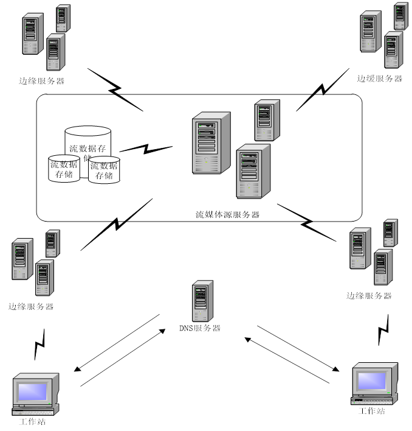

<h1><a
name="_Toc435713709">2.</a>集群与负载均衡及应用</h1>

服务器集群是指将很多彼此相互独立的服务器通过高速网络连接在一起，形成一个并行或分布式系统。这些服务器运行一系列共同的程序，向外提供单一的系统映射，提供一个服务。从外部来看，整个集群就像是一台具有统一输入、输出的服务器一样。使用集群能提高性能，降低成本，提高可扩展性，增加可用性。

负载均衡是将负载（工作任务）进行平衡、分摊到多个操作单元上进行执行，从而实现整个系统共同完成任务。服务器负载均衡是将客户端请求在集群中的服务器上实现均衡分发的技术。按照位于七层网络协议栈的不同层的划分，服务器负载均衡可以分为四层(L4)和七层负载均衡两种。其中，L4负载均衡是基于流的服务器负载均衡，能够对报文进行逐流分发，即将同一条流的报文分发给同一台服务器;L7负载均衡是基于内容的服务器负载均衡，能够对七层报文内容进行深度解析，并根据其中的关键字进行逐包转发，按照既定策略将连接导向指定的服务器。两者相比较，L4负载均衡因无法对七层业务实现按内容分发，限制了它的适用范围，因此L7负载均衡因无法对七层业务实现按内容分发，限制了它的适用范围，因此L7负载均衡受到了业界的极大重视并日渐成为服务器负载均衡的主流。

四层负载均衡主要有NAT方式和DR方式两种类型，它们适用于不同的应用场景。

NAT方式L4负载均衡的典型组网

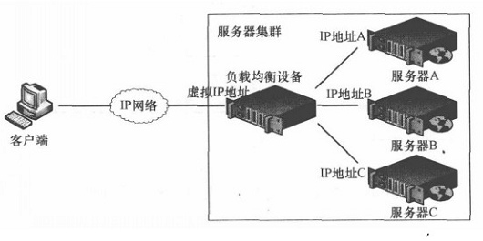

工作流程

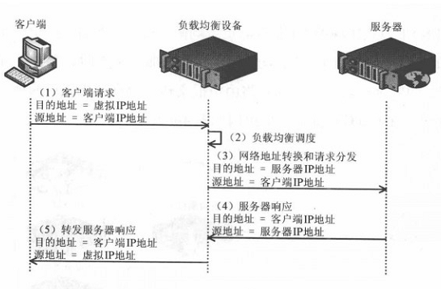

DR方式L4负载均衡的典型组网

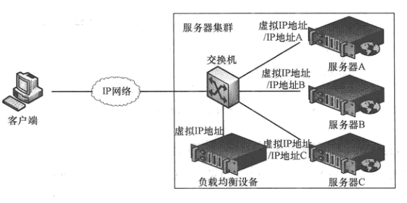

工作流程

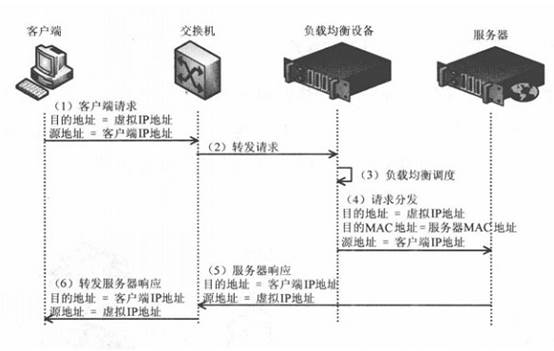

L7负载均衡的典型组网

工作流程

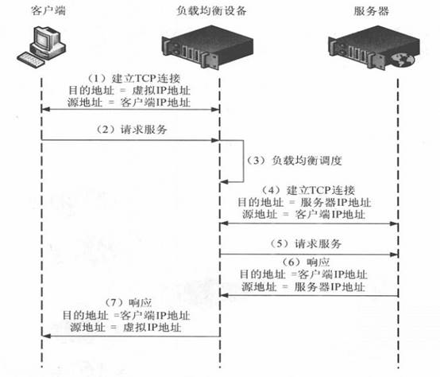

在应用中较多的负载均衡器硬件有F5BIG-IP, 软件有LVS、Nginx及HAproxy,高可用软件有Heartbeat、Keepalived、成熟的Linux集群架构有LVS+Keepalived、Nginx|HAproxy+Keepalived及DRBD+Heartbeart。在该文实例中主要使用lvs负载均衡，keepalived实现负载均衡双机热备，squid点播边缘缓冲，srs直播边缘缓冲。客户端 通过lvs虚拟地址接入系统，可以发布直播，播放直播，以及回放直播录像。

请参考如下系统架构图。

<h2><a
name="_Toc435713710">2.1 </a>四层负载均衡LVS</h2>

LVS是Linux Virtual Server的简写，意即Linux虚拟服务器，是一个虚拟的服务器集群系统。本项目在1998年5月由章文嵩博士成立，是中国国内最早出现的自由软件项目之一。

利用LVS可以实现高可用的、可伸缩的Web、Mail、Cache和Media等网络服务。并在此基础上开发支持庞大用户数的、可伸缩的、高可用的应用。

<h3><a name="_Toc33272374">2.1.1 LVS</a>集群的组成</h3>

&nbsp; &nbsp;&nbsp;&nbsp;利用LVS架设的服务器集群系统由3个部分组成：负载调度器(Load Balance),服务器池(server pool)，共享存储(Shared Storage)。在用户看来，整个LVS集群系统的所有内部应用结构都是透明的，最终用户只是在使用一个虚拟服务器提供的高性能服务。

LVS体系结构如图所示。

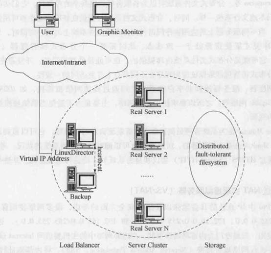

下面对LVS的各个组成部分进行详细介绍。

<b>负载调度器: </b>它是整个集群对外的前端机，负责将用户的请求发送到一组服务器上执行，而用户认为服务是来自一个IP地址（虚拟IP地址）上的

<b>服务器池:</b>它是一组真正执行客户请求的服务器，执行的服务有Web,Mail,FTP和DNS，流媒体等。

<b>共享存储:</b>它为服务器池提供一个共享的存储区，这样很容易使得服务器池拥有相同的内容，提供相同的服务。

调度器是服务器集群系统的唯一入口点，它可以采用IP负载均衡技术和基于内容的请求分发技术，或将两者相结合。在IP负载均衡技术中，要求服务器池拥有相同的内容，提供相同的服务。当用户请求到达时，调度器只根据服务器的负载情况和设定的调度算法从服务器池中选出一台服务器，将该请求转发到选出的服务器上，并记录这一次调度。当这个请求的其他报文到达时，也会被转发到前面选出的服务器上。在基于内容的请求分发技术中，服务器可以提供不同的服务，当用户请求到达时，调度器可根据请求的内容选择执行请求的服务器。因为所有的操作都是在Linux操作系统的核心空间中完成的，它的调度开销很小，所以它具有很高的吞吐率。

服务器池的节点数目是可变的。当整个系统的负载超过目前所有节点的处理能力时，可以在服务器池中增加服务器来满足不断增长的请求负载。对大多数网络服务来说，请求间的相关性并不是很强，请求可以在不同的节点上并行执行，所以整个系统的性能基本上可以随着服务器池的节点数目的增加而线性增长。

共享存储通常是数据库，网络文件系统或分布文件系统。服务器节点需要动态更新的数据一般存储在数据库系统中，同时数据库会保证并发访问时数据的一致性。静态的数据可以存储在网络文件系统(如NFS/CIFS)中，但网络文件系统的伸缩能力有限，一般来说，NFS/CI 
FS服务器只能支持3-6个敏忙的服务器节点。规模较大的集群系统可以考虑用分布式文件系统，如AFS、GFS、Cada和Intermezzo等。分布式文件系统可以为各服务器提供共享的存储区，它们访问分布式文件系统就像访问本地文件系统一样。同时，分布式文件系统可提供良好的伸缩性和可用性。

目前有三种IP负载均衡技术（VS/NAT、VS/TUN和VS/DR）；十种调度算法（rr|wrr|lc|wlc|lblc|lblcr|dh|sh|sed|nq）。

<h3><a name="_Toc33272375">2.1.2 IP</a>负载均衡技术</h3>

<h5>NAT模式（VS-NAT）</h5>

<b>原理：</b>就是把客户端发来的数据包的IP头的目的地址，在负载均衡器上换成其中一台RS的IP地址，并发至此RS来处理,RS处理完成后把数据交给经过负载均衡器,负载均衡器再把数据包的原IP地址改为自己的IP，将目的地址改为客户端IP地址即可&#65377;期间,无论是进来的流量,还是出去的流量,都必须经过负载 均衡器&#65377;

<b>优点：</b>集群中的物理服务器可以使用任何支持TCP/IP操作系统，只有负载均衡器需要一个合法的IP地址。

<b>缺点：</b>扩展性有限。当服务器节点（普通PC服务器）增长过多时,负载均衡器将成为整个系统的瓶颈，因为所有的请求包和应答包的流向都经过负载均衡器。当服务器节点过多时，大量的数据包都交汇在负载均衡器那，速度就会变慢！

<h5>IP隧道模式（VS-TUN）</h5>

<b>原理：</b>首先要知道，互联网上的大多Internet服务的请求包很短小，而应答包通常很大。那么隧道模式就是，把客户端发来的数据包，封装一个新的IP头 标记(仅目的IP)发给RS,RS收到后,先把数据包的头解开,还原数据包,处理后,直接返回给客户端,不需要再经过负载均衡器&#65377;注意,由于RS需要对负 载均衡器发过来的数据包进行还原,所以说必须支持IPTUNNEL协议&#65377;所以,在RS的内核中,必须编译支持IPTUNNEL这个选项

<b>优点：</b>负载均衡器只负责将请求包分发给后端节点服务器，而RS将应答包直接发给用户。所以，减少了负载均衡器的大量数据流动，负载均衡器不再是系统的瓶颈，就能处理很巨大的请求量，这种方式，一台负载均衡器能够为很多RS进行分发。而且跑在公网上就能进行不同地域的分发。

<b>缺点：</b>隧道模式的RS节点需要合法IP，这种方式需要所有的服务器支持”IP Tunneling”(IP Encapsulation)协议，服务器可能只局限在部分Linux系统上。

<h5>直接路由模式（VS-DR）</h5>

<b>原理：</b>负载均衡器和RS都使用同一个IP对外服务&#65377;但只有DR对ARP请求进行响应,所有RS对本身这个IP的ARP请求保持静默&#65377;也就是说,网关会把对这个服务IP的请求全部定向给DR,而DR收到数据包后根据调度算法,找出对应的RS,把目的MAC地址改为RS的MAC（因为IP一致）并将请求分发给这台RS&#65377;这时RS收到这个数据包,处理完成之后，由于IP一致，可以直接将数据返给客户，则等于直接从客户端收到这个数据包无异,处理后直接返回给客户 端&#65377;由于负载均衡器要对二层包头进行改换,所以负载均衡器和RS之间必须在一个广播域,也可以简单的理解为在同一台交换机上&#65377;

<b>优点：</b>和TUN（隧道模式）一样，负载均衡器也只是分发请求，应答包通过单独的路由方法返回给客户端。与VS-TUN相比，VS-DR这种实现方式不需要隧道结构，因此可以使用大多数操作系统做为物理服务器。

<b>缺点：</b>（不能说缺点，只能说是不足）要求负载均衡器的网卡必须与物理网卡在一个物理段上。

<h3><a name="_Toc33272376">2.1.3 </a>调度算法</h3>

<h5>1、静态调度</h5>

&nbsp; &nbsp; &nbsp; ①rr（Round Robin）:轮询调度，轮叫调度

&nbsp; &nbsp; &nbsp; 轮询调度算法的原理是每一次把来自用户的请求轮流分配给内部中的服务器，从1开始，直到N(内部服务器个数)，然后重新开始循环。算法的优点是其简洁性，它无需记录当前所有连接的状态，所以它是一种无状态调度。【提示：这里是不考虑每台服务器的处理能力】

&nbsp; &nbsp; &nbsp;②wrr：weight,加权（以权重之间的比例实现在各主机之间进行调度）

&nbsp; &nbsp;
&nbsp;由于每台服务器的配置、安装的业务应用等不同，其处理能力会不一样。所以，我们根据服务器的不同处理能力，给每个服务器分配不同的权值，使其能够接受相应权值数的服务请求。

③sh:source hashing,源地址散列。主要实现会话绑定，能够将此前建立的session信息保留了源地址散列调度算法正好与目标地址散列调度算法相反，它根据请求的源IP地址，作为散列键（Hash Key）从静态分配的散列表找出对应的服务器，若该服务器是可用的并且没有超负荷，将请求发送到该服务器，否则返回空。它采用的散列函数与目标地址散列调
度算法的相同。它的算法流程与目标地址散列调度算法的基本相似，除了将请求的目标IP地址换成请求的源IP地址，所以这里不一个一个叙述。

④dh:Destination hashing:目标地址散列。把同一个IP地址的请求，发送给同一个server。

目标地址散列调度算法也是针对目标IP地址的负载均衡，它是一种静态映射算法，通过一个散列（Hash）函数将一个目标IP地址映射到一台服务器。目标地址散列调度算法先根据请求的目标IP地址，作为散列键（Hash Key）从静态分配的散列表找出对应的服务器，若该服务器是可用的且未超载，将请求发送到该服务器，否则返回空。

<h5>2、动态调度</h5>

①lc（Least-Connection）：最少连接

最少连接调度算法是把新的连接请求分配到当前连接数最小的服务器，最小连接调度是一种动态调度短算法，它通过服务器当前所活跃的连接数来估计服务器的负载均衡，调度器需要记录各个服务器已建立连接的数目，当一个请求被调度到某台服务器，其连接数加1，当连接中止或超时，其连接数减一，在系统实现时，我们也引入当服务器的权值为0时，表示该服务器不可用而不被调度。

简单算法：active*256+inactive(谁的小，挑谁)

②wlc(Weighted
Least-Connection Scheduling)：加权最少连接。

加权最小连接调度算法是最小连接调度的超集，各个服务器用相应的权值表示其处理性能。服务器的缺省权值为1，系统管理员可以动态地设置服务器的权限，加权最小连接调度在调度新连接时尽可能使服务器的已建立连接数和其权值成比例。

简单算法：（active*256+inactive）/weight【（活动的连接数+1）/除以权重】（谁的小，挑谁）

③sed(Shortest
Expected Delay)：最短期望延迟

基于wlc算法

简单算法：（active+1)*256/weight 【（活动的连接数+1）*256/除以权重】

④nq（never queue）:永不排队（改进的sed）

无需队列，如果有台realserver的连接数＝0就直接分配过去，不需要在进行sed运算。

⑤LBLC（Locality-Based Least Connection）：基于局部性的最少连接

基于局部性的最少连接算法是针对请求报文的目标IP地址的负载均衡调度，目前主要用于Cache集群系统，因为Cache集群中客户请求报文的目标IP地址是变化的，这里假设任何后端服务器都可以处理任何请求，算法的设计目标在服务器的负载基本平衡的情况下，将相同的目标IP地址的请求调度到同一个台服务器，来提高各台服务器的访问局部性和主存Cache命中率，从而调整整个集群系统的处理能力。

基于局部性的最少连接调度算法根据请求的目标IP地址找出该目标IP地址最近使用的RealServer，若该Real Server是可用的且没有超载，将请求发送到该服务器；若服务器不存在，或者该服务器超载且有服务器处于一半的工作负载，则用“最少链接”的原则选出一
个可用的服务器，将请求发送到该服务器。

⑥LBLCR（Locality-Based Least
Connections withReplication）：带复制的基于局部性最少链接

&nbsp; &nbsp; &nbsp; 带复制的基于局部性最少链接调度算法也是针对目标IP地址的负载均衡，该算法根据请求的目标IP地址找出该目标IP地 址对应的服务器组，按“最小连接”原则从服务器组中选出一台服务器，若服务器没有超载，将请求发送到该服务器；若服务器超载，则按“最小连接”原则从这个
集群中选出一台服务器，将该服务器加入到服务器组中，将请求发送到该服务器。同时，当该服务器组有一段时间没有被修改，将最忙的服务器从服务器组中删除，
以降低复制的程度。

&nbsp;&nbsp;&nbsp; 此文方案使用VS-DR+RR

官网: <a href="http://zh.linuxvirtualserver.org/">http://zh.linuxvirtualserver.org/</a>

&nbsp;

高可用LVS负载均衡集群体系结构

高可用性软件Heartbeat与Keepalived

&nbsp;

<h2><a
name="_Toc435713711">2.2 </a>高可用软件 Keepalived</h2>

Keepalived是一款优秀的实现高可用的软件，它运行在LVS之上，它的主要功能是实现真实机的故障隔离及负载均衡器间的失败切换(failover)。Keepalived是一个类似于Layer3,Layer4,Layer5交换机制的软件，也就是我们平时说的第三层、第四层和第五层交换。

Keepalived的作用是检测服务器的状态，如果有一台服务器死机，或工作出现故障，Keepalived将检测到，并将有故障的服务器从系统中剔除，当服务器工作正常后Keepalived自动将服务器加入到服务器群中，这些工作全部自动完成，不需要人工干涉，需要人 工做的只是修复故障的服务器。

Keepalived是一款优秀的HA软件，一般应于生产环境下的LVS、Nginx中，采用都是双机方案，以保证最前端负载均衡器的高可用性。

此方案中，主要用作RealServer的健康状态检查以及LoadBalance主机和BackUP

主机之间failover的实现

通过LVS+Keepalived能实现的功能：利用LVS控制器主备模式避免单点故障以及自动删除故障服务器结点并当它恢复后再自动添加到群集中。

官网: <a href="http://www.keepalived.org">http://www.keepalived.org</a>

<h2><a
name="_Toc435713712">2.3 </a>流媒体直播服务器SRS</h2>

SRS是国内个人优秀的开源项目，最初开发SRS版本时，他参考了开源nginx+rtmp架构，商用的FMS等流媒体直播系统，以及cdn中直播系统常有的应用，所以SRS提供功能实用性比较高，而且版本一直不断更新，官网资料全面，文档有中英版，代码注释多。

SRS定位是运营级的互联网直播服务器集群，追求更好的概念完整性和最简单实现的代码，提供了丰富的接入方案将RTMP流接入SRS，包括推送RTMP到SRS、推送RTSP/UDP/FLV到SRS、拉取流到SRS。SRS还支持将接入的RTMP流进行各种变换，譬如将RTMP流转码、流截图、转发给其他服务器、转封装成HTTP-FLV流、转封装成HLS、转封装成HDS、录制成FLV。SRS包含支大规模集群如CDN业务的关键特性，譬如RTMP多级集群、VHOST虚拟服务器、无中断服务Reload、HTTP-FLV集群、Kafka对接。此外，SRS还提供丰富的应用接口，包括HTTP回调、安全策略Security、HTTP API接口、RTMP测速。

在此方案中，主要完成rtmp直播流边缘缓冲功能

官网: <a
href="https://github.com/ossrs/srs">https://github.com/ossrs/srs</a>

&nbsp;

<h2><a
name="_Toc435713713">2.4 Web</a>缓冲服务器Squid</h2>

&nbsp;&nbsp; Squid cache（简称为Squid）是一个流行的自由软件（GNU通用公共许可证）的代理服务器和Web缓存服务器。Squid有广泛的用途，从作为网页服务器的前置cache服务器缓存相关请求来提高

Squid是一种用来缓冲Internet数据的软件。它是这样实现其功能的，接受来自人们需要下载的目标（object）的请求并适当地处理这些请求。也就是说，如果一个人想下载一web页面，他请求Squid为他取得这个页面。Squid随之连接到远程服务器（比如：http：//squid.nlanr.net/）并向这个页面发出请求。然后，Squid显式地聚集数据到客户端机器，而且同时复制一份。当下一次有人需要同一页面时，Squid可以简单地从磁盘中读到它，那样数据迅即就会传输到客户机上。当前的Squid可以处理HTTP，FTP，GOPHER，SSL和WAIS等协议。但它不能处理如POP，NNTP，RealAudio以及其它类型的东西。 

&nbsp; 在此方案中，主要完成http点播边缘缓冲功能

&nbsp; 官网: <a
href="http://www.squid-cache.org">http://www.squid-cache.org</a>

&nbsp;

<h2><a
name="_Toc435713714">2.5 </a>负载均衡应用</h2>

<h3><a name="_Toc435713715">2.5.1 </a>系统环境</h3>

系统平台：VMware&nbsp; centos 7

LVS版本：ipvsadm-1.27

keepalived版本：keepalived-1.2.19

srs版本: srs-2.0a2

squid版本: squid-3.5.11.tar.gz

<h3><a name="_Toc33272382">2.5.2 </a>配置真实主机</h3>

在真实主机192.168.254.129与192.168.254.130配置与安装点播缓冲服务squid，与直播边缘服务srs

<h4>(一) 安装与配置直播流媒体服务器simple rtmp server(srs)</h4>

1.官方下载&nbsp;<a href="https://github.com/ossrs/srs">https://github.com/ossrs/srs</a>

2.编译与安装

./configure &amp;&amp; make
&amp;&amp; make install

默认安装在/usr/local/srs

3.配置

修改边缘服务器配置conf/edge.conf

{

listen&nbsp;&nbsp;&nbsp;&nbsp;&nbsp;&nbsp;&nbsp;&nbsp;&nbsp;&nbsp;&nbsp;&nbsp;&nbsp;
1935;

max_connections&nbsp;&nbsp;&nbsp;&nbsp;
1000;

pid&nbsp;&nbsp;&nbsp;&nbsp;&nbsp;&nbsp;&nbsp;&nbsp;&nbsp;&nbsp;&nbsp;&nbsp;&nbsp;&nbsp;&nbsp;&nbsp;
objs/edge.pid;

srs_log_file&nbsp;&nbsp;&nbsp;&nbsp;&nbsp;&nbsp;&nbsp;
./objs/edge.log;

vhost
__defaultVhost__ {

&nbsp;&nbsp;&nbsp;
mode&nbsp;&nbsp;&nbsp;&nbsp;&nbsp;&nbsp;&nbsp;&nbsp;&nbsp;&nbsp;&nbsp; remote;

&nbsp;&nbsp;&nbsp;
origin&nbsp;&nbsp;&nbsp;&nbsp;&nbsp;&nbsp;&nbsp;&nbsp;&nbsp;
192.168.111.99:1935; #源服务器地址与端口

}

4.启动

./objs/srs&nbsp; -c conf/edge.conf

<h4>(二) 安装与配置http缓冲服务器squid</h4>

1.官方下载<a href="http://www.squid-cache.org/Versions/">http://www.squid-cache.org/Versions/</a>

2.编译与安装

&nbsp; ./configure&nbsp; &amp;&amp; make &amp;&amp; make install

&nbsp; 默认安装在/usr/local/squid

3.配置

将默认squid.conf备份，修改/usr/local/squid/etc/squid.conf为如下内容

http_port &nbsp;80
&nbsp;accel &nbsp;vhost&nbsp; #squid监听端口

http_access
allow all&nbsp; #访问控制

cache_peer 192.168.111.99 parent 8080 0 no-query originserver #定义源服务器端口与地址

cache_mem 64 MB&nbsp;
#缓存占内存大小

maximum_object_size
4 MB #最大缓存块

minimum_object_size
0 KB&nbsp; #最小缓存块

maximum_object_size_in_memory
4096 KB #内存中cache的最大文件大小

cache_dir aufs
/var/spool/squid 100 16 256 #定义缓存目录

#ausf:缓存数据的存储格式

#/var/spool/squid
缓存目录

#100 : 缓存目录占磁盘空间大小（M）

#16 ：缓存空间一级子目录个数

#256 ：缓存空间二级子目录个数

access_log
/var/log/squid/access.log combined #日志存储方式

cache_log
/var/log/squid/cache.log&nbsp;&nbsp;&nbsp; #访问日志存放的文件

logfile_rotate
60&nbsp; #日志转换 执行squid -k rotate

cache_swap_high
95&nbsp; #这两行是,当缓存目录空间达到95%的时候,删&nbsp;&nbsp; 
cache_swap_low 90&nbsp; #除缓存到90%

&nbsp;&nbsp;&nbsp;&nbsp;&nbsp;&nbsp;&nbsp;&nbsp;&nbsp;&nbsp;

3.启动

/usr/local/squid/sbin/squid&nbsp;
-k&nbsp; parse&nbsp; 检查配置是否有问 

/usr/local/squid/sbin/squid
&nbsp;-z&nbsp; 创建缓冲目录

/usr/local/squid/sbin/squid&nbsp;&nbsp;
启动squid

&nbsp; 如果执行命令时提示文件或目录没有权限，可以使用chmod&nbsp; 777 目录 �CR&nbsp; 修改权限

成功启动之后，可以curl命令测试是否能成功

&nbsp;&nbsp;&nbsp;&nbsp;&nbsp;&nbsp;&nbsp;&nbsp;&nbsp;&nbsp;
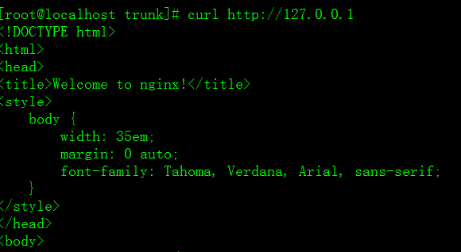

结果显示成功连接到192.168.111.99:8080 nginx Web服务器上。

<h3><a
name="_Toc435713717">2.5.3 </a>配置lvs与keepalived</h3>

如果需要双机热备可以在主备机使用lvs+keepalived，否则只在主机上配置lvs, 不使用双机热备时，存在单点故障。

<h4 style='margin-left:36.0pt;text-indent:-36.0pt'>(一)&nbsp;&nbsp;&nbsp;&nbsp;&nbsp;&nbsp; 两台LVS Server上安装lvs、keepalived软件</h4>

注意: 测试环境在vmware 上安装时centos 7 后系统自动安装了lvs,如果没有安装，请按 lvs install安装步骤

lvs install -------------

[root@LVS-MASTER~]#wget http://www.linuxvirtualserver.org/software/kernel-2.6/ipvsadm-1.24.tar.gz

[root@LVS-MASTER ~]# ln -s
/usr/src/kernels/2.6.18-194.el5-i686/&nbsp; /usr/src/linux/

[root@LVS-MASTER ~]# tar zxvf
ipvsadm-1.24.tar.gz

[root@LVS-MASTER ~]# cd ipvsadm-1.24

[root@LVS-MASTER ipvsadm-1.24]# make
&amp;&amp; make install

&nbsp;

不需要双机热备不安装keepalived

Keepalived install -------------

[root@LVS-MASTER ~]# wget
http://www.keepalived.org/software/keepalived-1.2.19.tar.gz

[root@LVS-MASTER ~]# tar zxvf
keepalived-1.2.19.tar.gz

[root@LVS-MASTER ~]# cd keepalived-1.2.19

[root@LVS-MASTER keepalived-1.2.19]#
./configure &amp;&amp; make &amp;&amp; make install

&nbsp;

<h4 style='margin-left:36.0pt;text-indent:-36.0pt'>(二)&nbsp;&nbsp;&nbsp;&nbsp;&nbsp;&nbsp; 不需要双机热备,只单机安装lvs</h4>

&nbsp;&nbsp; &nbsp;如果使用双机热备，请跳至第三步keepalived的配置虚拟地址，网卡物理设备名为eno16777736&nbsp;
虚拟地址为192.168.254.120：

ifconfig eno16777736:0 192.168.254.120
broadcast 192.168.254.120 netmask 255.255.255.255 up &nbsp;&nbsp;

配置成功后，使用ifconfig查看是否成功

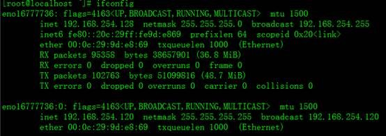添加虚拟主机路由，使用如下命令添加路由：

route &nbsp;add &nbsp;-host
&nbsp;192.168.254.120 &nbsp;dev &nbsp;eno16777736:0

使用route查看路由表是否成功

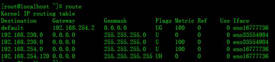

&nbsp;&nbsp;&nbsp;&nbsp; 映射虚拟地址与真实服务器地址，如果不使用双机热备，需要使用ipvsadm命令配置虚拟地址与真实服务器地址映射。新建lvs.sh脚本文件，把这些命令放入lvs.sh脚本文件，然后执行

&nbsp;&nbsp;&nbsp;&nbsp;
SNS_VIP=192.168.254.120&nbsp; #虚拟地址

SNS_RIP1=192.168.254.129&nbsp;
#真实服务器地址1

SNS_RIP2=192.168.254.130&nbsp;
#真实服务器地址2

#映射80端口

ipvsadm -A -t
$SNS_VIP:80 -s rr -p 120

&nbsp;&nbsp;&nbsp;&nbsp; ipvsadm -a -t
$SNS_VIP:80 -r $SNS_RIP1:80 -g -w 1

&nbsp;&nbsp;&nbsp;&nbsp; ipvsadm -a -t
$SNS_VIP:80 -r $SNS_RIP2:80 -g -w 1

&nbsp;&nbsp;&nbsp;&nbsp; #映身1935端口

&nbsp;&nbsp;&nbsp;&nbsp; ipvsadm -A -t
$SNS_VIP:1935 -s rr -p 120

&nbsp; &nbsp;&nbsp;&nbsp;ipvsadm -a -t
$SNS_VIP:1935 -r $SNS_RIP1:1935 -g -w 1

&nbsp;&nbsp;&nbsp;&nbsp; ipvsadm -a -t
$SNS_VIP:1935 -r $SNS_RIP2:1935 -g -w 1

<h4 style='margin-left:36.0pt;text-indent:-36.0pt'>(三)&nbsp;&nbsp;&nbsp;&nbsp;&nbsp;&nbsp; keepalived的配置</h4>

成功安装keepalived后，修改配置文件/etc/keepalived/keepalived.conf,
内容如下

###################&nbsp; MASTER
###################

&nbsp;!
Configuration File for keepalived

global_defs
{

&nbsp;&nbsp;
notification_email {

&nbsp;&nbsp;&nbsp;&nbsp;
root@test.com&nbsp;&nbsp;&nbsp;&nbsp;&nbsp;&nbsp;&nbsp;&nbsp;&nbsp;&nbsp;&nbsp;&nbsp;&nbsp;&nbsp;
#设置报警邮件地址，可以设置多个，每行一个。

&nbsp;&nbsp;&nbsp;&nbsp;
test@qq.com&nbsp;&nbsp;&nbsp;&nbsp;&nbsp;&nbsp;&nbsp;&nbsp;&nbsp;&nbsp;&nbsp;&nbsp;&nbsp;&nbsp;&nbsp;&nbsp;
#需开启本机的sendmail服务

&nbsp;&nbsp;
}

&nbsp;&nbsp;
notification_email_from
keepalived@localhost&nbsp;&nbsp;&nbsp;&nbsp;&nbsp;&nbsp;&nbsp;&nbsp; #设置邮件的发送地址

&nbsp;&nbsp;
smtp_server
127.0.0.1&nbsp;&nbsp;&nbsp;&nbsp;&nbsp;&nbsp;&nbsp;&nbsp;&nbsp;&nbsp;&nbsp;&nbsp;&nbsp;&nbsp;&nbsp;&nbsp;&nbsp;&nbsp;&nbsp;&nbsp;&nbsp;&nbsp;&nbsp;&nbsp;&nbsp;&nbsp;&nbsp;&nbsp;&nbsp;&nbsp;&nbsp;
#设置smtp server地址

&nbsp;&nbsp;
smtp_connect_timeout
30&nbsp;&nbsp;&nbsp;&nbsp;&nbsp;&nbsp;&nbsp;&nbsp;&nbsp;&nbsp;&nbsp;&nbsp;&nbsp;&nbsp;&nbsp;&nbsp;&nbsp;&nbsp;&nbsp;&nbsp;&nbsp;&nbsp;&nbsp;&nbsp;&nbsp;&nbsp;&nbsp;&nbsp;&nbsp;
#设置连接smtp
server的超时时间

&nbsp;&nbsp;
router_id
LVS_DEVEL&nbsp;&nbsp;&nbsp;&nbsp;&nbsp;&nbsp;&nbsp;&nbsp;&nbsp;&nbsp;&nbsp;&nbsp;&nbsp;&nbsp;&nbsp;
&nbsp;&nbsp;&nbsp;&nbsp;&nbsp;&nbsp;&nbsp;&nbsp;&nbsp;&nbsp;&nbsp;&nbsp;&nbsp;&nbsp;&nbsp;&nbsp;&nbsp;&nbsp;#表示运行keepalived服务器的一个标识。发邮件时显示在邮件主题的信息

}

&nbsp;

vrrp_instance
VI_1 {

&nbsp;&nbsp;&nbsp; state
MASTER&nbsp; &nbsp;&nbsp;&nbsp;&nbsp;&nbsp;&nbsp;&nbsp;&nbsp;&nbsp;&nbsp;&nbsp;&nbsp;#指定keepalived的角色，MASTER表示此主机是主服务器，BACKUP表示此主机是备用服务器

&nbsp;&nbsp;&nbsp;
interface eno16777736&nbsp;&nbsp;&nbsp;&nbsp; #指定HA监测网络的接口

&nbsp;&nbsp;&nbsp;
virtual_router_id 51&nbsp;&nbsp;&nbsp;&nbsp;&nbsp; #虚拟路由标识，这个标识是一个数字，同一个vrrp实例使用唯一的标识。即同一vrrp_instance下，MASTER和BACKUP必须是一致的

&nbsp;&nbsp;&nbsp; priority
100&nbsp;&nbsp;&nbsp;&nbsp;&nbsp;&nbsp;&nbsp;&nbsp;&nbsp;&nbsp;&nbsp; #定义优先级，数字越大，优先级越高，在同一个vrrp_instance下，MASTER的优先级必须大于BACKUP的优先级

&nbsp;&nbsp;&nbsp; advert_int
1&nbsp;&nbsp;&nbsp;&nbsp;&nbsp;&nbsp;&nbsp;&nbsp;&nbsp;&nbsp;&nbsp;&nbsp;&nbsp;
#设定MASTER与BACKUP负载均衡器之间同步检查的时间间隔，单位是秒

&nbsp;&nbsp;&nbsp;
authentication {&nbsp;&nbsp;&nbsp;&nbsp;&nbsp;&nbsp;&nbsp;&nbsp;&nbsp; #设置验证类型和密码

&nbsp;&nbsp;&nbsp;
&nbsp;&nbsp;&nbsp;&nbsp;auth_type
PASS&nbsp;&nbsp;&nbsp;&nbsp;&nbsp;&nbsp;&nbsp; #设置验证类型，主要有PASS和AH两种

&nbsp;&nbsp;&nbsp;&nbsp;&nbsp;&nbsp;&nbsp;
auth_pass 1111&nbsp;&nbsp;&nbsp;&nbsp;&nbsp;&nbsp;&nbsp; #设置验证密码，在同一个vrrp_instance下，MASTER与BACKUP必须使用相同的密码才能正常通信

&nbsp;&nbsp;&nbsp;
}

virtual_ipaddress {&nbsp; 

&nbsp;&nbsp;&nbsp;&nbsp; #设置虚拟IP地址，可以设置多个虚拟IP地址，每行一个

&nbsp;&nbsp;&nbsp;&nbsp;&nbsp;&nbsp;&nbsp;
192.168.254.120

&nbsp;&nbsp;&nbsp;
}

}

&nbsp;

virtual_server
192.168.254.120 80 {&nbsp; 

&nbsp;&nbsp;&nbsp;
#设置虚拟服务器，需要指定虚拟IP地址和服务端口，IP与端口之间用空格隔开

&nbsp;&nbsp;&nbsp;
delay_loop
6&nbsp;&nbsp;&nbsp;&nbsp;&nbsp;&nbsp;&nbsp;&nbsp;&nbsp;&nbsp;&nbsp;&nbsp;&nbsp;&nbsp;&nbsp;&nbsp;&nbsp;&nbsp;&nbsp;
#设置运行情况检查时间，单位是秒

&nbsp;&nbsp;&nbsp;
lb_algo
rr&nbsp;&nbsp;&nbsp;&nbsp;&nbsp;&nbsp;&nbsp;&nbsp;&nbsp;&nbsp;&nbsp;&nbsp;&nbsp;&nbsp;&nbsp;&nbsp;&nbsp;&nbsp;&nbsp;&nbsp;&nbsp;
#设置负载调度算法，这里设置为rr，即轮询算法

&nbsp;&nbsp;&nbsp; lb_kind
DR&nbsp;&nbsp;&nbsp;&nbsp;&nbsp;&nbsp;&nbsp;&nbsp;&nbsp;&nbsp;&nbsp;&nbsp;&nbsp;&nbsp;&nbsp;&nbsp;&nbsp;&nbsp;&nbsp;&nbsp;&nbsp;
#设置LVS实现负载均衡的机制，有NAT、TUN、DR三个模式可选

&nbsp;&nbsp;&nbsp;
persistence_timeout 50&nbsp;&nbsp;&nbsp;&nbsp;&nbsp;&nbsp;&nbsp;&nbsp;&nbsp; #会话保持时间，单位是秒。这个选项对动态网页是非常有用的，为集群系统中的session共享提供了一个很好的解决方案。

&nbsp;&nbsp;&nbsp;&nbsp;&nbsp;&nbsp;&nbsp;&nbsp;&nbsp;&nbsp;&nbsp;&nbsp;&nbsp;&nbsp;&nbsp;&nbsp;&nbsp;&nbsp;&nbsp;&nbsp;&nbsp;&nbsp;&nbsp;&nbsp;&nbsp;&nbsp;&nbsp;&nbsp;&nbsp;&nbsp;&nbsp;&nbsp;&nbsp;&nbsp;&nbsp;
#有了这个会话保持功能，用户的请求会被一直分发到某个服务节点，直到超过这个会话的保持时间。

&nbsp;&nbsp;&nbsp;&nbsp;&nbsp;&nbsp;&nbsp;&nbsp;&nbsp;&nbsp;&nbsp;&nbsp;&nbsp;&nbsp;&nbsp;&nbsp;&nbsp;&nbsp;&nbsp;&nbsp;&nbsp;&nbsp;&nbsp;&nbsp;&nbsp;&nbsp;&nbsp;&nbsp;&nbsp;&nbsp;&nbsp;&nbsp;&nbsp;&nbsp;&nbsp;
#需要注意的是，这个会话保持时间是最大无响应超时时间，也就是说，用户在操作动态页面时，如果50秒内没有执行任何操作，

&nbsp;&nbsp;&nbsp;&nbsp;&nbsp;&nbsp;&nbsp;&nbsp;&nbsp;&nbsp;&nbsp;&nbsp;&nbsp;&nbsp;&nbsp;&nbsp;&nbsp;&nbsp;&nbsp;&nbsp;&nbsp;&nbsp;&nbsp;&nbsp;&nbsp;&nbsp;&nbsp;&nbsp;&nbsp;&nbsp;&nbsp;&nbsp;&nbsp;&nbsp;&nbsp;
#那么接下来的操作会被分发到另外的节点，但是如果用户一直在操作动态页面，则不受50秒的时间限制

&nbsp;&nbsp;&nbsp;
protocol
TCP&nbsp;&nbsp;&nbsp;&nbsp;&nbsp;&nbsp;&nbsp;&nbsp;&nbsp;&nbsp;&nbsp;&nbsp;&nbsp;&nbsp;&nbsp;&nbsp;&nbsp;&nbsp;&nbsp;
#指定转发协议类型，有TCP和UDP两种

real_server 192.168.254.129 80 {
#配置服务节点1，需要指定real server的真实IP地址和端口，IP与端口之间用空格隔开

&nbsp;&nbsp;&nbsp;&nbsp;&nbsp;&nbsp;
weight 1&nbsp;&nbsp;&nbsp;&nbsp;&nbsp;&nbsp;&nbsp;&nbsp;&nbsp;&nbsp;&nbsp;&nbsp;&nbsp;&nbsp;&nbsp;&nbsp;&nbsp;&nbsp;&nbsp;
#配置服务节点的权值，权值大小用数字表示，数字越大，权值越高，设置权值大小可以为不同性能的服务器

&nbsp;&nbsp;&nbsp;&nbsp;&nbsp;&nbsp;&nbsp;&nbsp;&nbsp;&nbsp;&nbsp;&nbsp;&nbsp;&nbsp;&nbsp;&nbsp;&nbsp;&nbsp;&nbsp;&nbsp;&nbsp;&nbsp;&nbsp;&nbsp;&nbsp;&nbsp;&nbsp;&nbsp;&nbsp;&nbsp;&nbsp;&nbsp;&nbsp;&nbsp;&nbsp;
#分配不同的负载，可以为性能高的服务器设置较高的权值，而为性能较低的服务器设置相对较低的权值，这样才能合理地利用和分配系统资源

&nbsp;&nbsp;&nbsp;&nbsp;&nbsp;&nbsp;&nbsp;
TCP_CHECK
{&nbsp;&nbsp;&nbsp;&nbsp;&nbsp;&nbsp;&nbsp;&nbsp;&nbsp;&nbsp;&nbsp;&nbsp;&nbsp;&nbsp;&nbsp;&nbsp;
#realserver的状态检测设置部分，单位是秒

&nbsp;&nbsp;&nbsp;&nbsp;&nbsp;&nbsp;&nbsp;&nbsp;&nbsp;&nbsp;&nbsp;
connect_timeout 10&nbsp;&nbsp;&nbsp;&nbsp;&nbsp; #表示3秒无响应超时

&nbsp;&nbsp;&nbsp;&nbsp;&nbsp;&nbsp;&nbsp;&nbsp;&nbsp;&nbsp;&nbsp;
nb_get_retry 3&nbsp;&nbsp;&nbsp;&nbsp;&nbsp;&nbsp;&nbsp;&nbsp;&nbsp; #表示重试次数

&nbsp;&nbsp;&nbsp;&nbsp;&nbsp;&nbsp;&nbsp;&nbsp;&nbsp;&nbsp;&nbsp;
delay_before_retry 3&nbsp;&nbsp;&nbsp; #表示重试间隔

&nbsp;&nbsp;&nbsp;&nbsp;&nbsp;&nbsp;&nbsp;&nbsp;&nbsp;&nbsp;&nbsp;
connect_port 80

&nbsp;&nbsp;&nbsp;&nbsp;&nbsp;&nbsp;&nbsp;
}

&nbsp;&nbsp;&nbsp;
}

&nbsp;&nbsp;&nbsp;
real_server 192.168.254.130 80 {

&nbsp;&nbsp;&nbsp;&nbsp;&nbsp;&nbsp;&nbsp;
weight 1

&nbsp;&nbsp;&nbsp;&nbsp;&nbsp;&nbsp;&nbsp;
TCP_CHECK {

&nbsp;&nbsp;&nbsp;&nbsp;&nbsp;&nbsp;&nbsp;&nbsp;&nbsp;&nbsp;&nbsp;
connect_timeout 10

&nbsp;&nbsp;&nbsp;&nbsp;&nbsp;&nbsp;&nbsp;&nbsp;&nbsp;&nbsp;&nbsp;
nb_get_retry 3

&nbsp;&nbsp;&nbsp;&nbsp;&nbsp;&nbsp;&nbsp;&nbsp;&nbsp;&nbsp;&nbsp;
delay_before_retry 3

&nbsp;&nbsp;&nbsp;&nbsp;&nbsp;&nbsp;&nbsp;&nbsp;&nbsp;&nbsp;&nbsp;
connect_port 80

&nbsp;&nbsp;&nbsp;&nbsp;&nbsp;&nbsp;&nbsp;
}

&nbsp;&nbsp;&nbsp;
}

}

&nbsp;

virtual_server
192.168.254.120 1935 {&nbsp;&nbsp;&nbsp;&nbsp;&nbsp; 

&nbsp;&nbsp;&nbsp;
delay_loop
6&nbsp;&nbsp;&nbsp;&nbsp;&nbsp;&nbsp;&nbsp;&nbsp;&nbsp;&nbsp;&nbsp;&nbsp;&nbsp;&nbsp;&nbsp;&nbsp;&nbsp;&nbsp;

&nbsp;&nbsp;&nbsp;
lb_algo
rr&nbsp;&nbsp;&nbsp;&nbsp;&nbsp;&nbsp;&nbsp;&nbsp;&nbsp;&nbsp;&nbsp;&nbsp;&nbsp;&nbsp;&nbsp;&nbsp;&nbsp;&nbsp;&nbsp;&nbsp;

lb_kind
DR&nbsp;&nbsp;&nbsp;&nbsp;&nbsp;&nbsp;&nbsp;&nbsp;&nbsp;&nbsp;&nbsp;&nbsp;&nbsp;&nbsp;&nbsp;&nbsp;&nbsp;&nbsp;&nbsp;&nbsp;

persistence_timeout
50&nbsp;&nbsp;&nbsp;&nbsp; 

&nbsp;&nbsp;&nbsp;
protocol
TCP&nbsp;&nbsp;&nbsp;&nbsp;&nbsp;&nbsp;&nbsp;&nbsp;&nbsp;&nbsp;&nbsp;&nbsp;&nbsp;&nbsp;

real_server
192.168.254.129 1935 {&nbsp;&nbsp;&nbsp; 

&nbsp;&nbsp;&nbsp;&nbsp;&nbsp;&nbsp;&nbsp;
weight 1&nbsp;&nbsp;&nbsp;&nbsp;&nbsp;&nbsp;&nbsp;&nbsp;&nbsp;&nbsp;&nbsp;&nbsp;&nbsp;&nbsp;&nbsp;&nbsp;&nbsp;

&nbsp;&nbsp;&nbsp;&nbsp;&nbsp;&nbsp;&nbsp;
TCP_CHECK {&nbsp;&nbsp;&nbsp;&nbsp;&nbsp;&nbsp;&nbsp;&nbsp;&nbsp; 

&nbsp;&nbsp;&nbsp;&nbsp;&nbsp;&nbsp;&nbsp;&nbsp;&nbsp;&nbsp;&nbsp;
connect_timeout 10&nbsp;&nbsp;&nbsp; 

&nbsp;&nbsp;&nbsp;&nbsp;&nbsp;&nbsp;&nbsp;&nbsp;&nbsp;&nbsp;&nbsp;
nb_get_retry 3&nbsp;&nbsp;&nbsp;&nbsp;&nbsp;&nbsp;&nbsp;&nbsp; 

&nbsp;&nbsp;&nbsp;&nbsp;&nbsp;&nbsp;&nbsp;&nbsp;&nbsp;&nbsp;&nbsp;
delay_before_retry 3&nbsp;&nbsp; 

&nbsp;&nbsp;&nbsp;&nbsp;&nbsp;&nbsp;&nbsp;&nbsp;&nbsp;&nbsp;&nbsp;
connect_port 1935

&nbsp;&nbsp;&nbsp;&nbsp;&nbsp;&nbsp;&nbsp;
}

&nbsp;&nbsp;&nbsp;
}

&nbsp;&nbsp;&nbsp;
real_server 192.168.254.130 1935 {

&nbsp;&nbsp;&nbsp;&nbsp;&nbsp;&nbsp;&nbsp;
weight 1

&nbsp;&nbsp;&nbsp;&nbsp;&nbsp;&nbsp;&nbsp;
TCP_CHECK {

&nbsp;&nbsp;&nbsp;&nbsp;&nbsp;&nbsp;&nbsp;&nbsp;&nbsp;&nbsp;&nbsp;
connect_timeout 10

&nbsp;&nbsp;&nbsp;&nbsp;&nbsp;&nbsp;&nbsp;&nbsp;&nbsp;&nbsp;&nbsp;
nb_get_retry 3

&nbsp;&nbsp;&nbsp;&nbsp;&nbsp;&nbsp;&nbsp;&nbsp;&nbsp;&nbsp;&nbsp;
delay_before_retry 3

&nbsp;&nbsp;&nbsp;&nbsp;&nbsp;&nbsp;&nbsp;&nbsp;&nbsp;&nbsp;&nbsp;
connect_port 1935

&nbsp;&nbsp;&nbsp;&nbsp;&nbsp;&nbsp;&nbsp;
}

&nbsp;&nbsp;&nbsp;
}

}

####################&nbsp;BACKUP
###################

!
Configuration File for keepalived

&nbsp;

global_defs
{

&nbsp;&nbsp;
notification_email {

&nbsp;&nbsp;&nbsp;&nbsp;
root@linux.tang.chao

&nbsp;&nbsp;&nbsp;&nbsp;
mchina_tang@qq.com

&nbsp;&nbsp;
}

&nbsp;&nbsp;
notification_email_from Alexandre.Cassen@firewall.loc

&nbsp;&nbsp;
smtp_server 127.0.0.1

&nbsp;&nbsp;
smtp_connect_timeout 30

&nbsp;&nbsp;
router_id LVS_DEVEL

}

&nbsp;

vrrp_instance
VI_1 {

&nbsp;&nbsp;&nbsp;
state BACKUP

&nbsp;&nbsp;&nbsp;
interface eno16777736

&nbsp;&nbsp;&nbsp;
virtual_router_id 51

&nbsp;&nbsp;&nbsp;
priority 99

&nbsp;&nbsp;&nbsp;
advert_int 1

&nbsp;&nbsp;&nbsp;
authentication {

&nbsp;&nbsp;&nbsp;&nbsp;&nbsp;&nbsp;&nbsp;
auth_type PASS

&nbsp;&nbsp;&nbsp;&nbsp;&nbsp;&nbsp;&nbsp;
auth_pass 1111

&nbsp;&nbsp;&nbsp;
}

&nbsp;&nbsp;&nbsp;
virtual_ipaddress {

&nbsp;&nbsp;&nbsp;&nbsp;&nbsp;&nbsp;&nbsp;
192.168.254.120

&nbsp;&nbsp;&nbsp;
}

}

#映射80端口

virtual_server
192.168.254.120 80 {

&nbsp;&nbsp;&nbsp;
delay_loop 6

&nbsp;&nbsp;&nbsp;
lb_algo rr

&nbsp;&nbsp;&nbsp;
lb_kind DR

&nbsp;&nbsp;&nbsp;
persistence_timeout 50

&nbsp;&nbsp;&nbsp;
protocol TCP

&nbsp;

&nbsp;&nbsp;&nbsp;
real_server 192.168.254.129 80 {

&nbsp;&nbsp;&nbsp;&nbsp;&nbsp;&nbsp;&nbsp;
weight 1

&nbsp;&nbsp;&nbsp;&nbsp;&nbsp;&nbsp;&nbsp;
TCP_CHECK {

&nbsp;&nbsp;&nbsp;&nbsp;&nbsp;&nbsp;&nbsp;&nbsp;&nbsp;&nbsp;&nbsp;
connect_timeout 10

&nbsp;&nbsp;&nbsp;&nbsp;&nbsp;&nbsp;&nbsp;&nbsp;&nbsp;&nbsp;&nbsp;
nb_get_retry 3

&nbsp;&nbsp;&nbsp;&nbsp;&nbsp;&nbsp;&nbsp;&nbsp;&nbsp;&nbsp;&nbsp;
delay_before_retry 3

&nbsp;&nbsp;&nbsp;&nbsp;&nbsp;&nbsp;&nbsp;&nbsp;&nbsp;&nbsp;&nbsp;
connect_port 80

&nbsp;&nbsp;&nbsp;&nbsp;&nbsp;&nbsp;&nbsp;
}

&nbsp;&nbsp;&nbsp;
}

&nbsp;&nbsp;&nbsp;
real_server 192.168.254.130 80 {

&nbsp;&nbsp;&nbsp;&nbsp;&nbsp;&nbsp;&nbsp;
weight 1

&nbsp;&nbsp;&nbsp;&nbsp;&nbsp;&nbsp;&nbsp;
TCP_CHECK {

&nbsp;&nbsp;&nbsp;&nbsp;&nbsp;&nbsp;&nbsp;&nbsp;&nbsp;&nbsp;&nbsp;
connect_timeout 10

&nbsp;&nbsp;&nbsp;&nbsp;&nbsp;&nbsp;&nbsp;&nbsp;&nbsp;&nbsp;&nbsp;
nb_get_retry 3

&nbsp;&nbsp;&nbsp;&nbsp;&nbsp;&nbsp;&nbsp;&nbsp;&nbsp;&nbsp;&nbsp;
delay_before_retry 3

&nbsp;&nbsp;&nbsp;&nbsp;&nbsp;&nbsp;&nbsp;&nbsp;&nbsp;&nbsp;&nbsp;
connect_port 80

&nbsp;&nbsp;&nbsp;&nbsp;&nbsp;&nbsp;&nbsp;
}

&nbsp;&nbsp;&nbsp;
}

}

#映射1935端口

virtual_server
192.168.254.120 &nbsp;1935{

&nbsp;&nbsp;&nbsp;
delay_loop 6

&nbsp;&nbsp;&nbsp;
lb_algo rr

&nbsp;&nbsp;&nbsp;
lb_kind DR

&nbsp;&nbsp;&nbsp;
persistence_timeout 50

&nbsp;&nbsp;&nbsp;
protocol TCP

&nbsp;

&nbsp;&nbsp;&nbsp;
real_server 192.168.254.129 1935{

&nbsp;&nbsp;&nbsp;&nbsp;&nbsp;&nbsp;&nbsp;
weight 1

&nbsp;&nbsp;&nbsp;&nbsp;&nbsp;&nbsp;&nbsp;
TCP_CHECK {

&nbsp;&nbsp;&nbsp;&nbsp;&nbsp;&nbsp;&nbsp;&nbsp;&nbsp;&nbsp;&nbsp;
connect_timeout 10

&nbsp;&nbsp;&nbsp;&nbsp;&nbsp;&nbsp;&nbsp;&nbsp;&nbsp;&nbsp;&nbsp;
nb_get_retry 3

&nbsp;&nbsp;&nbsp;&nbsp;&nbsp;&nbsp;&nbsp;&nbsp;&nbsp;&nbsp;&nbsp;
delay_before_retry 3

&nbsp;&nbsp;&nbsp;&nbsp;&nbsp;&nbsp;&nbsp;&nbsp;&nbsp;&nbsp;&nbsp;
connect_port 80

&nbsp;&nbsp;&nbsp;&nbsp;&nbsp;&nbsp;&nbsp;
}

&nbsp;&nbsp;&nbsp;
}

&nbsp;&nbsp;&nbsp;
real_server 192.168.254.130 1935{

&nbsp;&nbsp;&nbsp;&nbsp;&nbsp;&nbsp;&nbsp;
weight 1

&nbsp;&nbsp;&nbsp;&nbsp;&nbsp;&nbsp;&nbsp;
TCP_CHECK {

&nbsp;&nbsp;&nbsp;&nbsp;&nbsp;&nbsp;&nbsp;&nbsp;&nbsp;&nbsp;&nbsp;
connect_timeout 10

&nbsp;&nbsp;&nbsp;&nbsp;&nbsp;&nbsp;&nbsp;&nbsp;&nbsp;&nbsp;&nbsp;
nb_get_retry 3

&nbsp;&nbsp;&nbsp;&nbsp;&nbsp;&nbsp;&nbsp;&nbsp;&nbsp;&nbsp;&nbsp;
delay_before_retry 3

&nbsp;&nbsp;&nbsp;&nbsp;&nbsp;&nbsp;&nbsp;&nbsp;&nbsp;&nbsp;&nbsp;
connect_port 80

&nbsp;&nbsp;&nbsp;&nbsp;&nbsp;&nbsp;&nbsp;
}

&nbsp;&nbsp;&nbsp;
}

}

<h4 style='margin-left:36.0pt;text-indent:-36.0pt'>(四)&nbsp;&nbsp;&nbsp;&nbsp;&nbsp;&nbsp; 绑定VIP地址，并设定arp抑制</h4>

这两台真实主机上，新建rsrun.sh脚本文件，输入如下这些内容，然后执行

&nbsp;&nbsp;&nbsp;&nbsp;
VIP=192.168.254.120&nbsp;&nbsp; #虚拟地址

ifconfig lo:0
$VIP broadcast $VIP netmask 255.255.255.255 up&nbsp; #添加虚拟地址

route add -host
$VIP dev lo:0&nbsp; #添加路由

echo
&quot;1&quot; &gt;/proc/sys/net/ipv4/conf/lo/arp_ignore #实现禁止响应对VIP的ARP请求

echo
&quot;2&quot; &gt;/proc/sys/net/ipv4/conf/lo/arp_announce

echo
&quot;1&quot; &gt;/proc/sys/net/ipv4/conf/all/arp_ignore&nbsp; #实现禁止响应对VIP的ARP请求

echo &quot;2&quot;
&gt;/proc/sys/net/ipv4/conf/all/arp_announce

sysctl �Cp

运行脚本：./rsrun.sh

运行脚本之后使有ifconfig 查看是否成功配置

&nbsp; 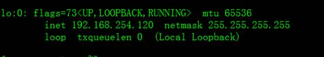

使用route查看路由表

&nbsp;

<h4 style='margin-left:36.0pt;text-indent:-36.0pt'>(五)&nbsp;&nbsp;&nbsp;&nbsp;&nbsp;&nbsp;&nbsp;&nbsp;&nbsp;&nbsp;
启动负载均衡高可用集群</h4>

分别在主备机上执行systemctl start keepalived.service启动keepalived就可实现负载均衡及高可用集群了；

&nbsp;systemctl
start keepalived.service

&nbsp;ipvsadm -L 

查看日志/var/log/messages

tail -n 30&nbsp;
/var/log/messages

<h4 style='margin-left:36.0pt;text-indent:-36.0pt'>(六)&nbsp; 测试</h4>

接下来做高可用性测试&amp;故障切换测试

<b>1.</b><b>高可用性测试</b>

模拟故障，将LVS-MASTER上的keepalived服务停掉，然后观察LVS-BACKUP上的日志，信息如下

tail -f
/var/log/messages

从日志中可知，主机出现故障后，备机立刻检测到，此时备机变为MASTER角色，并且接管了主机的虚拟IP资源，最后将虚拟IP绑定在etho设备上。

将LVS-MASTER&nbsp;上的keepalived服务开启后，LVS-BACKUP的日志状态。

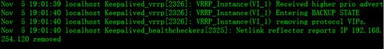

从日志可知，备机在检测到主机重新恢复正常后，释放了虚拟IP资源重新成为BACKUP角色

<b>2.</b><b>故障切换测试</b>

故障切换是测试当某个节点出现故障后，Keepalived监制模块是否能及时发现然后屏蔽故障节点，同时将服务器转移到正常节点来执行。

将192.168.254.130
节点srs, squid服务停掉，假设这个节点出现故障，然后主、备机日志信息如下

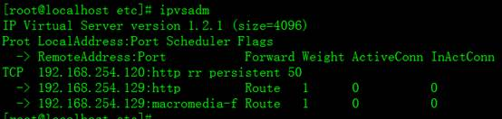从以上可以看出，Keepalived监控模块检测到192.168.254.130这台主机出现故障后，将些130从集群系统中剔除掉了。&nbsp;

重新启动130节点的srs,
squid服务后查看

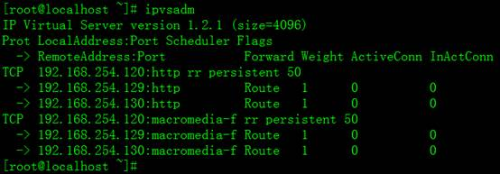

Keepalived监控模块检测到130这台主机恢复正常后，又将此节点加入集群系统中。

<b>3.</b><b>客户端直播与点播测试</b>

&nbsp;

&nbsp;

<h1><a
name="_Toc435713718">3.</a>全局负载均衡及实现</h1>

全局负载均衡（GLSB）就是负载解决多个节点之间相互协同的问题，实现整个系统的大规模服务能力和高可用性，基于DNS解析的GLSB,利用了DNS系统固有的域名解析，就近性判断，轮询算法等，可以在很大程度上借助独立于CDN系统之外的公共DNS系统来完成负载均衡,降低了对CDN本身的压力。为了更好的理解基于DNS解析的GLSB, 首先对DNS系统一些基本概念做下简单介绍，对以后章节中实现GSLB技术有更加深刻的了解。

<h2><a
name="_Toc435713719">3.1 DSN</a>简介</h2>

<h3><a
name="_Toc435713720">3.1.1</a>根域与顶级域名服务器</h3>

整个互联网中的域名空间结构就像一棵倒置的树，这棵域名树的根称为根域名服务器，在internet上共有13个<b>根</b><b>DNS</b><b>服务器</b>(每个服务器其实都是一个集群组成 )，大部分在北美。

往下的第一级节点称为<b>顶级域</b>，目前共有7个这样的顶级域（COM,EDU,GOV,MIL,NET,ORG,INT）,每个顶级域由对应的顶级域服务器负责管理。除了以上7个顶级域名，还有各个国家的顶级域名(如cn,
fr,ca等)也是这一级别进行管理。每个顶级域可以向下展开分支，每个分支域是一个子域。比如test.com是域com的子域。Test.com也可再向下展开a.test.com, b.test.com. 在每个域中，会有一台或多台服务器用来保存这个域名空间的所有信息，并且响应关于该域名空间的所有请求。这种助服务器就叫做这个域的权威域名服务器(也常称为授权域名服务器)，它拥有这个域所有的域名信息。

根DNS服务器，顶级域名服务器和权威DNS服务器共同组成了DNS服务器层，共同维护分布式，层次化的DNS数据库。对域进行授权，就是域管理组织把子域授权给其他组织进行管理，由子域管理者来维护子域中的数据，可以自由改动数据，包括对子域再进行划分，再授权。

<h3><a
name="_Toc435713721">3.1.2</a>本地DNS服务器</h3>

在DNS系统中还有一类非常重要的域名服务器，叫做本地DNS服务器，是用户所在局域网或ISP网络中的的域名服务器。我们平时上网在网络配置中设置的域名或使用DHCP获取的域名就是本地DNS服务器地址。本地DNS服务器得到浏览器的域名解析请求后，会用递归查询方式或者迭代查询方式向DNS系统中的其他远程域名服务器提出查询请求。递归方式指每次查询请求都向本地DNS服务器发起，收到答复后现向下一个远程DNS服务器提出请求，直到获得结果。迭代查询指本地DNS服务器只将自己知道的最合适的答案返回给查询者，帮助它把查询过程继续下去，而它本身不现做其他任何查询。在实际应用中，递归方式是比较常见的。

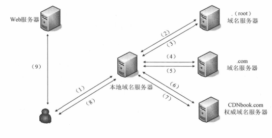

<h3><a
name="_Toc435713722">3.1.3</a>域名资源记录类型</h3>

&nbsp;&nbsp; 域名服务器是根据资源记来对DNS请求进行应答的，在&nbsp;DNS系统中，最常见的资源记录是 internet类记录，它主要分为以下几种类型：

（1）&nbsp;&nbsp;&nbsp;&nbsp;&nbsp;&nbsp;
A记录， Address

&nbsp;&nbsp; A记录用于描述域名到IP址的映射关系。对同个域名，可以有多条A记录。也就是说，一次DNS查找可以返回多个地址。

&nbsp;&nbsp; (2) NS记录，Name Server

&nbsp;&nbsp; NS记录是域名服务记录，用于指定该域名由哪个DNS服务器进行解析。每个区域可以有多个域名服务器，因此可以有多条NS记录。

&nbsp;&nbsp; (3)SOA记录, Start Of Authority

&nbsp;&nbsp; SOA记录用于指定该区域的权威域名服务器。每个区域允许且只允许有一个SOA记录，它是资源记录的第一个条目。

&nbsp;&nbsp; (4) CNAME 记录

&nbsp;&nbsp; CNAME记录用于描述别名与域名的对应关系，这种记录允许您将多个名字映射到同台计算机。当域名服务器查找一个域名时，找到一条CNAME记录，它会用记录中的规范名来替换这个域名别名，然后再查这个规范名的A记录，从而找到与规范名对应的IP地址，这样，就实现了对请求查找域名的IP地址响应。

&nbsp;&nbsp; (5)PTR记录，Pointor Record

&nbsp;&nbsp; PTR记录用于描述IP地址到域名的映射关系。这种描述方式只存在于in-addr.arpa这个特殊的域中。

<h2><a
name="_Toc435713723">3.2 </a>基于DNS解析实现GSLB方法</h2>

&nbsp;&nbsp; 基于DNS解析的GSLB方案实际上就是把负载均衡设备部署在DNS系统中。在用户发出任何应用连接请求时，首先必须通过DNS系统来请求获得服务器的IP地址，基于DNS的GSLB正是在返回DNS解析结果的过程中进行智能决策，给用户返回一个最佳的服务器的IP地址。DNS是基于轮询机制来提供简单负载分配能力的。在具体应用中，基于DNS解析来实现GSLB有几种方法。

<h4>3.2.1 通过CNAME方式实现负载均衡</h4>

通过CNAME方式来实现负载均衡，实际上是利用了DNS的两个机制：一是别名机制，二是轮询机制。具体操作简单地说就是:先将GSLB的主机名定义为所查询域名的权威DNS服务器的别名，然后将GSLB主机名添加多条A记录，分别对应多个服务器的IP地址。这样本地DNS服务器会向客户端返回多个IP地址作为域名的查询结果。并且这些IP地址的排列顺序是轮换的。客户端一般会选择首个IP地址进行访问。

<h4>3.2.2 负载均衡器作为权威DNS服务器</h4>

这种方式是把负载均衡器作为一个域名空间的权威DNS服务器，这样负载均衡器就会接收所有对这个域的DNS请求，从而能够根据预先设置的一些策略来提供对域名的智能DNS解析。

<h4>3.2.3 负载均衡器作为代理DNS服务器</h4>

在这种方式下，负载均衡器被注册为一个域名空间的权威DNS服务器，而真正的权威域名服务器则部署在负载均衡器后面。所有的DNS请求都会先到达负载均衡器，由负载均衡器转发至真正的权威DNS服务器，然后修改权威DNS服务器返回的响应信息，从而实现负载均衡功能。为实现这一过程，首先要将对外公布的权威DNS服务器的地址注册成负载均衡器上的VIP地址。直正的权威DNS服务器正常响应浏览器的DNS请求，返回域名解析结果列表，这个响应会先发送到负载均衡器，

<h2><a
name="_Toc435713724">3.3 BIND</a>开源域名服务器</h2>

Bind是一款开放源码的DNS服务器软件，Bind由美国加州大学Berkeley分校开发和维护的，全名为Berkeley Internet
Name Domain它是目前世界上使用最为广泛的DNS服务器软件，支持各种unix平台和windows平台。

官网: <a href="http://www.isc.org/downloads/">http://www.isc.org/downloads/</a>

<h2><a
name="_Toc435713725">3.4 </a>全局负载均衡实现</h2>

<h3><a
name="_Toc435713726">3.4.1 </a>系统环境</h3>

系统平台：VMware&nbsp; centos 7

DNS版本：BIND 9.9.4-RedHat-9.9.4-18

全局负载均衡域名服务器：

&nbsp;&nbsp;&nbsp;&nbsp;&nbsp;&nbsp;&nbsp;&nbsp;&nbsp;
网卡1:192.168.254.137

&nbsp;&nbsp;&nbsp;&nbsp;&nbsp;&nbsp;&nbsp;&nbsp;&nbsp;
网卡2:192.168.230.136

电信授权域名服务器::192.168.254.133

电信客户端::192.168.254.132

联通授权域名服务器::192.168.230..130

联通客户端:192.168.230.134

&nbsp;

GSLB部署架构图

<h3><a
name="_Toc435713727">3.4.2 </a>安装与编译</h3>

1.官方下载

<a href="http://www.isc.org/software/bind">http://www.isc.org/software/bind</a>

2.编译安装

可以下载源代码安装，也可以系统自动安装，测试环境是使用如下命令系统自动安装

yum install bind

<h3><a
name="_Toc435713728">3.4.3</a>配置</h3>

使用方法在各服务器安装成功后，根据下面的步骤，来配置授权域名服务器与GSLB服务器

<h4>3.4.3.1 授权域名服务器配置</h4>

<h5>(一) 电信授权域名服务器配置</h5>

电信使用254网段模拟，授权服务器为192.168.254.133

1&gt;配置/etc/named.conf加如下内容

options {&nbsp; //全局配置

&nbsp;&nbsp;&nbsp; directory
&quot;/var/named&quot;;&nbsp;&nbsp;&nbsp; //区域数据文件等存放路径

&nbsp;&nbsp;&nbsp; recursion yes;&nbsp;&nbsp;&nbsp;&nbsp;&nbsp;&nbsp;
//使用递归查询

};

zone &quot;testcdn.com&quot; {&nbsp; ;解析testcdn.com&nbsp;&nbsp;

&nbsp;&nbsp;&nbsp; type master;&nbsp;&nbsp;&nbsp;&nbsp;
;该域为主域名服务器

&nbsp;&nbsp;&nbsp; file
&quot;testcdn.com.zone&quot;;&nbsp;&nbsp; ;区域数据文件名称

};

&nbsp;

2&gt;建立区域数据文件内容后下/var/named/testcnd.com.zone

$TTL 3600&nbsp; ;定义了其他DNS服务器缓存本机数据的默认时间，默认单位是秒

@ &nbsp;IN &nbsp;SOA &nbsp;testcdn.com. &nbsp;admin@testcdn.com.
&nbsp;(

&nbsp;&nbsp;&nbsp;&nbsp;&nbsp;&nbsp;&nbsp;&nbsp;&nbsp;&nbsp;&nbsp;&nbsp;&nbsp;&nbsp;&nbsp;&nbsp;
;SOA是Start of Authority（起始授权机构）的缩写，它指出这个域名服务器是作为该区数据的权威的来源。在指令@ &nbsp;IN &nbsp;SOA &nbsp;testcdn.com. &nbsp;admin@testcdn.com.&quot;中，指定了负责解析本域的授权主机名是&quot; testcdn.com.&quot;，授权主机名称将在区域文件中解析为IP地 址。IN表示属于Internet类，是固定不变的，admin@testcdn.com.&quot;表示负责该区域的管理员的E-mail地址。每一个区文件都需要一个 SOA记录，而且只能有一个。SOA资源记录还要指定一些附加参数，放在SOA资源记录后面的括号内，其名称和功能见例子中的注释。

&nbsp;

<pre>&nbsp;&nbsp;&nbsp;&nbsp;&nbsp;&nbsp;&nbsp;&nbsp;&nbsp;&nbsp;&nbsp;&nbsp;&nbsp; &nbsp;&nbsp;&nbsp;20151011 ;定义序列号的值，同步辅助名称服务器数据时使用</pre><pre
style='margin-left:131.25pt;text-indent:-131.25pt'>&nbsp;&nbsp;&nbsp;&nbsp;&nbsp;&nbsp;&nbsp;&nbsp;&nbsp;&nbsp;&nbsp;&nbsp;&nbsp;&nbsp;&nbsp;&nbsp; 28800 ; 更新时间间隔值。定义该服务器的辅助名称服务器隔多久时间更新一次 </pre><pre>&nbsp;&nbsp;&nbsp;&nbsp;&nbsp;&nbsp;&nbsp;&nbsp;&nbsp;&nbsp;&nbsp;&nbsp;&nbsp;&nbsp;&nbsp;&nbsp;&nbsp;7200&nbsp; ;辅助名称服务器更新失败时，重试的间隔时间</pre><pre>&nbsp;&nbsp;&nbsp;&nbsp;&nbsp;&nbsp;&nbsp;&nbsp;&nbsp;&nbsp;&nbsp;&nbsp;&nbsp;&nbsp;&nbsp;&nbsp; 3600000&nbsp; ;辅助名称服务器一直不能更新时，其数据过期的时间</pre><pre>&nbsp;&nbsp;&nbsp;&nbsp;&nbsp;&nbsp;&nbsp;&nbsp;&nbsp;&nbsp;&nbsp;&nbsp;&nbsp;&nbsp;&nbsp;&nbsp; 6400&nbsp;&nbsp; ;最小默认TTL的值，如果第一行没有$TTL，则使用该值 </pre>

&nbsp;&nbsp;&nbsp;&nbsp;&nbsp;&nbsp;&nbsp;&nbsp;&nbsp;&nbsp;&nbsp;&nbsp;&nbsp;&nbsp;&nbsp;&nbsp;
)

testcdn.com.&nbsp;&nbsp;&nbsp; IN NS ns.testcdn.com.&nbsp;&nbsp;&nbsp;&nbsp;&nbsp;&nbsp;&nbsp;&nbsp;
; 是一条NS（Name Server）资源记录，定义了域&quot;testcdn.com.&quot;由DNS服务器&quot; ns.testcdn.com.&quot;负责解析，NS资源记录定义的服务器称为区域权威名称服务器。权威名称服务器负责维护和管理所管辖区域中的数据，被其他服务器或客户端当作权威的来源，并且能肯定应答区域内所含名称的查询。这里的配置要求和 SOA记录配置一致。

www &nbsp;&nbsp;IN &nbsp;CNAME &nbsp;testcdn.live.com.&nbsp;&nbsp;&nbsp;&nbsp;&nbsp;&nbsp;&nbsp;&nbsp;
;定义<a
href="http://www.testcdn.com">www.testcdn.com</a> 的别名为gslb主机;名testcdn.live.com

ns.testcdn.com. &nbsp;IN &nbsp;A &nbsp;192.168.254.133&nbsp;&nbsp;
;定义ns.testcdn.com.的记录为192.168.254.133

live IN NS ns.live.testcdn.com.&nbsp;&nbsp;&nbsp;&nbsp;&nbsp;&nbsp;&nbsp;&nbsp;&nbsp;&nbsp;&nbsp;&nbsp;&nbsp;
;定义子域live由ns.live.testcdn.com解析

ns.live.testcdn.com.&nbsp;&nbsp; IN A 192.168.254.137&nbsp;
;ns.live.testcdn.com的地址，实例中就是GSLB的地址

www IN CNAME live.testcdn.com.&nbsp;&nbsp;&nbsp;&nbsp;&nbsp;&nbsp;&nbsp;&nbsp;&nbsp;&nbsp;
;定义www的别名为live.testcdn.com，注意:有时定义后面有符号.&nbsp; 没有代表需要加上本域，例如:

&nbsp;&nbsp;&nbsp;&nbsp;&nbsp;&nbsp;&nbsp;&nbsp;&nbsp;&nbsp;&nbsp;&nbsp;&nbsp;&nbsp;&nbsp;&nbsp;&nbsp;&nbsp;&nbsp;&nbsp;&nbsp;&nbsp;&nbsp;&nbsp;&nbsp;&nbsp;&nbsp;&nbsp;&nbsp;&nbsp;&nbsp;&nbsp;&nbsp;&nbsp;&nbsp;&nbsp;&nbsp;&nbsp;&nbsp;
www代表域:www.testcdn.com

&nbsp;

<h5>(二) 电信客户端配置</h5>

在电信客户端需要配置指向电信域名服务器，这该测试环境中是直接指向电信授权域名服务器，实际环境中一般都是连接的本地域名服务器。测试环境修改/etc/resolv.conf为下如下内容

nameserver &nbsp;192.168.254.133

<h5>(三) 联通授权域名服务器配置</h5>

联通使用230网段模拟，授权服务器为192.168.230.130

1&gt;配置/etc/named.conf加如下内容

options {&nbsp; //全局配置

&nbsp;&nbsp;&nbsp; directory
&quot;/var/named&quot;;&nbsp;&nbsp;&nbsp; //区域数据文件等存放路径

&nbsp;&nbsp;&nbsp; recursion yes;&nbsp;&nbsp;&nbsp;&nbsp;&nbsp;&nbsp;
//使用递归查询

};

zone &quot;testcdn.com&quot; {&nbsp; ;解析testcdn.com&nbsp;&nbsp;

&nbsp;&nbsp;&nbsp; type master;&nbsp;&nbsp;&nbsp;&nbsp;
;该域为主域名服务器

&nbsp;&nbsp;&nbsp; file
&quot;testcdn.com.zone&quot;;&nbsp;&nbsp; ;区域数据文件名称

};

&nbsp;

2&gt;建立区域数据文件内容后下/var/named/testcnd.com.zone

$TTL 3600

@ IN SOA testcdn.com.&nbsp;
admin.testcdn.com. (

&nbsp;&nbsp;&nbsp;&nbsp;&nbsp;&nbsp;&nbsp;&nbsp;&nbsp;&nbsp;&nbsp;&nbsp;&nbsp;&nbsp;&nbsp;&nbsp;
20151011

&nbsp;&nbsp;&nbsp;&nbsp;&nbsp;&nbsp;&nbsp;&nbsp;&nbsp;&nbsp;&nbsp;&nbsp;&nbsp;&nbsp;&nbsp;&nbsp;
28800

&nbsp;&nbsp;&nbsp;&nbsp;&nbsp;&nbsp;&nbsp;&nbsp;&nbsp;&nbsp;&nbsp;&nbsp;&nbsp;&nbsp;&nbsp;&nbsp;
7200

&nbsp;&nbsp;&nbsp;&nbsp;&nbsp;&nbsp;&nbsp;&nbsp;&nbsp;&nbsp;&nbsp;&nbsp;&nbsp;&nbsp;&nbsp;&nbsp;
3600000

&nbsp;&nbsp;&nbsp;&nbsp;&nbsp;&nbsp;&nbsp;&nbsp;&nbsp;&nbsp;&nbsp;&nbsp;&nbsp;&nbsp;&nbsp;&nbsp;
6400

&nbsp;&nbsp;&nbsp;&nbsp;&nbsp;&nbsp;&nbsp;&nbsp;&nbsp;&nbsp;&nbsp;&nbsp;&nbsp;&nbsp;&nbsp;&nbsp;
)

testcdn.com.&nbsp;&nbsp;&nbsp; In NS
ns.testcdn.com.

ns.testcdn.com. IN A 192.168.230.130

live IN NS ns.live.testcdn.com.

ns.live.testcdn.com.&nbsp;&nbsp; IN A
192.168.230.136

www IN CNAME live.testcdn.com.

<h5>(四) 联通客户端配置</h5>

客户端域名服务器配置/etc/resolv.conf为下如下内容

nameserver &nbsp;192.168.254.130

&nbsp;

<h4>3.4.3.2 GLSB域名服务器配置</h4>

1&gt;配置/etc/named.conf加如下内容

options {

&nbsp;&nbsp;&nbsp; directory
&quot;/var/named&quot;;

&nbsp;&nbsp;&nbsp; recursion yes;

};

&nbsp;

view &quot;dx&quot; {&nbsp;&nbsp;&nbsp; &nbsp;//由于主机解析查询时会轮询使用解析到的服务器，而view则根据客户端的来源不同，将同一个名称解析至不同的值，不做轮询。 &nbsp;鉴于我国的各地既有联通网络，又有电信网络，而联通电信之间的连接靠的是北京机房的中转，那么可以想象，如果你处在电信网络下，向联通服务器发起请求的速
度会有多慢。为了解决这种状况，边出现了bind view 这种功能，让联通用户至访问联通服务器，电信只访问电信。这样速度就会快很多了。 

&nbsp;

&nbsp;&nbsp; match-clients { 192.168.254.0/24; };&nbsp; //定义局域网192.168.254.1-255 会电信网络，这是测试环境，虚拟使用，直实环境可以使且acl访问控制列表，acl列表中为电信的ip地址

&nbsp;&nbsp; zone &quot;live.testcdn.com&quot;
{

&nbsp;&nbsp;&nbsp;&nbsp;&nbsp;&nbsp;&nbsp;&nbsp;
type master;

&nbsp;&nbsp;&nbsp;&nbsp;&nbsp;&nbsp;&nbsp;&nbsp;
file &quot;testcdn.com.zone.dx&quot;;

&nbsp;&nbsp; };

};

view &quot;lt&quot; { //定义联通区域授权

&nbsp;&nbsp;&nbsp;&nbsp; match-clients
{192.168.230.0/24; };

&nbsp;&nbsp;&nbsp;&nbsp;&nbsp; zone &quot;live.testcdn.com&quot;
{

&nbsp;&nbsp;&nbsp;&nbsp;&nbsp;&nbsp;&nbsp;
type master;

&nbsp;&nbsp;&nbsp;&nbsp; &nbsp;&nbsp;&nbsp;file
&quot;testcdn.com.zone.lt&quot;;

&nbsp;&nbsp;&nbsp;&nbsp;&nbsp;&nbsp; };

};

&nbsp;

2&gt;建立电信区域数据文件/var/named/testcdn.com.zone.dx，

$TTL 3600

@ IN SOA ns.live.testcdn.com.
admin.testcdn.com. (

&nbsp;&nbsp;&nbsp;&nbsp;&nbsp;&nbsp;&nbsp;&nbsp;&nbsp;&nbsp;&nbsp;&nbsp;&nbsp;&nbsp;&nbsp;&nbsp;
20151011

&nbsp;&nbsp;&nbsp;&nbsp;&nbsp;&nbsp;&nbsp;&nbsp;&nbsp;&nbsp;&nbsp;&nbsp;&nbsp;&nbsp;&nbsp;&nbsp;
28800

&nbsp;&nbsp;&nbsp;&nbsp;&nbsp;&nbsp;&nbsp;&nbsp;&nbsp;&nbsp;&nbsp;&nbsp;&nbsp;&nbsp;&nbsp;&nbsp;
7200

&nbsp;&nbsp;&nbsp;&nbsp;&nbsp;&nbsp;&nbsp;&nbsp;&nbsp;&nbsp;&nbsp;&nbsp;&nbsp;&nbsp;&nbsp;&nbsp;
3600000

&nbsp;&nbsp;&nbsp;&nbsp;&nbsp;&nbsp;&nbsp;&nbsp;&nbsp;&nbsp;&nbsp;&nbsp;&nbsp;&nbsp;&nbsp;&nbsp;
6400

&nbsp;&nbsp;&nbsp;&nbsp;&nbsp;&nbsp;&nbsp;&nbsp;&nbsp;&nbsp;&nbsp;&nbsp;&nbsp;&nbsp;&nbsp;&nbsp;
)

&nbsp;&nbsp; IN NS ns

ns IN A 192.168.254.137

@&nbsp; IN A 192.168.254.120

@&nbsp; IN A 192.168.254.220

3&gt;建立联通区域数据文件/var/named/testcdn.com.zone.lt

$TTL 3600

@&nbsp; IN SOA ns.live.testcdn.com. admin.testcdn.com.
(

&nbsp;&nbsp;&nbsp;&nbsp;&nbsp;&nbsp;&nbsp;&nbsp;&nbsp;&nbsp;&nbsp;&nbsp;&nbsp;&nbsp;&nbsp;&nbsp;
20151011

&nbsp;&nbsp;&nbsp;&nbsp;&nbsp;&nbsp;&nbsp;&nbsp;&nbsp;&nbsp;&nbsp;&nbsp;&nbsp;&nbsp;&nbsp;&nbsp;
28800

&nbsp;&nbsp;&nbsp;&nbsp;&nbsp;&nbsp;&nbsp;&nbsp;&nbsp;&nbsp;&nbsp;&nbsp;&nbsp;&nbsp;&nbsp;&nbsp;
7200

&nbsp;&nbsp;&nbsp;&nbsp;&nbsp;&nbsp;&nbsp;&nbsp;&nbsp;&nbsp;&nbsp;&nbsp;&nbsp;&nbsp;&nbsp;&nbsp;
3600000

&nbsp;&nbsp;&nbsp;&nbsp;&nbsp;&nbsp;&nbsp;&nbsp;&nbsp;&nbsp;&nbsp;&nbsp;&nbsp;&nbsp;&nbsp;&nbsp;
6400

&nbsp;&nbsp;&nbsp;&nbsp;&nbsp;&nbsp;&nbsp;&nbsp;&nbsp;&nbsp;&nbsp;&nbsp;&nbsp;&nbsp;&nbsp;&nbsp;
)

&nbsp;&nbsp;&nbsp; IN&nbsp; NS&nbsp; ns

ns&nbsp; IN&nbsp; A&nbsp;
192.168.230.137

@&nbsp;&nbsp; IN&nbsp; A&nbsp;
192.168.230.135

@&nbsp;&nbsp; IN&nbsp; A&nbsp;
192.168.230.134

<h3><a
name="_Toc435713729">3.4.4 </a>测试</h3>

<h4>3.4.4.1 启动域名服务</h4>

使用如下命令，启动域名服务器，不同版本linux操作系统启动可能不同，测试环境是在centos 7下，使用下面的命令启动glsb,电信，联通授权域名服务器域名服务。

systemctl&nbsp; start &nbsp;named.service

在客户端配置域名指向授权域名服务器，因为测试环境省略了本地域名服务器，直接连接到授权域名服务器

<h4>3.4.4.2 命令测试</h4>

测试过程可以使用nslookup 与 dig测试。下面实例使用dig命令。

测试电信环境:客户端192.168.254.132下输入dig&nbsp; www.testcdn.com

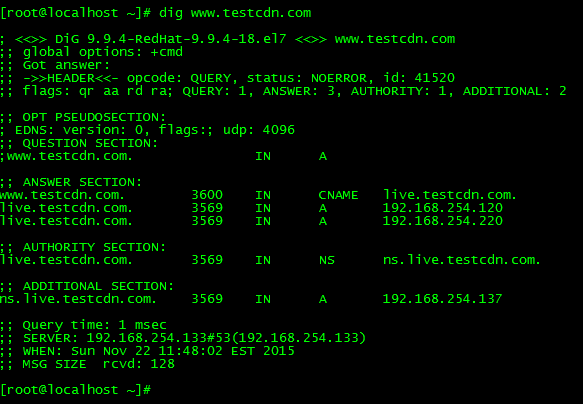

如果输出以上结果，表示，环境已经搭建成功，www.testcdn.com 这个域名会解析两个A记录，对应两个ip地址。

测试联通环境: 客户端192.168.230.134下输入dig&nbsp; <a
href="http://www.testcdn.com">www.testcdn.com</a>

<h1><a name="_Toc436141419">4.</a>网络存储及实现</h1>

<h2><a name="_Toc436141420">4.1</a>网络存储技术</h2>

目前高端服务器使用的专业网络存储技术大概分为四种，有DAS、NAS、SAN 、ISCSL，它们可以使用RAID阵列提供高效的安全存储空间。

<h3><a name="_Toc436141421">4.1.1</a>直接附加存储(DAS)</h3>

&nbsp;直接附加存储是指将存储设备通过SCSI接口直接连接到一台服务器上使用。DAS购置成本低，配置简单，使用过程和使用本机硬盘并无太大差别，对于服务器的要求仅仅是一个外接的SCSI口，

&nbsp;因此对于小型企业很有吸引力。但是DAS也存在诸多问题：

(1)服务器本身容易成为系统瓶颈;

(2)服务器发生故障，数据不可访问;

(3)对于存在多个服务器的系统来说，设备分散，不便管理。同时多台服务器使用DAS时，存储空间不能在服务器之间动态分配，可能造成相当的资源浪费;

(4)数据备份操作复杂。

<h3><a name="_Toc436141422">4.1.2</a>网络附加存储(NAS)</h3>

&nbsp;NAS实际是一种带有瘦服务器的存储设备。这个瘦服务器实际是一台网络文件服务器。NAS设备直接连接到TCP/IP网络上，网络服务器通过TCP/IP网络存取管理数据。NAS作为一种瘦服务器系统，易于安装和部署，管理使用也很方便。同时由于可以允许客户机不通过服务器直接在NAS中存取数据，因此对服务器来说可以减少系统开销。NAS为异构平台使用统一存储系统提供了解决方案。由于NAS只需要在一个基本的磁盘阵列柜外增加一套瘦服务器系统，对硬件要求很低，软件成本也不高，甚至可以使用免费的LINUX&nbsp; 解决方案，成本只比直接附加存储略高。NAS存在的主要问题是：

(1)由于存储数据通过普通数据网络传输，因此易受网络上其它流量的影响。当网络上有其它大数据&nbsp; 流量时会严重影响系统性能;

(2)由于存储数据通过普通数据网络传输，因此容易产生数据泄漏等安全问题;

(3)存储只能以文件方式访问，而不能像普通文件系统一样直接访问物理数据块，因此会在某些情况下严重影响系统效率，比如大型数据库&nbsp; 就不能使用NAS.

<h3><a name="_Toc436141423">4.1.3</a>存储区域网(SAN)</h3>

&nbsp;SAN实际是一种专门为存储建立的独立于TCP/IP网络之外的专用网络。目前一般的SAN提供2Gb/S到4Gb/S的传输数率，同时SAN

网络独立于数据网络存在，因此存取速度很快，另外SAN一般采用高端的RAID阵列，使SAN的性能在几种专业网络存储技术中傲视群雄。SAN由于其基础是一个专用网络，因此扩展性很强，不管是在一个SAN系统中增加一定的存储空间还是增加几台使用存储空间的服务器都非常方便。通过SAN接口的磁带机，SAN系统可以方便高效的实现数据的集中备份。SAN作为一种新兴的存储方式，是未来存储技术的发展方向，但是，它也存在一些缺点：

(1)价格昂贵。不论是SAN阵列柜还是SAN必须的光纤通道交换机价格都是十分昂贵的，就连服务器上使用的光通道卡的价格也是不容易被小型商业企业所接受的;

(2)需要单独建立光纤网络，异地扩展比较困难;

<h3><a name="_Toc436141424">4.1.4 iSCSI</a></h3>

&nbsp;使用专门的存储区域网成本很高，而利用普通的数据网来传输SCSI数据实现和SAN相似的功能可以大大的降低成本，同时提高系统的灵活性。iSCSI就是这样一种技术，它利用普通的TCP/IP网来传输本来用存储区域网来传输的SCSI数据块。iSCSI的成本相对SAN来说要低不少。随着千兆网的普及，万兆网也逐渐的进入主流，使iSCSI的速度相对SAN来说并没有太大的劣势。iSCSI目前存在的主要问题是：

(1)新兴的技术，提供完整解决方案的厂商较少，对管理者技术要求高;

(2)通过普通网卡存取iSCSI数据时，解码成SCSI需要CPU进行运算，增加了系统性能开销，如果采用专门的iSCSI网卡虽然可以减少系统性能开销，但会大大增加成本;

(3)使用数据网络进行存取，存取速度冗余受网络运行状况的影响。

&nbsp;

四种网络存储技术的主要区别

&nbsp;通过以上比较研究，四种网络存储技术方案各有优劣。对于小型且服务较为集中的商业企业，可采用简单的DAS方案。对于中小型商业企业，服务器数量比较少，有一定的数据集中管理要求，且没有大型数据库需求的可采用NAS方案。对于大中型商业企业，SAN和iSCSI是较好的选择。如果希望使用存储的服务器相对比较集中，且对系统性能要求极高，可考虑采用SAN方案;对于希望使用存储的服务器相对比较分散，又对性能要求不是很高的，可以考虑采用iSCSI方案。

<h2><a name="_Toc436141425">4.2</a>分布式存储</h2>

在流媒体系统的缓冲设备与web缓冲设备对cpu性能和IO能力要求差别很大，web缓冲需要应对小文件，高并发要求，这样的业务特性对cpu消耗非常大，而流媒体cdn的缓冲则需要应对大文件持续读写，tcp长连接维持要求，这对磁盘IO能力要求非常高。另外一个主要差别是，web缓冲一般不需要配置很大的存储空间，而流媒体缓冲则需要外挂TB级别的磁盘，因为流媒体文件实在是太占用存储空间了。为了保证连续媒体数据的实时磁盘访问，需要将数据以合适的块大小分布在磁盘的各个区域，并以最佳的顺序从磁盘中读取。

分布式存储技术因其大容量、低成本的特点，目前也被业界关注的研究作为流媒体CDN系统的存储解决方案之一。常用的分布式存储技术包括分布式文件系统和分布式数据库，由于采用了数据副本冗余（每份数据复制2-3份）、磁盘冗余(Raid1,Raid10,Raid5)等技术，通常可以提供良好的数据容错机制，当单台存储设备断电或者单个存储磁盘失效时，整个存储系统仍能正常工作。分布式文件系统更常见于高性能计算领域

<h3><a name="_Toc436141426">4.2.1</a>分布式存储实现实例MooseFS</h3>

&nbsp;MooseFS是一个具有容错性的网络分布式文件系统。它把数据分散存放在多个物理服务器上，而呈现给用户的则是一个统一的资源。Mfs由以下四部分组成:

1、管理服务器（master server）

一台管理整个文件系统的独立主机，存储着每个文件的元数据（文件的大小、属性、位置信息，包括所有非常规文件的所有信息，例如目录、套接字、管道以及设备文件）

2、数据服务器群（chunk servers）

任意数目的商用服务器，用来存储文件数据并在彼此之间同步（如果某个文件有超过一个备份的话）

3、元数据备份服务器（metalogger server）

任意数量的服务器，用来存储元数据变化日志并周期性下载主要元数据文件，以便用于管理服务器意外停止时好接替其位置。

4、访问mfs的客户端

任意数量的主机，可以通过mfsmount进程与管理服务器（接收和更改元数据）和数据服务器（改变实际文件数据）进行交流。

&nbsp;

<h4>4.2.1.1系统环境</h4>

系统平台：VMware&nbsp; centos 7

mfs版本：moosefs-2.0.77-1.tar.gz

<table class=MsoTableGrid border=1 cellspacing=0 cellpadding=0
 style='border-collapse:collapse;border:none'>
 <tr>
  <td width=284 valign=top style='width:213.05pt;border:solid windowtext 1.0pt;
  padding:0cm 5.4pt 0cm 5.4pt'>
  
IP

  </td>
  <td width=284 valign=top style='width:213.05pt;border:solid windowtext 1.0pt;
  border-left:none;padding:0cm 5.4pt 0cm 5.4pt'>
  
作用

  </td>
 </tr>
 <tr>
  <td width=284 valign=top style='width:213.05pt;border:solid windowtext 1.0pt;
  border-top:none;padding:0cm 5.4pt 0cm 5.4pt'>
  
192.168.254.134

  </td>
  <td width=284 valign=top style='width:213.05pt;border-top:none;border-left:
  none;border-bottom:solid windowtext 1.0pt;border-right:solid windowtext 1.0pt;
  padding:0cm 5.4pt 0cm 5.4pt'>
  
Master Server 

  </td>
 </tr>
 <tr>
  <td width=284 valign=top style='width:213.05pt;border:solid windowtext 1.0pt;
  border-top:none;padding:0cm 5.4pt 0cm 5.4pt'>
  
192.168.254.143

  </td>
  <td width=284 valign=top style='width:213.05pt;border-top:none;border-left:
  none;border-bottom:solid windowtext 1.0pt;border-right:solid windowtext 1.0pt;
  padding:0cm 5.4pt 0cm 5.4pt'>
  
Logger Server

  </td>
 </tr>
 <tr>
  <td width=284 valign=top style='width:213.05pt;border:solid windowtext 1.0pt;
  border-top:none;padding:0cm 5.4pt 0cm 5.4pt'>
  
192.168.254.144

  </td>
  <td width=284 valign=top style='width:213.05pt;border-top:none;border-left:
  none;border-bottom:solid windowtext 1.0pt;border-right:solid windowtext 1.0pt;
  padding:0cm 5.4pt 0cm 5.4pt'>
  
Chunck Server1

  </td>
 </tr>
 <tr>
  <td width=284 valign=top style='width:213.05pt;border:solid windowtext 1.0pt;
  border-top:none;padding:0cm 5.4pt 0cm 5.4pt'>
  
192.168.254.146

  </td>
  <td width=284 valign=top style='width:213.05pt;border-top:none;border-left:
  none;border-bottom:solid windowtext 1.0pt;border-right:solid windowtext 1.0pt;
  padding:0cm 5.4pt 0cm 5.4pt'>
  
Chunck Server2

  </td>
 </tr>
 <tr>
  <td width=284 valign=top style='width:213.05pt;border:solid windowtext 1.0pt;
  border-top:none;padding:0cm 5.4pt 0cm 5.4pt'>
  
192.168.254.148

  </td>
  <td width=284 valign=top style='width:213.05pt;border-top:none;border-left:
  none;border-bottom:solid windowtext 1.0pt;border-right:solid windowtext 1.0pt;
  padding:0cm 5.4pt 0cm 5.4pt'>
  
Chunck Server3

  </td>
 </tr>
 <tr>
  <td width=284 valign=top style='width:213.05pt;border:solid windowtext 1.0pt;
  border-top:none;padding:0cm 5.4pt 0cm 5.4pt'>
  
192.168.254.145

  </td>
  <td width=284 valign=top style='width:213.05pt;border-top:none;border-left:
  none;border-bottom:solid windowtext 1.0pt;border-right:solid windowtext 1.0pt;
  padding:0cm 5.4pt 0cm 5.4pt'>
  
Mfs Clinet 1

  </td>
 </tr>
 <tr>
  <td width=284 valign=top style='width:213.05pt;border:solid windowtext 1.0pt;
  border-top:none;padding:0cm 5.4pt 0cm 5.4pt'>
  
192.168.254.147

  </td>
  <td width=284 valign=top style='width:213.05pt;border-top:none;border-left:
  none;border-bottom:solid windowtext 1.0pt;border-right:solid windowtext 1.0pt;
  padding:0cm 5.4pt 0cm 5.4pt'>
  
Mfs Clinet 2

  </td>
 </tr>
</table>

&nbsp;

Mfs部署结构图：

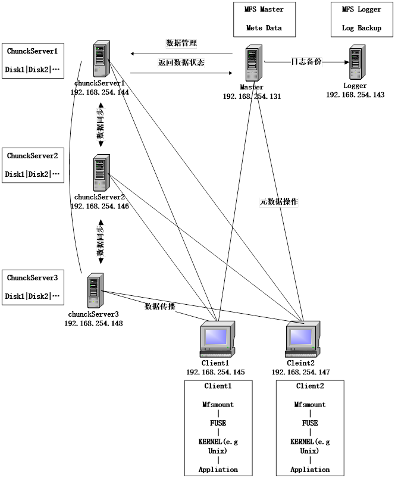

MFS读写原理图

&nbsp;

<h3><a name="_Toc436141427">4.2.2Moosefs</a>安装与配置</h3>

<h4>4.2.2.1元数据服务器安装和配置</h4>

元数据服务器可以是linux,也可以是unix,你可以根据自己的使用习惯选择操作系统,在我的环境里,我是用freebsd做为MFS元数据的运行平台。GNU源码，在各种类unix平台的安装都基本一致。

<h5>(一) 安装元数据服务</h5>

1、下载GNU源码

在网站<a
href="http://ncu.dl.sourceforge.net/project/moosefs/moosefs">http://ncu.dl.sourceforge.net/project/moosefs/moosefs</a> &nbsp;下载,以moosefs-2.0.77-1.tar.gz为例

2、解包 tar moosefs-2.0.77-1.tar.gz

3、切换目录 cd cd moosefs-2.0.77

4、创建用户 useradd mfs -s /sbin/nologin

5、配置 ./configure --prefix=/usr/local/mfs
--with-default-user=mfs --with-default-group=mfs

6、编译安装 make ; make install

<h5>(二) 配置元数据服务</h5>

元数据服务器的配置文件被放置于安装目录/usr/local/mfs/etc。安装完成只有模版文件，其后缀形如mfsmaster.cfg.dist。为了使mfs master正常工作，需要两个配置文件mfsmaster.cfg及mfsexports.cfg,前者为主配置文件，后者为权限控制文件（mfs客户 端挂接时使用）。

（1）主配置文件mfsmaster.cfg,可直接从模版文件拷贝而来，打开这个配置文件/usr/local/mfs/etc/mfsmaster.cfg，看看都有哪些内容，尽管每行都被注释掉了，但它们却是配置文件的默认值，要改变这些值，需要取消注释，然后明确指定其取值。接下来说明一下其中一些项目的含义。

◆ EXPORTS_FILENAME =
/usr/local/mfs/etc/mfsexports.cfg 权限控制文件的存放位置。

◆ DATA_PATH = /usr/local/mfs/var/mfs 数据存放路径，只元数据的存放路径。那么这些数据都包括哪些呢？进目录看看，大致分3种类型的文件：

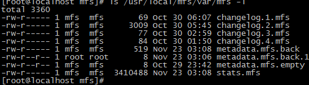

这些文件也同样要存储在其他数据存储服务器的相关目录。

◆ MATOCS_LISTEN_PORT = 9420
MATOCS--master to chunkserver，即元数据服务器使用9420这个监听端口来接受数据存储服务器chunkserver端的连接。

◆ MATOML_LISTEN_PORT = 9419
MATOML---master to metalogger，用于备份元数据服务器的变化日志。注：Mfs-1.5.12以前的版本没有这个项目。

◆ MATOCU_LISTEN_PORT = 9421 元数据服务器在9421端口监听，用以接受客户端对MFS进行远程挂接（客户端以mfsmount挂接MFS）

◆ 其他部分看字面意思都不难理解。还有几个与时间有关的数值，其单位是秒。

这个配置文件，不必做修改就能工作了。

（2）配置文件/usr/local/mfs/etc/mfsexports.cfg,也可直接从模版文件复制而来。这个文件的内容，十分类似 NFS服务器的exports文件．实际配置时，可参照这个文件的默认行来修改以满足自己的应用需求．

（3）复制文件

cp
/usr/local/mfs/var/mfs/metadata.mfs.empty /usr/local/mfs/var/mfs/metadata.mfs 

这是一个8字节的文件。

<h5>(三) 元数据服务器master启动</h5>

元数据服务器可以单独启动，即使没有任何数据存储服务器（chunkserver）也是能正常工作的，因此当我们安装配置完MFS后，即可启动
它。执行命令 /usr/local/mfs/sbin/mfsmaster start ，如果没有意外，元数据库服务器就应该作为一个守护进程运行起来。现在我们可以通过3个方面来检查一下MFS master的运行状况：

1、&nbsp; 检查进程

2、&nbsp; 检查网络状态

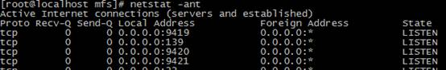

3、&nbsp; 检查系统日志

MFS的日志会直接写入系统日志。当我们增加数据存储服务器（chunkserver）或数据存储服务器（chunkserver）处故障时，都能在系统日志找到这些记录。注意，这个日志跟元数据变化日志不是一回事情。

<h5>(四) 关闭元数据服务器</h5>

关闭元数据服务器，务必使用 /usr/local/mfs/sbin/mfsmaster
stop 这种方式，如果直接使用kill杀死进程，将导致下次启动时出现找不到相关文件，而不能正常启动服务器。这个一定要谨慎。当然，如果发生了这个事情，还是可以通过
/usr/local/mfs/sbin/mfsmaster -a来恢复的。

&nbsp;

<h4>4.2.2.2元数据日志服务器安装和配置</h4>

元数据日志服务为mfs 1.6以后版本新增的服务，即可以把元数据日志保留在元数据服务器，也可以单独存储。为保证其可靠性，最好单独放置。需要注意的是，源数据日志守护进程跟
元数据服务器（master）在同一个服务器上，备份元数据日志的服务器作为它的客户端，从元数据服务器取得日志文件进行备份。

<h5>(一) 安装元数据日志服务器metalogger</h5>

1、下载GNU源码

在网站<a
href="http://ncu.dl.sourceforge.net/project/moosefs/moosefs">http://ncu.dl.sourceforge.net/project/moosefs/moosefs</a> &nbsp;下载,以moosefs-2.0.77-1.tar.gz为例

2、解包 tar moosefs-2.0.77-1.tar.gz

3、切换目录 cd cd moosefs-2.0.77

4、创建用户 useradd mfs -s /sbin/nologin

5、配置 ./configure --prefix=/usr/local/mfs
--with-default-user=mfs --with-default-group=mfs

6、编译安装 make ; make install

<h5>(二) 元数据日志服务（metalogger）配置</h5>

该服务仅需要一个配置文件，这里我们只需要从模板文件复制一个，然后稍微加以修改即可，实例中metalogger的配置文件mfsmetalogger.cfg，这个配置文件，唯一需要修改的地方就是MASTER_HOST，它的值必须是元数据服务器的主机名或者ｉｐ地址。如实例配置如下：

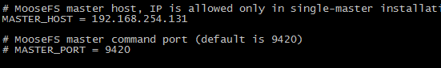

&nbsp;

另外，为方便大家进一步理解，配置文件里其他几个项目简单的说明一下：

（１）SYSLOG_IDENT = mfsmetalogger 元数据日志服务运行时，在系统日志输出的标识

（２）DATA_PATH = /usr/local/mfs/var/mfs 从元数据服务器(master)抓回文件，然后进行存放的路径。

（３）BACK_LOGS = 50 存放备份日志的总个数为５０，超出５０则轮转。在做元数据恢复时，仅仅需要最近的那个日志文件备份，因此默认的日志个数就足够了，这也保证了日志备份不会写满整个分区。

（４）META_DOWNLOAD_FREQ = 24 元数据备份文件下载请求频率。默认为２４小时，即每隔一天从元数据服务器(MASTER)下载一个metadata.mfs.back文件。当元数据服务器关闭或者出故障时，matedata.mfs.back文件将消失，那么要恢复整个mfs,则需从metalogger服务器取得该文件。请特别注意这个文件，它与日志文件一起，才能够恢复整个被损坏的分布式文件系统。

<h5>(三) 元数据日志服务（metalogger）运行及关闭</h5>

１、启动过程为： 

<b>/usr/local/mfs/sbin/mfsmetalogger start</b>

启动过程如果不能跟元数据服务器进行通信的话，系统会给出错误信息。

２、关闭服务，执行命令 

<b>/usr/local/mfs/sbin/mfsmetalogger stop </b>

３、检查服务的运行状况。从两个方面看，一个是元数据服务器，另一个是本身的数据生成情况。

◆察看元数据服务器网络连接，可以看见日志服务器连接到元数据服务器的tcp 9419端口。

◆查看日志服务器的工作目录，正常情况应该看见已经有文件生成了（从元数据服务器获取过来的）。可以手动从元数据服务器复制一个日志文件过来比较文件的内容。

<h4>4.2.2.3数据存储服务器的安装配置</h4>

数据存储服务器chunkserver也是可以运行在各种类unix平台的，因此不再多说。一个MFS环境到底能集群多少服务器，作者的说法是
上PB容量，一般建议，最好3台以上；并且专门用来做存储，不要把它跟master搞到一个机器（理论上没问题，实现也是可以的，但这不是一个好策略）。 因为每个数据存储服务器的安装和配置都是相同的，所以只需按照一个服务器的操作就可以了。

<h5>(一) 安装数据存储服务器 chunkserver</h5>

1、下载GNU源码

在网站<a
href="http://ncu.dl.sourceforge.net/project/moosefs/moosefs">http://ncu.dl.sourceforge.net/project/moosefs/moosefs</a> &nbsp;下载,以moosefs-2.0.77-1.tar.gz为例

2、解包 tar moosefs-2.0.77-1.tar.gz

3、切换目录 cd cd moosefs-2.0.77

4、创建用户 useradd mfs -s /sbin/nologin

5、配置 ./configure --prefix=/usr/local/mfs
--with-default-user=mfs --with-default-group=mfs

6、编译安装 make ; make install

<h5>(二) 配置数据存储服务器chunkserver</h5>

数据存储服务器有2个配置服务器需要修改，一个是主配置文件 mfschunkserver.cfg ,另一个配置文件是 mfshdd.cfg。每个服务器用来分配给 MFS使用的空间最好是一个单独的硬盘或者一个raid卷，最低要求是一个分区。1、修改配置文件
/usr/local/mfs/etc/mfschunkserver.cfg。下面是修改了的配置文件： 

这个配置文件里，没有注释符号“#”就是被修改过的项了，接下来是里面某些项的含义说明：

◆ MASTER_HOST = 192.168.254.131 元数据服务器的名称或地址，可以是主机名，也可以是ip地址，只要数据存储服务器能访问到元数据服务器就行。

◆ LOCK_FILE =
/var/run/mfs/mfschunkserver.pid 与元数据服务器master的处理完全相同.

◆ CSSERV_LISTEN_PORT = 9422 CSSERV―chunkserver,这个监听端口用于与其它数据存储服务器间的连接，通常是数据复制。

◆ HDD_CONF_FILENAME = <a
name="OLE_LINK1">/usr/local/mfs/etc/mfshdd.cfg</a> 分配给MFS使用的磁盘空间配置文件的位置。

2、修改配置文件/usr/local/mfs/etc/mfshdd.cfg。为了使mfs拥有写目录的权限，需要修改目录的属主。测试服务器的分区挂接点是 /data , 用 chown �CR mfs:mfs /data 把属主改变。因为测试环境中每个服务器只需贡献一个分区做为MFS,因此配置文件只需要如下一行内容就可以了： 

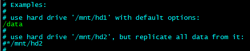

&nbsp;

<h5>(三) 启动数据存储服务器chunkserver</h5>

在数据存储服务器chunkserver执行命令 /usr/local/mfs/sbin/mfschunkserver start 启动数据存储守护进程.通过以下几种方式来检查chunkserver的运行状态.

1、 查看进程 ps aux | grep mfschunkserver 

2、 查看网络状态，正常情况下应该看见9422处于监听状态，如果有其他数据存储服务器chunkserver在同一个元数据服务器master管理下运行的话，应该能看见其他chunkserver跟本机的连接情况:

4、&nbsp; 查看<b>元数据服务器</b>的系统日志，可以看见新增的数据存储服务器chunkserver被加入。 

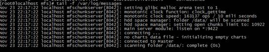

5. 启动后数据目录下显示如下

（四） 关闭数据存储服务器

跟元数据服务器master相似，执行命令 /usr/local/mfs/sbin/mfschunkserver stop , chunkserver服务就停下来了。

<h4>4.2.2.4 MFS客户端的安装及配置</h4>

<h5>(一) centos安装MFS客户端</h5>

◆Mfsmount需要依赖FUSE,因此需要先安装好fuse，可以下载源码编译安装，或使用命令，测试环境使用如下命令安装：

yum install fuse fuse-devel

如果系统已经安装了fuse,则跳过这个步骤。

◆安装MFS客户端程序

1、下载GNU源码

在网站<a
href="http://ncu.dl.sourceforge.net/project/moosefs/moosefs">http://ncu.dl.sourceforge.net/project/moosefs/moosefs</a> &nbsp;下载,以moosefs-2.0.77-1.tar.gz为例

2、解包 tar moosefs-2.0.77-1.tar.gz

3、切换目录 cd cd moosefs-2.0.77

4、创建用户 useradd mfs -s /sbin/nologin

5、配置 ./configure --prefix=/usr/local/mfs
--with-default-user=mfs --with-default-group=mfs --enable-mfsmount

6、编译安装 make ; make install

◆检查MFS客户端安装的结果。通过查看目录/usr/local/mfs/bin目录的文件，应该发现如下文件：

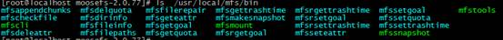

<h5>(二) 挂接和使用MFS文件系统</h5>

1、创建挂接点 mkdir /mnt/mfs

2、挂接MFS /usr/local/mfs/bin/mfsmount /mnt/mfs
-H&nbsp; 192.168.254.131注意，所有的MFS都是挂接同一个元数据服务器master,而不是其他数据存储服务器chunkserver !

3、通过查看磁盘使用情况来检查是否被挂接成功。 

以上面结果只是有一个chunckserver 最大可用空间为18G,下面显示添加一台新的chunckserver后的结果

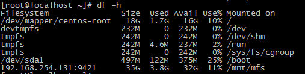

现在变成35G空间。

5、&nbsp; 进入目录/mnt/mfs，上传一个文件，看是否正常？

接着在手动用touch 创建一个文件，然后再删除它们，看是否可以正常操作。

6 设置文件副本数量，建议以3份为佳。 

设置副本数目

/usr/local/mfs/bin/mfsrsetgoal&nbsp; 3
/mnt/mfs/moosefs-2.0.77-1.tar.gz

查看设置是否如我所愿

/usr/local/mfs/bin/mfsgetgoal -r /mnt/mfs/moosefs-2.0.77-1.tar.gz

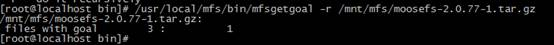

7&nbsp;&nbsp;&nbsp; 设置删除文件后空间回收时间。默认的回收时间为7天（604800秒） 

修改回收时间为10分钟

/usr/local/mfs/bin/mfsrsettrashtime
&nbsp;600 /mnt/mfs

</body>

</html>
